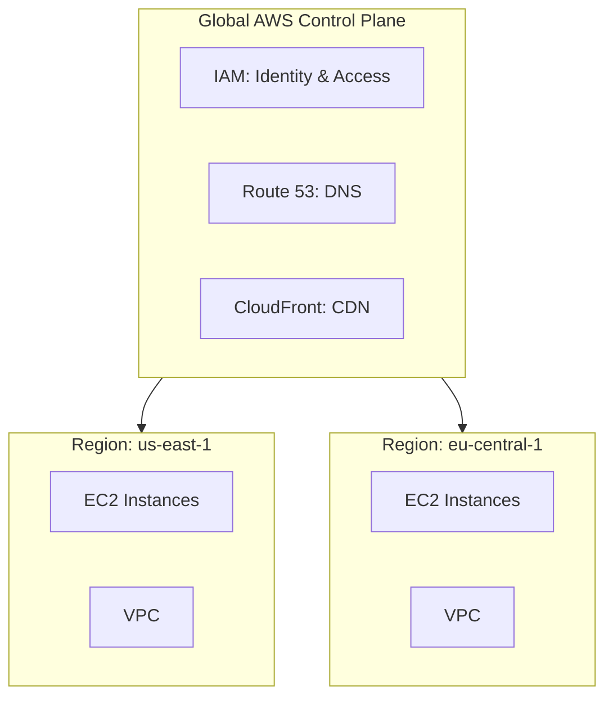
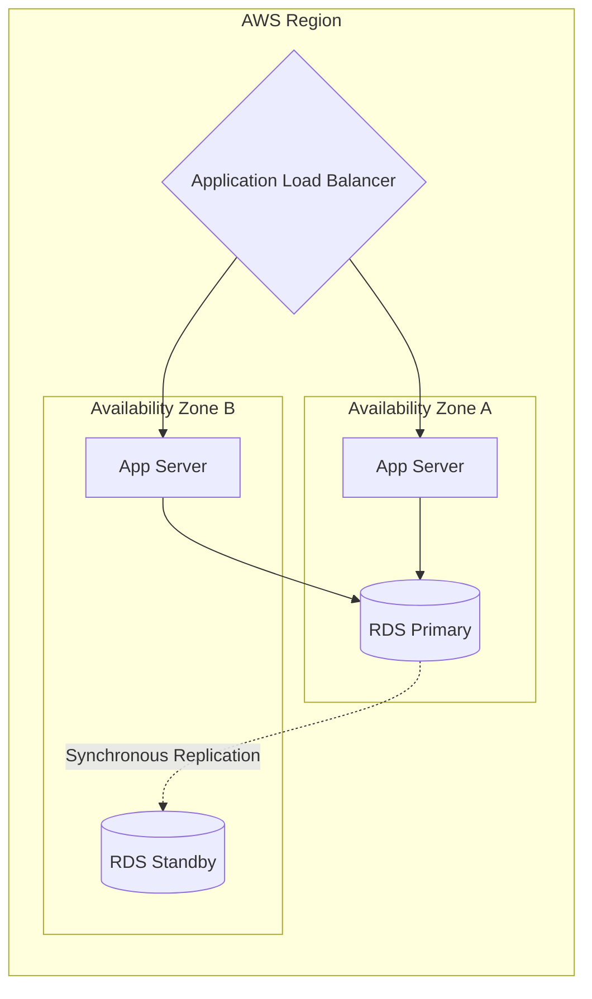
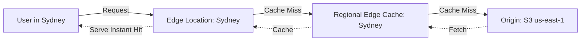

# AWS – Getting Started & Global Infrastructure
> 📚 Official Docs: https://aws.amazon.com/about-aws/global-infrastructure/  
> 🎯 SAA-C03 Exam Weight: Foundational (appears in every domain)

---

## 🌍 Topic 1: AWS Regions & Global Services

### 📖 Technical Specifications & AWS Core Concepts
* **Cloud Computing:** Renting computing resources on-demand (pay-as-you-go) instead of upfront capital expenditure for physical hardware.
* **AWS Region:** A physical, geographic location (e.g., `us-east-1`, `eu-central-1`) containing a cluster of independent data centers.
* **Data Sovereignty:** Data stored in a specific AWS Region never leaves that region without explicit user configuration, which is critical for compliance (e.g., GDPR).
* **Global Services:** Services whose configurations span all regions natively (e.g., IAM, Route 53, CloudFront, WAF).
* **Regional Services:** Services bound to the specific region they are created in (e.g., EC2, VPC, Lambda).
* **The CAPS Framework for Region Selection:** **C**ompliance (data laws), **A**vailability (service rollout), **P**roximity (latency to users), **S**avings (cost variations between regions).

---

### 🗺️ Visual Architecture: Regional vs Global Services



---

### 🧠 Architectural Probing & Decision Scenarios
* **Scenario:** A German fintech startup needs to deploy their core banking application while strictly adhering to GDPR data residency laws.
  * **Design:** Deploy entirely within the `eu-central-1` (Frankfurt) region. AWS natively guarantees that data stored in a region will never be replicated outside of it unless explicitly commanded.
* **Scenario:** A legacy application is being migrated to the cloud. You must minimize latency for a user base located primarily in Tokyo, Japan, while keeping computing costs as low as possible.
  * **Design:** Evaluate both `ap-northeast-1` (Tokyo) and `ap-northeast-3` (Osaka). Calculate the exact latency vs. cost trade-off between the two regions (using the CAPS framework) before finalizing the architecture.

---

### 📐 Application Design Patterns & Trade-offs
* **Single-Region vs. Multi-Region Deployment:**
  * **Single-Region:** Low complexity, lower data transfer costs, single pane of glass management. **Trade-off:** Vulnerable to a complete regional outage (rare but possible).
  * **Multi-Region (Active-Active or Active-Passive):** Ultimate disaster recovery and global low latency. **Trade-off:** Massively increased complexity in database synchronization, cross-region data transfer costs, and split-brain routing logic.

---

### 🚀 Real-World Production Insights
* **The "us-east-1" Launch Trap:**
  * **The Problem:** Because `us-east-1` (N. Virginia) is the oldest and largest region, it often gets new AWS services first. However, it also historically experiences the most frequent API degradation or capacity constraints during peak times.
  * **Mitigation:** Unless you specifically need a brand-new service that is only in `us-east-1`, or your primary user base is strictly on the US East Coast, production workloads are often more stable in `us-east-2` (Ohio) or `us-west-2` (Oregon).

---

### 💻 Hands-on CLI Commands
* **List all active regions your account can access:**
  ```bash
  aws ec2 describe-regions --all-regions --query "Regions[].RegionName" --output text
  ```

---

## 🏢 Topic 2: Availability Zones (AZs) & High Availability

### 📖 Technical Specifications & AWS Core Concepts
* **Availability Zone (AZ):** One or more discrete data centers within an AWS Region with redundant power, networking, and cooling.
* **AZ Isolation:** AZs in a region are physically separated by a meaningful distance (often tens of miles) to protect against local disasters (floods, fires) but close enough to maintain single-digit millisecond latency.
* **High Availability (HA):** Deploying infrastructure redundantly across multiple AZs so that if one entire facility goes offline, the application continues running without human intervention.
* **AZ Naming Convention:** AZs are named by appending a letter to the region code (e.g., `us-east-1a`, `us-east-1b`). However, these map to physical hardware randomly per AWS account (your `us-east-1a` might be different hardware than my `us-east-1a`).

---

### 🗺️ Visual Architecture: Multi-AZ High Availability



---

### 🧠 Architectural Probing & Decision Scenarios
* **Scenario:** You are deploying a mission-critical web application that must survive an entire data center losing power without users experiencing downtime.
  * **Design:** Deploy the application horizontally scaled across at least two Availability Zones (e.g., `us-west-2a` and `us-west-2b`). Place an Elastic Load Balancer (ELB) in front to detect AZ failure and seamlessly route traffic to the surviving AZ.
* **Scenario:** Two high-performance compute EC2 instances need to exchange massive amounts of data with microsecond latency.
  * **Design:** Deploy both instances in the *same* Availability Zone inside a Cluster Placement Group. Crossing AZ boundaries introduces 1-2ms of latency and inter-AZ data transfer costs.

---

### 📐 Application Design Patterns & Trade-offs
* **Multi-AZ Web Tier vs. Multi-AZ Database Tier:**
  * **Web Tier:** Can be active-active across AZs seamlessly since EC2 instances are generally stateless. Load balancers distribute requests evenly.
  * **Database Tier:** Usually active-passive. Synchronous replication between AZs guarantees zero data loss (RPO = 0), but the standby database cannot serve read traffic until a failover occurs. **Trade-off:** You pay for a second database instance that sits idle 99% of the time just for insurance.

---

### 🚀 Real-World Production Insights
* **The Inter-AZ Data Transfer Cost Shock:**
  * **The Problem:** Architects often blindly distribute microservices across AZs for high availability without considering data paths. Traffic crossing an AZ boundary (e.g., AZ-A to AZ-B) costs $0.01 per GB in *each* direction ($0.02 total). If a chatty backend service transfers 50TB a month across AZs, it generates thousands of dollars in hidden networking fees.
  * **Mitigation:** Keep highly chatty service pairs tightly coupled in the same AZ, or use AZ-aware routing topologies (like Service Mesh) to prefer local-AZ communication before crossing boundaries.

---

### 💻 Hands-on CLI Commands
* **List the Availability Zones mapped to your specific account in a region:**
  ```bash
  aws ec2 describe-availability-zones --region us-east-1 --query "AvailabilityZones[].[ZoneName, ZoneId]" --output table
  ```

---

## ⚡ Topic 3: Edge Locations & Cloud Computing Models

### 📖 Technical Specifications & AWS Core Concepts
* **Edge Location (PoP):** A globally distributed caching endpoint that sits closer to end-users than AWS Regions. AWS operates over 400+ Edge Locations.
* **Regional Edge Cache:** A mid-tier cache between Edge Locations and Origin servers (Regions) to increase cache hit ratios.
* **Cloud Computing Models:**
  * **IaaS (Infrastructure as a Service):** You manage the OS and everything above it (e.g., EC2).
  * **PaaS (Platform as a Service):** AWS manages the OS and runtime; you upload the code (e.g., Elastic Beanstalk).
  * **SaaS (Software as a Service):** Fully managed end-user applications (e.g., Amazon Connect, Rekognition).

---

### 🗺️ Visual Architecture: Edge Caching Flow



---

### 🧠 Architectural Probing & Decision Scenarios
* **Scenario:** A media company hosts video assets in an S3 bucket in `us-east-1`. Users in Australia are experiencing buffering and high latency when loading videos.
  * **Design:** Deploy **Amazon CloudFront**. It caches the video files at Edge Locations in Australia. Subsequent user requests are served instantly from the local Edge Location cache, bypassing the transatlantic network trip.
* **Scenario:** Your company wants to migrate an existing monolithic application to AWS but lacks the operational staff to patch Linux operating systems and manage kernel updates.
  * **Design:** Adopt a **PaaS (Platform as a Service)** model using AWS Elastic Beanstalk or AWS AppRunner. AWS manages the underlying EC2 instances, OS patching, and load balancing, allowing the team to focus solely on application code.

---

### 📐 Application Design Patterns & Trade-offs
* **Caching at Edge vs. Caching at Origin:**
  * **Edge Caching (CloudFront):** Lowest possible latency for static assets (images, CSS, JS). **Trade-off:** Cache invalidation takes time to propagate globally, and highly dynamic/personalized content is difficult to cache at the edge.
  * **Origin Caching (ElastiCache):** Reduces database load, excellent for highly dynamic but frequently accessed data (e.g., user session state). **Trade-off:** User request must still travel across the public internet to reach the region.

---

### 🚀 Real-World Production Insights
* **The "Cache-Busting" Nightmare:**
  * **The Problem:** A frontend team deploys a critical hotfix to `main.js`, but CloudFront has cached the old version for 24 hours at the Edge Locations. Users continue seeing a broken website. Running a manual CloudFront invalidation (`/*`) takes 5-15 minutes and costs money.
  * **Mitigation:** Never invalidate caches manually in production. Use **Cache Busting** (fingerprinting) by appending a hash to the filename during the build process (e.g., `main.a1b2c3.js`). CloudFront sees this as a brand-new file and fetches it immediately, ensuring zero-downtime rollouts.

---

### 💻 Hands-on CLI Commands
* **Create a CloudFront Cache Invalidation:**
  ```bash
  aws cloudfront create-invalidation \
    --distribution-id E1A2B3C4D5E6F7 \
    --paths "/*"
  ```
