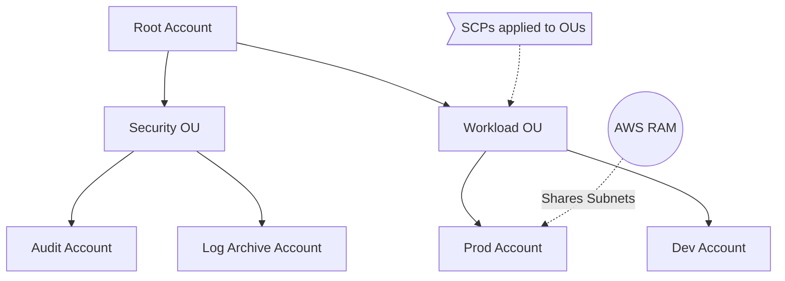
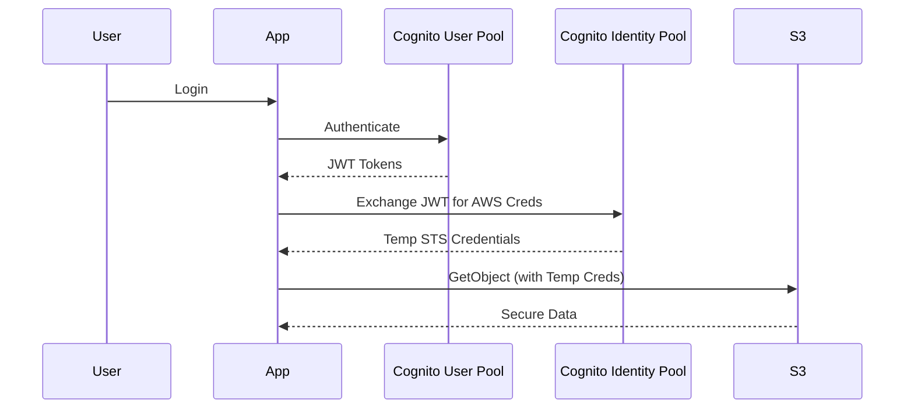
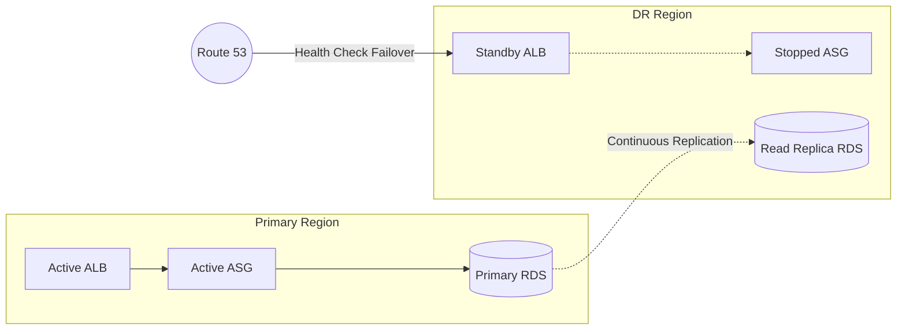
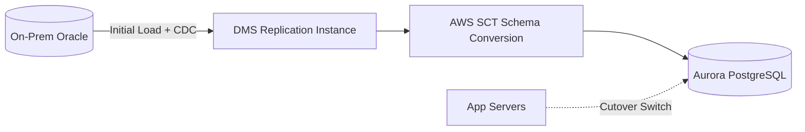
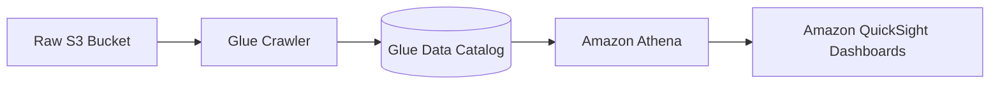

# AWS SAA-C03: Advanced Identity, Disaster Recovery & Other Services

## AWS Organizations & Control Tower

### 📖 Technical Specifications & AWS Core Concepts
* **AWS Organizations:** Centralized management for multiple AWS accounts. Provides consolidated billing, volume discounts, and Organizational Units (OUs) for hierarchy.
* **Service Control Policies (SCPs):** JSON policies that set maximum permission boundaries across accounts or OUs. They do not grant permissions; they restrict them (e.g., denying access to specific regions or services).
* **Control Tower:** Managed service that automates the setup of a multi-account environment (Landing Zone). Uses AWS Organizations and provides preventive (SCPs) and detective (AWS Config) guardrails. Account Factory allows vending new baseline-configured accounts.
* **AWS Resource Access Manager (RAM):** Service to securely share AWS resources (e.g., Subnets, Transit Gateways) across accounts without VPC peering.

### 🗺️ Visual Architecture: Multi-Account Landing Zone


### 🧠 Architectural Probing & Decision Scenarios
* **Scenario:** You need to prevent all developers in the Dev OU from leaving the organization.
  * **Design:** Deploy an SCP denying `organizations:LeaveOrganization` at the Dev OU level. Because SCPs cascade and enforce maximum permissions even for the root user of the member account.
* **Scenario:** You must share a common networking infrastructure (subnets) between multiple project accounts.
  * **Design:** Deploy AWS RAM in the VPC owner account and share the subnets. Because it avoids complex VPC peering and routing overhead.
* **Scenario:** You need to set up 50 AWS accounts with standardized security baselines immediately.
  * **Design:** Deploy AWS Control Tower. Because its Account Factory provisions new accounts with predefined guardrails (CloudTrail, Config) automatically.

### 📐 Application Design Patterns & Trade-offs
* **Pattern:** Centralized Logging vs. Decentralized Logging.
  * **Trade-off:** Centralized logging via Control Tower to a dedicated Log Archive account ensures immutability and compliance, but incurs cross-account data transfer costs and requires strict IAM permissions for analysis.
* **Pattern:** SCP Deny vs. IAM Allow.
  * **Trade-off:** SCPs are robust for organizational guardrails but can lead to complex troubleshooting if nested OUs inherit conflicting policies. Keep SCPs minimal and broad.

### 🚀 Real-World Production Insights
* **Battle Scares:** Applying an SCP that accidentally denies `sts:AssumeRole` can lock out CI/CD pipelines and cross-account access globally. Always test SCPs in a sandbox OU first.
* **Limits:** Control Tower takes up to 60 minutes to provision a new account. Do not rely on it for real-time dynamic scaling of accounts.
* **Throttling:** AWS Organizations API has low rate limits. Bulk account creation scripts often hit `TooManyRequestsException` unless exponential backoff is implemented.

### 💻 Hands-on CLI Commands
```bash
# Create a new account in the organization
aws organizations create-account --email prod-workload@acme.com --account-name "Acme-Prod"

# Attach an SCP to an Organizational Unit
aws organizations attach-policy --policy-id p-12345678 --target-id ou-exam-ple123

# Create a resource share using RAM
aws ram create-resource-share --name "Shared-Prod-Subnets" --resource-arns arn:aws:ec2:us-east-1:123456789012:subnet/subnet-12345678
```

## Identity & Federation

### 📖 Technical Specifications & AWS Core Concepts
* **IAM Identity Center (formerly SSO):** Centralized SSO across AWS accounts and SAML-enabled business apps. Backed by Identity Store, Active Directory, or external IdPs. Maps Permission Sets to target accounts.
* **AWS STS (Security Token Service):** Issues temporary credentials. Core APIs include `AssumeRole` (cross-account), `GetSessionToken` (MFA enforcement), and `AssumeRoleWithSAML`.
* **AWS Directory Service:** Options include Managed Microsoft AD (full trust), AD Connector (proxy to on-prem), and Simple AD (Samba-based).
* **Amazon Cognito:** User Pools (authentication directory, JWTs) and Identity Pools (authorization, exchanging tokens for temporary AWS credentials via STS).

### 🗺️ Visual Architecture: Web Identity Federation Flow


### 🧠 Architectural Probing & Decision Scenarios
* **Scenario:** You need to grant a third-party auditor access to your AWS account.
  * **Design:** Deploy an IAM Role with a trust policy requiring an `sts:ExternalId`. Because this prevents the confused deputy problem during cross-account role assumption.
* **Scenario:** You have an on-premises Active Directory and want employees to access the AWS Console without syncing passwords to AWS.
  * **Design:** Deploy AD Connector and IAM Identity Center. Because AD Connector proxies authentication requests directly to on-prem AD without caching credentials in the cloud.
* **Scenario:** Mobile app users need direct upload access to an S3 bucket.
  * **Design:** Deploy Cognito User Pools for login and Identity Pools for AWS credentials. Because embedding static IAM credentials in mobile code is a critical security vulnerability.

### 📐 Application Design Patterns & Trade-offs
* **Pattern:** AssumeRole vs. Resource-based Policies.
  * **Trade-off:** AssumeRole requires the caller to switch context and lose original permissions. Resource-based policies (e.g., S3 Bucket Policies) allow cross-account access while maintaining the original identity, but are not supported by all AWS services.

### 🚀 Real-World Production Insights
* **Battle Scares:** STS `AssumeRole` credentials expire in 1 hour by default (max 12). Long-running batch jobs will fail mid-execution if they don't implement credential refreshing logic.
* **Limits:** Cognito User Pools have strict limits on email sending via Amazon SES sandbox. You must move SES to production to support real-world sign-up volumes.

### 💻 Hands-on CLI Commands
```bash
# Assume a cross-account role with an External ID
aws sts assume-role --role-arn arn:aws:iam::123456789012:role/AuditorRole --role-session-name AuditSession --external-id "UniqueSecretId123"

# Enforce MFA for CLI programmatic access
aws sts get-session-token --serial-number arn:aws:iam::123456789012:mfa/jdoe --token-code 123456
```

## Disaster Recovery Strategies & Backup

### 📖 Technical Specifications & AWS Core Concepts
* **DR Strategies:** Backup & Restore (Hours RPO/RTO), Pilot Light (Minutes RPO/RTO, core DB active, compute off), Warm Standby (Seconds RPO, scaled-down active compute), Multi-Site Active-Active (Near-zero RPO/RTO, full scale active).
* **AWS Backup:** Centralized backup management. Uses Backup Plans, Vaults, and supports Vault Lock (WORM compliance).
* **AWS Elastic Disaster Recovery (DRS):** Block-level continuous replication of on-prem/cloud servers to AWS. Creates a low-cost staging area and spins up full EC2 instances upon failover.

### 🗺️ Visual Architecture: Pilot Light DR Strategy


### 🧠 Architectural Probing & Decision Scenarios
* **Scenario:** You need immutable backups that cannot be deleted by a compromised root user.
  * **Design:** Deploy AWS Backup with Vault Lock. Because Vault Lock enforces a Write-Once-Read-Many (WORM) policy at the infrastructure level.
* **Scenario:** You require sub-second RPO and sub-minute RTO for a global application.
  * **Design:** Deploy Aurora Global Database and DynamoDB Global Tables with Multi-Site Active-Active. Because synchronous/near-synchronous global replication guarantees minimal data loss and instant failover.
* **Scenario:** You need to protect on-premises VMs with continuous replication but minimal cloud compute costs.
  * **Design:** Deploy AWS DRS. Because it replicates blocks to cheap staging volumes/t3 instances and only provisions full production EC2 instances during actual failover.

### 📐 Application Design Patterns & Trade-offs
* **Pattern:** Pilot Light vs. Warm Standby.
  * **Trade-off:** Pilot Light minimizes cost by keeping compute off but increases RTO due to instance boot and scaling times. Warm Standby reduces RTO but incurs constant compute costs for the scaled-down environment.

### 🚀 Real-World Production Insights
* **Battle Scares:** Relying on standard EC2 AMIs for DR in a new region often fails because limits (e.g., vCPU quotas) are region-specific. Always pre-warm quotas in your DR region.
* **Throttling:** Mass-restoring hundreds of EBS volumes simultaneously from snapshots can trigger API rate limits and lead to degraded volume performance due to lazy-loading from S3.

### 💻 Hands-on CLI Commands
```bash
# Enable Backup Vault Lock for compliance
aws backup put-backup-vault-lock-configuration --backup-vault-name prod-vault --min-retention-days 30

# Start an on-demand backup job
aws backup start-backup-job --backup-vault-name prod-vault --resource-arn arn:aws:ec2:us-east-1:123456789012:volume/vol-0a1b2c3d
```

## Data Migration & Transfer

### 📖 Technical Specifications & AWS Core Concepts
* **AWS DataSync:** Online migration/sync tool. Deploys an agent to transfer data between on-prem (NFS/SMB) and AWS (S3/EFS/FSx).
* **AWS Application Migration Service (MGN):** Replaces CloudEndure. Lift-and-shift server migration via block-level replication.
* **AWS Database Migration Service (DMS):** Homogeneous and heterogeneous (via Schema Conversion Tool - SCT) DB migration. Uses CDC (Change Data Capture) for zero-downtime cutover.
* **AWS Snow Family:** Offline transfer for petabyte-scale data. Snowcone (8TB), Snowball Edge Storage/Compute (80TB/42TB), Snowmobile (100PB).
* **AWS Transfer Family:** Managed SFTP, FTPS, and FTP endpoints backed by S3 or EFS.

### 🗺️ Visual Architecture: Zero-Downtime Database Migration


### 🧠 Architectural Probing & Decision Scenarios
* **Scenario:** You need to migrate 50TB of NAS data to S3 over a reliable 10 Gbps direct connect.
  * **Design:** Deploy AWS DataSync. Because it handles network throttling, checksum verification, and is faster/more reliable than raw rsync for online transfers.
* **Scenario:** You need to migrate an Oracle database to Aurora PostgreSQL with zero downtime.
  * **Design:** Deploy AWS SCT for schema translation, then AWS DMS with CDC enabled. Because CDC continuously applies transaction logs to the target, allowing the app to switch over instantly.
* **Scenario:** You must transfer 10 PB of historical video archives from an on-prem data center with a 1 Gbps connection.
  * **Design:** Deploy AWS Snowball Edge Storage Optimized devices. Because online transfer of 10PB over 1Gbps would take years; physical transfer is significantly faster.

### 📐 Application Design Patterns & Trade-offs
* **Pattern:** Online (DataSync) vs. Offline (Snowball) Migration.
  * **Trade-off:** DataSync ensures real-time sync but saturates network links. Snowball avoids network saturation but introduces physical shipping latency and requires a final delta-sync for active datasets.

### 🚀 Real-World Production Insights
* **Battle Scares:** Running DMS on heavily transactional source databases can degrade production performance because it constantly polls transaction logs. Always monitor source DB CPU/IOPS during initial load.
* **Limits:** Snowball Edge devices have a maximum borrowing period (typically 90 days). If data extraction is slow, you will incur hefty extension fees.

### 💻 Hands-on CLI Commands
```bash
# Create a DataSync task from NFS to S3
aws datasync create-task --source-location-arn arn:aws:datasync:us-east-1:1234:location/loc-1 --destination-location-arn arn:aws:datasync:us-east-1:1234:location/loc-2

# Start a DMS replication task with CDC
aws dms start-replication-task --replication-task-arn arn:aws:dms:us-east-1:1234:task:XYZ --start-replication-task-type start-replication
```

## Analytics, Batch Compute & Other Services

### 📖 Technical Specifications & AWS Core Concepts
* **Amazon Athena:** Serverless SQL queries directly on S3 objects. Pay per TB scanned.
* **Amazon Redshift:** Petabyte-scale OLAP data warehouse. Uses columnar storage and cluster compute.
* **AWS Glue:** Serverless ETL and Data Catalog. Crawlers automatically infer schemas from S3/DBs.
* **AWS Batch:** Containerized batch computing. Dynamically provisions optimal EC2/Spot instances.
* **AWS AppRunner:** Fully managed container-to-url deployment service without infrastructure ops.
* **Edge Compute:** AWS Outposts (AWS racks on-prem), Local Zones (compute close to metro areas), Wavelength (compute on 5G networks).

### 🗺️ Visual Architecture: Serverless Analytics Pipeline


### 🧠 Architectural Probing & Decision Scenarios
* **Scenario:** You need to run complex business intelligence (BI) queries across years of structured transaction data.
  * **Design:** Deploy Amazon Redshift. Because it is a dedicated columnar data warehouse optimized for complex OLAP joins.
* **Scenario:** You need to query an ALB access log file stored in S3 exactly once to find an IP address.
  * **Design:** Deploy Amazon Athena. Because it provides ad-hoc serverless SQL directly on S3 without provisioning clusters or loading data.
* **Scenario:** You need to run 50,000 parallel media transcoding jobs in Docker containers.
  * **Design:** Deploy AWS Batch. Because it automatically orchestrates container execution across Spot fleets and handles queueing, unlike Lambda which has 15-minute limits.

### 📐 Application Design Patterns & Trade-offs
* **Pattern:** Athena (Serverless) vs. Redshift (Provisioned).
  * **Trade-off:** Athena has zero idle cost but high per-query cost on unoptimized data. Redshift has high idle cost but provides predictable latency and lower per-query cost at massive scale. Use Parquet/ORC for Athena to reduce scan costs.

### 🚀 Real-World Production Insights
* **Battle Scares:** Querying uncompressed JSON logs in Athena will cost $5 per TB scanned. Unoptimized queries easily rack up thousands of dollars. Always use Glue to convert JSON to columnar Parquet formats before querying.
* **Limits:** AWS Batch scales aggressively. If your batch jobs depend on a downstream relational database, they will easily exhaust database connection pools. Rate limit Batch using job queues.

### 💻 Hands-on CLI Commands
```bash
# Execute an Athena SQL query against S3 data
aws athena start-query-execution --query-string "SELECT * FROM alb_logs LIMIT 10" --result-configuration OutputLocation=s3://query-results-bucket/

# Submit a job to an AWS Batch queue
aws batch submit-job --job-name transcode-job --job-queue high-priority-queue --job-definition ffmpeg-task
```
