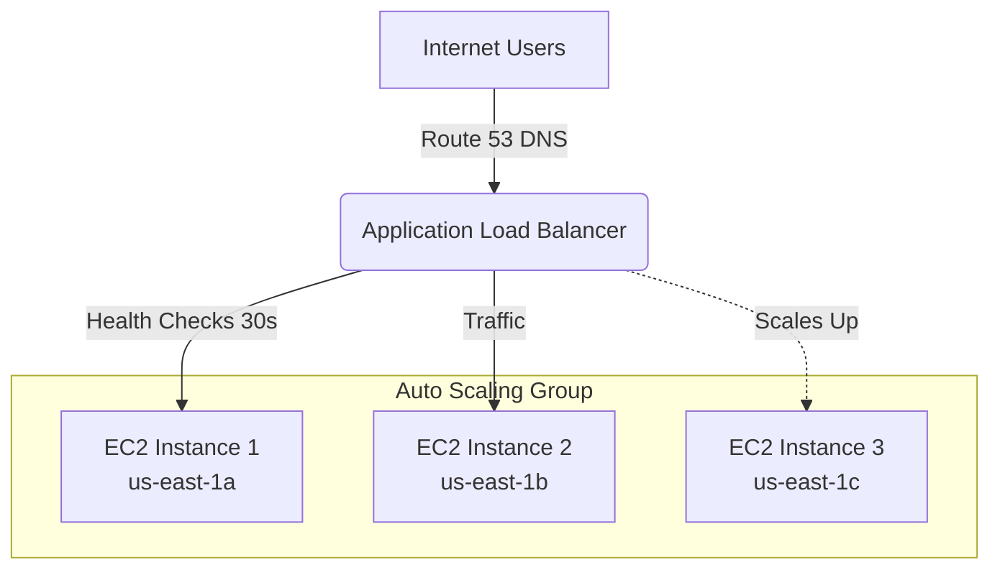
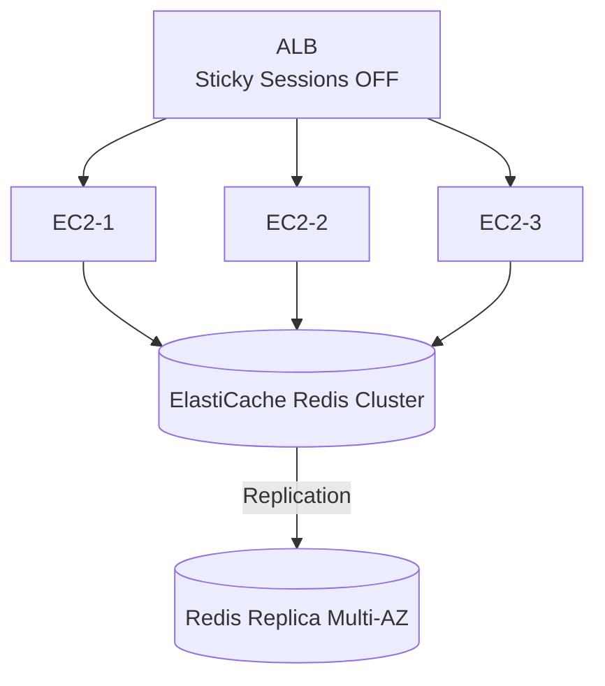
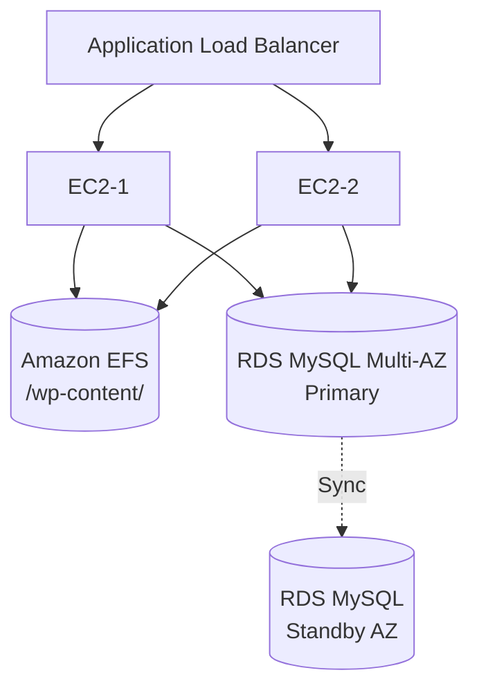
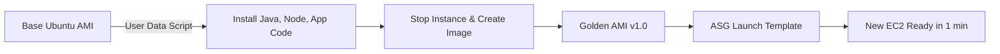

# AWS Solutions Architect Associate (SAA-C03) — Classic Solutions Architecture

## Stateless Web Applications

### 📖 Technical Specifications & AWS Core Concepts
- **Horizontal vs Vertical Scaling**: Scaling out by adding more instances vs scaling up by upgrading instance size.
- **Application Load Balancer (ALB)**: Distributes incoming application traffic across multiple targets (EC2 instances) and performs regular health checks.
- **Auto Scaling Group (ASG)**: Ensures you have the correct number of EC2 instances available to handle the load, automatically scaling based on thresholds.
- **High Availability**: Deploying architecture across multiple Availability Zones (AZs) to prevent a single point of failure.

### 🗺️ Visual Architecture: Multi-AZ Stateless Scaling


### 🧠 Architectural Probing & Decision Scenarios
* **Scenario:** You need to handle sudden spikes in traffic without manual intervention.
  * **Design:** Deploy an Auto Scaling Group with dynamic scaling policies. Because it automatically provisions instances based on CPU utilization or other metrics.
* **Scenario:** A single EC2 instance crashes unexpectedly.
  * **Design:** Deploy behind an Application Load Balancer with an ASG. Because the ALB will route traffic to healthy instances, and the ASG will terminate the unhealthy instance and spin up a replacement.
* **Scenario:** The entire `us-east-1a` availability zone experiences a power outage.
  * **Design:** Deploy instances across multiple Availability Zones. Because it ensures high availability if one datacenter fails completely.

### 📐 Application Design Patterns & Trade-offs
- **Vertical vs Horizontal Scaling:** Vertical scaling is limited by hardware maximums and keeps a single point of failure. Horizontal scaling allows virtually infinite scale but requires a completely stateless architecture where any instance can handle any request.
- **ALB Health Checks:** Must be tuned correctly. Too slow means users hit dead instances before they are removed; too fast causes unnecessary instance termination during minor CPU spikes.

### 🚀 Real-World Production Insights
- **Battle Scares (Scaling Delay):** Scaling policies based purely on CPU can be too slow. Real-world spikes often hit faster than the 5-minute CloudWatch default aggregation. Pre-warming the ASG or using predictive scaling is critical for known traffic events (e.g., ticket sales).
- **Battle Scares (Burstable Limits):** Relying on single instances or small ASGs using `t2/t3` burstable instances can lead to silent app degradation when CPU credits run out under sustained load.

### 💻 Hands-on CLI Commands
```bash
# Modify ALB target group deregistration delay
aws elbv2 modify-target-group-attributes \
  --target-group-arn arn:aws:elasticloadbalancing:us-east-1:123456789012:targetgroup/my-targets/50dc6c495c0c9188 \
  --attributes Key=deregistration_delay.timeout_seconds,Value=30
```

## Stateful Web Applications with Session Management

### 📖 Technical Specifications & AWS Core Concepts
- **Session Management**: Handling user-specific state (like shopping carts or login sessions) in a horizontally scaled architecture.
- **Sticky Sessions**: An ALB mechanism to bind a user's session to a specific EC2 instance.
- **Externalized Session Store**: Decoupling session data from compute instances using distributed memory caches like ElastiCache (Redis/Memcached).

### 🗺️ Visual Architecture: Distributed Session Store


### 🧠 Architectural Probing & Decision Scenarios
* **Scenario:** Users lose their shopping cart when navigating between pages.
  * **Design:** Deploy Amazon ElastiCache (Redis) to store session data. Because keeping state on EC2 RAM means session loss if the ALB routes the next request to a different instance.
* **Scenario:** You have strict budget constraints and low traffic but need session persistence.
  * **Design:** Enable ALB Sticky Sessions. Because it routes the user to the same instance without requiring extra infrastructure, though it risks session loss on instance failure.

### 📐 Application Design Patterns & Trade-offs
- **Sticky Sessions vs ElastiCache:** Sticky sessions cause uneven load distribution and data loss on instance failure. ElastiCache decouples state from compute, enabling seamless scaling and fault tolerance, but adds infrastructure cost and application complexity.

### 🚀 Real-World Production Insights
- **Battle Scares (Hot Instances):** Sticky sessions often lead to "hot instances" where one EC2 server gets overloaded by a few heavily active users, while others sit idle. Moving to ElastiCache fixes this but requires application code changes.
- **Battle Scares (Network Bottlenecks):** Redis can be bottlenecked by network bandwidth on smaller EC2 instance types before it runs out of memory or CPU. Always monitor `NetworkBytesIn` and `NetworkBytesOut`.

### 💻 Hands-on CLI Commands
```bash
# Create ElastiCache Redis for session storage
aws elasticache create-cache-cluster \
  --cache-cluster-id session-store \
  --cache-node-type cache.t3.small \
  --engine redis \
  --num-cache-nodes 1 \
  --cache-subnet-group-name my-cache-subnet-group \
  --security-group-ids sg-cache-only-from-ec2

# Enable sticky sessions (Legacy approach)
aws elbv2 modify-target-group-attributes \
  --target-group-arn arn:aws:elasticloadbalancing:us-east-1:123456789012:targetgroup/my-targets/12345 \
  --attributes Key=stickiness.enabled,Value=true Key=stickiness.type,Value=lb_cookie Key=stickiness.lb_cookie.duration_seconds,Value=86400
```

## Stateful Applications with Shared Media

### 📖 Technical Specifications & AWS Core Concepts
- **Amazon EFS (Elastic File System)**: Fully managed, scalable, shared NFS file system designed to be mounted by multiple EC2 instances simultaneously.
- **RDS Multi-AZ**: High availability deployment for relational databases using a synchronous standby replica.
- **Security Group Chaining**: Using logical security group references instead of IP blocks to enforce strict network isolation between application tiers.

### 🗺️ Visual Architecture: 3-Tier Web Architecture


### 🧠 Architectural Probing & Decision Scenarios
* **Scenario:** Users upload images but they randomly 404 when refreshing the page.
  * **Design:** Deploy Amazon EFS and mount it on all instances. Because storing images on local EBS volumes means other instances behind the ALB cannot serve them.
* **Scenario:** A database crash causes 30 minutes of downtime while restoring a snapshot.
  * **Design:** Deploy RDS with Multi-AZ enabled. Because it maintains a synchronous standby replica and automatically fails over in 1-2 minutes without data loss.
* **Scenario:** The database CPU is at 100% due to heavy reporting queries.
  * **Design:** Deploy an RDS Read Replica. Because it offloads read traffic from the primary database, freeing up capacity for writes.

### 📐 Application Design Patterns & Trade-offs
- **EBS vs EFS:** EBS is single-instance, fast, and block-level (OS drives). EFS is multi-instance, NFS-based, and highly durable, but has higher latency per operation and is significantly more expensive.
- **Security Group Referencing:** Crucial for zero-trust within the VPC. The Database SG should only accept traffic from the Application SG. Never use IP CIDRs for internal routing.

### 🚀 Real-World Production Insights
- **Battle Scares (EFS Credits):** If you use General Purpose EFS and run out of burst credits, your disk I/O crawls to a halt, taking down the entire application. Always monitor `BurstCreditBalance` or switch to Elastic Throughput.
- **Battle Scares (DNS Caching):** Multi-AZ failovers change the DNS resolution of the RDS endpoint. Applications that aggressively cache DNS lookups will fail to connect after a failover until the application is restarted. Ensure JVM/Node DNS TTLs are kept low.

### 💻 Hands-on CLI Commands
```bash
# Create EFS for shared image storage
aws efs create-file-system \
  --performance-mode generalPurpose \
  --encrypted \
  --tags Key=Name,Value=wordpress-images

# Create RDS with Multi-AZ
aws rds create-db-instance \
  --db-instance-identifier user-data-db \
  --db-instance-class db.t3.medium \
  --engine mysql \
  --master-username admin \
  --master-user-password MySecurePass123 \
  --allocated-storage 100 \
  --multi-az \
  --no-publicly-accessible \
  --vpc-security-group-ids sg-rds-from-ec2-only

# Allow EC2 to RDS (SG-to-SG rule)
aws ec2 authorize-security-group-ingress \
  --group-id sg-rds \
  --protocol tcp \
  --port 3306 \
  --source-group sg-app
```

## Rapid Application Instantiation

### 📖 Technical Specifications & AWS Core Concepts
- **Golden AMIs (Amazon Machine Images)**: A pre-configured, immutable image of a server containing the OS, software, and dependencies needed to run an application.
- **EC2 User Data**: Scripts executed at boot time to bootstrap an instance.
- **AMI Bakery**: The automated pipeline to build, test, and distribute Golden AMIs.

### 🗺️ Visual Architecture: AMI Bakery Process


### 🧠 Architectural Probing & Decision Scenarios
* **Scenario:** Auto Scaling takes 7 minutes to bring a new instance online, causing users to experience high latency during traffic spikes.
  * **Design:** Deploy a Golden AMI with all dependencies pre-installed. Because relying entirely on EC2 User Data to download code and install packages at boot time is too slow to react to dynamic traffic.
* **Scenario:** You need to share a baseline enterprise image across multiple AWS accounts in an organization.
  * **Design:** Modify the AMI launch permissions to explicitly include the target account IDs. Because AMIs are private by default but can be shared cross-account securely without making them public.

### 📐 Application Design Patterns & Trade-offs
- **Golden AMI vs User Data Bootstrapping:** Golden AMIs offer incredibly fast startup times (1-2 mins) and immutable, predictable deployments, but require a robust pipeline (like EC2 Image Builder) to maintain and update. User Data is highly flexible and simple to manage but severely impacts scaling speed. A hybrid approach (Golden AMI for heavy OS/dependencies, User Data for lightweight runtime config) is the industry standard.

### 🚀 Real-World Production Insights
- **Battle Scares (Hardcoded Secrets):** Do not hardcode secrets, DB passwords, or AWS credentials into Golden AMIs. Anyone with access to launch the AMI can extract them. Instead, use IAM Instance Profiles to fetch secrets from AWS Secrets Manager at runtime via User Data.
- **Battle Scares (IO Throttling):** Launching hundreds of instances simultaneously from the same massive AMI can sometimes lead to I/O throttling as the underlying EBS snapshot is lazily loaded. Pre-warming volumes (EBS fast snapshot restore) is essential for rapid massive scale-outs of IO-intensive apps.

### 💻 Hands-on CLI Commands
```bash
# Create AMI from a running, configured instance
aws ec2 create-image \
  --instance-id i-1234567890abcdef0 \
  --name "my-app-golden-ami-2026-03-06" \
  --description "Pre-baked AMI with app dependencies" \
  --no-reboot

# Share AMI with another AWS account securely
aws ec2 modify-image-attribute \
  --image-id ami-0abcdef1234567890 \
  --launch-permission "Add=[{UserId=987654321098}]"
```
