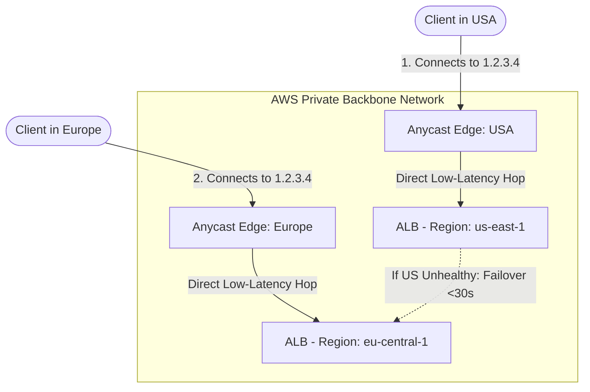

# CloudFront & Global Accelerator (Engineering Architect Reference)

> 📚 Official Docs: https://docs.aws.amazon.com/AmazonCloudFront/latest/DeveloperGuide/ | https://docs.aws.amazon.com/global-accelerator/latest/dg/
> 🎯 SAA-C03 Exam Weight: Medium-High — key edge networking services for content caching, DDOS mitigation, and global path routing.

---

## 🌐 Topic 1: Amazon CloudFront Origins & Security

### 📖 Technical Specifications & AWS Core Concepts
* **Amazon CloudFront:** A globally distributed Content Delivery Network (CDN) that caches data at 500+ edge locations (Points of Presence) to reduce latency and origin server load.
* **Origin Access Control (OAC):** The modern security standard that restricts S3 bucket access to authorized CloudFront distributions only, replacing the legacy Origin Access Identity (OAI).
* **VPC Origin:** A private network connector that allows CloudFront to route traffic directly to private ALBs, NLBs, or EC2 instances inside a VPC without public internet exposure.
* **Geo Restriction:** A CloudFront feature that allowlists or blocklists viewer access by country based on a Geo-IP database mapping.
* **Cache Invalidation:** The process of manually evicting cached files from all global edge locations before their TTL (Time-To-Live) expires.

---

### 🗺️ Visual Architecture: CloudFront OAC Request Signing to S3

```mermaid
graph TD
    Client([Internet Client]) -->|1. Request /index.html| CF{CloudFront Distribution}
    
    subgraph CloudFront_Edge [CloudFront Edge Location]
        CF -->|2. Check Cache| Cache{Cache lookup}
    end

    Cache -->|Cache Hit: Return 200 OK| Client
    
    subgraph AWS_Region [AWS Region: us-east-1]
        Cache -->|3. Cache Miss: Generate SIGv4 Signature| OAC[Origin Access Control]
        OAC -->|4. Signed Request| S3[(Private S3 Bucket)]
        
        note right of S3
            Bucket Policy allows ONLY 
            CloudFront Service Principal 
            and matches Distribution ARN
        end note
    end
```

---

### 🧠 Architectural Probing & Decision Scenarios
* **Scenario:** Why should an architect migrate from legacy OAI to OAC for CloudFront S3 origins?**
  * **Design:** Legacy OAI does not support modern S3 features such as KMS server-side encryption (SSE-KMS) for cached objects, POST/PUT upload protocols, or newer AWS regions. OAC provides enhanced security (temporary credentials via SigV4), support for SSE-KMS, and compatibility across all AWS regions.
* **Scenario:** How does a VPC Origin protect backend application servers?**
  * **Design:** VPC Origins allow CloudFront to route traffic directly to private Application Load Balancers, Network Load Balancers, or EC2 instances running in private subnets. This eliminates the need to assign public IP addresses to ALB target nodes, drastically reducing the external attack surface.

---

### 📐 Application Design Patterns & Trade-offs
* **CloudFront Caching vs. S3 Cross-Region Replication (CRR):**
  * **CloudFront:** Caches static assets globally at 500+ edge locations with TTL expiration. **Trade-off:** Ideal for read-heavy static web pages, static media, or API gateway acceleration. Requires invalidation or versioned naming to update.
  * **S3 CRR:** Asynchronously replicates objects between specific regional buckets. **Trade-off:** Ideal for regional disaster recovery (DR) or low-latency local reads of dynamic datasets that require real-time synchronization across specific regions.

---

### 🚀 Real-World Production Insights
* **The KMS Encrypted Bucket Access Failure:**
  * **The Trap:** When enabling OAC on a CloudFront distribution pointing to an S3 bucket encrypted with a custom KMS key (SSE-KMS), resources will return HTTP 403 Forbidden errors, even if the S3 bucket policy is correctly configured.
  * **Mitigation:** The custom KMS key policy must explicitly allow the CloudFront service principal (`cloudfront.amazonaws.com`) permission to decrypt (`kms:Decrypt`) the key, scoped to the specific distribution's ARN.
* **The Bulk Invalidation Database Crash:**
  * **The Disaster:** A deploy script executes a wild-card invalidation `/*` on an active, high-traffic website to ensure users see a new deployment version. This immediately drops the cache hit rate to 0% across all 500+ global edge locations, sending a massive stampede of HTTP requests directly to the origin backend database, crashing the application.
  * **Mitigation:** Utilize **Versioned Filenames** (e.g., `bundle.v102.js` instead of `bundle.js`) for code releases. Since the filename changes, it is treated as a new request, bypassing the old cache cleanly without requiring invalidation.

---

### 💻 Hands-on CLI Commands
* **Create a CloudFront Origin Access Control (OAC) configuration:**
  ```bash
  aws cloudfront create-origin-access-control \
    --origin-access-control-config '{
      "Name": "s3-oac-config",
      "Description": "Secure access to static files",
      "SigningProtocol": "sigv4",
      "SigningBehavior": "always",
      "OriginAccessControlOriginType": "s3"
    }'
  ```
* **Invalidate a specific path on a CloudFront distribution:**
  ```bash
  aws cloudfront create-invalidation \
    --distribution-id E1234567890ABC \
    --paths "/images/*" "/js/app.js"
  ```

---

## 🗺️ Topic 2: AWS Global Accelerator — Network Routing & Anycast IPs

### 📖 Technical Specifications & AWS Core Concepts
* **AWS Global Accelerator:** A networking service that routes user traffic over the AWS private backbone network to optimal regional endpoints.
* **Anycast IP:** An IP address block advertised from multiple global edge locations. BGP routing automatically sends packets to the closest physical router advertising that IP.
* **Client IP Preservation:** An option that preserves the source IP address of the client in the packet headers, allowing target application logs to see the client's actual IP.

---

### 🗺️ Visual Architecture: Anycast IP Routing & Regional Failover



---

### 🧠 Architectural Probing & Decision Scenarios
* **Scenario:** Why does Global Accelerator provide faster failover than Route 53 DNS routing?**
  * **Design:** Route 53 relies on updating DNS records (TTL). Even with a low TTL (e.g., 60s), client browsers, corporate proxies, and ISPs cache DNS mappings, keeping clients routed to a failed region for minutes or hours. Global Accelerator assigns **2 static Anycast IPs** that never change. When a region fails, Global Accelerator's health checkers update routing tables at the edge in **under 30 seconds**, shifting traffic instantly.
* **Scenario:** What protocols does Global Accelerator support compared to CloudFront?**
  * **Design:** CloudFront is strictly an HTTP/HTTPS (Layer 7) caching network. Global Accelerator operates at the network level and supports **TCP, UDP, and TLS** protocols. This makes it suitable for non-HTTP workloads like multiplayer gaming (UDP), IoT devices (MQTT), VoIP, and SMTP.

---

### 📐 Application Design Patterns & Trade-offs
* **CloudFront vs. Global Accelerator (HTTP API Acceleration):**
  * **CloudFront:** Caches responses locally. Best for cacheable HTTP endpoints (static assets, catalog APIs).
  * **Global Accelerator:** Does not cache. It acts purely as a network route optimizer. Best for dynamic HTTP/TCP/UDP traffic where low-latency packet transit to the origin is required without caching.

---

### 🚀 Real-World Production Insights
* **The Static IP Whitelisting Requirement:**
  * **The Problem:** Enterprise B2B clients frequently require you to provide a static IP address for their corporate firewall outbound whitelists. Placing a standard ALB as the endpoint is impossible because ALB IP addresses are dynamic.
  * **Mitigation:** Deploy AWS Global Accelerator. It provides two static Anycast IP addresses that remain fixed for the life of the resource, serving as a stable entrance point to your private backend network.

---

### 💻 Hands-on CLI Commands
* **Create a Global Accelerator and assign a listener:**
  ```bash
  # Step 1: Create the Accelerator
  aws globalaccelerator create-accelerator \
    --name production-accelerator \
    --ip-address-type IPV4 \
    --enabled
    
  # Step 2: Create a TCP Listener on Port 80 and 443
  aws globalaccelerator create-listener \
    --accelerator-arn arn:aws:globalaccelerator::123456789012:accelerator/abc123-def456 \
    --protocol TCP \
    --port-ranges '[{"FromPort": 80, "ToPort": 80}, {"FromPort": 443, "ToPort": 443}]'
  ```
