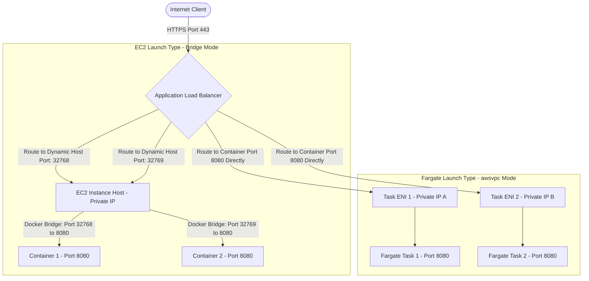
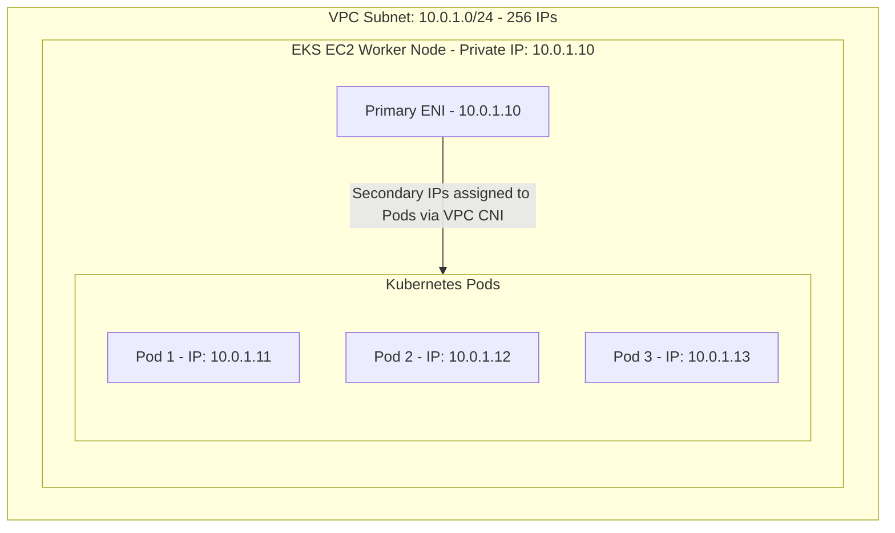

# AWS Containers — ECS, Fargate, EKS & ECR (Engineering Architect Reference)

> 📚 Official Docs: https://docs.aws.amazon.com/AmazonECS/latest/developerguide/ | https://docs.aws.amazon.com/eks/latest/userguide/ | https://docs.aws.amazon.com/AmazonECR/latest/userguide/
> 🎯 SAA-C03 Exam Weight: High — key services for running containerized microservices, serverless container hosting, and Kubernetes orchestration.

---

## 📦 Topic 1: Amazon ECS — Native Container Orchestration & Launch Types

### 📖 Technical Specifications & AWS Core Concepts
* **Amazon ECS:** Elastic Container Service, an AWS-native, highly scalable container management service to run, stop, and manage Docker containers on a cluster.
* **EC2 Launch Type:** A hosting model where you provision, manage, and scale the underlying EC2 instances that host your containers.
* **Fargate Launch Type:** A serverless hosting model where AWS provisions, manages, and scales the underlying compute resources for your containers.
* **Task Definition:** A JSON-formatted text file that describes one or more containers (up to 10) that form your application (specifying CPU, memory, ports, storage, and IAM roles).
* **Task:** An active running instance of a Task Definition inside a cluster.
* **Service:** An ECS configuration that runs and maintains a specified number of simultaneous instances of a task definition in an ECS cluster.

---

### 🗺️ Visual Architecture: Dynamic Host Port Mapping vs. Fargate `awsvpc` Mode



---

### 🧠 Architectural Probing & Decision Scenarios
* **Scenario:** Under what conditions should an architect choose ECS Fargate over ECS EC2 launch types?**
  * **Design:** Choose **ECS Fargate** when you want a serverless compute model with no server patching, no operating system maintenance, and no cluster auto-scaling setup. Fargate scales containers natively based on CPU/Memory demands. Choose **ECS EC2** only when you require custom OS kernel settings, access to GPU instances, legacy daemon containers running on host operating systems, or when you have highly predictable, sustained workloads where managing reservation instances on EC2 is cheaper.
* **Scenario:** What is the difference between the Task Execution Role and the Task Role in an ECS task definition?**
  * **Design:** * **Task Execution Role:** Used by the **ECS container agent** on the host before the container runs. It grants permissions to pull images from ECR, decrypt secrets from Systems Manager Parameter Store/Secrets Manager, and push container logs to CloudWatch Logs.
    * **Task Role:** Assigned to the **application inside the container** at runtime. It grants the container permissions to call other AWS services (e.g., querying a DynamoDB table or writing to an S3 bucket).

---

### 📐 Application Design Patterns & Trade-offs
* **Dynamic Host Port Mapping (EC2 Bridge Mode) vs. `awsvpc` Network Mode:**
  * **EC2 Bridge Mode:** Allows multiple tasks of the same container to run on a single EC2 host by mapping a random host port (from the ephemeral port range 49152–65535) to the static container port (e.g., 8080). **Trade-off:** Requires ALB dynamic port mapping integration, complicates security group rules (must allow the entire ephemeral range from ALB), and restricts tasks to sharing the host's ENI bandwidth.
  * **`awsvpc` Mode (Default for Fargate):** Allocates a dedicated Elastic Network Interface (ENI) and private IP to each task. **Trade-off:** Simplifies security group mapping (tasks behave like EC2 instances), but consumes VPC subnet IP addresses rapidly.

---

### 🚀 Real-World Production Insights
* **The "Container Access Denied" Role Mixup:**
  * **The Issue:** A newly deployed container crashes at startup with `AccessDeniedException` when trying to connect to DynamoDB. The developer verifies that the Task Execution Role has the DynamoDB permissions.
  * **The Failure:** The developer confused the roles. The Task Execution Role is only for the ECS agent to bootstrap the task. The actual running code inside the container uses the **Task Role** to authenticate to AWS resources.
  * **Mitigation:** Create two separate roles: `ecsTaskExecutionRole` (with AmazonECSTaskExecutionRolePolicy) and `appTaskRole` (with specific DynamoDB/S3 permissions), and associate them correctly in the task definition JSON.
* **EFS File-Lock Freezes under High Write Loads:**
  * **The Problem:** Multiple container tasks share a persistent Amazon EFS volume. When tasks perform highly concurrent file writes (e.g., logging or database processing), the shared EFS locks freeze, causing container tasks to freeze and fail health checks.
  * **Mitigation:** EFS is designed for shared read-heavy workloads. For high-throughput write workloads, utilize container ephemeral storage or write directly to S3/DynamoDB instead of EFS.

---

### 💻 Hands-on CLI Commands
* **Register a Task Definition (Task Execution Role vs. Task Role):**
  ```json
  // task-def.json
  {
    "family": "web-app",
    "networkMode": "awsvpc",
    "executionRoleArn": "arn:aws:iam::123456789012:role/ecsTaskExecutionRole",
    "taskRoleArn": "arn:aws:iam::123456789012:role/appTaskRole",
    "containerDefinitions": [
      {
        "name": "web",
        "image": "123456789012.dkr.ecr.us-east-1.amazonaws.com/web-app:latest",
        "cpu": 256,
        "memory": 512,
        "portMappings": [
          {
            "containerPort": 8080,
            "hostPort": 8080
          }
        ]
      }
    ]
  }
  ```
  ```bash
  aws ecs register-task-definition --cli-input-json file://task-def.json
  ```
* **Create an ECS Service running on Fargate:**
  ```bash
  aws ecs create-service \
    --cluster production-cluster \
    --service-name web-service \
    --task-definition web-app:1 \
    --desired-count 2 \
    --launch-type FARGATE \
    --network-configuration '{
      "awsvpcConfiguration": {
        "subnets": ["subnet-0abc123def456", "subnet-0def456abc123"],
        "securityGroups": ["sg-0abc123def456"],
        "assignPublicIp": "ENABLED"
      }
    }'
  ```

---

## 🎡 Topic 2: Amazon EKS — Managed Kubernetes & Networking

### 📖 Technical Specifications & AWS Core Concepts
* **Amazon EKS:** Elastic Kubernetes Service, a managed service that makes it easy to run Kubernetes on AWS without needing to install and operate your own Kubernetes control plane.
* **Fargate Profile:** A configuration that allows EKS to schedule pods on AWS Fargate (serverless worker nodes) based on namespace selectors.
* **VPC CNI (Container Network Interface):** The default Kubernetes networking plugin for EKS that assigns real private IP addresses from your VPC subnets directly to Kubernetes pods.

---

### 🗺️ Visual Architecture: EKS Node Group & VPC CNI Pod IP Allocation



---

### 🧠 Architectural Probing & Decision Scenarios
* **Scenario:** Why should an architect choose EKS over ECS for container deployments?**
  * **Design:** EKS is preferred when migrating existing workloads already running on Kubernetes (on-premises or on other cloud providers) to AWS, as it maintains compatibility with the standard Kubernetes API and CLI tools (`kubectl`). ECS is selected for AWS-first organizations that prefer a simpler configuration that integrates natively with AWS IAM, CloudWatch, and security services out of the box.
* **Scenario:** How does EKS VPC CNI handle IP allocation, and what is its main scaling limitation?**
  * **Design:** The VPC CNI plugin assigns primary/secondary private IP addresses from your VPC subnets directly to Kubernetes pods. This means pods have native VPC access and low network latency. However, because each pod consumes a real IP from the subnet, you can quickly **exhaust your VPC subnet IP pool** if you run high-density containers or auto-scale rapidly.

---

### 📐 Application Design Patterns & Trade-offs
* **Pod IP Address Conservation in EKS:**
  * **The Trade-off:** By default, each pod gets a unique IP from the subnet. If you have a small subnet (e.g., `/24`), you are limited to 251 usable IPs, restricting EKS scaling.
  * **The Design Pattern:** Configure **VPC CNI Prefix Delegation** or allocate a secondary CIDR block to the VPC specifically for EKS pod networking (custom networking). This allows you to scale pods without exhausting IPs in primary subnets where ALB or databases reside.

---

### 🚀 Real-World Production Insights
* **The VPC CNI "No IP Available" Cluster Lockup:**
  * **The Trap:** An EKS cluster scales up during a batch execution, launching hundreds of short-lived pods. Suddenly, new pods get stuck in the `ContainerCreating` or `Pending` state, throwing network errors.
  * **The Failure:** The subnet ran out of available private IP addresses, blocking the VPC CNI from assigning IPs to the new pods.
  * **Mitigation:** Plan subnet sizes carefully. Always assign larger subnets (e.g., `/20` or `/18`) to EKS worker nodes, or implement custom networking to route pod IPs from a dedicated secondary VPC CIDR block.

---

### 💻 Hands-on CLI Commands
* **Create an EKS cluster utilizing eksctl:**
  ```bash
  eksctl create cluster \
    --name production-eks \
    --version 1.28 \
    --region us-east-1 \
    --nodegroup-name standard-workers \
    --node-type t3.medium \
    --nodes 3 \
    --nodes-min 1 \
    --nodes-max 5 \
    --managed
  ```
