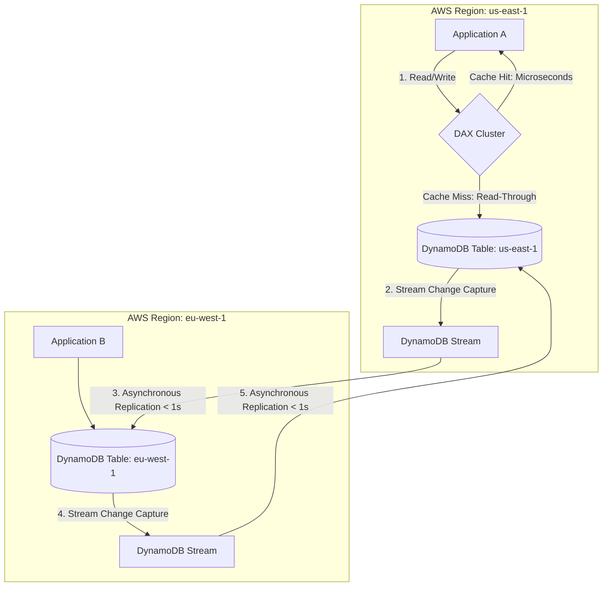
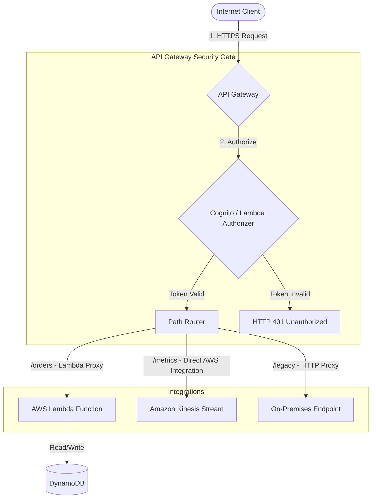

# DynamoDB, API Gateway & Serverless Architecture (Engineering Architect Reference)

> 📚 Official Docs: https://docs.aws.amazon.com/amazondynamodb/ | https://docs.aws.amazon.com/apigateway/ | https://docs.aws.amazon.com/step-functions/
> 🎯 SAA-C03 Exam Weight: Very High — core serverless components for building scalable, secure, low-latency microservice architectures.

---

## 🗄️ Topic 1: Amazon DynamoDB — NoSQL Scale & Partitioning

### 📖 Technical Specifications & AWS Core Concepts
* **Amazon DynamoDB:** A fully managed, serverless, multi-region NoSQL database providing single-digit millisecond response times at any scale.
* **Partition Key (PK / Hash Key):** An attribute that DynamoDB uses as input to an internal hash function to distribute data across physical storage partitions.
* **Sort Key (SK / Range Key):** An attribute used to sort items within a partition, enabling rich range queries (e.g., using `begins_with`, `between`).
* **LSI (Local Secondary Index):** An index that shares the same partition key as the base table but has a different sort key. Can only be created during table instantiation.
* **GSI (Global Secondary Index):** An index with a partition key and optional sort key that can be different from the base table. Can be created/deleted dynamically.

---

### 🗺️ Visual Architecture: DAX In-line Cache & Global Tables



---

### 🧠 Architectural Probing & Decision Scenarios
* **Scenario:** How does DynamoDB handle partition allocation, and what are the capacity limits of a single partition?**
  * **Design:** DynamoDB automatically divides a table's data into partitions based on partition key hashes. A single physical partition has a maximum capacity of **10 GB of data**, and can support a maximum throughput of **1,000 WCUs** (Write Capacity Units) or **3,000 RCUs** (Read Capacity Units). When a table exceeds any of these limits, DynamoDB splits the partition.
* **Scenario:** What is the architectural trade-off of creating a Global Secondary Index (GSI) on a DynamoDB table?**
  * **Design:** GSIs enable flexible queries across different attributes. However:
    1. **Eventual Consistency:** Queries on GSIs are always eventually consistent.
    2. **Write Costs:** Every write to the base table that updates a GSI attribute incurs write capacity costs on the GSI. If the GSI is under-provisioned, writes to the base table will be throttled (backpressure).

---

### 📐 Application Design Patterns & Trade-offs
* **Provisioned Capacity (with Auto Scaling) vs. On-Demand Mode:**
  * **Provisioned Mode:** You specify exact RCUs and WCUs. **Trade-off:** Safest and most cost-effective for predictable workloads with steady-state baselines. Scales via Application Auto Scaling but has a reaction delay.
  * **On-Demand Mode:** DynamoDB charges per request and scales instantly. **Trade-off:** Ideal for spiky, unpredictable workloads (e.g., flash sales) but can be significantly more expensive if baseline traffic remains high.

---

### 🚀 Real-World Production Insights
* **The "Hot Partition" Throttle Disaster:**
  * **The Trap:** An application uses `TenantID` as the partition key. One tenant (e.g., a viral enterprise customer) generates 5,000 write requests per second. Since a single partition can only handle 1,000 WCUs, the partition throttles, throwing `ProvisionedThroughputExceededException` errors, blocking writes for that tenant and potentially others sharing the same physical partition, even if the table-level provisioned WCU is set to 20,000.
  * **Mitigation:** Implement **Partition Key Salting**. Append a randomized suffix (e.g., `TenantID_0` to `TenantID_9`) to the partition key during writes to distribute the load across multiple physical partitions, and query them in parallel using Scatter-Gather scripts.
* **Write Backpressure Throttling via GSIs:**
  * **The Problem:** If you configure a table with 1,000 WCUs, but set its GSI to only 100 WCUs, writes to the base table that modify GSI attributes will throttle down to the GSI's limit of 100. DynamoDB throttles the primary write to prevent the GSI replication lag from falling behind.
  * **Mitigation:** Always size GSI write capacity symmetrically with the base table's write capacity, or use On-Demand mode which handles this automatically.

---

### 💻 Hands-on CLI Commands
* **Create a DynamoDB Table with a Composite Primary Key:**
  ```bash
  aws dynamodb create-table \
    --table-name game-scores \
    --attribute-definitions \
      AttributeName=user_id,AttributeType=S \
      AttributeName=game_id,AttributeType=S \
    --key-schema \
      AttributeName=user_id,KeyType=HASH \
      AttributeName=game_id,KeyType=RANGE \
    --billing-mode PAY_PER_REQUEST
  ```
* **Query a table utilizing the sort key for range filtering:**
  ```bash
  aws dynamodb query \
    --table-name game-scores \
    --key-condition-expression "user_id = :uid AND game_id begins_with(:gid)" \
    --expression-attribute-values '{
      ":uid": {"S": "user-100"},
      ":gid": {"S": "match-"}
    }'
  ```

---

## 🌐 Topic 2: Amazon API Gateway — Request Landing & Integration

### 📖 Technical Specifications & AWS Core Concepts
* **Amazon API Gateway:** A managed service that allows developers to create, publish, maintain, and secure APIs at any scale.
* **REST API:** A stateless HTTP API supporting features like request validation, caching, API keys, and client rate throttling.
* **HTTP API:** A lightweight, low-latency API proxy designed for serverless architectures, offering up to 70% lower costs than REST APIs.
* **Lambda Authorizer:** A custom API Gateway policy evaluator written as a Lambda function (useful for validating OAuth/custom tokens).
* **Usage Plan:** A configuration that associates API keys with specific rate and burst throttling limits to govern client access.

---

### 🗺️ Visual Architecture: Secure API Request Landing & Routing



---

### 🧠 Architectural Probing & Decision Scenarios
* **Scenario:** What is the difference between an Edge-Optimized endpoint and a Regional endpoint in API Gateway?**
  * **Design:** * **Edge-Optimized:** Routes traffic to a hidden Amazon CloudFront distribution globally, resolving SSL handshakes at the closest edge location. Best for public, globally distributed clients.
    * **Regional:** Resolves handshakes within the host AWS region. Best when clients are concentrated in the same region, or when routing traffic through a regional CloudFront distribution you manage.
* **Scenario:** How does API Gateway handle throttling, and how can an architect prevent a single client from starving other API consumers?**
  * **Design:** API Gateway has a default regional throttle limit (typically 10,000 requests per second with a 5,000 burst limit). To prevent client starvation, implement **API Keys and Usage Plans**. This allows you to configure individual throttling limits (RPS and Burst) per API key.

---

### 📐 Application Design Patterns & Trade-offs
* **REST API vs. HTTP API:**
  * **REST API:** Supports request/response mapping templates, client SSL certificates, private VPC endpoints, API keys, and usage plans. **Trade-off:** High feature set, but higher cost and slightly higher routing latency.
  * **HTTP API:** Designed for high-scale, low-latency routing directly to Lambda or HTTP backends. Supports JWT authentication and CORS natively. **Trade-off:** Lacks mapping templates and API keys, but is up to 70% cheaper and faster.

---

### 🚀 Real-World Production Insights
* **The 29-Second Hard Integration Timeout:**
  * **The Trap:** API Gateway has a hard limit on request integration timeouts: **29 seconds**. If a backend Lambda function or HTTP service takes 30 seconds to process a batch job, API Gateway will cut the connection and return an HTTP 504 Gateway Timeout error, even if the backend process eventually finishes successfully.
  * **Mitigation:** Never execute long-running synchronous jobs via API Gateway. Convert the integration to an **Asynchronous Event-Driven Pattern**: API Gateway immediately pushes the request payload to an SQS queue and returns an HTTP 202 Accepted status with a tracking ID. A backend worker processes the queue, and the client polls a separate endpoint or opens a WebSocket for status updates.

---

### 💻 Hands-on CLI Commands
* **Create an API Gateway HTTP API and deploy it:**
  ```bash
  # Step 1: Create the HTTP API
  aws apigatewayv2 create-api \
    --name production-api \
    --protocol-type HTTP \
    --target arn:aws:lambda:us-east-1:123456789012:function:order-processor
  ```

---

## ⚙️ Topic 3: AWS Step Functions & Amazon Cognito — Orchestration & Auth

### 📖 Technical Specifications & AWS Core Concepts
* **AWS Step Functions:** A low-code visual workflow orchestrator used to build state machines that coordinate multiple AWS services.
* **Standard Workflows:** Workflows designed for long-running processes (up to 1 year) that require audit history and visual execution tracing.
* **Express Workflows:** High-throughput, short-duration workflows (up to 5 minutes) designed for high-volume event processing (e.g., IoT data ingestion).
* **Amazon Cognito User Pool:** A user directory that handles user registration, authentication, login pages, and token generation.
* **Amazon Cognito Identity Pool (Federated Identities):** An authorization service that exchanges User Pool tokens (or external identity provider tokens) for temporary, limited-privilege AWS IAM credentials.

---

### 🧠 Architectural Probing & Decision Scenarios
* **Scenario:** Why should an architect use Step Functions to coordinate Lambda functions instead of executing direct Lambda-to-Lambda calls?**
  * **Design:** Direct Lambda-to-Lambda calls lead to **tight coupling and double-billing**. If Lambda A invokes Lambda B and waits for B to return, you are paying for both runtimes concurrently (Lambda A sits idle). Step Functions acts as an external state machine, executing routing logic and error handling natively. This reduces runtime costs, handles retries, and provides visual debugging history.
* **Scenario:** When should an application use Cognito User Pools versus Cognito Identity Pools?**
  * **Design:** * **User Pools:** Use when you need to manage user identities (sign-up, sign-in, password resets, and MFA) and obtain JSON Web Tokens (JWT).
    * **Identity Pools:** Use when you need to authorize users to access AWS resources directly (e.g., granting a user permission to upload files directly to a private S3 bucket folder) by exchanging user pool tokens for temporary IAM credentials.

---

### 🚀 Real-World Production Insights
* **Step Functions Double-Billing Prevention:**
  * **The Scenario:** A workflow processes an invoice: validating the metadata, calculating taxes, and charging a card. If implemented as a single orchestrator Lambda calling child functions sequentially, the orchestrator runs for 4 seconds, charging you for idle wait time.
  * **Mitigation:** Use Step Functions to model this as a state machine. The transition state machine handles the values, invokes Lambdas asynchronously, and saves on orchestrator execution costs.

---

### 💻 Hands-on CLI Commands
* **Create an AWS Step Functions State Machine:**
  ```bash
  aws stepfunctions create-state-machine \
    --name InvoiceWorkflow \
    --definition '{"Comment": "Process Invoice", "StartAt": "Validate", "States": {"Validate": {"Type": "Task", "Resource": "arn:aws:lambda:us-east-1:123456789012:function:validate-invoice", "End": true}}}' \
    --role-arn arn:aws:iam::123456789012:role/stepfunctions-execution-role
  ```
