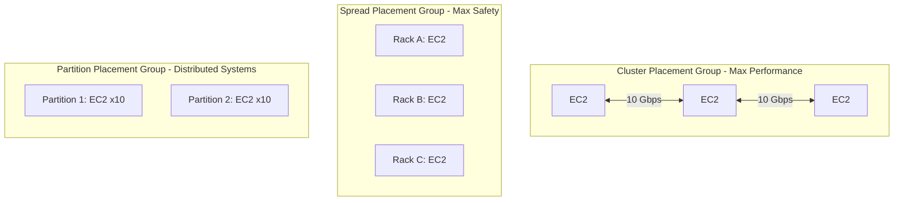
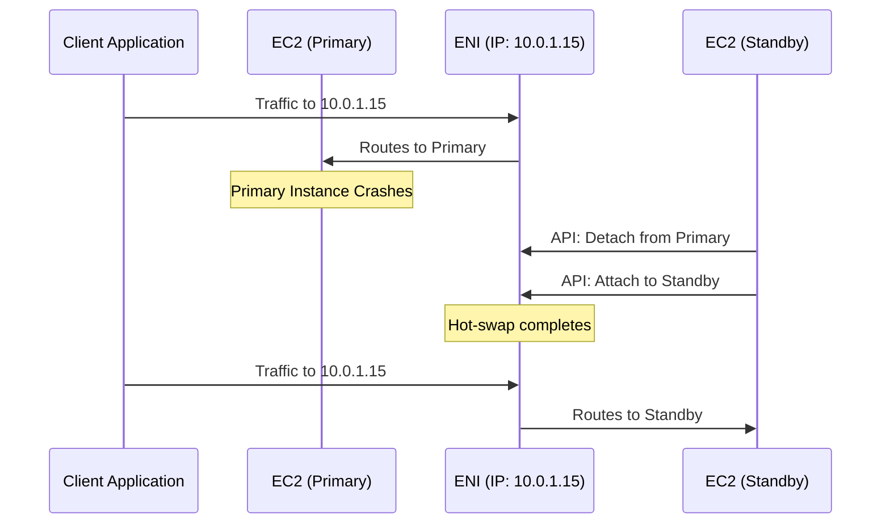
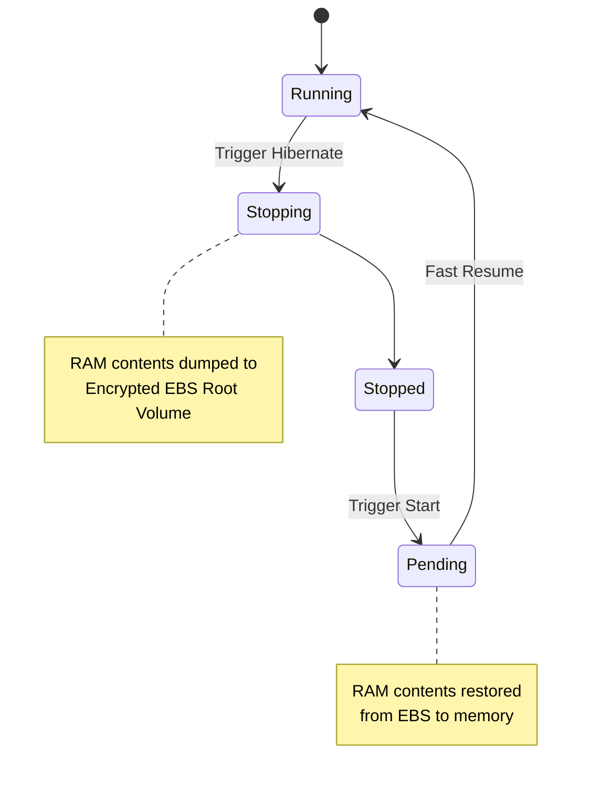

# Amazon EC2 – Associate Level Concepts (Placement, ENI, Hibernate)
> 📚 Official Docs: https://docs.aws.amazon.com/AWSEC2/latest/UserGuide/  
> 🎯 SAA-C03 Exam Weight: Medium — tests depth beyond basic EC2 deployments.

---

## 📦 Topic 1: EC2 Placement Groups

### 📖 Technical Specifications & AWS Core Concepts
* **Placement Groups:** A logical grouping of instances within a single AWS Region that allows you to influence the underlying hardware placement.
* **Cluster Placement Group:** Packs instances close together inside a single Availability Zone. Delivers ultra-low latency and 10 Gbps+ network throughput.
* **Spread Placement Group:** Strictly places each instance on distinct underlying hardware (distinct racks, network, and power source). Hard limit of **7 instances per AZ**.
* **Partition Placement Group:** Divides the group into logical segments called partitions. Instances in one partition do not share hardware with instances in other partitions. Up to 7 partitions per AZ, but can contain hundreds of instances.

---

### 🗺️ Visual Architecture: Placement Strategies



---

### 🧠 Architectural Probing & Decision Scenarios
* **Scenario:** You are deploying a massive Hadoop cluster or Cassandra ring and need to ensure that a single hardware rack failure does not take down multiple data nodes.
  * **Design:** Deploy a **Partition Placement Group**. It scales to hundreds of instances while physically separating subsets of the cluster into isolated failure domains.
* **Scenario:** You are running a tightly-coupled High Performance Computing (HPC) financial simulation that requires microsecond inter-node latency.
  * **Design:** Deploy a **Cluster Placement Group**. It places instances on the same rack in a single AZ to minimize network hops.
* **Scenario:** You are hosting a 5-node Zookeeper cluster that orchestrates your microservices. Total loss of the cluster would be catastrophic.
  * **Design:** Deploy a **Spread Placement Group**. It places each instance on a separate physical rack. (It natively supports the 5 nodes since the limit is 7 per AZ).

---

### 📐 Application Design Patterns & Trade-offs
* **Performance vs. Fault Tolerance (Cluster vs. Spread):**
  * **Cluster:** Optimized for network speed. **Trade-off:** High blast radius. If the rack loses power, the entire HPC job fails simultaneously.
  * **Spread:** Optimized for independent hardware isolation. **Trade-off:** Limited scale (max 7 per AZ) and no guaranteed ultra-low latency between nodes.

---

### 🚀 Real-World Production Insights
* **The "Insufficient Capacity" Trap with Clusters:**
  * **The Problem:** When launching instances into an existing Cluster placement group later in its lifecycle, you frequently encounter `InsufficientInstanceCapacity` errors. This happens because AWS must find contiguous rack space right next to the existing instances, which may no longer be available.
  * **Mitigation:** Always launch the entire batch of required instances for a Cluster Placement Group simultaneously in a single API call, rather than scaling out incrementally.

---

### 💻 Hands-on CLI Commands
* **Create a Spread Placement Group and launch an instance:**
  ```bash
  aws ec2 create-placement-group \
    --group-name my-spread-pg \
    --strategy spread
    
  aws ec2 run-instances \
    --image-id ami-0abcdef1234567890 \
    --instance-type m5.large \
    --placement '{"GroupName": "my-spread-pg"}'
  ```

---

## 🌐 Topic 2: Elastic Network Interfaces (ENI) & IP Failover

### 📖 Technical Specifications & AWS Core Concepts
* **Elastic Network Interface (ENI):** A logical networking component in a VPC that represents a virtual network card.
* **ENI Attributes:** Holds a primary private IPv4 address, optional secondary IPv4 addresses, an optional Elastic IP (public IP), a MAC address, and one or more Security Groups.
* **AZ Boundary:** ENIs are strictly bound to a single Availability Zone. They cannot be detached and moved to an instance in a different AZ.
* **Hot Attach/Detach:** ENIs can be attached or detached from running EC2 instances on-the-fly without requiring a reboot.

---

### 🗺️ Visual Architecture: ENI IP Failover



---

### 🧠 Architectural Probing & Decision Scenarios
* **Scenario:** You have a legacy licensed software application running on an EC2 instance. The license is hardcoded to the server's MAC address. The underlying hardware degrades and you must replace the instance.
  * **Design:** Detach the **ENI** from the failing instance and attach it to a newly launched replacement instance. The ENI retains the same MAC address and private IP, satisfying the legacy licensing requirement natively.
* **Scenario:** A primary backend server crashes. You need a fast, cheap way to route internal VPC traffic to a standby server without using an internal Load Balancer or updating DNS records.
  * **Design:** Script an automated **ENI Failover**. Have the standby server detach the ENI from the crashed primary and attach it to itself. Internal clients connecting to the static private IP experience minimal interruption.

---

### 📐 Application Design Patterns & Trade-offs
* **ENI Failover vs. Internal Load Balancers:**
  * **ENI Failover:** Very cheap (free), retains exact IP and MAC addresses. **Trade-off:** Failover takes a few seconds to process API calls, and is strictly limited to a single AZ.
  * **Internal ALB/NLB:** Instant, seamless failover across multiple AZs. **Trade-off:** Incurs hourly running costs and data processing fees, and obscures the client IP (unless using NLB or X-Forwarded-For).

---

### 🚀 Real-World Production Insights
* **The "Secondary ENI Asymmetric Routing" Bug:**
  * **The Problem:** Engineers attach a secondary ENI (in a different subnet) to an EC2 instance so it can straddle two networks. However, Linux OS routing tables by default send all return traffic out the primary ENI (eth0). Traffic comes in on eth1 but leaves on eth0, causing stateful firewalls/security groups to drop the packets.
  * **Mitigation:** You must implement Policy-Based Routing (PBR) inside the guest OS (e.g., using `iproute2` in Linux) to ensure that traffic arriving on the secondary ENI also departs via the secondary ENI.

---

### 💻 Hands-on CLI Commands
* **Hot-swap an ENI from a failed instance to a new one:**
  ```bash
  aws ec2 detach-network-interface \
    --attachment-id eni-attach-0abc123def456

  aws ec2 attach-network-interface \
    --network-interface-id eni-0abc123def456 \
    --instance-id i-NEW-INSTANCE-ID \
    --device-index 1
  ```

---

## 😴 Topic 3: EC2 Hibernate & Instance Metadata Service (IMDS)

### 📖 Technical Specifications & AWS Core Concepts
* **EC2 Hibernate:** Pauses an instance and saves the contents of RAM to the EBS root volume. Upon resume, the RAM is reloaded, bypassing the OS boot sequence and application initialization time.
* **Hibernate Constraints:** The root volume must be an encrypted EBS volume. Maximum 150 GB of RAM. Cannot hibernate longer than 60 days. Must be enabled at launch time.
* **Instance Metadata Service (IMDS):** A local endpoint (`169.254.169.254`) accessible only from within the EC2 instance to retrieve metadata (instance ID, AZ) and IAM role credentials dynamically.
* **IMDSv2:** The modern, secure version of the metadata service that requires a session token to protect against Server-Side Request Forgery (SSRF) attacks.

---

### 🗺️ Visual Architecture: EC2 Hibernation Process



---

### 🧠 Architectural Probing & Decision Scenarios
* **Scenario:** You have a fleet of machine learning worker nodes. Loading the multi-gigabyte inference model into memory takes 15 minutes during boot, rendering Auto Scaling ineffective for sudden traffic spikes.
  * **Design:** Use **EC2 Hibernate**. Pre-warm the instances by loading the ML models into RAM, then hibernate them. When the Auto Scaling Group scales out, the instances resume with the models already in RAM, reducing launch time from 15 minutes to seconds.
* **Scenario:** Your security team alerts you that a vulnerability in your web application could allow an attacker to make internal HTTP requests (SSRF), potentially exposing the temporary IAM credentials of the EC2 instance.
  * **Design:** Enforce **IMDSv2** on all EC2 instances. IMDSv2 requires the attacker to execute a `PUT` request to generate a session token before fetching metadata, which natively blocks almost all standard SSRF attack vectors.

---

### 📐 Application Design Patterns & Trade-offs
* **Hibernation vs. Golden AMIs:**
  * **Golden AMIs:** Bakes software and dependencies into the disk image. **Trade-off:** Fast OS boot, but the application must still initialize and load data into RAM upon startup.
  * **Hibernation:** Saves the exact running state of RAM. **Trade-off:** Instant resume, but incurs EBS storage costs for the RAM dump file, and instances cannot be hibernated indefinitely (60-day limit).

---

### 🚀 Real-World Production Insights
* **The Hibernate "Out of Space" Kernel Panic:**
  * **The Problem:** Engineers enable hibernation but size the EBS root volume exactly to the application's disk needs. When hibernation triggers, EC2 attempts to dump 32GB of RAM onto the root volume. If the volume lacks 32GB of free space, the hibernation fails, and the instance may crash or remain in a stuck state.
  * **Mitigation:** When sizing an EBS root volume for a hibernating instance, you must allocate `OS size + Application size + Total Instance RAM size`. Always overestimate the root volume size.

---

### 💻 Hands-on CLI Commands
* **Fetch IAM role credentials using the secure IMDSv2:**
  ```bash
  # 1. Get a session token (valid for 21600 seconds)
  TOKEN=`curl -X PUT "http://169.254.169.254/latest/api/token" -H "X-aws-ec2-metadata-token-ttl-seconds: 21600"`
  
  # 2. Use the token to fetch IAM credentials
  curl -H "X-aws-ec2-metadata-token: $TOKEN" http://169.254.169.254/latest/meta-data/iam/security-credentials/MyRoleName
  ```
