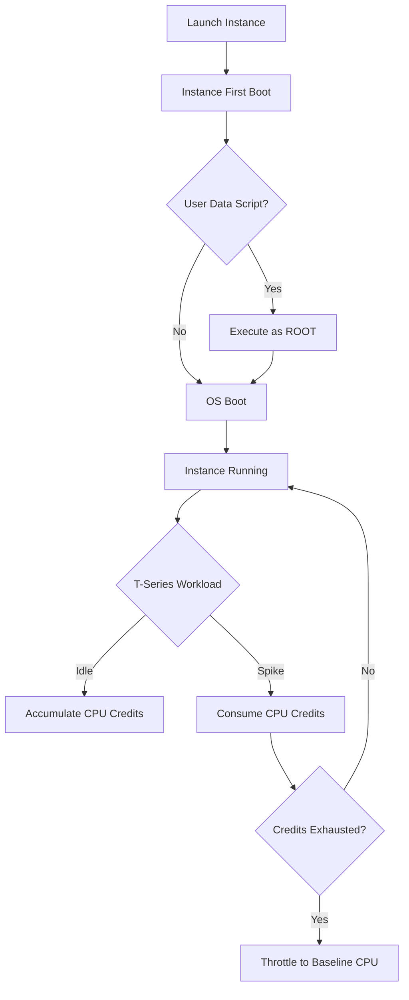
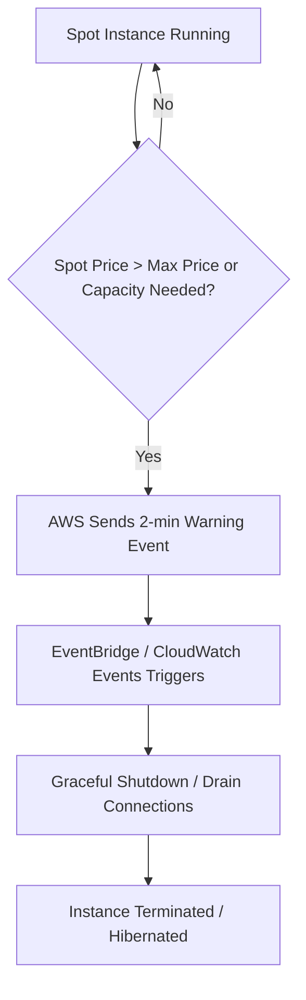
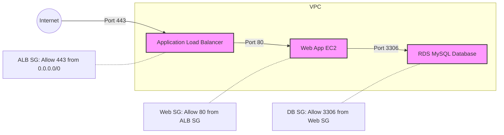

# Amazon EC2 – Basics, Instance Types, & Security Groups

## EC2 Instances & Compute Basics

### 📖 Technical Specifications & AWS Core Concepts
- **EC2 (Elastic Compute Cloud)**: IaaS (Infrastructure as a Service) offering providing resizable virtual compute capacity in the cloud. You manage the OS and above; AWS manages the physical hardware.
- **Instance Families**: Compute Optimized (c), Memory Optimized (r, x, z), Storage Optimized (i, d, h), General Purpose (t, m), Accelerated Computing (p, g, trn).
- **User Data**: Bootstrap script that executes automatically as root ONLY ONCE during the instance's first launch.
- **Credit System (T-series)**: Burstable instances (e.g., t2, t3) earn CPU credits while idle and spend them during spikes. Depleted credits result in severe throttling to a baseline CPU percentage unless T-Unlimited is enabled.
- **Elastic IP**: A static, public IPv4 address associated with your AWS account that remains attached to an instance even through stops and starts.

### 🗺️ Visual Architecture: Instance Lifecycle & User Data


### 🧠 Architectural Probing & Decision Scenarios
* **Scenario:** You need to launch a web server that requires pre-installed Apache and app code pulled from S3 upon creation.
  * **Design:** Use EC2 User Data. Because it runs automatically once at first boot as root, avoiding manual post-launch configuration.
* **Scenario:** You have a workload with unpredictable, occasional traffic spikes but extensive idle time.
  * **Design:** Deploy T-Series (e.g., t3) burstable instances. Because the credit model accumulates CPU credits during idle time to absorb spikes cost-effectively.
* **Scenario:** Your application requires a public IP address that remains completely static even if the instance is stopped, restarted, or moved.
  * **Design:** Attach an Elastic IP. Because standard EC2 public IPs change automatically upon instance stop/start.

### 📐 Application Design Patterns & Trade-offs
- **Vertical vs. Horizontal Scaling**: EC2 allows vertical scaling (resizing instance type, requiring downtime/reboot) or horizontal scaling (adding more identical instances, usually behind an Auto Scaling Group and Load Balancer).
- **Stateless Design**: Always prefer stateless instances. If instances hold no local state, they can be seamlessly replaced, terminated, or scaled out (store state in RDS, DynamoDB, or ElastiCache instead).

### 🚀 Real-World Production Insights
- **Battle Scares:** Assuming User Data runs on every reboot is a classic mistake. It only runs on the *first* launch. If you need boot scripts on every restart, use `rc.local`, systemd, or a cron `@reboot` job inside the image.
- **Throttling:** T-series CPU throttling is a very common cause of mysterious, massive performance degradation. Always monitor `CPUCreditBalance` in CloudWatch!
- **Metadata Security:** Always use IMDSv2 (session-oriented, requires tokens) over IMDSv1 to prevent SSRF (Server-Side Request Forgery) attacks where attackers might read IAM role credentials attached to the instance.

### 💻 Hands-on CLI Commands
```bash
# Launch instance with tags
aws ec2 run-instances \
  --image-id ami-0abcdef1234567890 \
  --instance-type t3.micro \
  --key-name my-key-pair \
  --subnet-id subnet-0abc123def456 \
  --tag-specifications 'ResourceType=instance,Tags=[{Key=Name,Value=MyServer}]'

# Retrieve instance ID using IMDSv2 from inside the instance
TOKEN=$(curl -X PUT "http://169.254.169.254/latest/api/token" -H "X-aws-ec2-metadata-token-ttl-seconds: 21600")
curl -H "X-aws-ec2-metadata-token: $TOKEN" http://169.254.169.254/latest/meta-data/instance-id

# Allocate and associate Elastic IP
aws ec2 allocate-address --domain vpc
aws ec2 associate-address --instance-id i-1234567890abcdef0 --allocation-id eipalloc-0abc123def456
```

---

## EC2 Purchasing Options & Cost Optimization

### 📖 Technical Specifications & AWS Core Concepts
- **On-Demand**: Pay per second (Linux/Windows) or per hour (others). No commitment. Highest cost but maximum flexibility.
- **Reserved Instances (RIs)**: 1 or 3-year commitment. Up to 72% discount. Standard RIs are locked to a family; Convertible RIs offer less discount but allow changing families.
- **Savings Plans**: Dollar commitment per hour (e.g., $10/hour) for 1 or 3 years. More flexible than RIs; covers EC2, Lambda, and Fargate dynamically.
- **Spot Instances**: Use AWS spare capacity for up to 90% off. Warning: AWS can terminate the instance with a 2-minute notice if they need capacity back or spot prices rise.
- **Dedicated Hosts/Instances**: Physical isolation. Dedicated Hosts provide full visibility into hardware sockets/cores (allows BYOL - Bring Your Own License). Dedicated Instances just ensure your instances don't share hardware with other customers.

### 🗺️ Visual Architecture: Spot Instance Interruption Flow


### 🧠 Architectural Probing & Decision Scenarios
* **Scenario:** You need to run a persistent PostgreSQL database for 3 years 24/7.
  * **Design:** Purchase Reserved Instances (or Savings Plans). Because steady-state, long-term workloads benefit massively from the 72% discount compared to On-Demand.
* **Scenario:** You are executing massive, stateless image rendering jobs that take 10 minutes and can be safely retried if failed.
  * **Design:** Use Spot Instances. Because fault-tolerant batch workloads can leverage 90% discounts and easily tolerate 2-minute interruption notices.
* **Scenario:** You have strict corporate compliance requiring physical hardware isolation and need to use existing per-socket software licenses (BYOL).
  * **Design:** Provision Dedicated Hosts. Because it provides visibility into the physical server sockets and cores required for licensing, unlike Dedicated Instances.

### 📐 Application Design Patterns & Trade-offs
- **Spot Fleet vs. Auto Scaling Groups**: A modern pattern is mixing On-Demand and Spot instances across multiple Availability Zones in an ASG to optimize cost while maintaining a baseline of guaranteed compute.
- **Flexibility vs. Discount Trade-off**: Standard RIs give the absolute highest discount but lock you to a specific instance family. Compute Savings Plans provide slightly less discount but allow shifting across instance families, regions, and compute types seamlessly.

### 🚀 Real-World Production Insights
- **Spot Reclaims:** Never rely on Spot instances for stateful components like databases or in-memory caches. AWS *will* reclaim them. Always handle the 2-minute interruption notice via EC2 metadata to drain connections and save state quickly.
- **Billing Traps:** On-Demand is billed per second for Linux and Windows, but per *hour* for RHEL, SUSE, and macOS instances. Keep this in mind when spinning up short-lived test nodes.
- **Capacity Reservations:** RIs provide a billing discount but DO NOT guarantee capacity in an AZ unless you explicitly create an On-Demand Capacity Reservation.

### 💻 Hands-on CLI Commands
```bash
# Describe running instances
aws ec2 describe-instances --filters "Name=instance-state-name,Values=running"

# Stop instance (you stop paying for compute, but still pay for EBS storage attached)
aws ec2 stop-instances --instance-ids i-1234567890abcdef0

# Start a stopped instance
aws ec2 start-instances --instance-ids i-1234567890abcdef0

# Terminate instance (permanent deletion of compute and root volume)
aws ec2 terminate-instances --instance-ids i-1234567890abcdef0
```

---

## Security Groups & Access Management

### 📖 Technical Specifications & AWS Core Concepts
- **Security Groups (SG)**: Virtual firewalls operating strictly at the EC2 instance level (ENI level) to control inbound and outbound traffic.
- **Stateful Nature**: SGs are stateful. If inbound traffic is allowed on port 80, the return outbound traffic is automatically allowed regardless of outbound rules.
- **Rule Constraints**: SGs contain **ALLOW rules only** (no explicit DENY rules exist). Default inbound is completely blocked, default outbound is completely allowed.
- **References**: SGs can reference CIDR blocks (IP ranges) or other Security Groups (SG-to-SG chaining).
- **Secure Access**: Methods include SSH (Port 22), EC2 Instance Connect, and SSM Session Manager (requires no open inbound ports).

### 🗺️ Visual Architecture: SG-to-SG Chaining


### 🧠 Architectural Probing & Decision Scenarios
* **Scenario:** You need to allow scaling EC2 web instances to talk to your RDS database dynamically.
  * **Design:** Configure the RDS Security Group to allow inbound traffic explicitly from the EC2 Security Group ID. Because IP addresses change dynamically as instances scale, but SG references safely maintain access regardless of the underlying IP.
* **Scenario:** You need to explicitly deny a specific malicious IP address from hitting your EC2 instance.
  * **Design:** Use Network ACLs (NACLs) at the subnet level. Because Security Groups only support ALLOW rules; they cannot explicitly DENY traffic.
* **Scenario:** You require secure shell access to your private EC2 instances without opening port 22 or maintaining complex bastion hosts.
  * **Design:** Use AWS Systems Manager (SSM) Session Manager. Because it leverages the SSM agent to provide secure, auditable shell access over outbound HTTPS without requiring any open inbound ports.

### 📐 Application Design Patterns & Trade-offs
- **Least Privilege Access**: Never use `0.0.0.0/0` for administrative ports like 22 (SSH) or 3389 (RDP). Always restrict to a specific corporate VPN IP or strictly use SSM Session Manager.
- **Tiered/Chained Security Groups**: A standard best practice pattern where Tier 1 (Load Balancer) allows the internet, Tier 2 (App) allows only the Tier 1 SG, and Tier 3 (Database) allows only the Tier 2 SG. Highly resilient to scaling events and prevents lateral movement.

### 🚀 Real-World Production Insights
- **SG Rule Limits:** You are hard-limited to 60 inbound and 60 outbound rules per SG. Hitting this limit during a dynamic automated deployment will cause immediate provisioning failures.
- **Connection Draining:** Because SGs are stateful, if you remove an ALLOW rule, *existing* established connections might not drop immediately until they time out natively.
- **Region Locking:** SGs are locked to a specific Region and VPC. You cannot reference a Security Group from `us-east-1` in `eu-west-1`, or across VPCs unless VPC Peering or Transit Gateway is configured.

### 💻 Hands-on CLI Commands
```bash
# Create Security Group
aws ec2 create-security-group \
  --group-name my-app-sg \
  --description "Security group for web app" \
  --vpc-id vpc-1234567890abcdef0

# Allow inbound HTTPS from anywhere
aws ec2 authorize-security-group-ingress \
  --group-id sg-0abc123def456 \
  --protocol tcp \
  --port 443 \
  --cidr 0.0.0.0/0

# SG-to-SG Rule: Allow MySQL from frontend SG (crucial pattern)
aws ec2 authorize-security-group-ingress \
  --group-id sg-backend123 \
  --protocol tcp \
  --port 3306 \
  --source-group sg-frontend456

# Create key pair and save to PEM locally
aws ec2 create-key-pair \
  --key-name my-key-pair \
  --query 'KeyMaterial' \
  --output text > my-key-pair.pem
chmod 400 my-key-pair.pem
```
