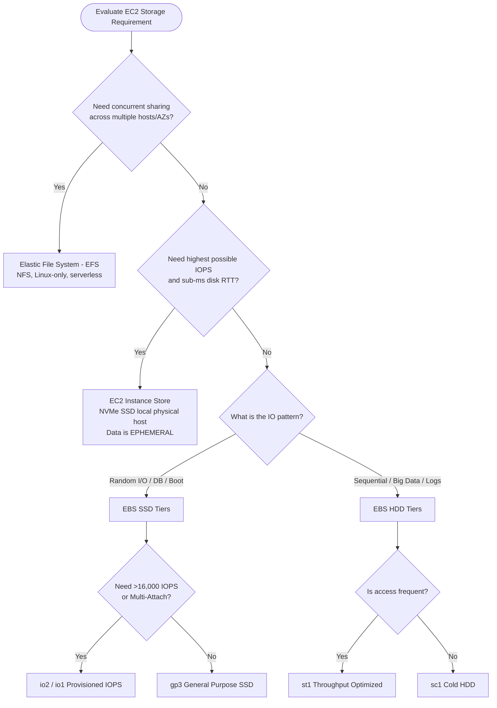
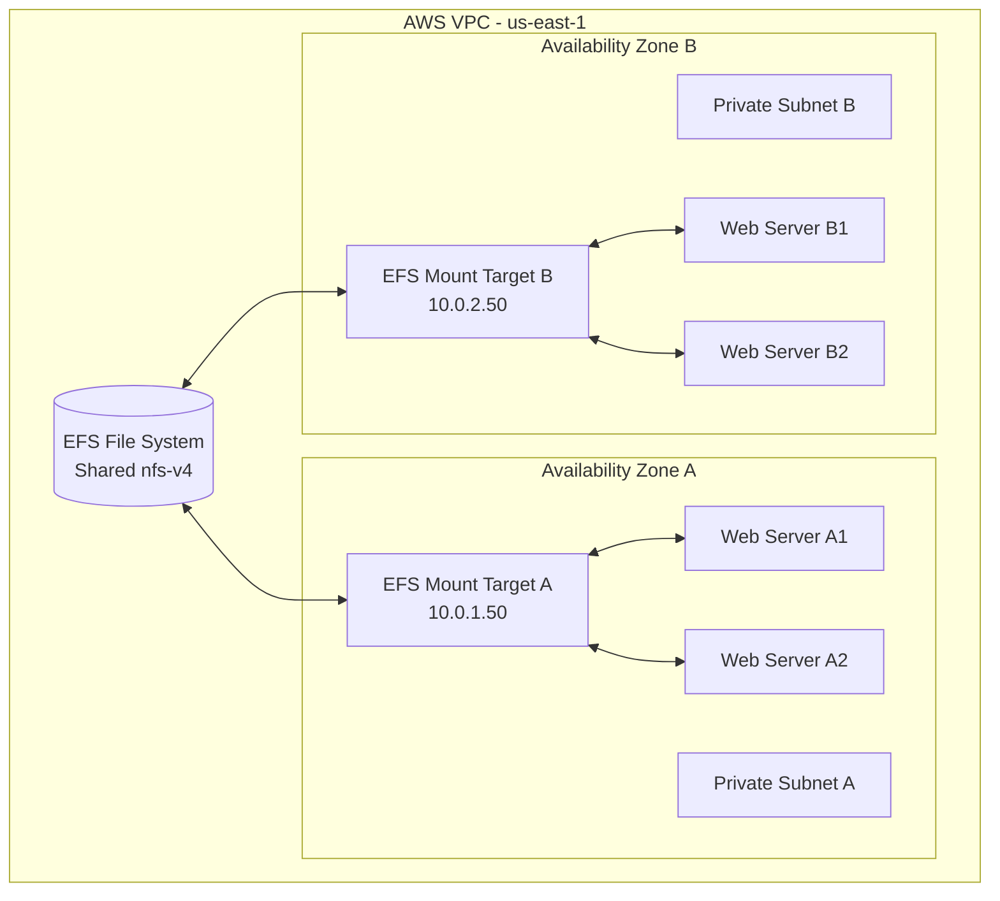

# Amazon EC2 — Instance Storage: EBS, EFS, & Instance Store (Engineering Architect Guide)

> 📚 Official Docs: https://docs.aws.amazon.com/AWSEC2/latest/UserGuide/Storage.html  
> 🎯 SAA-C03 Exam Weight: High — core architectural choices for data persistence, read/write performance, caching, and state management.

---

## 🗂️ Topic 1: Elastic Block Store (EBS) Core Concepts & SSD Volumes

### 📖 Technical Specifications & AWS Core Concepts
* **EBS (Elastic Block Store):** A network-attached block storage service designed for use with Amazon EC2 instances. It provides persistent, high-performance block storage volumes.
* **Block Storage:** A storage paradigm where data is split into evenly sized blocks, each with a unique identifier, allowing fast, random access (ideal for databases and OS drives).
* **Availability Zone (AZ) Lock:** EBS volumes are created within a specific AZ and are inherently redundant within that AZ. They cannot be attached directly to an instance in a different AZ.
* **gp3 (General Purpose SSD v3):** The default SSD volume type offering baseline performance of 3,000 IOPS and 125 MB/s throughput, allowing IOPS and throughput to be provisioned independently of storage capacity.
* **gp2 (General Purpose SSD v2):** An older SSD volume type where performance is directly linked to size (3 IOPS per GB), meaning larger capacities must be provisioned to achieve higher performance.
* **io2 Block Express / io1 (Provisioned IOPS SSD):** High-performance SSD volume types designed for I/O-intensive database and enterprise applications. io2 Block Express offers sub-millisecond latency and up to 256,000 IOPS.
* **Multi-Attach:** An EBS feature (supported only on io1/io2 SSDs) that allows mounting a single volume to up to 16 Nitro EC2 instances simultaneously within the **same** Availability Zone.
* **Delete on Termination:** An attribute that determines whether an EBS volume is automatically deleted when its attached EC2 instance is terminated. (Default is `true` for root volumes, `false` for non-root data volumes).

---

### 🧠 Architectural Probing & Decision Scenarios
* **Scenario:** Why choose gp3 over gp2, and how do they differ in cost and performance tuning?**
  * **Design:** * **Independent Scaling:** With `gp3`, you can scale IOPS and throughput independently of storage size. With `gp2`, performance is bound to size (3 IOPS per GB). If a database needs 6,000 IOPS but only 100 GB of data, `gp2` forces you to provision a 2,000 GB volume (wasted cost). `gp3` allows you to provision 100 GB and dial up the IOPS to 6,000 separately.
    * **Cost-Efficiency:** `gp3` is up to 20% cheaper per GB than `gp2`. 

* **Scenario:** When should you choose Provisioned IOPS SSD (io1/io2) instead of General Purpose SSD (gp3)?**
  * **Design:** Choose Provisioned IOPS when:
    * You need **more than 16,000 IOPS** (the maximum for `gp3`).
    * You require extreme write consistency with sub-millisecond latencies (such as large-scale Oracle, Microsoft SQL Server, or SAP HANA databases).
    * You need **Multi-Attach** to share block storage between clustered instances (e.g., clustered file systems).

* **Scenario:** What are the requirements and constraints of EBS Multi-Attach, and why can't it cross Availability Zones?**
  * **Design:** * **Constraints:** Multi-Attach only works with `io1` or `io2` volumes, requires Nitro-based instances, and **cannot cross Availability Zones** (it is bound to the physical hardware zone of the volume).
    * **Cluster File System Requirement:** You *must* use a cluster-aware file system (like GFS2 or OCFS2) at the operating system layer. Standard file systems (like ext4 or XFS) will experience data corruption because they do not coordinate read/write locks across different hosts.

* **Scenario:** Can any EBS volume be used as an EC2 boot volume?**
  * **Design:** **No.** Only SSD-based volume types (`gp2`, `gp3`, `io1`, `io2`) can be used as boot volumes. HDD-based volumes (`st1`, `sc1`) are restricted from serving as boot devices.

---

### 📐 Application Design Patterns & Trade-offs
* **Shared Storage Architecture: Clustered Block Storage (EBS Multi-Attach) vs. Distributed File System (EFS):**
  * **EBS Multi-Attach:** Provides raw, high-performance block-level access to multiple instances in the same AZ. Choose this only when running specialized enterprise clusters (like Oracle RAC or Teradata) that require low-latency raw block writes and have cluster locking systems built into the application layer.
  * **EFS:** Provides file-level access over standard network protocols (NFS) across multiple AZs. Choose this for standard microservice workloads (e.g., sharing user uploads across a dynamic auto-scaling group of web servers) where ease of management and cross-AZ resilience outweigh raw sub-millisecond disk access.

---

### 💻 Hands-on CLI Commands
* **Create a gp3 EBS volume (100 GB, custom performance specs):**
  ```bash
  aws ec2 create-volume \
    --availability-zone us-east-1a \
    --size 100 \
    --volume-type gp3 \
    --iops 3000 \
    --throughput 125 \
    --encrypted
  ```
* **Create an io2 EBS volume (500 GB, 20,000 IOPS):**
  ```bash
  aws ec2 create-volume \
    --availability-zone us-east-1a \
    --size 500 \
    --volume-type io2 \
    --iops 20000 \
    --encrypted
  ```
* **Attach an EBS volume to an EC2 instance:**
  ```bash
  aws ec2 attach-volume \
    --volume-id vol-0abc123def456 \
    --instance-id i-1234567890abcdef0 \
    --device /dev/sdf
  ```
* **Modify volume configuration in-place (no downtime):**
  ```bash
  aws ec2 modify-volume \
    --volume-id vol-0abc123def456 \
    --size 200 \
    --volume-type gp3 \
    --iops 6000
  ```

---

## 💾 Topic 2: EBS HDD Volumes & Storage Selection Decisions

### 📖 Technical Specifications & AWS Core Concepts
* **HDD (Hard Disk Drive):** Magnetic platter-based storage optimized for large sequential access, measured primarily by throughput (MB/s) rather than IOPS.
* **st1 (Throughput Optimized HDD):** A low-cost HDD volume type designed for frequently accessed, throughput-intensive workloads (e.g., big data, log processing).
* **sc1 (Cold HDD):** The lowest-cost EBS volume type, designed for infrequently accessed workloads with sequential data access patterns.

---

### 🗺️ Visual Architecture: Storage Decision Path



---

### 🧠 Architectural Probing & Decision Scenarios
* **Scenario:** Why choose st1 over sc1 for data processing workloads (like Hadoop or Kafka)?**
  * **Design:** * `st1` provides double the maximum throughput (500 MB/s) compared to `sc1` (250 MB/s). 
    * Big data framework clusters (like MapReduce, Kafka, and Hadoop) read and write massive sequential datasets where raw throughput is the primary performance bottleneck. `sc1` is too slow for active processing and should only be used as a cold archive tier.

---

### 📐 Application Design Patterns & Trade-offs
* **EBS Throughput Throttling & Burst Balance Design:**
  * **The Challenge:** HDD volumes (`st1`, `sc1`) and older SSD volumes (`gp2`) rely on an **I/O credit system** (Burst Balance). Under heavy load (e.g., running an overnight ETL batch job), the volume consumes credit. Once credit hits 0%, performance drops to baseline, causing application queues to back up and API timeouts to occur.
  * **The Architectural Pattern:** Design application data ingestion to use **rate-limiting or buffering** (via SQS or Kinesis) to prevent sudden, sustained I/O spikes from exhausting the EBS burst balance. If the workload has constant, high throughput demands, upgrade the volume to `gp3` or `io2`, where throughput and IOPS can be statically provisioned without relying on dynamic burst credits.

---

### 💻 Hands-on CLI Commands
* **Describe volume configurations and performance details:**
  ```bash
  aws ec2 describe-volumes \
    --filters "Name=status,Values=available" \
    --query 'Volumes[*].[VolumeId,VolumeType,Size,Iops,Throughput]'
  ```

---

## 🔄 Topic 3: EBS Snapshots, Data Life Cycle, & Encryption

### 📖 Technical Specifications & AWS Core Concepts
* **EBS Snapshot:** A point-in-time, incremental backup of an EBS volume that is stored durably in Amazon S3.
* **Incremental Backup:** A backup strategy where only the data blocks that have changed since the most recent snapshot are copied, saving storage space and costs.
* **Snapshot Archive:** A low-cost storage tier for EBS snapshots that are accessed infrequently (at least 90 days). It reduces storage costs by up to 75% but requires 24 to 72 hours to restore.
* **Fast Snapshot Restore (FSR):** An EBS capability that allows you to instantly restore a volume from a snapshot with full provisioned performance, eliminating the latency overhead of block initialization.
* **Recycle Bin:** A resource recovery feature that protects EBS snapshots and AMIs from accidental deletion by retaining them for a user-specified retention window.

---

### 🧠 Architectural Probing & Decision Scenarios
* **Scenario:** How does the incremental nature of EBS snapshots affect data restore times, and how does FSR solve this?**
  * **Design:** * **The Problem (Lazy Loading):** When you restore an EBS volume from a standard snapshot, the blocks are pulled from S3 "on-demand" when first read. This causes a significant performance penalty (latency spike) during the first access of each block (known as "pre-warming" lag).
    * **The Solution (FSR):** Enabling Fast Snapshot Restore ensures the restored EBS volume is instantly fully instantiated with maximum provisioned performance out of the gate. FSR is billed per hour per AZ.

* **Scenario:** How do you migrate an EBS volume from one Availability Zone (AZ) or Region to another?**
  * **Design:** 1. Create an EBS Snapshot of the target volume in its source AZ.
    2. If moving to a different region: Copy the snapshot to the destination region.
    3. Restore the snapshot into a new EBS volume in the target AZ/Region.

* **Scenario:** If an EBS snapshot is unencrypted, how can you restore it to a new, encrypted EBS volume?**
  * **Design:** You cannot encrypt an existing snapshot in-place. The correct architectural path is:
    1. Perform a copy of the unencrypted snapshot.
    2. During the copy process, enable the `Encrypted` flag and specify your KMS Key ID.
    3. Restore a new EBS volume from the newly created, encrypted snapshot.

---

### 📐 Application Design Patterns & Trade-offs
* **Pre-Warming Block Volumes vs. FSR for Dynamic Scaled Containers:**
  * **The Scenario:** You run microservices inside containers (ECS/EKS) that mount restored database volumes dynamically upon scaling.
  * **Standard Pre-warming (FIO/DD):** Running `dd` or `fio` commands on instance boot reads all blocks to pre-warm them from S3. This forces the instance to sit idle for minutes, delaying autoscaling response and increasing response times.
  * **FSR Pattern:** Architect the scaling pipeline to utilize FSR-enabled snapshots. While more expensive, FSR enables instant storage instantiation. This permits the newly launched app instance to begin serving requests immediately at full disk speeds, preventing scaling delays.

---

### 🚀 Real-World Production Insights
* **The Lazy Loading Outage Trap:**
  * **The Scenario:** A production database volume crashes. You restore the volume from a 2 TB EBS snapshot and bring the database online immediately.
  * **The Outage:** As users request data, the database query threads block because EBS is pulling block-level data from S3 on demand. Query latency spikes from 1ms to 200ms, backing up connection pools and causing a total application freeze (cascading timeout failures).
  * **Mitigation:** If recovery speed is critical, use **Fast Snapshot Restore (FSR)**. FSR guarantees the blocks are pre-loaded at the AWS hardware layer, bypassing the lazy-loading process entirely. If FSR is not enabled, your deployment pipeline must execute a pre-warming run (e.g. `dd if=/dev/xvdf of=/dev/null bs=1M`) to load all blocks before pointing the application load balancer to the new server.

---

### 💻 Hands-on CLI Commands
* **Create an EBS snapshot:**
  ```bash
  aws ec2 create-snapshot \
    --volume-id vol-0abc123def456 \
    --description "Backup before system upgrade"
  ```
* **Copy and encrypt a snapshot to another region:**
  ```bash
  aws ec2 copy-snapshot \
    --source-region us-east-1 \
    --source-snapshot-id snap-0abc123def456 \
    --destination-region eu-west-1 \
    --encrypted \
    --kms-key-id arn:aws:kms:eu-west-1:123456789012:key/mrk-xyz789
  ```
* **Enable EBS encryption by default for your account in a region:**
  ```bash
  aws ec2 enable-ebs-encryption-by-default --region us-east-1
  ```
* **Enable Fast Snapshot Restore (FSR) for a snapshot in specific AZs:**
  ```bash
  aws ec2 enable-fast-snapshot-restores \
    --availability-zones us-east-1a us-east-1b \
    --source-snapshot-ids snap-0abc123def456
  ```

---

## ⚡ Topic 4: EC2 Instance Store (Ephemeral Storage)

### 📖 Technical Specifications & AWS Core Concepts
* **Instance Store:** Physical SSD or HDD storage drives that are directly attached to the host computer hosting your EC2 instance. It provides high-speed local block-level storage.
* **Ephemeral Storage:** Temporary storage that does not persist data across lifecycle events like instance stop or host termination.
* **Host Computer:** The physical bare-metal server in an AWS data center on which your virtual EC2 instance is running.

---

### 🧠 Architectural Probing & Decision Scenarios
* **Scenario:** What events cause data loss on an EC2 Instance Store, and what events do NOT?**
  * **Design:** * **Data is LOST when:**
      * The instance is **Stopped** (the physical instance is de-allocated from the host server).
      * The instance is **Terminated**.
      * The underlying physical drive fails.
    * **Data is RETAINED when:**
      * The operating system is **Rebooted** (soft reboot).

* **Scenario:** Under what architectural scenarios should you choose Instance Store instead of EBS, and how do you mitigate risk?**
  * **Design:** * **Scenarios:** Choose Instance Store when your application needs the absolute lowest latency and highest throughput (millions of IOPS) and can manage data replication itself. Examples include distributed NoSQL databases (Cassandra, MongoDB), temporary caches, scratch space for analytics (Hadoop/Spark), or load balancer buffers.
    * **Mitigation:** To handle ephemeral drive failures, run your workload in a clustered configuration with peer-to-peer replication (e.g., a 3-node Cassandra ring). If host hardware fails and one node loses its instance store, it can rebuild its data from the remaining cluster nodes upon replacement.

---

### 📐 Application Design Patterns & Trade-offs
* **Caching Architecture: Local Ephemeral Cache (Instance Store) vs. Distributed Cache (ElastiCache Redis):**
  * **Local Instance Store Caching:** Extremely fast (millions of IOPS, zero network hop latency). However, it creates **siloed state**. If a user request lands on EC2-A, it cannot access the cache written on EC2-B. Also, stopping the instance destroys the cache, causing a cold-start storm on your database.
  * **ElastiCache Redis:** Network-attached, creating a unified, shared cache accessed by all application servers. It persists cache state across application restarts and scales independently. **Architectural Choice:** Use local Instance Store for raw scratch files or intermediate processing calculations; use distributed Redis/Memcached for user sessions and query results.

---

## 📂 Topic 5: Elastic File System (EFS)

### 📖 Technical Specifications & AWS Core Concepts
* **EFS (Elastic File System):** A managed, serverless, elastic network file system based on the NFSv4 protocol that can be shared simultaneously by thousands of EC2 instances and containers.
* **Mount Target:** An endpoint created in a specific subnet of an Availability Zone that provides an IP address for EC2 instances to connect to the EFS file system.
* **EFS Access Point:** An application-specific entry point into an EFS file system that enforces POSIX user/group identities and isolates container access to specific directories.
* **Elastic Throughput Mode:** An EFS throughput mode that automatically adjusts throughput capacity to match your application's read/write activity without provisioning.
* **Standard Storage Class:** The default EFS storage tier designed for frequently accessed active files.
* **Infrequent Access (IA) Storage Class:** A low-cost EFS storage tier optimized for files that are not read or written to frequently.
* **EFS Lifecycle Management:** An automated policy that transitions files to the IA tier if they have not been accessed for a selected period (e.g., 30 days).

---

### 🗺️ Visual Architecture: EFS Shared Mounting Model



---

### 🧠 Architectural Probing & Decision Scenarios
* **Scenario:** When should you choose EFS instead of EBS, and what are the major limitations?**
  * **Design:** * **Why choose EFS:** Choose EFS when you need a shared, highly available file system that can be mounted by **multiple servers concurrently across different Availability Zones (AZs)** (e.g., a clustered web server farm like WordPress, shared user home directories, or persistent container volumes).
    * **Limitations:** 
      * **OS:** EFS natively supports **Linux only** (does not support Windows Server).
      * **Cost:** It is roughly 3x more expensive per GB than EBS.
      * **Latency:** Because EFS is network-attached over NFS, it has higher latency (1-10ms) than local EBS drives (sub-ms), making it unsuitable for database engines.

* **Scenario:** How do EFS Performance Modes (General Purpose vs. Max I/O) and Throughput Modes affect scaling and billing?**
  * **Design:** * **Performance Modes:**
      * **General Purpose (Default):** Best for latency-sensitive applications (web servers, CMS).
      * **Max I/O:** Best for big data parallel processing (e.g., media rendering, massive scale analytical jobs) where you can scale to tens of thousands of operations per second but accept slightly higher latency.
    * **Throughput Modes:**
      * **Elastic (Recommended):** Best for unpredictable workloads. You pay strictly for the throughput consumed.
      * **Provisioned:** Best for workloads with high throughput demands but low storage capacity.

* **Scenario:** How do EFS Access Points help containerized workloads (like ECS Fargate or EKS)?**
  * **Design:** Containers often run with random root or non-root user IDs. 
    * An Access Point overrides the container's user identity with a fixed POSIX UID/GID.
    * It enforces a directory root (e.g., `/app-data`), preventing a container from accessing or deleting files in other directories on the shared file system.

---

### 📐 Application Design Patterns & Trade-offs
* **Decoupling State: Shared File System (EFS) vs. Object Storage (S3 API):**
  * **The Scenario:** You are designing a document-sharing web application.
  * **EFS Integration:** The application writes files directly to `/mnt/efs/` using standard OS file system APIs (`java.io.File`, `open()`, etc.).
    * *Pros:* Requires no code changes to legacy software.
    * *Cons:* Elevated storage cost ($0.30/GB), lock contention if multiple servers write to the same file, and tight coupling to the host file system.
  * **S3 API Integration:** The application writes files using the AWS SDK (`s3.putObject()`).
    * *Pros:* Scales infinitely, cost-effective ($0.023/GB), handles lifecycle tiering, and enables direct secure user downloads via presigned URLs.
    * *Cons:* Requires rewriting application code to use S3 APIs instead of traditional file system writes.
  * **Architectural Decision:** For modern application design, **always prefer S3 over EFS** to achieve better horizontal scaling, lower costs, and clean API-driven state management.

---

### 🚀 Real-World Production Insights
* **The EFS NFS Lock Freeze Outage:**
  * **The Failure:** You deploy a cluster of 50 Java microservice containers sharing a single EFS Standard file system. Under peak traffic load, they aggressively write logs or temporary transactional directories to the same EFS folder.
  * **The Behavior:** The system experiences a complete freeze: all threads hang, and the web tier drops connections. 
  * **The Cause:** **NFS File Lock Overhead**. The NFS protocol uses stateful locks to coordinate writes across multiple nodes. When multiple servers write to the same file directory concurrently, NFS lock serialization causes threads to wait. This cascades across the servers, exhausting the Tomcat/JVM thread pool in seconds.
  * **Mitigation:** Never write active logs or high-write temporary files (scratch folders) to a shared EFS. Force containers to write logs to local `/tmp` (ephemeral container space) and use log collectors (FluentBit) to ship them out-of-band to CloudWatch or ElasticSearch.

---

### 💻 Hands-on CLI Commands
* **Create an encrypted EFS file system with Elastic throughput:**
  ```bash
  aws efs create-file-system \
    --performance-mode generalPurpose \
    --throughput-mode elastic \
    --encrypted \
    --tags Key=Name,Value=web-shared-assets
  ```
* **Create EFS mount targets (one per AZ):**
  ```bash
  aws efs create-mount-target \
    --file-system-id fs-0abc123def456 \
    --subnet-id subnet-0abc123def456 \
    --security-groups sg-0abc123def456
  ```
* **Configure lifecycle policies to shift old files to Standard-IA:**
  ```bash
  aws efs put-lifecycle-configuration \
    --file-system-id fs-0abc123def456 \
    --lifecycle-policies TransitionToIA=AFTER_30_DAYS
  ```
* **Create an EFS Access Point to enforce permissions:**
  ```bash
  aws efs create-access-point \
    --file-system-id fs-0abc123def456 \
    --posix-user Uid=1001,Gid=1001 \
    --root-directory Path=/app-data,CreationInfo={OwnerUid=1001,OwnerGid=1001,Permissions=755}
  ```
