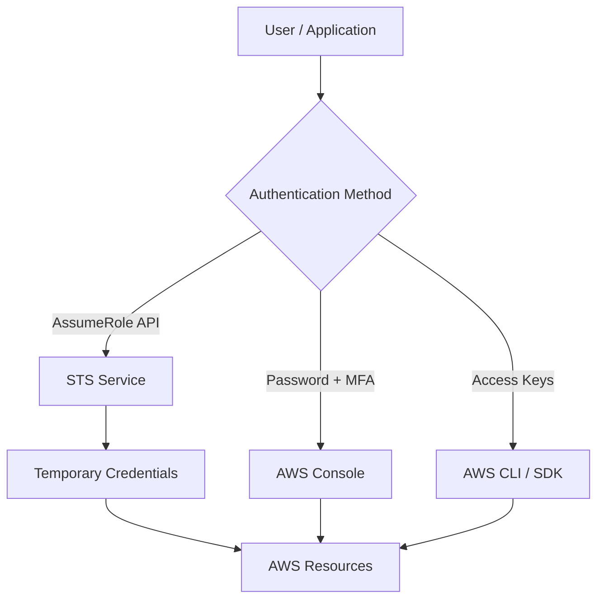
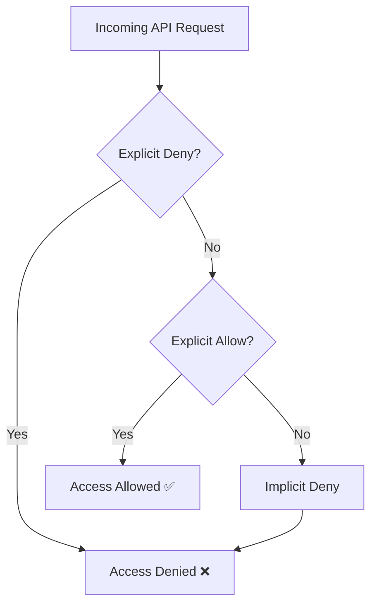
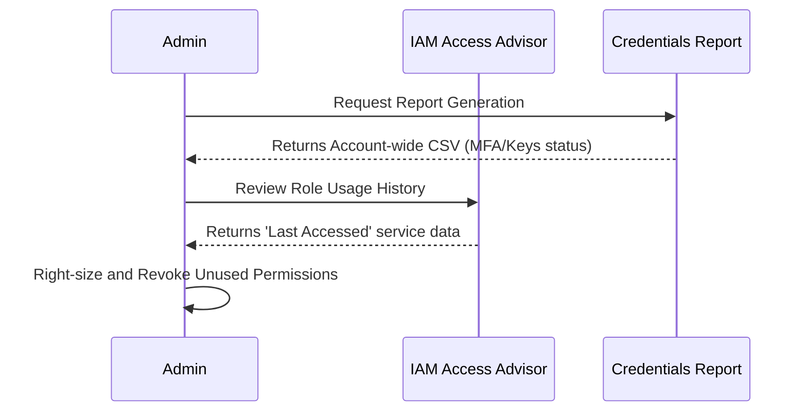

# AWS IAM – Identity & Access Management

> 📚 Official Docs: https://docs.aws.amazon.com/IAM/latest/UserGuide/introduction.html  
> 🎯 SAA-C03 Exam Weight: High — appears in almost every scenario question

---

## IAM Identities: Users, Groups, and Roles

### 📖 Technical Specifications & AWS Core Concepts
- **Users**: Represent real people or applications. They can belong to zero, one, or multiple groups.
- **Groups**: Collections of users. Groups can ONLY contain users, not other groups.
- **Roles**: Identities assumed by AWS services (e.g., EC2) or external entities. Roles do not have long-term credentials; they use temporary, auto-rotating credentials provided by Security Token Service (STS).
- **Root User**: The god-mode account created at signup. Should never be used for day-to-day operations.
- **Access Keys**: Consist of an Access Key ID and Secret Access Key, used exclusively for programmatic access (CLI/SDK).
- **MFA (Multi-Factor Authentication)**: Adds a second layer of physical security (Virtual App, U2F Key, or Hardware Fob).

### 🗺️ Visual Architecture: IAM Identity Lifecycle & Access


### 🧠 Architectural Probing & Decision Scenarios
* **Scenario:** You need to give an EC2 instance access to read an S3 bucket.
  * **Design:** Assign an IAM Role to the EC2 instance. Because hardcoding access keys in applications is a severe security risk; roles provide auto-rotating temporary credentials natively.
* **Scenario:** You have 50 developers needing identical access to S3.
  * **Design:** Create a "Developers" IAM Group and attach a managed policy to the group. Because managing policies per-user doesn't scale and leads to widespread permission drift.
* **Scenario:** Cross-account access is required between Dev and Prod accounts.
  * **Design:** Use IAM Roles with cross-account trust policies. Because duplicating IAM users across multiple accounts breaks centralized identity management and complicates revocation.

### 📐 Application Design Patterns & Trade-offs
- **Role-Based Access Control (RBAC)**: Use Groups mapped to job functions (e.g., DBA, Developer, Admin). 
  - *Trade-off*: Simple to build and understand, but lacks fine-grained contextual constraints (like limiting access based on time-of-day or IP).
- **Temporary Credential Vending**: Use AWS STS for all application-to-AWS interactions.
  - *Trade-off*: Slightly higher initial engineering complexity to implement `AssumeRole` logic, but massively reduces the blast radius of credential leaks.
- **Anti-Pattern**: Attaching policies directly to users. This leads to orphaned permissions when employees switch teams.

### 🚀 Real-World Production Insights
- **Battle Scare:** Hardcoded secret access keys accidentally checked into public GitHub repositories result in AWS accounts being hijacked for crypto-mining within minutes. Always rely on IAM Roles for compute resources.
- **Battle Scare:** The root account's MFA device was lost without a backup. Recovering root access requires a grueling verification process with AWS Support involving notarized documents. Always store root MFA seed phrases securely offline.
- **Limits:** An IAM user can be a member of at most 10 groups. IAM Role temporary credentials can be valid for a maximum of 12 hours.

### 💻 Hands-on CLI Commands
```bash
# Create a user
aws iam create-user --user-name alice

# Create a group and add user
aws iam create-group --group-name Developers
aws iam add-user-to-group --user-name alice --group-name Developers

# Create access key for programmatic CLI/SDK access
aws iam create-access-key --user-name alice

# Assume a role via STS (Returns temporary credentials)
aws sts assume-role \
  --role-arn arn:aws:iam::123456789012:role/DevRole \
  --role-session-name MySession

# Setup virtual MFA device
aws iam create-virtual-mfa-device \
  --virtual-mfa-device-name alice-mfa \
  --outfile /tmp/mfa-qr.png \
  --bootstrap-method QRCodePNG
```

---

## IAM Policies & Permissions

### 📖 Technical Specifications & AWS Core Concepts
- **Policies**: JSON documents defining `Allow` or `Deny` rules for AWS APIs.
- **Core Elements**: 
  - `Version`: Always "2012-10-17".
  - `Effect`: Allow or Deny.
  - `Action`: The AWS API call (e.g., `s3:GetObject`).
  - `Resource`: The ARN the action applies to.
  - `Condition`: Additional constraints (e.g., IP address restrictions).
- **Evaluation Logic**: Explicit DENY > Explicit ALLOW > Implicit DENY. AWS defaults to denying everything.
- **Managed vs Inline Policies**: Managed policies are standalone and reusable across multiple identities. Inline policies are strictly 1:1 with an identity and not recommended.
- **Least Privilege**: The core tenet of IAM; grant only the absolute minimum permissions required to perform a task.

### 🗺️ Visual Architecture: Policy Evaluation Logic


### 🧠 Architectural Probing & Decision Scenarios
* **Scenario:** You want to ensure developers can only launch EC2 instances in the `eu-west-1` region.
  * **Design:** Add a `Condition: {"StringEquals": {"aws:RequestedRegion": "eu-west-1"}}` to the ALLOW policy. Because this enforces geographical boundaries dynamically without completely restricting the EC2 launch action.
* **Scenario:** Two policies are attached to a user: one allows S3 read on all buckets, the other explicitly denies read on `bucket-secrets`.
  * **Design:** Rely on the explicit deny. Because in IAM evaluation logic, an explicit DENY always strictly overrides any conflicting explicit ALLOW.
* **Scenario:** You need standard read-only permissions mapped to multiple roles across teams.
  * **Design:** Create a Customer Managed Policy. Because Inline policies cannot be reused, meaning you'd have to update dozens of embedded policies manually instead of a single central managed policy.

### 📐 Application Design Patterns & Trade-offs
- **Attribute-Based Access Control (ABAC)**: Use tags on IAM users/roles and resources to determine access dynamically via the `Condition` block.
  - *Trade-off*: Scales perfectly as new resources are spun up, but strictly requires you to enforce tagging compliance across the entire organization.
- **Centralized Managed Policies**: Keep policies modular by feature (e.g., `S3-Read-Only`, `DB-Admin`).
  - *Trade-off*: Easier auditing but you risk hitting the IAM limit of 10 managed policies per role if you break permissions down too granularly.

### 🚀 Real-World Production Insights
- **Battle Scare:** Accidentally locked out the entire engineering team by attaching a broad Explicit DENY policy while testing restrictions. Always use `aws iam simulate-principal-policy` against production policies before committing changes.
- **Battle Scare:** Hitting the inline policy size limit (2,048 characters for users) when adding too many granular resource ARNs. Managed policies allow up to 6,144 characters.

### 💻 Hands-on CLI Commands
```bash
# Attach managed policy to group
aws iam attach-group-policy \
  --group-name Developers \
  --policy-arn arn:aws:iam::aws:policy/AmazonS3ReadOnlyAccess

# Create a customer-managed policy from a JSON file
aws iam create-policy \
  --policy-name MyCustomPolicy \
  --policy-document file://my-policy.json

# Simulate a policy to verify access safely before deployment
aws iam simulate-principal-policy \
  --policy-source-arn arn:aws:iam::123456789012:user/alice \
  --action-names s3:GetObject \
  --resource-arns arn:aws:s3:::my-bucket/secret.txt
```

---

## Security & Auditing Tools

### 📖 Technical Specifications & AWS Core Concepts
- **IAM Credentials Report**: Account-level audit tool that generates a downloadable CSV file. It lists all IAM users, their credential status, MFA usage, and when passwords/keys were last used.
- **IAM Access Advisor**: User/Role-level service that tracks exactly which AWS services an identity has permission to access, and the timestamp of when they last accessed them.
- **Access Analyzer**: Proactively analyzes resource policies (like S3 bucket policies or IAM roles) to identify external or public access risks.

### 🗺️ Visual Architecture: Auditing Workflow


### 🧠 Architectural Probing & Decision Scenarios
* **Scenario:** You need to pass an annual security audit proving that no stale access keys exist in the account.
  * **Design:** Generate an IAM Credentials Report. Because it asynchronously exports account-wide data on key age and rotation status into a single parseable CSV.
* **Scenario:** You inherited an overly permissive legacy admin role and want to safely strip permissions.
  * **Design:** Consult IAM Access Advisor. Because it provides up to 400 days of historical tracking for actually invoked services, clearly identifying what can be removed without breaking the legacy workload.

### 📐 Application Design Patterns & Trade-offs
- **Automated Credential Rotation**: Deploy a Lambda function to parse the Credentials Report daily and automatically disable keys older than 90 days.
  - *Trade-off*: Drastically increases security posture but risks breaking older, unmaintained applications that rely on static credentials without alert mechanisms.
- **Continuous Right-sizing**: Implement periodic reviews using Access Advisor to strip excess permissions.
  - *Trade-off*: Can be a heavy manual process if not automated, but is necessary to maintain strict adherence to Least Privilege over time.

### 🚀 Real-World Production Insights
- **Battle Scare:** An ex-employee's active access keys were used months after their departure because the offboarding process wasn't automated. Scheduling automated credential reports to flag inactive users prevents ghost access.
- **Throttling Issues:** The `generate-credential-report` API can only be called once every 4 hours. You must rely on the asynchronous polling mechanism via `get-credential-report` to fetch the actual file.

### 💻 Hands-on CLI Commands
```bash
# Check who you are currently authenticated as (Crucial for auditing)
aws sts get-caller-identity

# Generate credential report (async operation)
aws iam generate-credential-report

# Retrieve the generated credential report and decode from base64
aws iam get-credential-report \
  --output text \
  --query Content | base64 -d > credentials-report.csv
```
