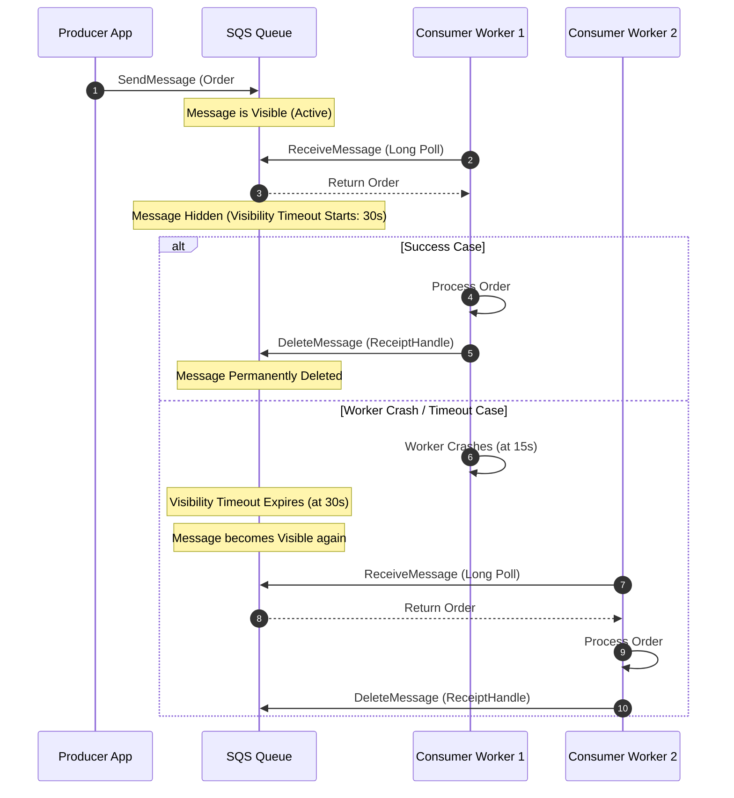
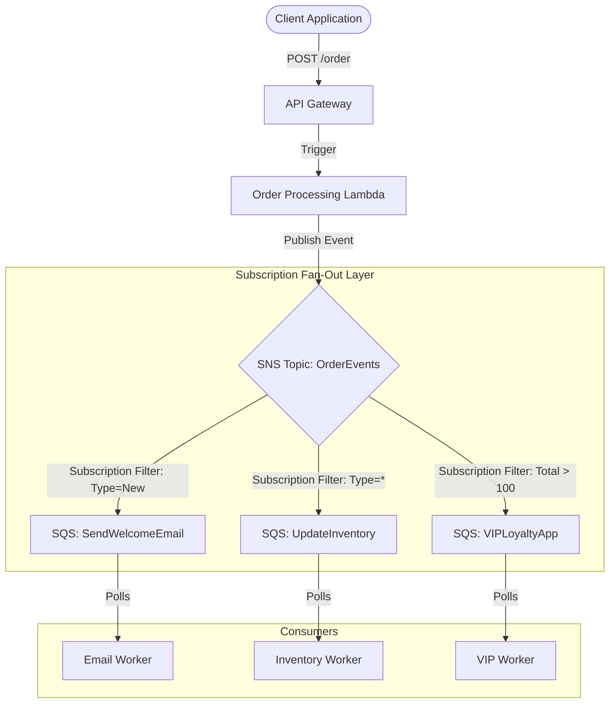
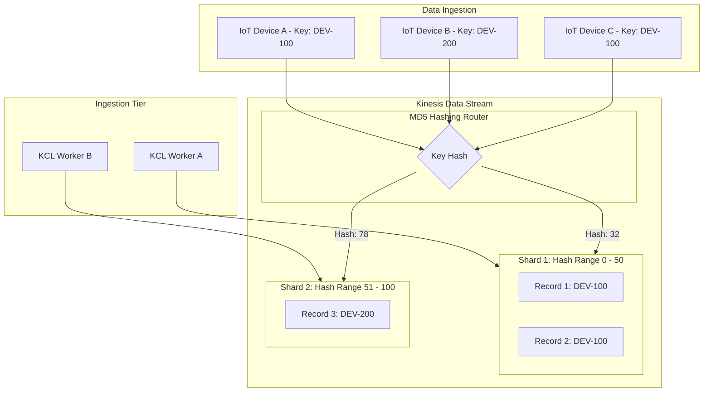
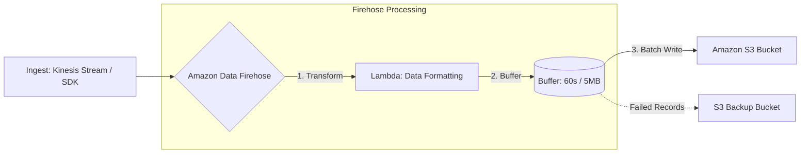

# AWS Integration & Messaging — SQS, SNS, Kinesis, Firehose & Amazon MQ (Engineering Architect Reference)

> 📚 Official Docs: https://docs.aws.amazon.com/SQS/ | https://docs.aws.amazon.com/SNS/ | https://docs.aws.amazon.com/Kinesis/
> 🎯 SAA-C03 Exam Weight: High — key services for decoupling, microservice integration, event-driven architectures, and high-throughput real-time streaming.

---

## 📥 Topic 1: Amazon SQS (Simple Queue Service) — Queue Buffers & Decoupling

### 📖 Technical Specifications & AWS Core Concepts
* **Amazon SQS:** A fully managed message queuing service for decoupling application tiers. It operates on a pull-based model (consumers poll for messages).
* **Standard Queue:** A queue providing unlimited throughput, at-least-once delivery, and best-effort ordering.
* **FIFO Queue:** A first-in-first-out queue providing exactly-once processing, guaranteed ordering, and limited throughput (300 RPS natively, or 3,000 RPS with batching). Suffix must be `.fifo`.
* **Visibility Timeout:** The period (default 30s, max 12h) during which SQS hides a received message from other consumers to prevent duplicate processing.
* **Long Polling:** A resource-optimization setting (wait time 1–20s) that keeps the connection open until a message arrives, reducing empty responses and costs.
* **Dead-Letter Queue (DLQ):** A secondary queue where SQS routes messages that failed to process successfully after a specified number of retries (`maxReceiveCount`).

---

### 🗺️ Visual Architecture: SQS Visibility Timeout Lifecycle



---

### 🧠 Architectural Probing & Decision Scenarios
* **Scenario:** Why does a consumer need to explicitly call `DeleteMessage` after processing a message?**
  * **Design:** SQS is designed for distributed environments. When a consumer retrieves a message, SQS cannot assume the consumer successfully processed it (the consumer could crash mid-execution). To prevent data loss, SQS only hides the message (Visibility Timeout). The consumer must explicitly delete the message once processing succeeds. If it does not, the visibility timeout will expire, and the message will return to the queue for another worker to retry.
* **Scenario:** How does Long Polling reduce transaction costs compared to Short Polling?**
  * **Design:** Short polling queries a subset of SQS servers and returns immediately, even if the queue is empty. This results in millions of empty API calls (billed per request). Long Polling (`WaitTimeSeconds` > 0) waits up to 20 seconds for a message to arrive before returning an empty response, significantly reducing empty poll counts and operational costs.

---

### 📐 Application Design Patterns & Trade-offs
* **Backlog-Based Scaling (ASG Queue Depth):**
  * **The Design Pattern:** To scale worker pools behind a queue, do not use standard CPU-based scaling. The CPU might be low because workers are idle, or high due to a database lock. Instead, scale based on **Queue Depth** by targeting the `ApproximateNumberOfMessagesVisible` metric.
  * **The Trade-off:** SQS metric data is pushed to CloudWatch in 1-minute intervals by default. Under sudden massive spikes, this delay can cause a scale-out delay. To optimize, use a target-tracking policy based on the custom backlog per instance metric: `BacklogPerInstance = ApproximateNumberOfMessages / RunningInstanceCount`.

---

### 🚀 Real-World Production Insights
* **The SQS Poison Pill / Retry Storm:**
  * **The Disaster:** A corrupted payload (e.g., malformed JSON) lands in the queue. A worker pulls it, fails to parse it, and throws an error without deleting the message. The visibility timeout expires, and the message returns to the queue. Another worker pulls it, crashes, and the loop repeats indefinitely. This "poison pill" consumes all cluster CPU and stops processing for valid messages.
  * **Mitigation:** Always configure a **Dead-Letter Queue (DLQ)** with a `maxReceiveCount` (usually set to 3 or 5). If a message is received and returned to the queue more than this limit, SQS automatically routes it to the DLQ, isolating the bad payload for manual audit.
* **The 256 KB Limit Bypass (S3 Extended Client Library):**
  * **The Problem:** SQS has a hard limit of 256 KB per message payload. Trying to send large payloads (e.g., heavy image metadata or PDF raw bytes) will trigger API validation failures.
  * **Mitigation:** Use the **Amazon SQS Extended Client Library**. Under the hood, this library automatically uploads the large payload to an Amazon S3 bucket, puts a pointer/reference containing the S3 URI inside the SQS message, and deletes the payload from S3 after the consumer finishes processing and deletes the SQS message.

---

### 💻 Hands-on CLI Commands
* **Create an SQS FIFO Queue with Content-Based Deduplication:**
  ```bash
  aws sqs create-queue \
    --queue-name production-orders.fifo \
    --attributes '{
      "FifoQueue": "true",
      "ContentBasedDeduplication": "true",
      "VisibilityTimeout": "60",
      "ReceiveMessageWaitTimeSeconds": "20"
    }'
  ```
* **Send a message to a FIFO queue (requires MessageGroupId):**
  ```bash
  aws sqs send-message \
    --queue-url https://sqs.us-east-1.amazonaws.com/123456789012/production-orders.fifo \
    --message-body '{"order_id": "9876", "status": "pending"}' \
    --message-group-id "customer-9876" \
    --message-deduplication-id "token-9876-abc"
  ```

---

## 📢 Topic 2: Amazon SNS (Simple Notification Service) — Pub/Sub Fan-Out Patterns

### 📖 Technical Specifications & AWS Core Concepts
* **Amazon SNS:** A managed, push-based publish-subscribe (Pub/Sub) messaging service.
* **Topic:** A logical access point and communication channel to which publishers send messages.
* **Subscription:** A target endpoint (SQS, Lambda, HTTP Webhooks, Email, SMS) registered to a topic to receive published messages.
* **Fan-Out Pattern:** A design pattern where a single event published to an SNS topic is pushed to multiple subscribed queues or endpoints concurrently.
* **Message Filtering:** An SNS subscription policy that checks message attributes and filters out unwanted messages before delivery.

---

### 🗺️ Visual Architecture: Landing Requests via Fan-Out



---

### 🧠 Architectural Probing & Decision Scenarios
* **Scenario:** Why should an architect place an SQS queue between an SNS subscription and a worker service instead of pushing directly to HTTP endpoints or Lambda?**
  * **Design:** SNS is a push service without message persistence. If you push directly to an HTTP endpoint or a Lambda function and the target is down (network partition, rate limits, or cold starts), the message will be lost after SNS retries exhaust. Placing SQS as the subscriber provides **persistence and backpressure buffering**. If the consumer goes offline, the message remains safely in SQS until recovery.
* **Scenario:** Can you perform message filtering based on the content of the message body in SNS?**
  * **Design:** No. SNS Message Filtering only evaluates **Message Attributes** (key-value metadata sent alongside the message body). The SNS service does not parse the message body. Publishers must promote routing keys to message attributes for subscription filters to evaluate them.

---

### 📐 Application Design Patterns & Trade-offs
* **Decoupled Client Notifications vs. System State Synced Updates:**
  * **The Trade-off:** Pushing events to SNS allows massive scalability (12.5M subscriptions per topic). However, you have no visibility into when all subscribers have finished processing.
  * **The Pattern:** Use SNS Fan-Out to SQS queues for parallel, asynchronous workflows (e.g., emailing, auditing). For workflows that require transactional synchronization or state rollback on failure, use AWS Step Functions instead of a raw Pub/Sub pattern.

---

### 🚀 Real-World Production Insights
* **The Cross-Account SNS Access Control Trap:**
  * **The Issue:** Microservices often span multiple AWS accounts. If Account A tries to subscribe an SQS queue to an SNS topic in Account B, the subscription will fail or messages will silently drop if both resource policies are not configured to allow cross-account permissions.
  * **Mitigation:** Ensure the SNS Topic Policy allows `sns:Subscribe` from the SQS account's IAM roles. Crucially, the SQS Queue Policy must also allow `sqs:SendMessage` with a condition specifying the source SNS Topic ARN.

---

### 💻 Hands-on CLI Commands
* **Create an SNS Topic and Subscribe an SQS Queue:**
  ```bash
  # Step 1: Create SNS Topic
  aws sns create-topic --name production-events
  
  # Step 2: Subscribe SQS Queue to the Topic
  aws sns subscribe \
    --topic-arn arn:aws:sns:us-east-1:123456789012:production-events \
    --protocol sqs \
    --notification-endpoint arn:aws:sqs:us-east-1:123456789012:production-orders
  ```
* **Publish a message with attributes for filtering:**
  ```bash
  aws sns publish \
    --topic-arn arn:aws:sns:us-east-1:123456789012:production-events \
    --message '{"order_id": "1234", "amount": 150}' \
    --message-attributes '{
      "Type": {"DataType": "String", "StringValue": "New"},
      "Total": {"DataType": "Number", "StringValue": "150"}
    }'
  ```

---

## 📈 Topic 3: Amazon Kinesis — Real-Time Streaming & Shard Architecture

### 📖 Technical Specifications & AWS Core Concepts
* **Kinesis Data Streams:** A highly scalable, real-time data streaming service that ingests and stores continuous streams of data for analytics.
* **Shard:** The base throughput unit of a Kinesis stream. A single shard supports 1 MB/s or 1,000 records/s ingress, and 2 MB/s egress.
* **Partition Key:** A user-defined string (e.g., `device_id`, `user_id`) used to group data by shard. Kinesis hashes the key to determine the target shard.
* **Sequence Number:** A unique identifier assigned by Kinesis to each record written to a shard, ensuring strict ordering within that shard.
* **KCL (Kinesis Client Library):** An AWS-provided library that manages consumer scaling, load balancing across shards, and fault-tolerant checkpointing.

---

### 🗺️ Visual Architecture: Partition Key Hashing & Shard Egress



---

### 🧠 Architectural Probing & Decision Scenarios
* **Scenario:** How does Kinesis guarantee record ordering, and what are its limits?**
  * **Design:** Kinesis guarantees record ordering **only at the shard level**. Records containing the same **Partition Key** are routed to the same shard and assigned sequential numbers. If you need global ordering across all shards, you must design a single-shard stream (limiting ingress to 1 MB/s) or handle re-ordering at the consumer database tier.
* **Scenario:** What happens if you run out of read throughput on a Kinesis Shard because multiple consumer apps are reading from it?**
  * **Design:** Standard shards limit shared egress to 2 MB/s. If you have 3 separate consumer applications polling the shard, they will experience read throttling (`ProvisionedThroughputExceededException`). To solve this, enable **Enhanced Fan-Out**. This dedicates a 2 MB/s pipe per consumer using an HTTP/2 push connection, bypassing the shared egress limits.

---

### 📐 Application Design Patterns & Trade-offs
* **Kinesis Data Streams vs. SQS FIFO:**
  * **Kinesis:** Best for **unlimited throughput parallel analytics** and replayable clickstreams. Allows multiple independent consumers to read the same stream.
  * **SQS FIFO:** Best for **discrete transactional tasks** (e.g., bank updates) where ordering is critical but throughput is moderate. Only one consumer retrieves a message, and it is deleted upon completion.

---

### 🚀 Real-World Production Insights
* **The "Hot Shard" Outage (Bad Partition Keys):**
  * **The Trap:** An architect builds an IoT data stream and uses `CountryCode` as the partition key. Because 90% of the devices are located in `us-east-1` (US country code), almost all records hash to a single shard. That shard throttles with write errors (`ProvisionedThroughputExceededException`), even though the other shards in the stream are completely idle.
  * **Mitigation:** Use high-cardinality keys like `DeviceID`, `UUID`, or a combined key (e.g., `DeviceID_Timestamp`) to ensure MD5 hashing distributes records symmetrically across all available shards.
* **Shard Merges and Splits Performance Hits:**
  * **The Reality:** When scaling Kinesis, you perform shard splits (to increase throughput) or shard merges (to save costs). During a split, the parent shard becomes read-only, and two child shards are created.
  * **Mitigation:** KCL consumer apps must be configured to process all remaining records in the parent shard *before* switching consumption to the new child shards. Failing to handle this logic results in out-of-order data processing.

---

### 💻 Hands-on CLI Commands
* **Create a Kinesis Stream and put records:**
  ```bash
  # Step 1: Create a stream with 2 provisioned shards
  aws kinesis create-stream \
    --stream-name production-logs \
    --shard-count 2
    
  # Step 2: Put a record into the stream
  aws kinesis put-record \
    --stream-name production-logs \
    --data "LOG_PAYLOAD_DATA" \
    --partition-key "server-100"
  ```

---

## 🚚 Topic 4: Amazon Data Firehose — Managed Delivery Streams

### 📖 Technical Specifications & AWS Core Concepts
* **Amazon Data Firehose:** A fully managed service for loading real-time streaming data directly into destinations like Amazon S3, Redshift, OpenSearch, Splunk, and HTTP custom endpoints.
* **Zero Administration:** Unlike Kinesis Streams, Firehose requires no shard provisioning. It scales automatically based on incoming data volume.
* **Buffer Interval & Size:** The threshold settings (1MB to 128MB, or 60s to 900s) that determine how long Firehose buffers incoming data before delivering it in batches.
* **Inline Data Transformation:** The process of using an AWS Lambda function to transform, clean, or format raw data (e.g., CSV to JSON) inside the Firehose pipeline before delivery.

---

### 🗺️ Visual Architecture: Firehose Buffer and S3 Delivery



---

### 🧠 Architectural Probing & Decision Scenarios
* **Scenario:** Is Amazon Data Firehose a real-time service?**
  * **Design:** No. Firehose is a **near-real-time** delivery service. Data is buffered before delivery. The minimum buffer time is 60 seconds (unless using custom APIs that support lower thresholds). If your application requires sub-second streaming analytics, use Kinesis Data Streams and Apache Flink/Kinesis Data Analytics instead.
* **Scenario:** What happens if the delivery destination (e.g., Redshift) is unavailable?**
  * **Design:** Firehose buffers data for up to 24 hours. If the destination remains unreachable beyond this, Firehose can be configured to back up the raw streaming payloads to a backup Amazon S3 bucket to prevent data loss.

---

### 💻 Hands-on CLI Commands
* **Create a Firehose Delivery Stream to Amazon S3:**
  ```bash
  aws firehose create-delivery-stream \
    --delivery-stream-name production-s3-delivery \
    --delivery-stream-type DirectPut \
    --extended-s3-destination-configuration '{
      "BucketARN": "arn:aws:s3:::production-analytics-bucket",
      "RoleARN": "arn:aws:iam::123456789012:role/firehose-s3-delivery-role",
      "BufferingHints": {
        "SizeInMBs": 5,
        "IntervalInSeconds": 300
      },
      "CompressionFormat": "GZIP"
    }'
  ```

---

## 🐰 Topic 5: Amazon MQ — Legacy Message Brokers

### 📖 Technical Specifications & AWS Core Concepts
* **Amazon MQ:** A managed message broker service compatible with open-source brokers: Apache ActiveMQ and RabbitMQ.
* **JMS/AMQP/MQTT:** Standard messaging protocols supported by Amazon MQ, allowing hybrid compatibility.
* **Active/Standby Broker:** A high-availability deployment option for ActiveMQ that uses shared storage to switch from a failed active node to a standby node automatically.

---

### 🧠 Architectural Probing & Decision Scenarios
* **Scenario:** When should an architect choose Amazon MQ over SQS or SNS?**
  * **Design:** Choose Amazon MQ when you are migrating **legacy, on-premises applications** that rely on standard protocols (like AMQP, MQTT, JMS, OpenWire, STOMP) to AWS. Rewriting legacy code to use the AWS-proprietary SQS/SNS SDKs can take weeks; Amazon MQ allows you to lift-and-shift the broker configuration and keep the application code unchanged.

---

### 💻 Hands-on CLI Commands
* **Create an Active/Standby ActiveMQ Broker:**
  ```bash
  aws mq create-broker \
    --broker-name production-activemq \
    --engine-type ACTIVEMQ \
    --engine-version "5.17.1" \
    --host-instance-type mq.t3.micro \
    --deployment-mode ACTIVE_STANDBY_MULTI_AZ \
    --users '[{"Username": "brokeruser", "Password": "BrokerSecurePass123!"}]' \
    --publicly-accessible
  ```
