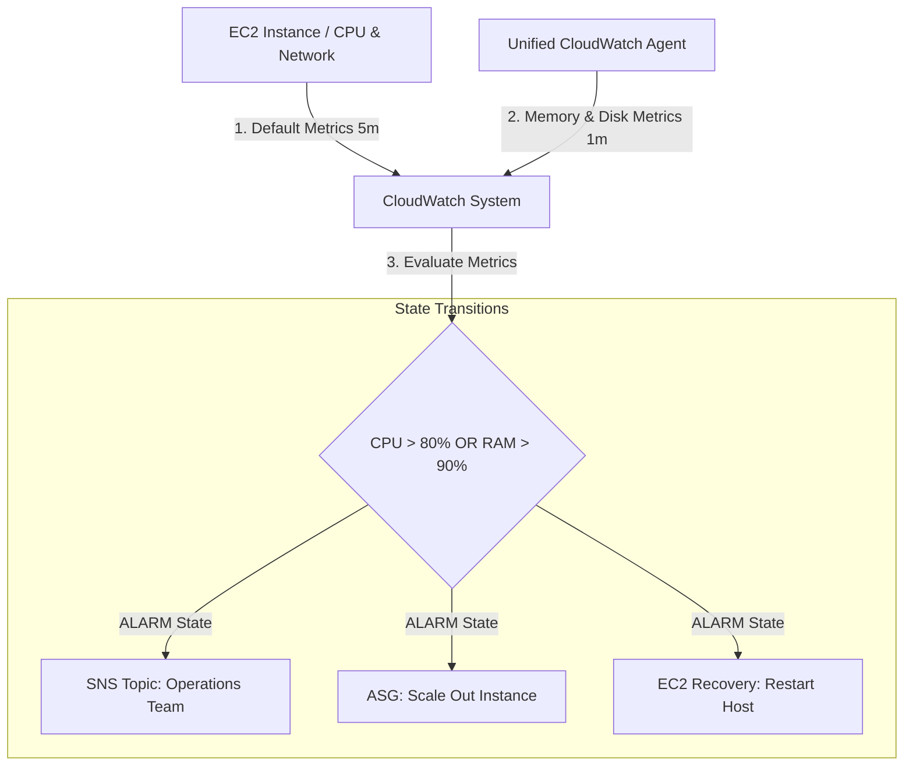
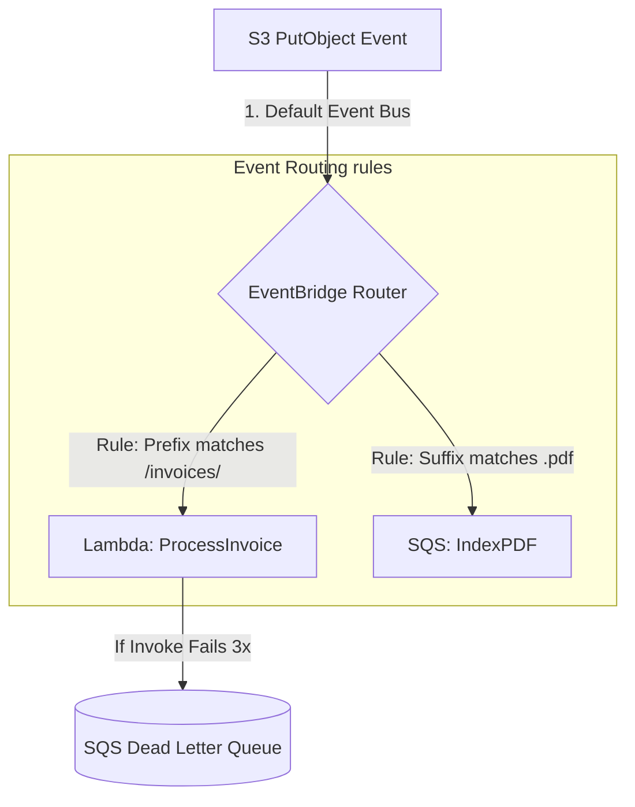
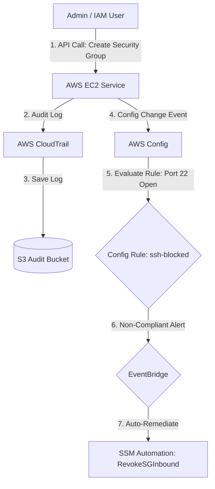

# AWS Monitoring, Auditing & Compliance — CloudWatch, CloudTrail & Config (Engineering Architect Reference)

> 📚 Official Docs: https://docs.aws.amazon.com/cloudwatch/ | https://docs.aws.amazon.com/awscloudtrail/ | https://docs.aws.amazon.com/config/
> 🎯 SAA-C03 Exam Weight: Medium-High — key services for real-time monitoring, metric-based alerting, audit trails, and automated compliance auditing.

---

## 🌐 Topic 1: Amazon CloudWatch Observability — Metrics, Alarms & Logs

### 📖 Technical Specifications & AWS Core Concepts
* **Amazon CloudWatch:** A managed observability platform providing metrics collection, log analytics, and alarm orchestration.
* **Unified CloudWatch Agent:** An OS-level agent installed on EC2 instances or on-premises servers to collect system-level metrics (e.g., RAM usage, disk space) and log files.
* **Composite Alarm:** A meta-alarm that evaluates the state of multiple underlying alarms using logical operators (AND/OR/NOT) to reduce alert fatigue.
* **Metric Filter:** A CloudWatch Logs feature that parses text logs for patterns (e.g., "ERROR") and converts occurrences into numerical metrics.
* **Subscription Filter:** A real-time log streaming connector that pushes log events directly to Lambda, Kinesis, or OpenSearch for processing.

---

### 🗺️ Visual Architecture: CloudWatch Metric & Alarm Loop



---

### 🧠 Architectural Probing & Decision Scenarios
* **Scenario:** Why does a default EC2 instance configuration fail to report RAM (memory) utilization to CloudWatch?**
  * **Design:** Hypervisor status checks can only inspect virtual machine hardware limits (CPU, disk I/O, network packets). Memory allocation occurs entirely inside the guest operating system kernel. To capture memory usage, you must install the **Unified CloudWatch Agent** inside the guest OS, which pushes memory metrics outbound to CloudWatch via API calls.
* **Scenario:** What is the benefit of a Composite Alarm over individual metric alarms?**
  * **Design:** If an database server crashes, it triggers a "CPU Util low" alarm, a "Read IOPS low" alarm, and a "Connection count drop" alarm. This floods the engineering team with alert messages. A Composite Alarm combines these into a single logical check (e.g., `ALARM(DB-CPU) AND ALARM(DB-IOPS)`), triggering a single notification only when a complete system failure occurs.

---

### 📐 Application Design Patterns & Trade-offs
* **Cross-Account Log Aggregation (Central Security Logging):**
  * **The Design Pattern:** Deploy an Amazon Kinesis Data Stream in a centralized security account. In your secondary application accounts, configure **CloudWatch Logs Subscription Filters** to stream log groups in real time to the centralized Kinesis stream.
  * **The Trade-off:** High-volume log streaming incurs significant inter-account network data transfer charges and Kinesis shard ingestion costs. Filter logs at the source using specific subscription patterns to only push critical audit/error logs.

---

### 🚀 Real-World Production Insights
* **The "Silent" Memory Exhaustion Crash:**
  * **The Trap:** An application suffers from a memory leak, eventually leading to an Out-Of-Memory (OOM) killer event that crashes the web server process. Because CPU utilization remains low, standard CPU-based auto-scaling alarms never trigger, leaving the site offline.
  * **Mitigation:** Always deploy the Unified CloudWatch Agent to monitor memory utilization (`mem_used_percent`) and configure alarms to trigger auto-scaling or reboots based on RAM thresholds.
* **High-Resolution Custom Metric Cost Explosions:**
  * **The Issue:** Developers configure high-resolution custom metrics (`StorageResolution=1`) to monitor sub-minute transaction spikes. While effective, pushing metrics every second generates significant API charges (`PutMetricData`), potentially exceeding the cost of the underlying compute infrastructure.
  * **Mitigation:** Use high-resolution metrics selectively on critical bottlenecks, and batch multiple data points into a single API call when possible.

---

### 💻 Hands-on CLI Commands
* **Create a CloudWatch Metric Alarm for CPU utilization:**
  ```bash
  aws cloudwatch put-metric-alarm \
    --alarm-name production-cpu-high \
    --alarm-description "Scale out if CPU exceeds 80%" \
    --metric-name CPUUtilization \
    --namespace AWS/EC2 \
    --statistic Average \
    --period 300 \
    --evaluation-periods 2 \
    --threshold 80 \
    --comparison-operator GreaterThanThreshold \
    --dimensions Name=InstanceId,Value=i-1234567890abcdef0 \
    --alarm-actions arn:aws:sns:us-east-1:123456789012:operations-alerts
  ```
* **Put a custom metric data point with standard resolution:**
  ```bash
  aws cloudwatch put-metric-data \
    --namespace "eCommerceApp" \
    --metric-name "CheckoutErrors" \
    --value 1 \
    --unit Count
  ```

---

## 📢 Topic 2: Amazon EventBridge — Event-Driven Architecture

### 📖 Technical Specifications & AWS Core Concepts
* **Amazon EventBridge:** A serverless event bus service that routes events from AWS services, custom applications, or SaaS partners to target endpoints.
* **Event Bus:** A pipeline that receives events. Default bus handles AWS events; Custom bus handles application-specific events.
* **Rule:** A filter configuration matching JSON event patterns to determine which events are routed to targets.
* **Schema Registry:** A directory that maps the structure (schema) of events, generating code bindings for developer integrations.

---

### 🗺️ Visual Architecture: EventBridge Custom Routing & DLQ



---

### 🧠 Architectural Probing & Decision Scenarios
* **Scenario:** How does EventBridge handle delivery failures when routing to downstream targets?**
  * **Design:** EventBridge retries delivering events for up to 24 hours with exponential backoff. To prevent data loss when downstream targets are persistently unavailable, you must configure a **Dead-Letter Queue (DLQ)** (supported via SQS) on the target. If retries fail, the event payload is routed to the DLQ.

---

### 🚀 Real-World Production Insights
* **The Target Concurrency Throttle Loop:**
  * **The Issue:** An EventBridge rule matches high-frequency events (e.g., S3 file uploads) and routes them directly to a target Lambda function. If the event volume exceeds the regional Lambda concurrency limit, the Lambda throttles. EventBridge continues retrying, creating a retry loop that exacerbates the starvation.
  * **Mitigation:** Place an SQS queue between EventBridge and Lambda. Let EventBridge route events directly to SQS, and configure Lambda to poll SQS asynchronously using batch processing.

---

### 💻 Hands-on CLI Commands
* **Create an EventBridge Rule and add a Lambda target:**
  ```bash
  # Step 1: Create the rule matching EC2 state changes
  aws events put-rule \
    --name ec2-state-monitor \
    --event-pattern '{"source":["aws.ec2"],"detail-type":["EC2 Instance State-change Notification"],"detail":{"state":["stopping"]}}'
    
  # Step 2: Add Lambda as a target
  aws events put-targets \
    --rule ec2-state-monitor \
    --targets "Id"="1","Arn"="arn:aws:lambda:us-east-1:123456789012:function:handle-ec2-shutdown"
  ```

---

## 🔒 Topic 3: AWS CloudTrail & AWS Config — Auditing & Compliance

### 📖 Technical Specifications & AWS Core Concepts
* **AWS CloudTrail:** A governance and auditing service that records API activity across your AWS account (who did what, and when).
* **Management Events:** CloudTrail events recording resource plane control operations (e.g., creating a bucket, launching an instance).
* **Data Events:** CloudTrail events recording resource-level operations (e.g., S3 `GetObject`, DynamoDB `PutItem`). Disabled by default due to high cost.
* **AWS Config:** A managed service that records resource configuration changes over time and evaluates them against compliance policies.
* **Remediation Action:** An automated workflow (using Systems Manager Automation) triggered by AWS Config when a resource is flagged as non-compliant.

---

### 🗺️ Visual Architecture: Configuration Auditing & Compliance Remediation



---

### 🧠 Architectural Probing & Decision Scenarios
* **Scenario:** What is the core difference between AWS CloudTrail and AWS Config?**
  * **Design:** * **CloudTrail** is an **API auditor**. It records the *actions* taken (e.g., "User Alice called `ModifySecurityGroupRules` at 2:00 PM").
    * **AWS Config** is a **state auditor**. It records the *configuration state* of resources over time and checks compliance (e.g., "Security Group sg-123 currently allows open SSH port 22 access, violating security policy").
* **Scenario:** Can AWS Config prevent a user from launching a non-compliant resource?**
  * **Design:** No. AWS Config is **detective**, not preventive. It detects changes after they happen, records them in the configuration timeline, flags the resource as non-compliant, and triggers asynchronous auto-remediation. To prevent non-compliant launches, use IAM policy SCPs or CloudFormation Guard.

---

### 🚀 Real-World Production Insights
* **The S3 Data Event Cost Explosion:**
  * **The Trap:** To satisfy security audits, developers enable Data Events on a high-throughput Amazon S3 bucket (hosting user uploads). Since every read and write is now logged as a CloudTrail event, this generates millions of logs daily, resulting in massive CloudTrail ingestion costs and S3 storage charges.
  * **Mitigation:** Only log Data Events on S3 buckets containing highly sensitive information (e.g., payment details). For standard buckets, rely on S3 Server Access Logs, which are significantly cheaper.

---

### 💻 Hands-on CLI Commands
* **Create a Multi-Region CloudTrail logging to an S3 Bucket:**
  ```bash
  aws cloudtrail create-trail \
    --name organization-audit-trail \
    --s3-bucket-name organization-logs-bucket \
    --is-multi-region-trail \
    --include-global-service-events
  ```
* **Enable AWS Config recording for all resources:**
  ```bash
  aws configservice start-configuration-recorder \
    --configuration-recorder-name default
  ```
