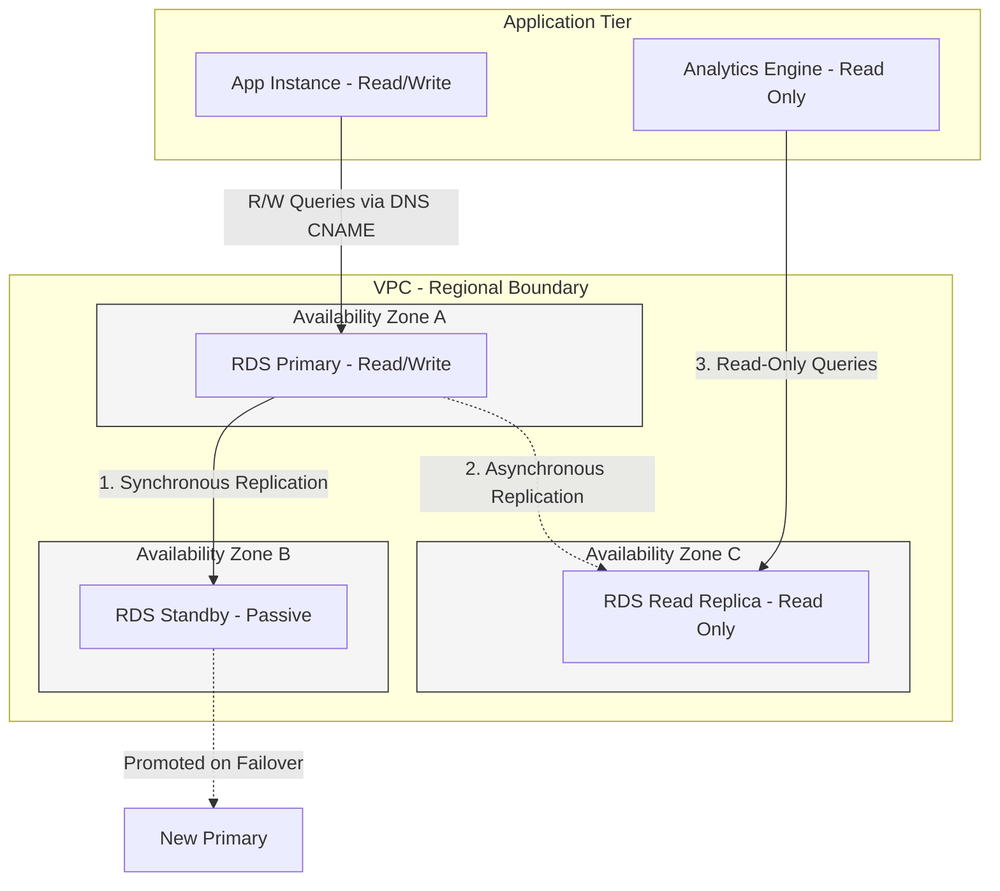
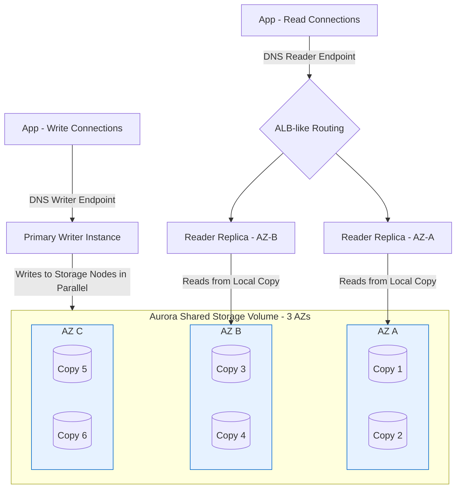
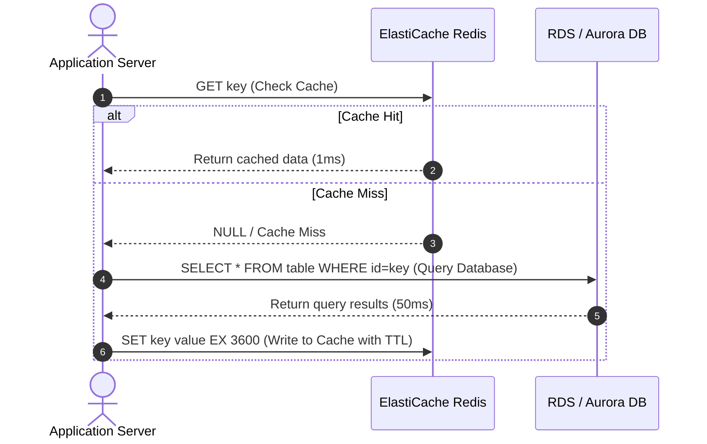

# RDS, Aurora & ElastiCache (Engineering Architect Reference)

> 📚 Official Docs: https://docs.aws.amazon.com/rds/ | https://docs.aws.amazon.com/AmazonElastiCache/
> 🎯 SAA-C03 Exam Weight: Very High — core databases and caching patterns for application integration, durability, and low-latency scaling.

---

## 🗄️ Topic 1: Amazon RDS — Managed Relational Database & High Availability

### 📖 Technical Specifications & AWS Core Concepts
* **Amazon RDS:** Relational Database Service, a managed SQL database service supporting MySQL, PostgreSQL, MariaDB, Oracle, SQL Server, and DB2.
* **DB Subnet Group:** A collection of subnets (typically private) in a VPC across at least two Availability Zones that RDS reserves for provisioning database nodes.
* **Storage Auto Scaling:** An RDS feature that automatically increases allocated storage when free space falls below 10% and remains low for more than 5 minutes.
* **Parameter Group:** A configuration container for database engine settings (e.g., max connections, character sets) applied to one or more database instances.
* **Option Group:** A container for database engine features and add-ons (e.g., transparent data encryption, backup plugins).

---

### 🗺️ Visual Architecture: RDS Multi-AZ Failover vs. Read Replicas



---

### 🧠 Architectural Probing & Decision Scenarios
* **Scenario:** Why is it not possible to SSH into an Amazon RDS database instance?**
  * **Design:** RDS is a managed database service. AWS is responsible for OS provisioning, security patching, hosting infrastructure, and kernel maintenance. If users were granted host-level SSH access, it would compromise the automated management, patching, and SLA guarantees provided by AWS.
* **Scenario:** What is the behavior of an RDS database during a Multi-AZ failover?**
  * **Design:** When the primary database fails (e.g., loss of power, storage failure, or AZ outage), RDS automatically promotes the standby instance to the new primary. It updates the database CNAME record to point to the IP address of the promoted standby instance. The application does not need to change connection strings; it simply reconnects, though it must handle a brief 1-to-2 minute connection disruption during DNS propagation.

---

### 📐 Application Design Patterns & Trade-offs
* **Multi-AZ vs. Read Replicas:**
  * **Multi-AZ:** Used for **Disaster Recovery (DR) and High Availability**. Replication is **synchronous** to ensure zero data loss on failover. The standby database is *passive* and cannot serve read or write queries.
  * **Read Replicas:** Used for **Read Scalability**. Replication is **asynchronous** to prevent write delays on the primary. Replicas are *active* and can serve read-only queries (e.g., reports, analytics).
  * **The Trade-off:** Multi-AZ increases write latency slightly (every write must commit on both instances before confirming) but ensures high durability. Read Replicas improve read throughput but introduce eventual consistency (slight replication lag).

---

### 🚀 Real-World Production Insights
* **The GP2/GP3 Storage Burst Balance Exhaustion:**
  * **The Trap:** Production databases on General Purpose (gp2/gp3) SSD storage rely on a burst balance system for high I/O workloads. If the database sustains high read/write cycles (e.g., during a nightly ETL process or heavy indexing), the burst balance can deplete to 0%. At that point, IOPS drop to the baseline rate, causing query response times to skyrocket and application connections to pile up, leading to a system-wide crash.
  * **Mitigation:** Monitor the `BurstBalance` CloudWatch metric. If I/O patterns are consistently high, upgrade the RDS storage type to Provisioned IOPS (io1/io2) or increase the allocated storage size (since GP2/GP3 baseline IOPS scale with volume size).

---

### 💻 Hands-on CLI Commands
* **Create a Multi-AZ RDS MySQL database instance:**
  ```bash
  aws rds create-db-instance \
    --db-instance-identifier production-mysql \
    --db-instance-class db.r6g.large \
    --engine mysql \
    --master-username dbadmin \
    --master-user-password SecurePassword123! \
    --allocated-storage 100 \
    --db-subnet-group-name db-private-subnets \
    --backup-retention-period 7 \
    --multi-az \
    --no-publicly-accessible
  ```
* **Promote an existing read replica to a standalone database:**
  ```bash
  aws rds promote-read-replica \
    --db-instance-identifier production-mysql-replica
  ```

---

## 🌟 Topic 2: Amazon Aurora — Cloud-Native Distributed Storage & Global Databases

### 📖 Technical Specifications & AWS Core Concepts
* **Amazon Aurora:** A proprietary cloud-native database engine compatible with MySQL and PostgreSQL, offering up to 5x standard MySQL throughput.
* **Aurora Shared Storage Volume:** A distributed virtual storage volume spanning 3 AZs. Data is replicated 6-ways (2 copies per AZ) and scales automatically in 10 GB increments up to 128 TB.
* **Writer Endpoint:** The database cluster DNS endpoint that always points to the primary instance (handles reads and writes).
* **Reader Endpoint:** A load-balanced DNS endpoint that routes read-only connections across all available reader replicas in the cluster.
* **Aurora Global Database:** A feature that replicates database storage across up to 5 secondary AWS regions with sub-second replication lag for global read scaling and disaster recovery.

---

### 🗺️ Visual Architecture: Aurora Distributed Storage & Endpoints



---

### 🧠 Architectural Probing & Decision Scenarios
* **Scenario:** How does Aurora's 6-way storage replication survive AZ failures without data loss?**
  * **Design:** Aurora replicates data 6 times across 3 AZs. It uses a quorum-based writing and reading protocol:
    * **Write Quorum (4/6):** A write is confirmed only when 4 out of the 6 storage nodes acknowledge the write. If 1 AZ goes down (losing 2 copies), writing continues because 4 copies remain.
    * **Read Quorum (3/6):** A read requires consensus from 3 nodes. Even if 1 AZ goes down and a second AZ loses another node (losing 3 copies total), reading is still functional with the remaining 3 copies.
* **Scenario:** What is the main difference between standard RDS PostgreSQL failover and Aurora PostgreSQL failover?**
  * **Design:** Standard RDS requires a DNS update pointing the CNAME to the standby instance, which takes 60–120 seconds. Aurora replica promotion takes **less than 30 seconds**. If the primary writer fails, the cluster promotes an existing reader to writer. Because all nodes share the same storage volume, there is no storage replication lag to sync, enabling near-instant promotion.

---

### 📐 Application Design Patterns & Trade-offs
* **Aurora Serverless v2 vs. Aurora Provisioned:**
  * **Aurora Serverless v2:** Automatically scales compute resources (Aurora Capacity Units, or ACUs) from 0.5 to 128 units in real time. **Use Case:** Variable, unpredictable workloads, multi-tenant SaaS, or dev/test environments.
  * **Aurora Provisioned:** Manually sized instance classes (e.g., `db.r6g.2xlarge`). **Use Case:** Predictable, high-throughput production workloads where CPU baseline usage is high and resource sizing needs to be locked down to prevent auto-scaling latency.

---

### 🚀 Real-World Production Insights
* **The Serverless DB Connection Storm & RDS Proxy:**
  * **The Trap:** When scaling a stateless frontend utilizing AWS Lambda, a traffic burst can launch 5,000 Lambda functions concurrently. If each Lambda establishes a direct connection to RDS/Aurora, the database will exhaust its connection limit (`max_connections`), drop incoming connections, and crash.
  * **Mitigation:** Place **RDS Proxy** between the Lambda functions and the Aurora cluster. RDS Proxy pools and shares database connections, limiting the load on the database engine. It also reduces failover times by up to 66% by maintaining established backend connection pools during failover events.
* **Replica Lag & Read-After-Write Consistency:**
  * **The Problem:** In an Aurora cluster, writes go to the writer instance, while reads route via the Reader Endpoint. If a user submits a form (e.g., editing a profile), the write commits on the writer. The browser immediately refreshes the page, sending a GET request to a reader. If replication lag is even 5ms, the reader may serve the old profile data, confusing the user.
  * **Mitigation:** Direct critical Read-After-Write requests directly to the Writer Endpoint instead of the Reader Endpoint, or use session-level stickiness to bypass readers for a short window after a POST action.

---

### 💻 Hands-on CLI Commands
* **Create an Aurora MySQL database cluster:**
  ```bash
  aws rds create-db-cluster \
    --db-cluster-identifier production-aurora-cluster \
    --engine aurora-mysql \
    --engine-version "8.0.mysql_aurora.3.02.0" \
    --master-username clusteradmin \
    --master-user-password SecurePassword123! \
    --db-subnet-group-name db-private-subnets \
    --backup-retention-period 7
  ```
* **Add a Reader Instance to the Aurora Cluster:**
  ```bash
  aws rds create-db-instance \
    --db-instance-identifier production-aurora-reader-1 \
    --db-cluster-identifier production-aurora-cluster \
    --db-instance-class db.r5.large \
    --engine aurora-mysql
  ```

---

## ⚡ Topic 3: Amazon ElastiCache — In-Memory Caching (Redis vs. Memcached)

### 📖 Technical Specifications & AWS Core Concepts
* **Amazon ElastiCache:** A managed, in-memory key-value data store service compatible with Redis and Memcached.
* **ElastiCache Redis:** A persistent, single-threaded (mostly) caching engine supporting replication, Multi-AZ failover, backup/restore, and complex data structures (hashes, sorted sets).
* **ElastiCache Memcached:** A non-persistent, multi-threaded, simple key-value memory object caching system designed for scaling out raw cache performance.
* **Cache-Aside (Lazy Loading):** A pattern where the application queries the cache first. On a miss, it queries the database, writes the result to the cache, and returns it.
* **Write-Through:** A pattern where the application updates the database and the cache concurrently, ensuring the cache is never stale.

---

### 🗺️ Visual Architecture: Cache-Aside (Lazy Loading) Pattern



---

### 🧠 Architectural Probing & Decision Scenarios
* **Scenario:** Under what conditions should an architect choose Redis over Memcached?**
  * **Design:** Choose Redis if:
    1. **High Availability:** You need automatic failover and Multi-AZ capabilities.
    2. **Persistence:** Cache data needs to survive node restarts or cluster failures (using AOF or RDB snapshots).
    3. **Complex Data Types:** You need to store and manipulate structured data (e.g., Sorted Sets for gaming leaderboards, Pub/Sub channels, or Geospatial data).
    * Choose Memcached only for simple key-value lookups where multi-threaded horizontal scaling is required, and data durability is completely optional.

---

### 📐 Application Design Patterns & Trade-offs
* **Eviction Policies and TTL Management:**
  * **The Trade-off:** Cache memory is expensive. If the cache fills up, ElastiCache must evict keys to make room for new data. 
  * **The Design Pattern:** Define a strict **Time-To-Live (TTL)** on all keys to naturally prune stale data. Choose an appropriate eviction policy (e.g., `volatile-lru` - Least Recently Used with TTL, or `allkeys-lru` - Least Recently Used across all keys) to ensure hot keys remain in memory while cold keys are discarded.

---

### 🚀 Real-World Production Insights
* **The Database-Crushing "Cache Stampede" (Thundering Herd):**
  * **The Trap:** An application has a highly requested hot key (e.g., homepage configuration). If the key's TTL expires, or if the key is manually evicted, thousands of concurrent application requests will miss the cache simultaneously. All requests hit the backend RDS database at the same time, causing CPU utilization to spike to 100%, query timeouts, and cascading connection drops.
  * **Mitigation:**
    1. **Mutex Locks:** Require the application code to acquire a distributed lock (e.g., via Redlock) before querying the database on a cache miss. Only the lock winner queries the DB and updates the cache; other threads wait and re-read from the cache.
    2. **Soft TTLs:** Implement background regeneration. If the key is close to expiration, a background thread updates it before it officially expires.
    3. **Jitter:** Apply randomized jitter to cache TTLs (e.g., `expiry = 3600 + rand(120)`) to prevent multiple keys from expiring at the exact same instant.

---

### 💻 Hands-on CLI Commands
* **Create a Multi-AZ Redis Replication Group:**
  ```bash
  aws elasticache create-replication-group \
    --replication-group-id production-redis-group \
    --replication-group-description "High Availability Redis cluster" \
    --cache-node-type cache.r6g.large \
    --engine redis \
    --num-cache-clusters 3 \
    --automatic-failover-enabled \
    --multi-az-enabled \
    --cache-subnet-group-name cache-private-subnets \
    --security-group-ids sg-0abc123def456
  ```
* **Describe the status of the Redis cluster:**
  ```bash
  aws elasticache describe-replication-groups \
    --replication-group-id production-redis-group
  ```
