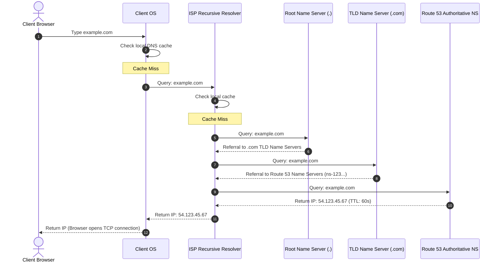
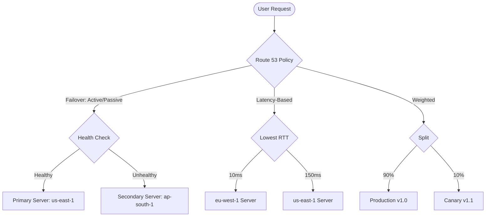
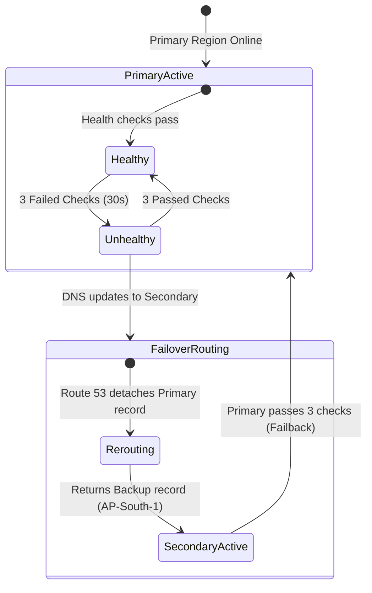

# Amazon Route 53 — DNS & Routing Policies (Engineering Architect Reference)

> 📚 Official Docs: https://docs.aws.amazon.com/Route53/latest/DeveloperGuide/  
> 🎯 SAA-C03 Exam Weight: High — key for regional failover, latency routing, and DNS-level traffic management.

---

## 🌐 Topic 1: DNS & Route 53 Fundamentals

### 📖 Technical Specifications & AWS Core Concepts
* **DNS (Domain Name System):** A globally distributed service that translates human-readable hostnames (e.g., `example.com`) into computer-readable IP addresses.
* **Authoritative Name Server:** The final DNS server in the lookup chain that holds the actual DNS records for a domain and returns them to the resolver.
* **Recursive DNS Resolver (DNS Server):** A local DNS server (often run by an ISP or Google `8.8.8.8`) that queries other name servers on behalf of a client to resolve a domain.
* **TTL (Time-To-Live):** The duration (in seconds) for which a DNS record is cached by resolvers and clients before they must request it again.
* **Route 53:** AWS's highly available, scalable, managed Domain Name System (DNS) web service. It supports domain registration, DNS routing, and health checking.
* **100% Uptime SLA:** Route 53 is **the only AWS service** that offers a 100% availability guarantee in its Service Level Agreement (SLA).

---

### 🗺️ Visual Architecture: DNS Resolution Flow



---

### 🧠 Architectural Probing & Decision Scenarios
* **Scenario:** How does a recursive DNS resolver find the IP address for a domain name?**
  * **Design:** When a user requests a domain (e.g., `www.google.com`), the DNS resolution follows a hierarchical lookup flow:
    1. **Local Cache Check:** The browser and Operating System check their local caches first.
    2. **Recursive DNS Server:** If not cached, the OS asks the ISP's Recursive Resolver.
    3. **Root Name Server:** The Recursive Resolver queries the global Root Name Server (`.`), which points to the Top-Level Domain (TLD) servers for `.com`.
    4. **TLD Name Server:** The resolver queries the TLD server, which redirects to the Authoritative Name Servers for `google.com`.
    5. **Authoritative Name Server:** The resolver queries the authoritative name server (e.g., Route 53), which returns the actual IP address (A record).
    6. **Client Connection:** The resolver returns the IP to the browser, which caches it based on the Time-To-Live (TTL) and opens a connection.

* **Scenario:** What are the primary DNS record types, and when do you use each?**
  * **Design:** * **A (Address):** Maps a hostname directly to an IPv4 address (e.g., `api.example.com` → `1.2.3.4`).
    * **AAAA:** Maps a hostname directly to an IPv6 address.
    * **CNAME (Canonical Name):** Maps a hostname to another hostname (e.g., `www.example.com` → `example.com`). **Cannot be used for the Zone Apex (root domain).**
    * **MX (Mail Exchanger):** Directs email traffic to mail servers.
    * **NS (Name Server):** Specifies the authoritative name servers that host the DNS records for your domain.
    * **TXT (Text):** Holds arbitrary text metadata, commonly used for domain ownership verification and email security protocols like SPF, DKIM, and DMARC.

---

### 📐 Application Design Patterns & Trade-offs
* **DNS Caching vs. Real-Time Routing Control:** 
  * **The Trade-off:** High TTLs (e.g., 86400 seconds / 24 hours) reduce DNS query costs and latency by caching responses at the client/resolver layer. However, they destroy real-time traffic control. If you need to perform an emergency failover, clients will continue hitting the old IP until their cache expires.
  * **The Design Pattern:** For microservices and API gateways involved in active routing or DR, set TTLs to **60 seconds or less**. While this slightly increases query costs and resolution latency, it gives the application layer the agility to shift traffic dynamically during outages.

---

### 🚀 Real-World Production Insights
* **The Browser DNS Caching Override (Why TTLs Lie):**
  * **The Secret:** Even if you set your Route 53 TTL to 10 seconds, modern browsers (like Google Chrome) and operating systems often enforce a hardcoded minimum DNS cache time (e.g., 60 seconds) to speed up user browsing. 
  * **Production Impact:** During a regional failover, you will observe traffic continuing to hit the failed primary region for 1–2 minutes after Route 53 has updated its records.
  * **Mitigation:** Your application client-side code should handle connection timeout errors natively. If a request to `api.example.com` times out, the client should attempt a retry to a secondary fallback URL (e.g., `api-backup.example.com`) or use an IP-based fallback list, bypassing the browser's DNS cache completely.

---

### 💻 Hands-on CLI Commands
* **Test DNS resolution using command-line query tools:**
  ```bash
  # Query A records using dig
  dig api.example.com A
  
  # Query CNAME records using a specific DNS server directly (e.g., Google DNS)
  dig www.example.com CNAME @8.8.8.8
  
  # Perform quick verification using nslookup
  nslookup blog.example.com
  ```

---

## 🔍 Topic 2: Hosted Zones (Public vs. Private)

### 📖 Technical Specifications & AWS Core Concepts
* **Hosted Zone:** An Amazon Route 53 container that holds resource record sets for a specific domain name (e.g., `example.com`) and its subdomains.
* **Public Hosted Zone:** A hosted zone that contains DNS records visible to the public internet, allowing public traffic routing.
* **Private Hosted Zone:** A hosted zone that contains DNS records for routing traffic within one or more Amazon VPCs (Virtual Private Clouds) without exposing the records to the internet.
* **VPC Association:** The mandatory process of linking a Private Hosted Zone to specific VPCs so that DNS queries originating from inside those VPCs resolve using the private zone's records.

---

### 🧠 Architectural Probing & Decision Scenarios
* **Scenario:** When should you use a Private Hosted Zone instead of a Public Hosted Zone?**
  * **Design:** * **Public Hosted Zone:** Use when your resources need to be resolved from the public internet (e.g., mapping `www.my-company.com` to a public ALB).
    * **Private Hosted Zone:** Use when you need internal DNS resolution within your private network (VPCs) without exposing internal hostnames or IP addresses to the public internet (e.g., mapping `db.internal` to a private RDS instance).

* **Scenario:** What VPC settings are mandatory for a Private Hosted Zone to work?**
  * **Design:** You must enable two specific settings on the associated VPC(s) for Route 53 to resolve private records:
    1. `enableDnsHostnames` — Ensures instances in the VPC get public/private DNS names.
    2. `enableDnsSupport` — Enables the Amazon DNS server (the `.2` resolver) to resolve Route 53 private hosted zone records.

---

### 📐 Application Design Patterns & Trade-offs
* **Internal Service Discovery: Route 53 Private Hosted Zones vs. AWS Cloud Map / ECS Service Connect:**
  * **Route 53 Private Hosted Zones:** Best for traditional static microservices (e.g., mapping `api.internal` to an internal ALB). It is simple, protocol-agnostic, and works out of the box with standard DNS resolution. However, it lacks dynamic health checking for individual container instances (it only checks the ALB target group level).
  * **AWS Cloud Map / ECS Service Connect:** Best for highly dynamic containerized/gRPC microservices. Service Connect manages local proxy routing (Envoy), handles traffic splitting, retries, and circuit breaking at the application layer, bypassing standard DNS caching limitations completely.

---

### 💻 Hands-on CLI Commands
* **Create a Public Hosted Zone:**
  ```bash
  aws route53 create-hosted-zone \
    --name example.com \
    --caller-reference "$(date +%s)" \
    --hosted-zone-config Comment="My public zone"
  ```
* **Create a Private Hosted Zone and associate it with a VPC:**
  ```bash
  aws route53 create-hosted-zone \
    --name internal.example.com \
    --caller-reference "$(date +%s)" \
    --hosted-zone-config PrivateZone=true,Comment="Internal zone" \
    --vpc VPCRegion=us-east-1,VPCId=vpc-1234567890abcdef0
  ```
* **List all Hosted Zones:**
  ```bash
  aws route53 list-hosted-zones
  ```

---

## ⭐ Topic 3: CNAME vs. Alias Records

### 📖 Technical Specifications & AWS Core Concepts
* **CNAME Record:** A standard DNS record type that points a hostname to another hostname. It acts as an alias but requires the resolver to make an additional DNS query to resolve the target hostname.
* **Alias Record:** An AWS-proprietary Route 53 record type that routes traffic directly to selected AWS resources (like ELBs, CloudFront, or S3 buckets) without invoking external lookups.
* **Zone Apex (Root Domain):** The DNS parent domain node (e.g., `example.com` without a `www.` prefix).

---

### 🧠 Architectural Probing & Decision Scenarios
* **Scenario:** Why choose an Alias record over a CNAME record in Route 53?**
  * **Design:** Alias records are AWS-proprietary DNS extensions that offer significant advantages:
    * **Zone Apex Support:** Unlike CNAMEs, Alias records can be mapped to the Zone Apex (root domain like `example.com`).
    * **Cost:** Querying Alias records pointing to AWS resources is **completely free**, whereas CNAME queries incur standard charges.
    * **Dynamic Mapping:** If the underlying AWS resource IP changes (e.g., an ALB), the Alias target automatically updates. CNAMEs require resolving the secondary hostname first, adding latency.
    * **Health Check Integration:** Alias targets can evaluate target health automatically.

* **Scenario:** Why can't you use a CNAME for a Zone Apex, and how does Alias resolve this?**
  * **Design:** * **The Problem:** The DNS standard (RFC 1034) dictates that if a CNAME record exists at a hostname, no other records (like MX, NS, or SOA) can exist for that same hostname. Because a Zone Apex *must* have NS and SOA records, putting a CNAME at the apex violates the protocol.
    * **The Solution:** Route 53 **Alias** records act as an `A` or `AAAA` record under the hood. When queried, Route 53 resolves the target AWS resource IP internally and returns it directly as an IP address, maintaining RFC compliance while offering CNAME-like flexibility.

* **Scenario:** What is the architectural role of the `EvaluateTargetHealth` parameter in a Route 53 Alias record?**
  * **Design:** When `EvaluateTargetHealth` is set to `true` on an Alias record:
    * **Target Status Resolution:** Route 53 active query mechanisms inspect the health of the underlying target resources (e.g. EC2 instance targets inside an Application Load Balancer target group, or the health configurations of S3 website buckets).
    * **Dynamic Failover:** If the target resources are found to be unhealthy (e.g. all backend web instances fail their HTTP/HTTPS checks), Route 53 marks the Alias record itself as unhealthy and reroutes queries to healthy fallback targets.
    * **No-Blackhole Fallback:** If all target endpoints inside the Alias configuration are marked unhealthy at the same time, Route 53 acts defensively by routing queries to all targets anyway to keep the application partially active.
    * **Cost Optimization:** Evaluating target health on Alias records pointing to AWS resources is **completely free**, saving the cost of dedicated active Route 53 endpoint health checks.

---

### 📐 Application Design Patterns & Trade-offs
* **Cold Starts & DNS Latency Optimization:**
  * **The Scenario:** A mobile application connects to an API gateway.
  * **CNAME Approach:** Resolving `api.myapp.com` requires two external DNS round-trips: one to resolve `api.myapp.com` to `execute-api.us-east-1.amazonaws.com`, and another to resolve that hostname to its public IPs.
  * **Alias Approach:** Resolving `api.myapp.com` using an Alias record performs the translation on Route 53's authoritative servers, returning the IP addresses directly in a single round-trip. **Architectural Choice:** Always use Alias records for latency-critical API endpoints and web assets to shave 50–100ms off client connection times.

---

### 💻 Hands-on CLI Commands
* **Create a standard A record:**
  ```bash
  aws route53 change-resource-record-sets \
    --hosted-zone-id Z1234567890ABC \
    --change-batch '{
      "Changes": [{
        "Action": "CREATE",
        "ResourceRecordSet": {
          "Name": "www.example.com",
          "Type": "A",
          "TTL": 300,
          "ResourceRecords": [{"Value": "54.123.45.67"}]
        }
      }]
    }'
  ```
* **Create a CNAME record (subdomain to parent apex):**
  ```bash
  aws route53 change-resource-record-sets \
    --hosted-zone-id Z1234567890ABC \
    --change-batch '{
      "Changes": [{
        "Action": "CREATE",
        "ResourceRecordSet": {
          "Name": "blog.example.com",
          "Type": "CNAME",
          "TTL": 300,
          "ResourceRecords": [{"Value": "example.com"}]
        }
      }]
    }'
  ```
* **Create an Alias record pointing to an Application Load Balancer (ALB) with health evaluation enabled:**
  ```bash
  aws route53 change-resource-record-sets \
    --hosted-zone-id Z1234567890ABC \
    --change-batch '{
      "Changes": [{
        "Action": "CREATE",
        "ResourceRecordSet": {
          "Name": "example.com",
          "Type": "A",
          "AliasTarget": {
            "HostedZoneId": "Z35SXDOTRQ7X7K",
            "DNSName": "my-alb-1234567890.us-east-1.elb.amazonaws.com",
            "EvaluateTargetHealth": true
          }
        }
      }]
    }'
  ```

---

## 🗺️ Topic 4: Traffic Routing Policies

### 📖 Technical Specifications & AWS Core Concepts
* **Routing Policy:** A Route 53 setting that determines how Route 53 responds to DNS queries for your domain names.
* **Simple Routing Policy:** Routes traffic to a single resource or multiple resources specified in a single record. Does not support health checks.
* **Weighted Routing Policy:** Routes traffic to multiple resources in proportions that you specify (e.g., using integer values).
* **Latency Routing Policy:** Routes traffic to the AWS region that provides the lowest network latency for the client query.
* **Geolocation Routing Policy:** Routes traffic based on the geographic location of your users (continent, country, or state).
* **Geoproximity Routing Policy:** Routes traffic based on the geographic location of your resources and your users, using a custom scale factor called a "bias" to expand or contract resource coverage zones.
* **IP-Based Routing Policy:** Routes traffic based on the CIDR blocks of the client DNS queries.
* **Multi-Value Answer Routing Policy:** Configures Route 53 to return up to 8 healthy resource records in response to DNS queries, providing a form of client-side load balancing.

---

### 🗺️ Visual Architecture: Routing Policy Comparison



---

### 🧠 Architectural Probing & Decision Scenarios
* **Scenario:** What is Simple Routing, and why is it unsuitable for High Availability (HA)?**
  * **Design:** Simple Routing maps a domain to one or multiple static values (IP addresses). 
  * **The Catch:** It **does not support health checks**. If you list multiple IPs (e.g., `[1.2.3.4, 5.6.7.8]`), Route 53 returns all of them to the client in random order. If one server goes offline, Route 53 still returns its IP, causing connection failures for users who try to connect to the dead instance.

* **Scenario:** How does Weighted Routing work, and what are its primary architectural use cases?**
  * **Design:** Weighted Routing splits incoming traffic across multiple resources based on user-assigned numeric weights (e.g., 70/30).
  * **Key Use Cases:**
    * **Blue/Green & Canary Deployments:** Shifting a tiny fraction of traffic (e.g., 5%) to a new application version to test stability before a full rollout.
    * **Zero-Traffic Maintenance Mode:** Setting a resource's weight to `0` stops Route 53 from returning its IP, allowing you to perform maintenance on it without removing the record.

* **Scenario:** How do you choose between Geolocation Routing and Latency-Based Routing?**
  * **Design:** * **Choose Geolocation Routing** when traffic must be directed based on **geographic boundaries**. Use cases include content localization (displaying German text for European users), regional licensing restrictions, or compliance (ensuring EU user data routes only to EU-based servers under GDPR).
    * **Choose Latency-Based Routing** when you want to optimize for the **fastest user experience**. Route 53 measures latency from the user to the AWS regions and routes them to the lowest-latency endpoint. *Note: Latency routing is not strictly geographical (e.g., a user in South America might resolve to US-East instead of SA-East if the network path is faster).*

* **Scenario:** What happens in Geolocation Routing if a user makes a request from an unmapped country? How do you prevent errors?**
  * **Design:** If there is no explicit record for the user's location, Route 53 will return an `NXDOMAIN` (non-existent domain) error, causing the website to fail to load.
  * **The Prevention:** You **must configure a default "catch-all" record** with a wildcard (`*`) location. This ensures unmatched traffic is routed to a generic endpoint.

* **Scenario:** What is Geoproximity Routing, and when would you choose it over Geolocation?**
  * **Design:** Geoproximity Routing directs traffic based on the physical distance between the user and your resources. 
  * **Why choose it:** Unlike Geolocation, Geoproximity allows you to **adjust the size of the geographic zone** (called a **bias**) for each resource. 
    * A positive bias expands the region's coverage area, funneling more users to it.
    * A negative bias shrinks its coverage area, shifting traffic away.
  * *Note: Geoproximity routing is only configurable via Route 53's visual **Traffic Flow** editor.*

* **Scenario:** What is IP-Based Routing, and what is its primary use case?**
  * **Design:** IP-Based Routing allows you to route traffic based on the client's subnet (CIDR block).
  * **Primary Use Case:** Optimizing network performance for known client bases (e.g., directing corporate office subnets directly to private internal servers, or routing traffic from specific ISP subnets to dedicated endpoints to bypass local routing bottlenecks).

* **Scenario:** What is Multi-Value Answer Routing, and how does it differ from an Elastic Load Balancer (ELB)?**
  * **Design:** Multi-Value Routing allows Route 53 to return up to 8 healthy IP addresses in response to a single DNS query. Unlike Simple routing, Multi-Value **supports health checks** and will filter out unhealthy IPs before responding.
  * **Why it's NOT an ELB:** 
    * Multi-Value relies on **client-side load balancing** (the client browser randomly picks one of the returned IPs). It cannot handle instant failover if an IP goes down *after* the DNS query is cached, and it does not handle protocol-level features like SSL termination, sticky sessions, or request path routing. 
    * Always use an ELB for true, application-level load balancing.

---

### 📐 Application Design Patterns & Trade-offs
* **Handling Database Write Conflicts in Active-Active Multi-Region Deployments:**
  * **The Challenge:** Using Latency-Based Routing to send users to regional Application Load Balancers (ALBs) in `us-east-1` and `ap-south-1`. If both regions write to their local databases simultaneously, you run into data synchronization conflicts.
  * **The Architectural Patterns:**
    1. **Single-Primary (Write-Forwarding):** Route all reads locally via Latency routing, but use application code or Aurora Global Database to forward all write requests to a single master region (e.g., `us-east-1`). This prevents write conflicts but adds cross-region latency to writes.
    2. **Multi-Master (DynamoDB Global Tables):** Allow local writes in both regions. Utilize DynamoDB Global Tables' conflict resolution model (Last-Writer-Wins based on physical timestamps) or design application code to partition data so users in different regions never modify the same rows.

---

### 💻 Hands-on CLI Commands
* **Configure a Weighted Routing Policy (Split 70% to primary, 30% to secondary):**
  ```bash
  # Record 1: 70% weight
  aws route53 change-resource-record-sets \
    --hosted-zone-id Z1234567890ABC \
    --change-batch '{
      "Changes": [{
        "Action": "CREATE",
        "ResourceRecordSet": {
          "Name": "api.example.com",
          "Type": "A",
          "SetIdentifier": "PrimaryTier",
          "Weight": 70,
          "TTL": 60,
          "ResourceRecords": [{"Value": "54.123.45.67"}]
        }
      }]
    }'

  # Record 2: 30% weight
  aws route53 change-resource-record-sets \
    --hosted-zone-id Z1234567890ABC \
    --change-batch '{
      "Changes": [{
        "Action": "CREATE",
        "ResourceRecordSet": {
          "Name": "api.example.com",
          "Type": "A",
          "SetIdentifier": "SecondaryTier",
          "Weight": 30,
          "TTL": 60,
          "ResourceRecords": [{"Value": "54.234.56.78"}]
        }
      }]
    }'
  ```
* **Configure a Latency-based Routing Policy (pointing to us-east-1 endpoint):**
  ```bash
  aws route53 change-resource-record-sets \
    --hosted-zone-id Z1234567890ABC \
    --change-batch '{
      "Changes": [{
        "Action": "CREATE",
        "ResourceRecordSet": {
          "Name": "app.example.com",
          "Type": "A",
          "SetIdentifier": "us-east-1",
          "Region": "us-east-1",
          "TTL": 60,
          "ResourceRecords": [{"Value": "54.123.45.67"}]
        }
      }]
    }'
  ```

---

## ❤️ Topic 5: Route 53 Health Checks & Disaster Recovery

### 📖 Technical Specifications & AWS Core Concepts
* **Route 53 Health Check:** A feature that monitors the health and performance of your web applications, web servers, and other resources.
* **Failover Routing Policy (Active-Passive):** A routing configuration that routes traffic to a primary resource when it is healthy, and switches to a secondary resource when the primary is unhealthy.
* **Endpoint Health Check:** A check that monitors the health of a specific IP address or domain name via TCP, HTTP, or HTTPS queries.
* **Calculated Health Check:** A parent health check that evaluates the status of up to 256 "child" health checks using logical operators (AND, OR, NOT).
* **CloudWatch Alarm Health Check:** A health check that monitors a CloudWatch alarm to determine whether a resource is healthy (used when resources have private IPs).

---

### 🗺️ Visual Architecture: Failover Lifecycle & Health Checker



---

### 🧠 Architectural Probing & Decision Scenarios
* **Scenario:** How does Failover Routing work in an Active-Passive architecture?**
  * **Design:** You configure a **PRIMARY** record and a **SECONDARY** record.
    * Route 53 routes 100% of traffic to the PRIMARY as long as it passes health checks.
    * If the PRIMARY fails its health check, Route 53 automatically redirects 100% of traffic to the SECONDARY (e.g., a backup region or a static S3 website showing a maintenance message).
    * Once the PRIMARY becomes healthy again, Route 53 automatically performs a "failback," routing traffic back to the primary.

* **Scenario:** How does Route 53 health check a private resource inside a VPC since Route 53 servers live on the public internet?**
  * **Design:** Route 53's global health checkers cannot reach private IP addresses (e.g., `10.0.0.0/8`).
  * **The Solution:** 
    1. Create a **CloudWatch Alarm** that monitors a metric on the private resource (e.g., CPU utilization, status check failures, or ELB target health).
    2. Create a Route 53 health check of type **CLOUDWATCH_METRIC** that monitors the status of that CloudWatch Alarm.
    3. When the alarm triggers, Route 53 marks the private resource as unhealthy and updates DNS routing accordingly.

* **Scenario:** What is a Calculated Health Check, and how does it prevent false failovers?**
  * **Design:** A Calculated Health Check monitors the status of other health checks (up to 256 child checks) rather than an endpoint directly.
  * **Why use it:** You can use logic gates (AND, OR, NOT) and thresholds (e.g., *"Mark parent healthy only if at least 2 of the 3 web servers are passing"*). This prevents a transient network blip on a single server from triggering an expensive global database failover.

---

### 📐 Application Design Patterns & Trade-offs
* **Deep vs. Shallow API Health Check Endpoints (DR Protection):**
  * **Shallow Health Checks:** A `/ping` endpoint that simply checks if the web server process is running and returns `200 OK`. 
    * *Risk:* If the backend database crashes, the server stays online, the health check passes, and Route 53 continues routing traffic to a completely broken application instance.
  * **Deep Health Checks:** A `/health/deep` endpoint that explicitly queries the database, verifies cache connectivity, and checks critical downstream APIs.
    * *Risk:* A transient failure in a third-party payment gateway or a slow query could cause the deep health check to fail. If all nodes fail their check simultaneously, Route 53 will flag the entire primary region as unhealthy, triggering an expensive and unnecessary database failover.
  * **Architectural Practice:** Use **Shallow Health Checks** at the Load Balancer level to manage instance recycling, but use a **Deep Health Check** (with circuit breakers to prevent cascading failures) under a **Calculated Health Check** to determine global DNS failover logic.

---

### 🚀 Real-World Production Insights
* **The DB Promotion Split-Brain Nightmare:**
  * **The Risk:** Route 53 failover is DNS-level only. If the primary application server crashes, Route 53 redirects user traffic to the secondary region. However, Route 53 **does not promote your database replica**. If your secondary region's application starts up and attempts to write to a read-only database replica (e.g., Aurora Reader), writes will fail, resulting in a silent application outage. Alternatively, if you promote the database replica, but the primary database is actually still running (network partition), you get a **Split-Brain Scenario** where both regions are writing decoupled data concurrently.
  * **Architectural Mitigation:** Implement a centralized state coordinator (e.g., AWS Systems Manager Parameter Store or DynamoDB) using conditional writes to coordinate failovers. Do not promote secondary databases based purely on DNS changes. Force secondary apps to wait for an explicit promotion coordinator signal.

---

### 💻 Hands-on CLI Commands
* **Create an HTTP/HTTPS Health Check:**
  ```bash
  aws route53 create-health-check \
    --caller-reference "$(date +%s)" \
    --health-check-config '{
      "Type": "HTTPS",
      "FullyQualifiedDomainName": "api.example.com",
      "Port": 443,
      "ResourcePath": "/health/deep",
      "RequestInterval": 10,
      "FailureThreshold": 3
    }'
  ```
* **Create a CloudWatch Alarm Health Check (for private database subnets):**
  ```bash
  aws route53 create-health-check \
    --caller-reference "$(date +%s)" \
    --health-check-config '{
      "Type": "CLOUDWATCH_METRIC",
      "AlarmIdentifier": {
        "Region": "us-east-1",
        "Name": "private-db-cpu-alarm"
      },
      "InsufficientDataHealthStatus": "Healthy"
    }'
  ```
* **Configure a Failover Routing Policy (PRIMARY record):**
  ```bash
  aws route53 change-resource-record-sets \
    --hosted-zone-id Z1234567890ABC \
    --change-batch '{
      "Changes": [{
        "Action": "CREATE",
        "ResourceRecordSet": {
          "Name": "api.example.com",
          "Type": "A",
          "SetIdentifier": "PrimaryEndpoint",
          "Failover": "PRIMARY",
          "TTL": 60,
          "ResourceRecords": [{"Value": "54.123.45.67"}],
          "HealthCheckId": "healthcheck-primary-id"
        }
      }]
    }'
  ```

---

## 🛠️ Topic 6: DNS Diagnostics & Troubleshooting

### 📖 Technical Specifications & AWS Core Concepts
* **`test-dns-answer`:** A Route 53 API action that returns the DNS response that Amazon Route 53 would return for a specific hostname and record type, showing exactly how traffic is routed at that instant.

---

### 🧠 Architectural Probing & Decision Scenarios
* **Scenario:** How do you troubleshoot and test DNS resolution using command-line utilities?**
  * **Design:** * Use **`dig`** to perform detailed DNS queries:
      ```bash
      # Basic query
      dig www.example.com
      
      # Query a specific DNS server directly (e.g., Google's public DNS)
      dig www.example.com @8.8.8.8
      ```
    * Use **`nslookup`** for quick verification:
      ```bash
      nslookup www.example.com
      ```

---

### 📐 Application Design Patterns & Trade-offs
* **Client-Side Connection Failovers (Avoiding DNS Cache TTL Lag):**
  * **The Challenge:** Even with a low TTL (e.g., 10 seconds), clients (mobile apps, external services) might cache DNS records indefinitely due to buggy client-side HTTP libraries or intermediate ISP DNS servers that ignore low TTLs. During a regional failover, these users remain stranded on the broken region.
  * **The Architectural Pattern:** Design client-side SDKs to use **dual-endpoint fallback logic**. Instead of hardcoding a single DNS hostname (`api.myapp.com`), the client should possess a prioritized list of hostnames (e.g., Primary: `api-us.myapp.com`, Fallback: `api-in.myapp.com`). If a request to the primary hostname encounters repeated TCP timeouts (e.g., 3 failures), the client-side code bypasses DNS resolution entirely and routes the payload directly to the fallback hostname, establishing immediate recovery.

---

### 💻 Hands-on CLI Commands
* **Run Route 53 DNS API test to check how it routes requests:**
  ```bash
  aws route53 test-dns-answer \
    --hosted-zone-id Z1234567890ABC \
    --record-name www.example.com \
    --record-type A
  ```
