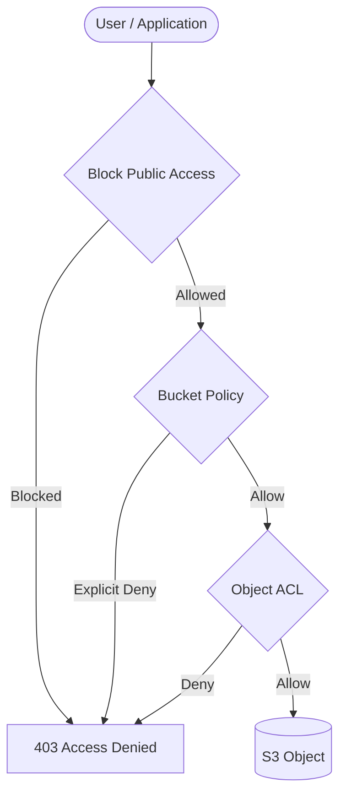
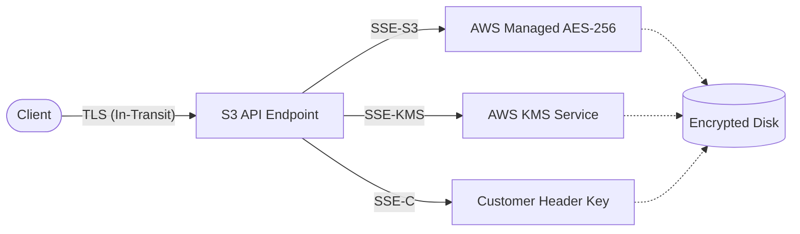
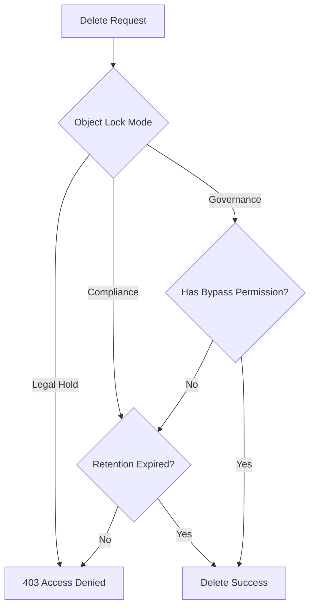
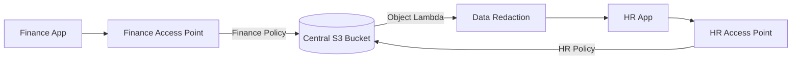

# Amazon S3 – Advanced Security & Encryption

## S3 Access Control & Bucket Security

### 📖 Technical Specifications & AWS Core Concepts
- **Bucket Policies (Resource-based)**: JSON policies attached directly to the bucket. Can grant cross-account access, enforce HTTPS, and manage broad public access rules.
- **Access Control Lists (ACLs)**: Legacy mechanism for object or bucket-level access. AWS recommends disabling ACLs entirely in favor of Object Ownership settings and Bucket Policies.
- **Block Public Access (BPA)**: An account-level or bucket-level guardrail. Overrides any bucket policies or ACLs that attempt to grant public access. Should be ON by default unless explicitly hosting public content.
- **MFA Delete**: Protects against accidental deletion. Requires multi-factor authentication from the bucket owner (root account) to permanently delete an object version or suspend versioning.

### 🗺️ Visual Architecture: Access Control Flow


### 🧠 Architectural Probing & Decision Scenarios
* **Scenario:** You need to ensure no one, even a privileged admin, can accidentally make a bucket public.
  * **Design:** Deploy Account-level Block Public Access. Because it serves as a strict guardrail that overrides all bucket policies and ACLs globally.
* **Scenario:** You need to prevent compromised IAM users from deleting historical object versions.
  * **Design:** Deploy MFA Delete. Because it requires a hardware or virtual MFA token from the root account to permanently delete an object version.

### 📐 Application Design Patterns & Trade-offs
- **Pattern:** Centralize access control using Bucket Policies while setting "Object Ownership" to "Bucket Owner Enforced" to completely disable ACLs.
- **Trade-off:** Bucket Policies provide a unified, easily auditable access model but have a 20KB size limit. For environments with hundreds of complex rules, you must transition to S3 Access Points.

### 🚀 Real-World Production Insights
- **Battle Scares:** Applying an overly broad `Deny *` bucket policy without specific conditions can lock even root administrators out of the bucket. Always test policies carefully, and ensure you include conditions to bypass the deny for emergency administrative roles.

### 💻 Hands-on CLI Commands
```bash
# Enable MFA Delete (requires root credentials + MFA code)
aws s3api put-bucket-versioning \
  --bucket my-bucket \
  --versioning-configuration Status=Enabled,MFADelete=Enabled \
  --mfa "arn:aws:iam::123456789012:mfa/root-account-mfa-device 123456"

# Enable server access logging
aws s3api put-bucket-logging \
  --bucket my-bucket \
  --bucket-logging-status '{
    "LoggingEnabled": {
      "TargetBucket": "my-access-logs-bucket",
      "TargetPrefix": "my-bucket-logs/"
    }
  }'
```

## S3 Data Encryption (At-Rest & In-Transit)

### 📖 Technical Specifications & AWS Core Concepts
- **SSE-S3**: Default encryption (AES-256) managed fully by AWS. No extra cost.
- **SSE-KMS**: AWS KMS-managed keys. Provides explicit control and auditing via CloudTrail.
- **SSE-C**: Customer-managed keys. Customer provides the key in HTTP headers; AWS encrypts/decrypts in memory and discards the key immediately. Requires HTTPS.
- **DSSE-KMS**: Double-layer server-side encryption for stringent compliance requirements.
- **Encryption in Transit (SSL/TLS)**: S3 provides HTTP and HTTPS endpoints. Best practice is to deny HTTP traffic entirely using a bucket policy `aws:SecureTransport` condition.

### 🗺️ Visual Architecture: S3 Encryption Patterns


### 🧠 Architectural Probing & Decision Scenarios
* **Scenario:** You need strict audit trails showing exactly who decrypted which file and when.
  * **Design:** Deploy SSE-KMS. Because AWS KMS inherently logs every cryptographic operation (key usage) to CloudTrail.
* **Scenario:** Corporate policy strictly mandates that AWS must never persistently store encryption keys.
  * **Design:** Deploy SSE-C. Because the customer manages the key, provides it per request, and AWS discards it from memory immediately after use.

### 📐 Application Design Patterns & Trade-offs
- **Pattern:** Enforcing encryption in transit at the bucket level using `aws:SecureTransport: false` Deny rules.
- **Trade-off:** SSE-KMS provides superior security and auditing but introduces KMS API quota limits and costs per request. SSE-S3 is free and unlimited but lacks granular key usage auditing.

### 🚀 Real-World Production Insights
- **Battle Scares:** Heavy parallel processing workloads (e.g., EMR, Athena, or Lambda arrays) hitting S3 buckets encrypted with SSE-KMS often cause KMS `ThrottlingException` due to API rate limits. Mitigate this by utilizing S3 Bucket Keys to decrease KMS request traffic by up to 99%.

### 💻 Hands-on CLI Commands
```bash
# Put object with SSE-KMS
aws s3api put-object \
  --bucket my-bucket \
  --key sensitive-file.txt \
  --body sensitive-file.txt \
  --server-side-encryption aws:kms \
  --ssekms-key-id arn:aws:kms:us-east-1:123456789012:key/mrk-abc123

# Force HTTPS-only via bucket policy (Deny HTTP)
aws s3api put-bucket-policy \
  --bucket my-bucket \
  --policy '{
    "Statement": [{
      "Effect": "Deny",
      "Principal": "*",
      "Action": "s3:*",
      "Resource": ["arn:aws:s3:::my-bucket", "arn:aws:s3:::my-bucket/*"],
      "Condition": {"Bool": {"aws:SecureTransport": "false"}}
    }]
  }'
```

## S3 Data Immutability (Object Lock & Glacier Vault Lock)

### 📖 Technical Specifications & AWS Core Concepts
- **WORM Model**: Write Once, Read Many. Prevents deletion or modification of data.
- **Glacier Vault Lock**: Implements WORM at the Glacier Vault level by locking a vault policy for future edits.
- **S3 Object Lock (Compliance Mode)**: No user (including the root user) can delete or overwrite the object until the retention period expires.
- **S3 Object Lock (Governance Mode)**: Most users cannot delete the object, but authorized users with special IAM permissions (`s3:BypassGovernanceRetention`) can alter or delete it.
- **Legal Hold**: Protects an object indefinitely. Independent of retention periods and can be toggled by authorized users.

### 🗺️ Visual Architecture: Object Lock Retention Modes


### 🧠 Architectural Probing & Decision Scenarios
* **Scenario:** Financial regulations (like SEC Rule 17a-4) require logs to be immutable for 7 years; no admin override is legally permitted.
  * **Design:** Deploy Object Lock in Compliance Mode. Because it guarantees mathematical immutability where even the AWS account root user cannot bypass the retention period.
* **Scenario:** You want to protect backups against ransomware, but need the ability for the Chief Security Officer to delete data in emergencies.
  * **Design:** Deploy Object Lock in Governance Mode. Because standard users are blocked, but users granted specific bypass permissions can alter the objects.

### 📐 Application Design Patterns & Trade-offs
- **Pattern:** Using Legal Holds for e-discovery during active litigation, ensuring files remain untouched until the legal hold is manually removed.
- **Trade-off:** Compliance mode guarantees absolute immutability, meaning you are financially liable to pay for the storage until expiration, with zero possibility of early deletion. Also, Object Lock must be enabled during bucket creation.

### 🚀 Real-World Production Insights
- **Battle Scares:** Enabling Compliance mode on an active development or testing bucket can result in massive, unavoidable storage bills. Developers might write terabytes of test data that physically cannot be deleted until the retention period expires. Always validate lifecycle policies in Governance mode first.

### 💻 Hands-on CLI Commands
```bash
# Create bucket with Object Lock enabled (Required at creation)
aws s3api create-bucket \
  --bucket my-locked-bucket \
  --object-lock-enabled-for-bucket

# Put object with Compliance retention (e.g., 30 days)
aws s3api put-object-retention \
  --bucket my-locked-bucket \
  --key important-doc.pdf \
  --retention '{"Mode": "COMPLIANCE", "RetainUntilDate": "2026-12-31T00:00:00Z"}'

# Toggle a legal hold on an object
aws s3api put-object-legal-hold \
  --bucket my-locked-bucket \
  --key important-doc.pdf \
  --legal-hold Status=ON
```

## S3 Advanced Data Sharing (Pre-Signed URLs, Access Points, CORS)

### 📖 Technical Specifications & AWS Core Concepts
- **Pre-Signed URLs**: Cryptographically signed URLs that grant time-limited access (GET/PUT) to specific S3 objects without requiring AWS credentials from the requester. Inherits the permissions of the URL creator.
- **S3 Access Points**: Dedicated network endpoints attached to an S3 bucket. Each has a unique DNS name and a distinct IAM policy. Can be restricted to a specific VPC.
- **CORS (Cross-Origin Resource Sharing)**: Configuration that defines which external domains (origins) are allowed to make requests directly to the S3 bucket via web browsers.
- **S3 Object Lambda**: Intercepts `GET` requests to modify data on the fly (e.g., redacting PII, resizing images) using Lambda functions before returning it to the client.

### 🗺️ Visual Architecture: S3 Access Points


### 🧠 Architectural Probing & Decision Scenarios
* **Scenario:** Allow premium mobile users to upload a 5GB video directly to S3 within a 15-minute window without passing through your application servers.
  * **Design:** Deploy S3 Pre-Signed URLs for PUT operations. Because it delegates your backend's IAM permissions for a restricted time window, offloading bandwidth directly to AWS.
* **Scenario:** You have a massive data lake bucket shared across 50 different microservices, and managing a single bucket policy has become impossible.
  * **Design:** Deploy S3 Access Points. Because it decentralizes policy management, allowing each microservice to have a distinct DNS endpoint and separate IAM policy scoped to their specific prefix.

### 📐 Application Design Patterns & Trade-offs
- **Pattern:** Using S3 Object Lambda to serve multiple formats (e.g., watermarked images, redacted CSVs) from a single source object.
- **Trade-off:** Pre-signed URLs are simple to generate natively in client SDKs but are incredibly difficult to revoke early (they remain valid until the expiration time or until the generating credentials are rotated). Access Points scale well but increase infrastructure complexity.

### 🚀 Real-World Production Insights
- **Battle Scares:** Pre-signed URLs generated using temporary IAM role credentials (like those from EC2 instance profiles or Lambda roles) are bounded by the session duration. If an EC2 role expires in 1 hour, a pre-signed URL configured with a 7-day `--expires-in` limit will stop working after 1 hour anyway.

### 💻 Hands-on CLI Commands
```bash
# Generate a pre-signed URL for GET (valid for 1 hour)
aws s3 presign s3://my-bucket/private-video.mp4 --expires-in 3600

# Create a VPC-restricted S3 Access Point
aws s3control create-access-point \
  --account-id 123456789012 \
  --name finance-access-point \
  --bucket my-bucket \
  --vpc-configuration VpcId=vpc-1234567890abcdef0

# Set CORS configuration allowing GET requests from example.com
aws s3api put-bucket-cors \
  --bucket my-bucket \
  --cors-configuration '{
    "CORSRules": [{
      "AllowedOrigins": ["https://www.example.com"],
      "AllowedMethods": ["GET", "HEAD"],
      "AllowedHeaders": ["*"],
      "MaxAgeSeconds": 3000
    }]
  }'
```
