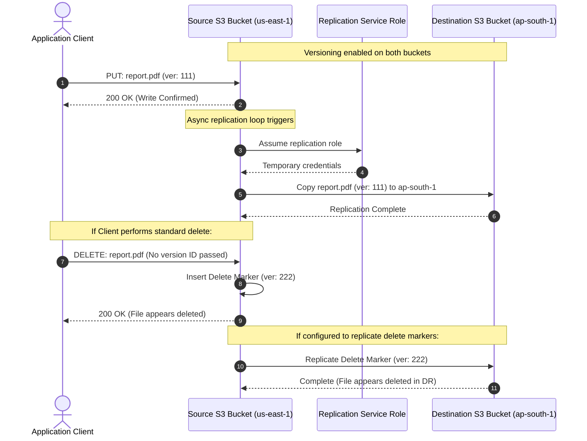
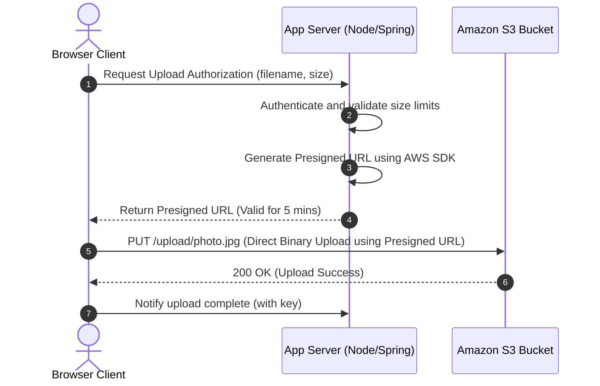

# Amazon S3 — Buckets, Objects, & Storage Classes (Engineering Architect Reference)

> 📚 Official Docs: https://docs.aws.amazon.com/AmazonS3/latest/userguide/  
> 🎯 SAA-C03 Exam Weight: High — S3 is the foundational storage service in AWS and features heavily in data lakes, backup, security, and performance scenarios.

---

## 🪣 Topic 1: S3 Buckets & Objects Fundamentals

### 📖 Technical Specifications & AWS Core Concepts
* **S3 (Simple Storage Service):** A highly scalable, durable object storage service accessed via HTTP REST APIs. It is designed to store and retrieve any amount of data from anywhere on the web.
* **S3 Bucket:** A logical container for storing objects in Amazon S3. Every bucket is created in a specific AWS Region, but the **bucket name must be globally unique** across all AWS accounts and regions.
* **S3 Object:** The fundamental entity stored in S3, consisting of data, a key (its unique name/path), metadata (key-value pairs), and optionally a Version ID and tags.
* **Object Key:** The unique identifier for an object in an S3 bucket (e.g., `images/2026/logo.png`).
* **Prefix:** The directory-like string prefix in an object key used to organize files logically (e.g., `images/2026/` is the prefix).
* **Multi-Part Upload:** An S3 feature that allows uploading a single large object as a set of parts in parallel. **Required for objects larger than 5 GB**; highly recommended for objects larger than 100 MB.
* **Requester Pays:** A bucket configuration where the requester (rather than the bucket owner) pays the costs associated with data download (data transfer out) and API requests. The requester must be authenticated in AWS.

---

### 🧠 Architectural Probing & Decision Scenarios
* **Scenario:** Why are S3 bucket names globally unique if the bucket itself is hosted in a specific region?**
  * **Design:** S3 buckets are resolved via global DNS endpoints (e.g., `http://my-unique-bucket-name.s3.amazonaws.com`). Because DNS names must be unique worldwide to route traffic correctly, S3 enforces global uniqueness to prevent name collisions across different AWS customers.

* **Scenario:** When must you use S3 Multi-Part Upload, and what are its architectural advantages?**
  * **Design:** * **Constraint:** It is mandatory for any upload exceeding 5 GB. (The absolute maximum size of a single S3 object is 5 TB).
    * **Advantages:** 
      * **Parallel Uploads:** Improves throughput by uploading multiple parts of a single file simultaneously.
      * **Resilience:** If a network connection drops, you only have to re-upload the failed part, not the entire multi-gigabyte file.
      * **Pause and Resume:** You can pause uploads and resume them later.

---

### 📐 Application Design Patterns & Trade-offs
* **Handling Database & Storage Desynchronization (S3 Write Outbox Pattern):**
  * **The Challenge:** Your application database registers a new user profile, and the user uploads an avatar image to S3. If the application writes to S3 first and then the database transaction fails (due to a validation or database crash), you have orphaned data in S3. If you write to the database first and the S3 upload fails, your database references an image that doesn't exist.
  * **The Design Patterns:**
    1. **Two-Phase Commit (Orphan cleanup):** Write to S3, catch database errors, and run an asynchronous background job to delete orphaned S3 keys.
    2. **Transactional Outbox:** Write the database record and insert an "Upload Pending" task into an outbox database table in a single transaction. A background worker picks up the task, performs the S3 upload, and updates the task status to "Completed". This guarantees strong eventual consistency between your transactional database state and S3 storage state.

---

### 💻 Hands-on CLI Commands
* **Create a globally unique bucket:**
  ```bash
  aws s3 mb s3://my-unique-bucket-name --region us-east-1
  ```
* **List files and folders (simulating prefixes):**
  ```bash
  aws s3 ls s3://my-unique-bucket-name/images/2026/
  ```

---

## 💾 Topic 2: S3 Storage Classes & Intelligent-Tiering

### 📖 Technical Specifications & AWS Core Concepts
* **S3 Standard:** The default storage class designed for active, frequently accessed data with millisecond retrieval times.
* **S3 Standard-IA (Infrequent Access):** A storage class for data that is accessed less frequently but requires rapid access when needed. Cheaper storage cost than Standard but charges a retrieval fee per GB. Minimum storage duration is 30 days.
* **S3 One Zone-IA:** Similar to Standard-IA, but stores data in a **single Availability Zone** rather than replicating it across three zones. Costs 20% less but data is lost if the physical AZ fails. Minimum storage duration is 30 days.
* **S3 Glacier Instant Retrieval:** An archive storage class designed for cold data that is rarely accessed but requires millisecond retrieval times. Minimum storage duration is 90 days.
* **S3 Glacier Flexible Retrieval:** An archive class with standard retrieval times of 3 to 5 hours (or expedited 1-5 minutes). Minimum storage duration is 90 days.
* **S3 Glacier Deep Archive:** The lowest-cost storage class in AWS, designed for long-term archiving (180 days minimum) with standard retrieval times of 12 hours.
* **S3 Intelligent-Tiering:** A serverless storage class that automatically moves objects between frequent, infrequent, archive, and deep archive access tiers based on changing access patterns, without operational overhead or retrieval fees.

---

### 🧠 Architectural Probing & Decision Scenarios
* **Scenario:** How do you choose between S3 Standard-IA, S3 One Zone-IA, and S3 Glacier Instant Retrieval for infrequently accessed data?**
  * **Design:** * **Standard-IA:** Choose for critical backup files or media assets that cannot be easily recreated and must be resilient to AZ outages.
    * **One Zone-IA:** Choose for secondary backups, replicated data, or easily reproducible media (like thumbnails) where cost savings are prioritized over AZ redundancy.
    * **Glacier Instant Retrieval:** Choose for compliance records or medical archives that are rarely accessed (once or twice a year) but must be available to users in milliseconds when requested.

* **Scenario:** How does S3 Intelligent-Tiering optimize costs without retrieval fees, and is it always the right choice?**
  * **Design:** * **Mechanism:** It monitors object access patterns. If an object is not accessed for 30 consecutive days, it shifts it to the Infrequent Access tier. If accessed again, it moves back to the Frequent tier automatically with no retrieval fees.
    * **When it is NOT the right choice:** Do not use it for objects smaller than 128 KB (objects under 128 KB are never transitioned to IA and remain in the Frequent tier). Also, avoid it if your access pattern is highly predictable (where standard lifecycle rules are cheaper) because Intelligent-Tiering charges a small monthly monitoring fee per 1,000 objects.

---

### 📐 Application Design Patterns & Trade-offs
* **Lifecycle Rules vs. Query Optimization in Data Lakes:**
  * **The Trade-off:** Shifting older analytics partitions (e.g. log files from last year) to S3 Glacier Deep Archive saves massive storage costs. However, Glacier Deep Archive has a 12-hour retrieval latency. If an analyst runs a global SQL query (via Athena) that scans all historical data, the query will fail because Glacier objects are unreadable in real time.
  * **The Solution:** Structure your data lake directory partitions by date (e.g., `year=2026/month=03/`). Keep the active year in **S3 Standard/Standard-IA** where Athena can run real-time queries, and configure lifecycle rules to compress and transition old years to Glacier deep tiers *only* after they are excluded from active dashboards.

---

### 💻 Hands-on CLI Commands
* **Upload a file with a specific storage class:**
  ```bash
  aws s3 cp large-file.zip s3://my-bucket/backups/ \
    --storage-class STANDARD_IA
  ```

---

## 🔄 Topic 3: Versioning & Object Replication

### 📖 Technical Specifications & AWS Core Concepts
* **Versioning:** A bucket-level configuration that keeps multiple versions of an object in the same bucket, protecting against accidental deletions and overwrites.
* **Delete Marker:** A placeholder version inserted by S3 when an object is deleted without specifying a Version ID. It hides the object from standard queries while preserving historical versions.
* **CRR (Cross-Region Replication):** Automatic, asynchronous replication of new S3 objects from a source bucket in one region to a destination bucket in another region.
* **SRR (Same-Region Replication):** Automatic, asynchronous replication of new objects between buckets in the same AWS Region.

---

### 🗺️ Visual Architecture: S3 Cross-Region Replication (CRR) Flow



---

### 🧠 Architectural Probing & Decision Scenarios
* **Scenario:** How does S3 versioning protect against accidental deletions, and how does a "delete marker" behave?**
  * **Design:** * **Standard Delete:** If versioning is enabled and a user deletes an object, S3 does not delete the data blocks. Instead, it inserts a **Delete Marker** as the current version. If a user tries to access the file, S3 reports it as deleted.
    * **Reversing a Delete:** To restore the object, you simply locate the version list and delete the Delete Marker. The previous version automatically becomes active again.
    * **Permanent Delete:** To permanently delete the file, you must explicitly pass the specific `Version ID` in your delete API call.

* **Scenario:** What are the strict prerequisites for setting up S3 Cross-Region Replication (CRR)?**
  * **Design:** 1. **Versioning** must be enabled on both the source and destination buckets.
    2. S3 must be granted an **IAM Service Role** with permission to read from the source bucket and write to the destination bucket.
    3. **New Objects Only:** By default, replication only copies objects created *after* the replication rule is applied. To copy existing objects, you must use **S3 Batch Replication**.
    4. **Delete Actions:** Standard deletes (which create a delete marker) are optionally replicated. Explicit version-specific deletions (`DeleteObject` with a Version ID) are **never replicated** to the destination bucket to prevent catastrophic malicious deletions from propagating.

---

### 📐 Application Design Patterns & Trade-offs
* **Replication Lag & Eventual Consistency in Multi-Region Architectures:**
  * **The Problem:** You use CRR to replicate profile photos from `us-east-1` to `ap-south-1`. Because S3 replication is asynchronous, it can take seconds or minutes for changes to propagate. If a user updates their profile photo in N. Virginia and instantly accesses the app from Mumbai, they might see the old photo (or a broken link if it's a new upload), creating a poor user experience.
  * **The Architectural Pattern:** Design the application to write the updated object key (with a unique version string or UUID) to a globally replicated database (like DynamoDB Global Tables). The app client should read the database to fetch the exact image URL version. If the local S3 check fails, the app code should fall back to fetching the image from the primary region's S3 bucket directly, hiding replication lag from the user.

---

### 💻 Hands-on CLI Commands
* **Enable versioning on a bucket:**
  ```bash
  aws s3api put-bucket-versioning \
    --bucket my-bucket \
    --versioning-configuration Status=Enabled
  ```
* **List object versions (including version IDs and delete markers):**
  ```bash
  aws s3api list-object-versions --bucket my-bucket
  ```
* **Establish Cross-Region Replication:**
  ```bash
  aws s3api put-bucket-replication \
    --bucket source-bucket \
    --replication-configuration file://replication.json
  ```

---

## 🛡️ Topic 4: S3 Security, Policies, & Encryptions

### 📖 Technical Specifications & AWS Core Concepts
* **Bucket Policy:** A resource-based IAM policy attached directly to an S3 bucket that controls access permissions to the bucket and its objects.
* **Public Access Block:** A feature that provides centralized control to prevent the public sharing of S3 buckets and objects, overriding any permissive bucket policies or Access Control Lists (ACLs).
* **SSE-S3 (Server-Side Encryption with Amazon S3 Managed Keys):** Server-side encryption where S3 automatically manages the encryption keys (AES-256) at no additional charge.
* **SSE-KMS (Server-Side Encryption with AWS KMS Keys):** Server-side encryption where S3 uses customer-managed or AWS-managed KMS keys, offering audit trails, key rotation, and granular access controls.
* **Presigned URL:** A URL generated by an object owner that grants temporary read or write access to an S3 object using the owner's credentials, valid for a specified expiration window.
* **CORS (Cross-Origin Resource Sharing):** An S3 configuration that allows web applications running in one domain to request assets (such as fonts or scripts) hosted in your S3 bucket.

---

### 🧠 Architectural Probing & Decision Scenarios
* **Scenario:** How do you choose between a Bucket Policy and an IAM User Policy to secure access to S3?**
  * **Design:** * **Choose a Bucket Policy** when you need to enforce rules for the entire bucket (e.g., forcing SSL/HTTPS connections, blocking non-encrypted uploads, or granting public access for hosting static websites). Also use it for cross-account access (allowing accounts B and C to write to account A's bucket).
    * **Choose an IAM User Policy** when you want to control what a specific user or group in your own account can do across multiple AWS services (e.g., allowing an admin user to access S3, EC2, and RDS).

* **Scenario:** What is the architectural difference between SSE-S3 and SSE-KMS, and why does SSE-KMS enforce additional API call limits (KMS throttle limits)?**
  * **Design:** * **SSE-S3:** Very simple, no extra cost, automatically handles key rotation.
    * **SSE-KMS:** Provides granular control over who can decrypt files and logs every decryption event in CloudTrail.
    * **The Catch (KMS Throttling):** Every time an application calls a `GET` request on an SSE-KMS encrypted object, S3 must call the KMS `Decrypt` API. If you have an active workload performing thousands of GET requests per second, you can easily hit the regional **KMS API Rate Limits**, resulting in HTTP 503 Throttling errors. To avoid this, you must enable **KMS Bucket Keys**, which cache the database key at the S3 level, reducing KMS API calls by up to 99%.

* **Scenario:** How do Presigned URLs work, and under what circumstances are they preferred over bucket policies?**
  * **Design:** Presigned URLs append security credentials to the object's URL. Anyone with the URL can download (or upload) the file. They are preferred when sharing private, sensitive data (like customer invoices, private video courses, or profile photos) with unauthorized internet users. It allows your backend application to authenticate the user and then hand them a temporary link valid for e.g. 5 minutes.

---

### 📐 Application Design Patterns & Trade-offs
* **Decoupling Upload Traffic via Direct Client S3 Uploads (Presigned Post Pattern):**
  * **The Bottleneck:** Traditional web architectures force users to upload files directly to the web application servers (e.g. Node.js or Spring Boot), which then upload the file to S3. Under heavy load (large file uploads), application server memory is exhausted, network bandwidth is choked, and threads are blocked.
  * **The Presigned Post Design Pattern:** 
    1. The client requests an upload authorization from the backend API.
    2. The backend generates an **S3 Presigned Post URL** (enforcing specific key structures, file size limits, and expiration) and returns it to the client.
    3. The client uploads the file **directly from the browser to S3** using the presigned URL.
    4. S3 fires an event notification (or the client notifies the backend upon completion) to trigger post-upload tasks.
  * **Architectural Advantage:** Your application servers never handle the raw file bytes, saving CPU, memory, and bandwidth, allowing your compute tier to scale efficiently.

---

### 🗺️ Visual Architecture: Presigned Upload Pattern



---

### 🚀 Real-World Production Insights
* **The KMS API Throttling Outage:**
  * **The Failure:** You deploy a static asset hosting bucket or a highly active data lake where all objects are encrypted with SSE-KMS using a custom KMS Key. During a high-concurrency peak event, GET requests fail with `KMS.ThrottlingException` (HTTP 503).
  * **The Cause:** Every read request to an SSE-KMS encrypted file triggers a call to the KMS `Decrypt` API. AWS enforces strict regional API rate limits on KMS (e.g., 10,000 requests/sec in us-east-1). If your data lake queries exceed this threshold, KMS throttles all queries, taking down S3 access.
  * **Mitigation:** Modify your bucket configuration to enable **KMS Bucket Keys**. This allows S3 to reuse a temporary bucket-level key instead of querying KMS for every single object read, reducing KMS API calls by up to 99% and avoiding throttle limits.

---

### 💻 Hands-on CLI Commands
* **Enable default SSE-S3 encryption on a bucket:**
  ```bash
  aws s3api put-bucket-encryption \
    --bucket my-bucket \
    --server-side-encryption-configuration '{
      "Rules": [{
        "ApplyServerSideEncryptionByDefault": {
          "SSEAlgorithm": "AES256"
        }
      }]
    }'
  ```
* **Enforce SSE-KMS encryption during object upload:**
  ```bash
  aws s3 cp document.pdf s3://my-bucket/secured/ \
    --sse aws:kms \
    --sse-kms-key-id arn:aws:kms:us-east-1:123456789012:key/mrk-abc123
  ```
* **Generate a Presigned URL valid for 30 minutes:**
  ```bash
  aws s3 presign s3://my-bucket/private-file.pdf --expires-in 1800
  ```

---

## ⚡ Topic 5: S3 Performance Optimization & Querying

### 📖 Technical Specifications & AWS Core Concepts
* **Prefix Scaling:** S3 automatically scales to support **3,500 PUT/COPY/POST/DELETE** requests and **5,500 GET/HEAD** requests per second per prefix.
* **S3 Transfer Acceleration:** An S3 feature that uses AWS Edge Locations to route files over the AWS global network backbone, accelerating uploads over long geographical distances.
* **Byte-Range Fetches:** An HTTP range header request that downloads specific bytes of an object in parallel, optimizing download speeds and allowing resume capability.
* **S3 Select / Glacier Select:** An S3 feature that uses SQL statements to filter and retrieve only the required subset of data from a CSV, JSON, or Parquet file, reducing network payload size.

---

### 🧠 Architectural Probing & Decision Scenarios
* **Scenario:** How does S3 scale request throughput, and how does a multi-prefix partition strategy maximize performance?**
  * **Design:** S3 scales partition throughput based on object prefix paths. If you store all files in a single folder (e.g., `s3://bucket/data/file1`), you share the 5,500 GET request limit. If you distribute files across multiple folders/prefixes:
    * `s3://bucket/folder1/` (5,500 GET requests/sec)
    * `s3://bucket/folder2/` (5,500 GET requests/sec)
    * `s3://bucket/folder3/` (5,500 GET requests/sec)
    * S3 automatically partitions the physical data behind the prefixes, multiplying your aggregate throughput capacity.

* **Scenario:** What is the difference between S3 Transfer Acceleration and Amazon CloudFront, and when should you use each?**
  * **Design:** * **S3 Transfer Acceleration (TA):** Optimized for **UPLOADING** large files over long distances. It bypasses internet routing congestion by accepting the file at the nearest AWS edge location and routing it over AWS's fast internal backbone to the S3 bucket.
    * **Amazon CloudFront:** Optimized for **DOWNLOADING** and caching static web content (images, html, video) globally for end users.

* **Scenario:** How do S3 Select and Glacier Select optimize application performance and save cost?**
  * **Design:** Normally, if a program needs to query one row in a 5 GB CSV file stored in S3, it must download the entire 5 GB file, parse it in application memory, and throw away 99.9% of it. This consumes network bandwidth and compute memory. S3 Select executes SQL queries (e.g. `SELECT * FROM S3Object WHERE age > 21`) directly on the S3 hardware, returning only the matching rows, reducing network transit by up to 99%.

---

### 📐 Application Design Patterns & Trade-offs
* **Design Patterns for High-Performance Data Ingestion:**
  * **The Scenario:** Your IoT database collects data from 10,000 devices writing files every second.
  * **The Anti-Pattern:** Writing small, 1 KB files directly to S3. This leads to high API costs (charged per 1,000 requests) and slows down analytical queries (since Athena must open thousands of small files).
  * **The Design Pattern:** Implement **Buffer and Batch Ingestion** using Amazon Kinesis Data Firehose. Kinesis buffers incoming data in memory for e.g. 5 minutes or 100 MB, merges the records, and writes a single, optimized Parquet file to S3. This slashes S3 API write costs and optimizes the data lake for query engines.

---

### 💻 Hands-on CLI Commands
* **Configure a lifecycle configuration policy on a bucket:**
  ```bash
  aws s3api put-bucket-lifecycle-configuration \
    --bucket my-bucket \
    --lifecycle-configuration file://lifecycle.json
  ```
