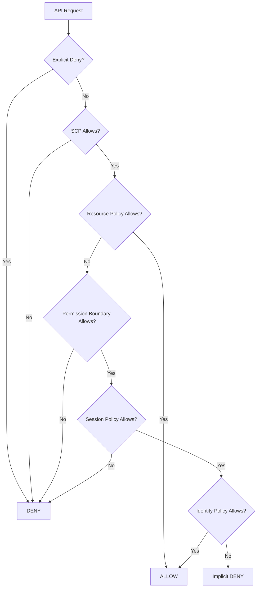
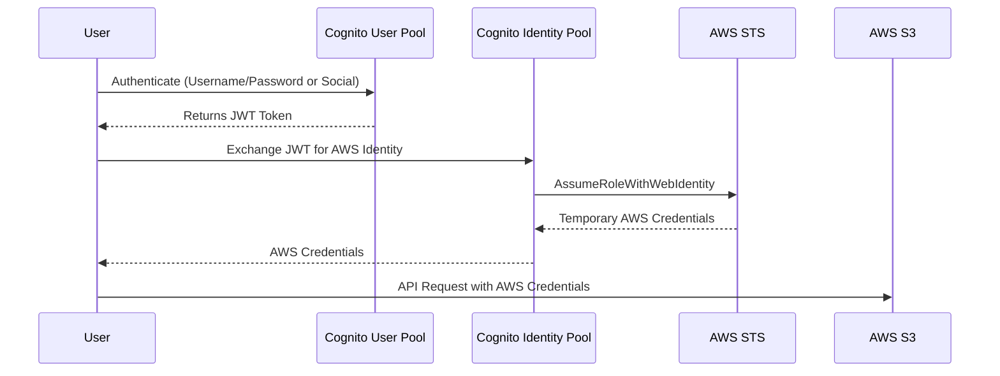
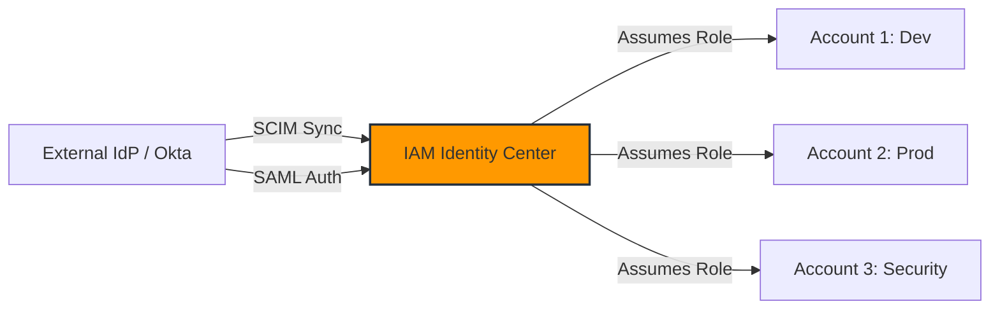
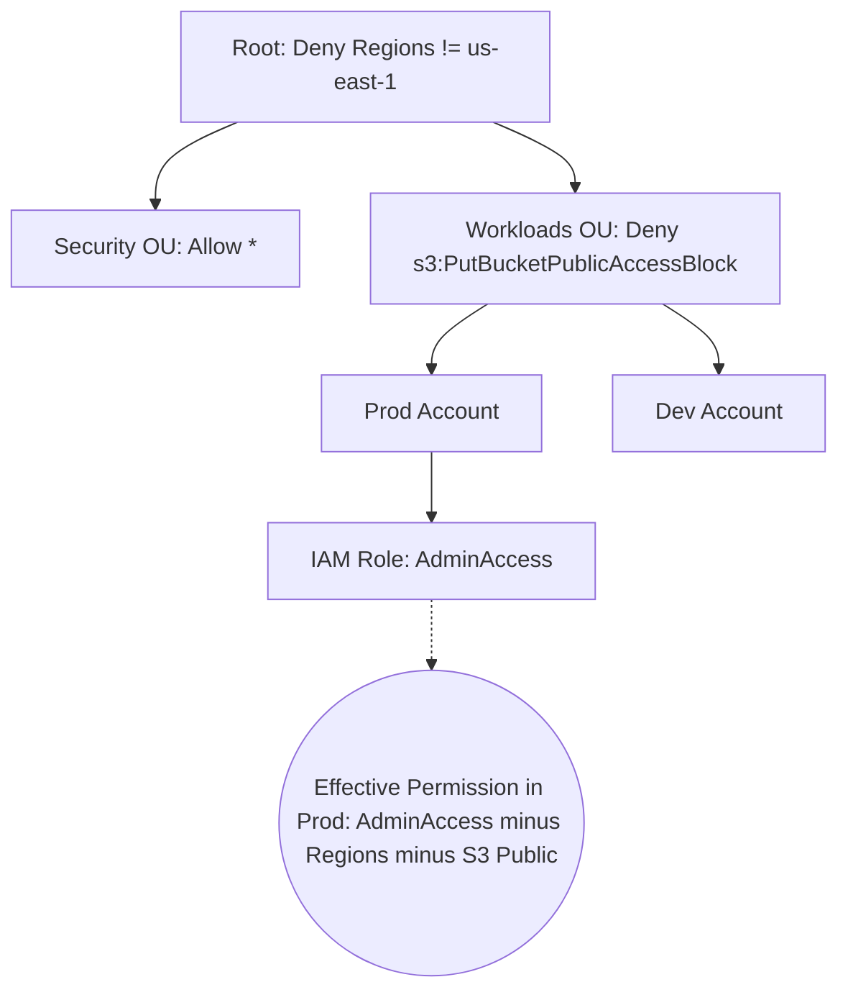
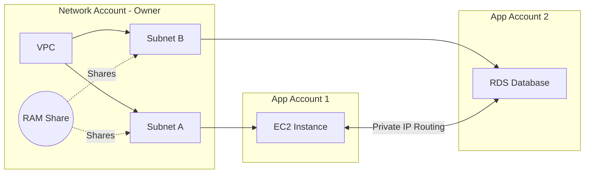

# SAP Section 3: Identity & Federation

---

## IAM Deep Dive & Policy Evaluation

### 📖 Technical Specifications & AWS Core Concepts
IAM entities consist of Users (long-term credentials), Groups (collections of users, no nested groups), and Roles (temporary credentials via STS, optimal for cross-account and service access).
Policy Types: Identity Policies (attached to principals), Resource Policies (attached to S3, KMS, etc.), Permission Boundaries (set max permissions for a user/role), SCPs (max permissions for org/account/OU), and Session Policies (passed during AssumeRole).
Policy Evaluation Logic: An Explicit Deny in any policy always wins. The evaluation checks SCPs, Resource Policies, Permission Boundaries, Session Policies, and Identity Policies. All applicable layers must allow, or the action defaults to an Implicit Deny.
Attribute-Based Access Control (ABAC) uses `aws:PrincipalTag` and `aws:ResourceTag` to conditionally grant access at scale.

### 🗺️ Visual Architecture: IAM Policy Evaluation Flow


### 🧠 Architectural Probing & Decision Scenarios
* **Scenario:** You need to allow developers to create IAM roles but prevent them from escalating their own privileges.
  * **Design:** Enforce a Permission Boundary. Because it caps the maximum permissions of the created role, preventing unauthorized access regardless of the attached identity policies.
* **Scenario:** You need to grant cross-account S3 access without requiring the caller to assume a new role.
  * **Design:** Use a Resource-based policy on the S3 bucket. Because it allows direct access if both the caller's identity policy and the bucket's resource policy permit it.
* **Scenario:** You want to implement Attribute-Based Access Control (ABAC) for thousands of users across various departments.
  * **Design:** Map IAM session tags to Identity Provider attributes and use `aws:PrincipalTag` conditions. Because it removes the need to create and manage individual policies per team.

### 📐 Application Design Patterns & Trade-offs
* **Role Chaining:** Assuming a role from an assumed role session. Trade-off: Caps session duration to 1 hour max, reducing risk but potentially causing timeouts for long-running batch jobs.
* **Permission Boundaries vs. SCPs:** Boundaries delegate role creation within an account; SCPs enforce org-wide guardrails. Trade-off: Misconfigured boundaries can break CI/CD pipelines when creating new execution roles.

### 🚀 Real-World Production Insights
* **Battle Scare - The Phantom Deny:** A single `Deny` in an obscure managed policy or SCP will break access globally. Many production outages stem from an overly broad SCP updated in the management account without testing.
* **Limits:** IAM policies have hard size limits (Managed: 6,144 characters, Inline: 2,048/10,240 characters). Broad ABAC or resource policies easily hit this.
* **Throttling:** STS `AssumeRole` API calls can be throttled if invoked per-execution in tight loops (e.g., inside Lambda). Always cache temporary credentials globally.

### 💻 Hands-on CLI Commands
```bash
# Attach a permission boundary to an IAM role
aws iam put-role-permissions-boundary \
  --role-name DeveloperCreatedRole \
  --permissions-boundary arn:aws:iam::123456789012:policy/DeveloperBoundary

# Simulate principal policy to debug evaluation logic
aws iam simulate-principal-policy \
  --policy-source-arn arn:aws:iam::123456789012:user/alice \
  --action-names s3:GetObject \
  --resource-arns arn:aws:s3:::production-bucket/data.json
```

---

## STS & Identity Federation

### 📖 Technical Specifications & AWS Core Concepts
AWS Security Token Service (STS) issues temporary credentials (valid from 15 minutes to 36 hours). 
`AssumeRole`: Requests credentials for another role, requiring a trust policy on the target role.
`AssumeRoleWithSAML`: Exchanges an IdP SAML assertion for AWS credentials.
`AssumeRoleWithWebIdentity`: Exchanges OIDC/social login tokens for AWS credentials.
Cognito separates concerns: User Pools handle authentication (issuing JWTs), while Identity Pools handle authorization (exchanging tokens for temporary AWS credentials via STS, supporting guest/unauthenticated roles).

### 🗺️ Visual Architecture: Cognito Authentication to AWS Resources


### 🧠 Architectural Probing & Decision Scenarios
* **Scenario:** A third-party vendor needs cross-account access to monitor your AWS environment.
  * **Design:** Use STS AssumeRole with an `ExternalId` in the trust policy. Because it mitigates the Confused Deputy problem by ensuring the vendor proves they are acting on your specific behalf.
* **Scenario:** Your mobile app needs to allow users to read their profile photos from S3 directly.
  * **Design:** Use Cognito Identity Pools. Because it issues temporary AWS credentials mapped to a role that scopes access using the `cognito-identity.amazonaws.com:sub` condition.
* **Scenario:** You suspect an IAM role's temporary credentials are compromised.
  * **Design:** Add an inline policy denying actions where `aws:TokenIssueTime` is before the current time. Because STS tokens cannot be manually revoked or deleted before they expire.

### 📐 Application Design Patterns & Trade-offs
* **Custom Identity Broker:** Building a proxy that calls `GetFederationToken` for legacy systems. Trade-off: Unlocks legacy access but introduces a high-maintenance single point of failure.
* **Cognito Identity Pools vs. API Gateway Authorizers:** If clients call AWS APIs directly (like S3/DynamoDB), use Identity Pools. If they call a custom API Gateway, validate User Pool JWTs directly. Trade-off: Identity Pools incur STS limits, while JWT authorizers reduce credential exchange latency.

### 🚀 Real-World Production Insights
* **Battle Scare - AssumeRole Throttling Storm:** A microservice container fleet rebooted simultaneously and every container blindly called STS `AssumeRole` on startup, throttling the STS API and causing cascading failures.
* **Limits:** Chained role sessions are strictly capped at 1 hour. Attempting a 12-hour session via role chaining fails silently or throws cryptic expiration errors.
* **SAML Outage:** If your on-prem IdP goes down or the VPN drops, nobody can log into the AWS console. Always maintain a break-glass IAM root/admin user with MFA stored in a physical safe.

### 💻 Hands-on CLI Commands
```bash
# Assume a cross-account role with an External ID
aws sts assume-role \
  --role-arn arn:aws:iam::123456789012:role/CrossAccountAdmin \
  --role-session-name AuditSession \
  --external-id "VendorProvidedSecret123" \
  --duration-seconds 3600

# Get session token with MFA for sensitive administrative actions
aws sts get-session-token \
  --serial-number arn:aws:iam::123456789012:mfa/alice \
  --token-code 123456
```

---

## AWS Directory Services & Identity Center

### 📖 Technical Specifications & AWS Core Concepts
AWS Managed Microsoft AD: Provides full AD in AWS, supporting trusts with on-prem AD, RDS SQL Server auth, and MFA.
AD Connector: A directory gateway that proxies requests directly to an on-prem AD without caching.
Simple AD: A Samba-based LDAP for basic, small-scale use cases (< 5,000 users) lacking trust capabilities.
AWS IAM Identity Center (formerly SSO): Provides centralized multi-account login. Uses Permission Sets (templates that deploy as IAM roles in target accounts) and supports SCIM for automated identity provisioning from Okta, Azure AD, etc.

### 🗺️ Visual Architecture: Identity Center Multi-Account Federation


### 🧠 Architectural Probing & Decision Scenarios
* **Scenario:** You need to provide SSO access for 5,000 employees using Okta and automatically remove access when they leave.
  * **Design:** Deploy IAM Identity Center connected to Okta via SAML and enable SCIM provisioning. Because SCIM syncs identity lifecycle events in real-time, eliminating manual offboarding.
* **Scenario:** You are migrating legacy .NET apps that require full SQL Server Windows Authentication but want to keep on-prem AD authoritative.
  * **Design:** Deploy AWS Managed Microsoft AD and establish a two-way forest trust with the on-prem AD. Because AD Connector does not support RDS SQL Server AD auth.
* **Scenario:** Corporate policy forbids user data from being stored in the cloud, but AWS console access must use AD credentials.
  * **Design:** Deploy AD Connector. Because it acts purely as a pass-through proxy to the on-prem AD.

### 📐 Application Design Patterns & Trade-offs
* **ABAC in Identity Center:** Using Identity Center attributes passed as session tags. Trade-off: Reduces the number of Permission Sets required, but relies entirely on the source IdP maintaining clean, consistent user attribute data.
* **Managed AD vs. AD Connector:** Managed AD provides local resilience if the Direct Connect drops. Trade-off: AD Connector avoids cloud data storage but causes total authentication failure during network partitions.

### 🚀 Real-World Production Insights
* **Battle Scare - The SCIM Sync Failure:** An Okta SCIM token expired silently, meaning deactivated employees retained AWS access because deprovisioning signals never reached Identity Center. Always alarm on SCIM sync failures.
* **Limits:** IAM Identity Center enforces quotas on the number of Permission Sets per account. Over-allocating granular Permission Sets instead of using ABAC leads to organizational deployment limits.
* **Latency:** Authenticating via AD Connector across a heavily saturated VPN/Direct Connect link directly impacts console login speeds and causes SDK timeouts.

### 💻 Hands-on CLI Commands
```bash
# Login using IAM Identity Center (SSO)
aws sso login --profile my-dev-profile

# Configure SSO for CLI manually
aws configure sso \
  --sso-session my-session \
  --sso-start-url "https://my-company.awsapps.com/start" \
  --sso-region us-east-1
```

---

## AWS Organizations, SCPs, & Control Tower

### 📖 Technical Specifications & AWS Core Concepts
AWS Organizations: Consolidates billing (sharing RI/Savings Plans) and structures accounts into hierarchical Organizational Units (OUs). The Management Account is fundamentally exempt from SCPs.
Service Control Policies (SCPs): Guardrails defining the maximum possible permissions for member accounts (including the root user). They do not grant permissions.
AWS Control Tower: An automated landing zone and account vending machine. It enforces governance via Preventive Guardrails (SCPs) and Detective Guardrails (AWS Config rules).

### 🗺️ Visual Architecture: SCP Inheritance & Evaluation


### 🧠 Architectural Probing & Decision Scenarios
* **Scenario:** You need to ensure developers cannot disable CloudTrail or AWS Config, even if they possess AdministratorAccess.
  * **Design:** Apply an SCP at the OU level denying `cloudtrail:StopLogging` and `config:StopConfigurationRecorder`. Because SCPs cap maximum permissions and overrule identity policies.
* **Scenario:** You need to automate the provisioning of dozens of new AWS accounts with baseline security rules, VPCs, and centralized logging.
  * **Design:** Implement AWS Control Tower with Account Factory. Because it orchestrates Organizations, SSO, Config, and CloudTrail automatically into a secure Landing Zone.
* **Scenario:** You must restrict the Management Account from deploying EC2 instances.
  * **Design:** Do not use SCPs; rely on strict IAM policies for users in the Management Account. Because SCPs fundamentally do not apply to the Organizations Management Account.

### 📐 Application Design Patterns & Trade-offs
* **SCP Allowlist vs Denylist:** Allowlisting is more secure (zero trust) but creates heavy operational overhead when new AWS services launch. Denylisting is easier to maintain but risks exposing unapproved features.
* **Control Tower vs Custom Landing Zone:** Control Tower provides rapid compliance but imposes strict opinions on architecture. Trade-off: Heavily customized organizational structures might require raw Organizations + Terraform.

### 🚀 Real-World Production Insights
* **Battle Scare - The Root Lockout:** Applying a `Deny *` SCP to an OU immediately breaks all running workloads in those accounts if not tested properly. Always test SCPs in a Sandbox OU and monitor CloudTrail for `AccessDenied` events before wide enforcement.
* **Limits:** SCPs have a strict size limit of 5,120 bytes. Complex condition keys or exhaustive allowlists hit this limit rapidly, requiring policies to be broken up across the OU structure.

### 💻 Hands-on CLI Commands
```bash
# Attach an SCP to an Organizational Unit
aws organizations attach-policy \
  --policy-id p-12345678 \
  --target-id ou-abcd-12345678

# Create a new member account via Organizations
aws organizations create-account \
  --email dev-team@company.com \
  --account-name "Dev-App-A" \
  --iam-user-access-to-billing ALLOW
```

---

## Cross-Account Resource Sharing (RAM) & Access Analyzer

### 📖 Technical Specifications & AWS Core Concepts
Resource Access Manager (RAM): Shares resources (VPC Subnets, Transit Gateways, Route 53 Resolvers, License Manager) directly across accounts. Shared subnets do not require VPC peering. The owner manages the resource, while participants use it. Intra-org shares can auto-accept.
IAM Access Analyzer: Employs automated mathematical reasoning to detect external or public access to resources like S3, KMS, and IAM Roles. It also generates least-privilege policies by analyzing CloudTrail activity.

### 🗺️ Visual Architecture: RAM Shared Subnet Model


### 🧠 Architectural Probing & Decision Scenarios
* **Scenario:** Multiple app teams in separate accounts need to deploy EC2 instances into a central network architecture without setting up VPC peering.
  * **Design:** Use RAM to share the VPC subnets from a central Network Account. Because resources in shared subnets communicate via private IPs natively as if in the same account.
* **Scenario:** You need to audit hundreds of S3 buckets and IAM roles to mathematically prove that no public or external AWS account has access.
  * **Design:** Enable IAM Access Analyzer. Because it uses formal reasoning to analyze resource policies and generate findings for any trust boundary violations.
* **Scenario:** A developer needs to create a least-privilege policy for a Lambda function but doesn't know exactly which API calls it makes.
  * **Design:** Run the function with broad permissions, then use Access Analyzer Policy Generation. Because it parses CloudTrail logs to output a policy matching exact usage.

### 📐 Application Design Patterns & Trade-offs
* **Shared VPCs via RAM vs Transit Gateway:** Shared VPCs are excellent for tight coupling and reducing network overhead. Trade-off: Limits participant autonomy over routing and NACLs. Transit Gateway offers better isolation but incurs data transfer costs.
* **Auto-Accepting RAM Shares:** Enabling `EnableSharingWithAwsOrganization` reduces management overhead. Trade-off: Member accounts instantly inherit shared resources, which might conflict with local compliance rules if not monitored.

### 🚀 Real-World Production Insights
* **Battle Scare - RAM Subnet Exhaustion:** In a shared VPC, one application auto-scaled massively and exhausted all available IPs in the shared subnet, causing critical deployments in completely different accounts to fail. Always implement IP monitoring and cross-account quotas.
* **Access Analyzer Alert Fatigue:** Ignoring Access Analyzer findings leads to data breaches. Archive "known good" public buckets so you only receive alerts on true anomalies via EventBridge.

### 💻 Hands-on CLI Commands
```bash
# Share a subnet via RAM with an Organization Unit
aws ram create-resource-share \
  --name "Central-Prod-Subnets" \
  --resource-arns arn:aws:ec2:us-east-1:123456789012:subnet/subnet-0abcd1234 \
  --principals arn:aws:organizations::123456789012:ou/o-abcd/ou-efgh-1234

# Generate a least-privilege IAM policy using Access Analyzer
aws accessanalyzer start-policy-generation \
  --policy-generation-details "{
      \"principalArn\": \"arn:aws:iam::123456789012:role/DevRole\"
    }" \
  --cloud-trail-details "{
      \"accessRole\": \"arn:aws:iam::123456789012:role/AnalyzerRole\",
      \"startTime\": \"2023-01-01T00:00:00Z\",
      \"endTime\": \"2023-01-30T00:00:00Z\",
      \"trails\": [{\"cloudTrailArn\": \"arn:aws:cloudtrail:us-east-1:123456789012:trail/MyTrail\"}]
    }"
```
