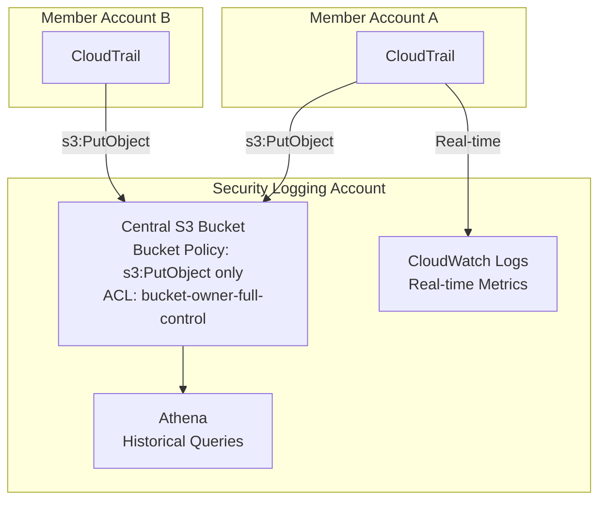
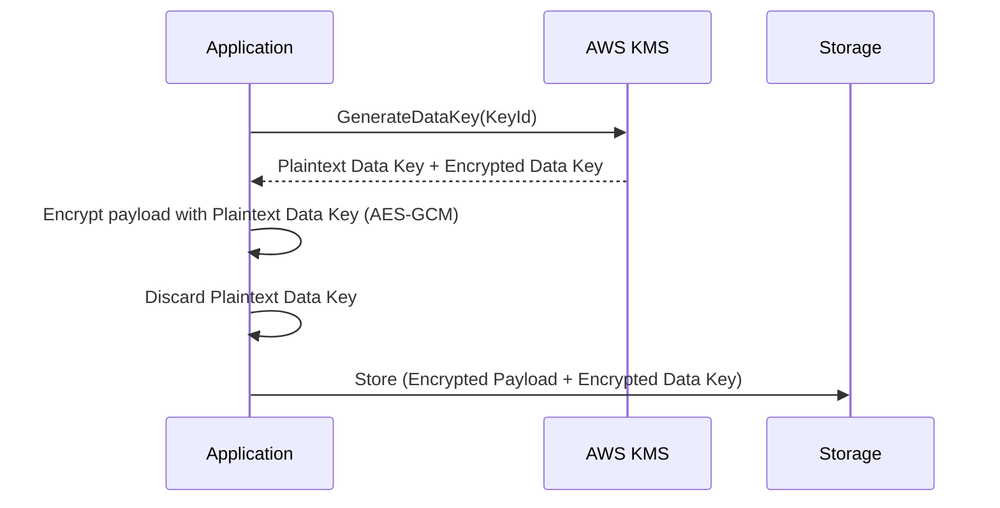
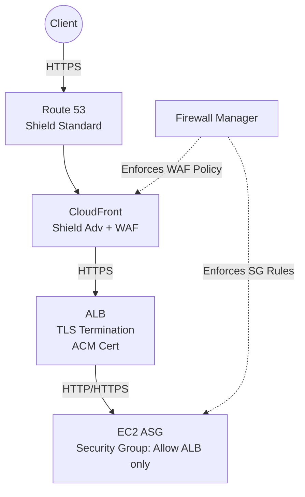
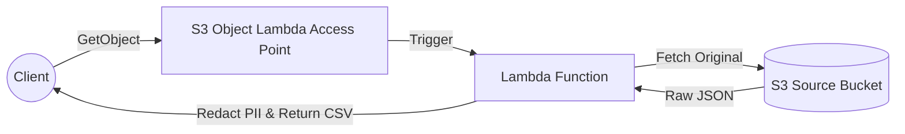
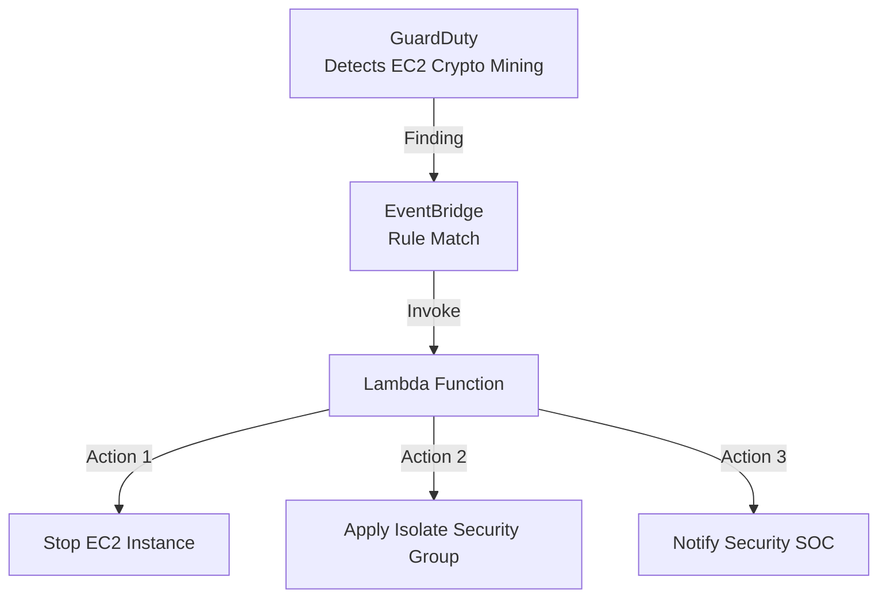
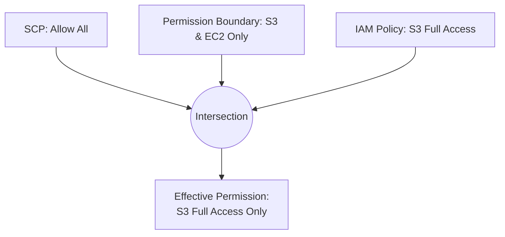

# AWS SAP-C02 — Section 4: Security (4-Layer Template)

## 1. Audit & Logging (AWS CloudTrail)

### 📖 Technical Specifications & AWS Core Concepts
AWS CloudTrail provides governance, compliance, and operational/risk auditing of your AWS account. It logs API calls made via Console, CLI, SDK, and other services.
* **Management Events:** Control plane operations (e.g., CreateBucket, AttachRolePolicy). Default and free for the first copy.
* **Data Events:** Data plane operations (e.g., S3 GetObject, DynamoDB PutItem). High volume, paid per event.
* **Insights Events:** ML-driven anomaly detection on API call volumes.
* **Organization Trails:** Centralized logging created in the management account, pushed to all member accounts automatically, preventing local tampering.
* **Log File Integrity Validation:** Cryptographic hashing (SHA-256) and digital signatures applied to log files to prove non-repudiation and detect tampering.

### 🗺️ Visual Architecture: Multi-Account Centralized Auditing


### 🧠 Architectural Probing & Decision Scenarios
* **Scenario:** You need to prevent member accounts from modifying or deleting CloudTrail logs.
  * **Design:** Deploy Organization Trails from the management account to a central S3 bucket with S3 Object Lock. Because member accounts cannot modify Organization Trails and Object Lock prevents object deletion even by root.
* **Scenario:** You must investigate all API calls made over the past year across 50 accounts.
  * **Design:** Query the central S3 bucket using Amazon Athena. Because the CloudTrail console only retains 90 days of Event History.
* **Scenario:** Automatically detect and revert unauthorized Security Group changes.
  * **Design:** Deploy EventBridge rules listening for `AuthorizeSecurityGroupIngress` via CloudTrail, triggering a Lambda function to revert. Because EventBridge natively integrates with CloudTrail management events for near real-time remediation.

### 📐 Application Design Patterns & Trade-offs
* **Centralized vs. Decentralized Logging:** Centralized logging into a dedicated Security account is an AWS best practice. Trade-off: Cross-account bucket policies require precise IAM configuration (specifically `bucket-owner-full-control` ACLs) to ensure the Security account owns the objects written by member accounts.
* **CloudWatch Logs vs. S3:** S3 is used for cheap, long-term immutable retention (using Glacier lifecycle rules and Athena for querying). CloudWatch Logs is used for real-time Metric Filters and Alarms. Most architectures require both.

### 🚀 Real-World Production Insights
* **Battle Scare - S3 Cost Explosions:** Enabling Data Events (e.g., S3 GetObject) on a busy bucket without filtering can lead to thousands of dollars in CloudTrail costs overnight. Always filter Data Events to specific critical prefixes.
* **Throttling:** CloudTrail delivers logs to S3 every 5 minutes. It is NOT real-time. For sub-second security alerting, use EventBridge directly.
* **Orphaned Logs:** When an account leaves an AWS Organization, its CloudTrail might stop logging to the central bucket if not explicitly reconfigured.

### 💻 Hands-on CLI Commands
```bash
# Create a secure, multi-region trail with integrity validation
aws cloudtrail create-trail \
  --name "OrgSecureTrail" \
  --s3-bucket-name "security-central-logs" \
  --is-multi-region-trail \
  --enable-log-file-validation

# Query CloudTrail via Athena (Pre-requisite: Athena table created)
aws athena start-query-execution \
  --query-string "SELECT eventTime, eventName, sourceIPAddress FROM cloudtrail_logs WHERE userIdentity.type = 'Root' LIMIT 10;" \
  --result-configuration OutputLocation=s3://athena-query-results/
```

## 2. Cryptography & Secrets Management

### 📖 Technical Specifications & AWS Core Concepts
* **AWS KMS:** Regional service for managing symmetric and asymmetric keys. Limits encryption to 4KB directly; uses Envelope Encryption for larger data. Supports AWS Managed and Customer Managed Keys (CMKs).
* **Envelope Encryption:** KMS generates a Data Key (both plaintext and encrypted versions). Application encrypts data locally with plaintext key, discards plaintext key, and stores encrypted data alongside encrypted Data Key.
* **KMS Grants:** Temporary, programmatic delegation of permissions without modifying the Key Policy. Heavily used by AWS services (e.g., EBS, RDS).
* **AWS CloudHSM:** FIPS 140-2 Level 3 compliant, single-tenant, customer-managed hardware security module.
* **Secrets Manager vs. Parameter Store:** Secrets Manager natively integrates with RDS for automatic password rotation via Lambda. Parameter Store provides hierarchical config storage (Standard tier is free, Advanced supports TTL).

### 🗺️ Visual Architecture: Envelope Encryption Flow


### 🧠 Architectural Probing & Decision Scenarios
* **Scenario:** An EC2 role has `kms:Decrypt` in its IAM policy but gets AccessDenied when accessing an encrypted EBS volume.
  * **Design:** Update the KMS Key Policy to explicitly allow the EC2 role. Because KMS requires BOTH the IAM policy and the Key Policy to allow the action.
* **Scenario:** A global app encrypts PII in `us-east-1` and reads it in `eu-west-1` for GDPR reporting, needing low latency.
  * **Design:** Deploy KMS Multi-Region Keys. Because they share the same key ID and material, eliminating cross-region API calls for decryption.
* **Scenario:** You must natively auto-rotate DocumentDB passwords every 30 days without downtime.
  * **Design:** Deploy AWS Secrets Manager. Because it has native rotation Lambda functions utilizing `AWSPENDING` and `AWSCURRENT` version staging to ensure zero-downtime rotation.

### 📐 Application Design Patterns & Trade-offs
* **KMS Multi-Region Keys vs. Regional Keys:** MRKs simplify multi-region data replication (like DynamoDB Global Tables or S3 CRR) but violate strict regional isolation. If a key material is compromised, it affects all regions.
* **Parameter Store vs. Secrets Manager:** Use Parameter Store Standard for thousands of cheap config strings. Use Secrets Manager exclusively for high-value secrets requiring managed rotation.

### 🚀 Real-World Production Insights
* **Battle Scare - KMS Throttling:** Batch processing millions of S3 objects can easily hit the KMS request quota, causing application failures. Always enable S3 Bucket Keys to cache KMS data keys at the S3 layer, reducing KMS calls by 99%.
* **Accidental Key Deletion:** KMS keys have a mandatory waiting period (7-30 days) before deletion to prevent catastrophic data loss.
* **CloudHSM Complexity:** CloudHSM requires maintaining a client agent and managing cluster synchronization. Avoid unless specifically mandated by FIPS 140-2 Level 3 compliance.

### 💻 Hands-on CLI Commands
```bash
# Generate a data key for envelope encryption
aws kms generate-data-key \
  --key-id alias/my-app-key \
  --key-spec AES_256

# Create a cross-account KMS Grant for decryption
aws kms create-grant \
  --key-id alias/my-app-key \
  --grantee-principal arn:aws:iam::111122223333:role/CrossAccountRole \
  --operations Decrypt

# Retrieve a SecureString from Parameter Store
aws ssm get-parameter \
  --name "/prod/db/endpoint" \
  --with-decryption
```

## 3. Edge Security & Threat Mitigation

### 📖 Technical Specifications & AWS Core Concepts
* **AWS WAF:** Layer 7 firewall that inspects HTTP/HTTPS (headers, body, IP, query strings). Supports Rate-Based rules and Managed Rule Groups (e.g., OWASP Top 10, Bot Control). Deploys to ALB, API Gateway, AppSync, and CloudFront.
* **AWS Shield Standard:** Free, automatic Layer 3/4 DDoS mitigation (SYN/UDP floods).
* **AWS Shield Advanced:** Paid ($3k/mo) protection with 24/7 DDoS Response Team (DRT), Layer 7 mitigation, and cost protection for scaling events triggered by DDoS.
* **AWS Firewall Manager:** Centralized management of WAF, Shield, Security Groups, and Network Firewall across an AWS Organization.
* **AWS Certificate Manager (ACM):** Free public TLS/SSL certificates with automatic DNS-validated renewal. Private CA supports mTLS and internal PKI.

### 🗺️ Visual Architecture: End-to-End Edge Security


### 🧠 Architectural Probing & Decision Scenarios
* **Scenario:** You need to block SQL injection attempts and throttle IPs exceeding 1,000 requests/5-mins across 50 AWS accounts.
  * **Design:** Deploy AWS Firewall Manager with WAF Rate-Based rules and SQLi Managed Rules. Because Firewall Manager auto-applies policies to all current and future accounts in the Organization.
* **Scenario:** A legacy backend application requires end-to-end encryption and client certificate inspection (mTLS).
  * **Design:** Deploy a Network Load Balancer (NLB) with TLS Pass-Through. Because ALB terminates TLS and consumes the client certificate, whereas NLB at Layer 4 passes the raw TLS connection directly to the backend.
* **Scenario:** You need to serve HTTPS on CloudFront for `example.com`.
  * **Design:** Provision an ACM Certificate in `us-east-1`. Because CloudFront requires certificates to reside in the N. Virginia region globally.

### 📐 Application Design Patterns & Trade-offs
* **TLS Termination (ALB) vs. End-to-End (ALB + Re-encrypt) vs. Pass-Through (NLB):** ALB termination is easiest and offloads CPU from backend. Re-encryption satisfies internal compliance but uses two TLS sessions. Pass-through (NLB) is required for backend mTLS but removes Layer 7 routing capabilities.
* **WAF Scope:** CloudFront WAF rules apply globally at the edge (saving origin bandwidth), but ALB WAF rules are regional.

### 🚀 Real-World Production Insights
* **Battle Scare - WAF Body Inspection Limits:** AWS WAF only inspects the first 8KB of an HTTP body. Attackers pad malicious payloads with 8KB of garbage to bypass WAF rules. Always configure WAF rules to block requests if the body exceeds the inspection limit, if applicable.
* **Shield Cost Protection:** If you don't have Shield Advanced and experience a Layer 7 HTTP flood, auto-scaling will spin up hundreds of EC2 instances to handle the load, leaving you with a massive bill. Shield Advanced refunds these scaling costs.
* **CloudFront IP Masking:** Origin EC2 instances see the CloudFront Edge IP, not the client IP. Using NACLs to block bad actors at the VPC level will break all CloudFront traffic. Block IPs at the WAF level instead.

### 💻 Hands-on CLI Commands
```bash
# Create a WAF Rate-Based Rule
aws wafv2 create-rule-group \
  --name "RateLimitRule" \
  --scope CLOUDFRONT \
  --capacity 50 \
  --rules '[{"Name":"Throttle","Priority":0,"Statement":{"RateBasedStatement":{"Limit":1000,"AggregateKeyType":"IP"}},"Action":{"Block":{}},"VisibilityConfig":{"SampledRequestsEnabled":true,"CloudWatchMetricsEnabled":true,"MetricName":"Throttle"}}]' \
  --visibility-config SampledRequestsEnabled=true,CloudWatchMetricsEnabled=true,MetricName=RateLimitRule

# Request an ACM cert with DNS validation
aws acm request-certificate \
  --domain-name "*.example.com" \
  --validation-method DNS \
  --region us-east-1
```

## 4. Amazon S3 Security & Access Control

### 📖 Technical Specifications & AWS Core Concepts
* **Block Public Access:** Account or bucket-level override that strictly blocks public access, regardless of bucket policies or ACLs.
* **Bucket Policies vs. ACLs:** JSON resource policies evaluate IAM conditions (e.g., `aws:SecureTransport` for HTTPS). ACLs are legacy and should be disabled via "Bucket Owner Enforced".
* **S3 Object Lock:** WORM (Write Once, Read Many) compliance. Compliance mode prevents deletion even by the root user.
* **S3 Access Points:** Dedicated hostnames with distinct policies to overcome the 20KB bucket policy size limit. Can be restricted to specific VPCs.
* **S3 Object Lambda:** Modifies S3 objects dynamically upon `GetObject` requests (e.g., PII redaction, format conversion) via Lambda.

### 🗺️ Visual Architecture: Dynamic Data Transformation


### 🧠 Architectural Probing & Decision Scenarios
* **Scenario:** SEC regulations require storing financial records for 7 years where no one, not even the AWS root account, can modify or delete them.
  * **Design:** Deploy S3 Object Lock in Compliance Mode. Because Governance Mode allows bypasses with specific IAM permissions, while Compliance mode is immutable.
* **Scenario:** A data science team and a marketing team share one S3 bucket. Marketing needs VPC-only access, Data Science needs internet access. The bucket policy is hitting the 20KB limit.
  * **Design:** Deploy S3 Access Points. Create one VPC-restricted access point for Marketing and one internet-facing access point for Data Science. Because Access Points decouple complex routing and policies from the core bucket.
* **Scenario:** You need to serve PII-redacted user data to external partners without duplicating storage.
  * **Design:** Deploy S3 Object Lambda. Because it intercepts the `GetObject` call and transforms the payload on the fly.

### 📐 Application Design Patterns & Trade-offs
* **MFA Delete vs Object Lock:** MFA Delete (requires root account to enable) protects against accidental deletion but doesn't guarantee retention timelines. Object Lock enforces strict legal holds and retention periods.
* **S3 Multi-Region Access Points (MRAP):** Provides a single global endpoint routing to the lowest-latency bucket. Trade-off: Requires configuring bidirectional S3 replication separately; MRAP itself only handles the routing.

### 🚀 Real-World Production Insights
* **Battle Scare - Cross-Account Uploads:** If Account A uploads an object to Account B's bucket without the `bucket-owner-full-control` ACL, Account B cannot read the object despite owning the bucket. Always use "Object Ownership = Bucket Owner Enforced" to eliminate this ACL nightmare.
* **Object Lambda Latency:** Object Lambda introduces synchronous invocation latency. For large files or high-throughput GETs, pre-processing and storing multiple copies is often cheaper and faster than on-the-fly Lambda execution.

### 💻 Hands-on CLI Commands
```bash
# Restrict an S3 Access Point to a specific VPC
aws s3control create-access-point \
  --account-id 111122223333 \
  --name hr-secure-ap \
  --bucket corp-data \
  --vpc-configuration VpcId=vpc-0abcd1234ef

# Put an S3 Object Legal Hold
aws s3api put-object-legal-hold \
  --bucket my-compliance-bucket \
  --key financial_report.pdf \
  --legal-hold Status=ON
```

## 5. Threat Detection, Posture & Vulnerability

### 📖 Technical Specifications & AWS Core Concepts
* **Amazon GuardDuty:** Agentless, ML-powered threat detection. Analyzes VPC Flow Logs, CloudTrail, DNS Logs, and EKS audit logs for behavioral anomalies (e.g., crypto-mining, C&C communication).
* **Amazon Inspector:** Automated vulnerability management (CVE scanning) for EC2, ECR, and Lambda. Evaluates network reachability to calculate risk scores.
* **AWS Security Hub:** Aggregates findings from GuardDuty, Inspector, Macie, and IAM Access Analyzer. Maps findings against frameworks like CIS and PCI DSS for a unified compliance score.
* **Amazon Detective:** Graph-based root cause analysis tool to visualize timelines and blast radiuses of GuardDuty findings.
* **AWS Config:** Records configuration changes and evaluates them against managed/custom rules (e.g., `encrypted-volumes`). Triggers SSM Automation for auto-remediation.

### 🗺️ Visual Architecture: Automated Threat Remediation


### 🧠 Architectural Probing & Decision Scenarios
* **Scenario:** You need to automatically patch EC2 instances when a critical CVE is detected.
  * **Design:** Deploy Amazon Inspector to generate EventBridge events on CVE detection, triggering SSM Patch Manager. Because Inspector provides continuous scanning and native EventBridge integration for automated remediation.
* **Scenario:** GuardDuty flags an EC2 instance communicating with a known malicious IP. You need to understand what IAM role the instance assumed and what APIs it called before the event.
  * **Design:** Use Amazon Detective. Because Detective automatically correlates VPC Flow Logs, CloudTrail, and GuardDuty findings into an interactive behavior graph.
* **Scenario:** Enforce CIS Foundations Benchmark across 200 accounts.
  * **Design:** Deploy an AWS Config Conformance Pack via AWS Organizations. Because it provisions dozens of compliance rules simultaneously across all member accounts.

### 📐 Application Design Patterns & Trade-offs
* **GuardDuty vs. Inspector:** GuardDuty detects *active threats* (reactive, behavioral). Inspector detects *software vulnerabilities* (proactive, state-based). Both are strictly necessary.
* **Config Auto-Remediation vs. Manual Review:** Auto-remediation (e.g., terminating non-compliant EC2 instances) can break production if rules are too aggressive. Best practice: Use monitor mode first, analyze logs, then enable auto-remediation.

### 🚀 Real-World Production Insights
* **Battle Scare - Config Cost Spikes:** AWS Config charges per configuration item recorded. If you have auto-scaling groups rapidly spinning instances up and down, Config costs will explode. Exclude highly ephemeral resources from Config tracking.
* **GuardDuty Publishing Delay:** GuardDuty findings are sent to EventBridge. By default, CloudWatch Event publishing is delayed. For automated remediation, configure the GuardDuty publishing frequency to 15 minutes (the minimum).

### 💻 Hands-on CLI Commands
```bash
# Enable AWS Config rule for restricted SSH
aws configservice put-config-rule \
  --config-rule '{
    "ConfigRuleName": "restricted-ssh",
    "Source": {
      "Owner": "AWS",
      "SourceIdentifier": "INCOMING_SSH_DISABLED"
    }
  }'

# Create a GuardDuty IPSet for trusted IPs
aws guardduty create-ip-set \
  --detector-id 12abc34d567e8fa \
  --name "CorporateVPN" \
  --format TXT \
  --location s3://my-threat-intel/vpn-ips.txt \
  --activate
```

## 6. IAM Advanced Policies & Identity Governance

### 📖 Technical Specifications & AWS Core Concepts
* **Condition Keys:** Fine-grained IAM controls (`aws:SourceIp`, `aws:MultiFactorAuthPresent`, `s3:prefix`).
* **NotAction:** Evaluates to "deny everything EXCEPT the listed actions." Highly effective in Service Control Policies (SCPs).
* **PassRole (`iam:PassRole`):** The permission required to attach an IAM role to a service (e.g., EC2, Lambda). Critical for preventing privilege escalation.
* **Permission Boundaries:** An IAM policy that sets the *maximum* permissions a user/role can have. Used for delegated administration.
* **EC2 Instance Connect:** Ephemeral, keyless SSH access. Injects a temporary public key into the EC2 metadata valid for 60 seconds.

### 🗺️ Visual Architecture: Effective Permissions Evaluation


### 🧠 Architectural Probing & Decision Scenarios
* **Scenario:** You want developers to create new IAM roles for Lambda functions, but you must prevent them from creating an administrator role and assuming it.
  * **Design:** Grant developers `iam:CreateRole` but enforce a `PermissionsBoundary` condition. Because this ensures any role the developer creates is permanently capped by the boundary, preventing privilege escalation.
* **Scenario:** You need to enforce MFA enrollment across the organization without blocking the ability to set up MFA.
  * **Design:** Create an SCP with a `Deny` effect, using `NotAction` for IAM MFA creation APIs, and a condition `aws:MultiFactorAuthPresent: false`. Because `NotAction` cleanly isolates the required setup APIs while denying everything else.
* **Scenario:** You must eliminate persistent SSH key management while maintaining strict audit trails of all EC2 shell access.
  * **Design:** Deploy EC2 Instance Connect. Because it uses IAM authorization to push a 60-second SSH key, requiring no long-lived keys, and logs every access event to CloudTrail.

### 📐 Application Design Patterns & Trade-offs
* **EC2 Instance Connect vs. Systems Manager (SSM) Session Manager:** Both eliminate SSH keys. EC2 Instance Connect uses standard port 22 and SSH clients. Session Manager uses the SSM Agent, requires no inbound open ports, and logs actual terminal keystrokes to S3. Session Manager is generally preferred for strict compliance.

### 🚀 Real-World Production Insights
* **Battle Scare - PassRole Escalation:** A developer with `iam:PassRole` for `*` and `ec2:RunInstances` can create an EC2 instance, attach an Admin role to it, log into the instance, and effectively become an Administrator. Always restrict `iam:PassRole` resources to explicitly approved arns.
* **Cross-Account Trust Limits:** When setting up cross-account roles, remember that the trusting account (Resource) must have a Role Trust Policy allowing the trusted account, AND the trusted account (Identity) must have an IAM policy granting `sts:AssumeRole`.

### 💻 Hands-on CLI Commands
```bash
# Push a temporary SSH key via EC2 Instance Connect (valid for 60s)
aws ec2-instance-connect send-ssh-public-key \
  --instance-id i-0123456789abcdef0 \
  --availability-zone us-east-1a \
  --instance-os-user ec2-user \
  --ssh-public-key file://~/.ssh/id_rsa.pub

# Test IAM policy execution against a specific action
aws iam simulate-principal-policy \
  --policy-source-arn arn:aws:iam::111122223333:role/DevRole \
  --action-names s3:PutObject \
  --resource-arns arn:aws:s3:::production-bucket/data
```
