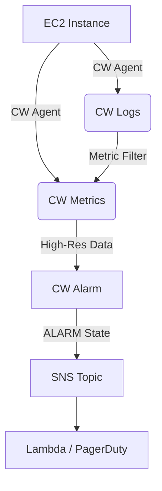
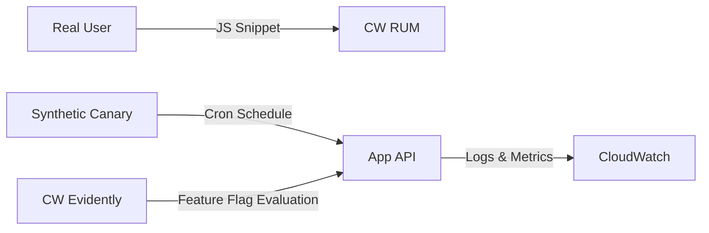
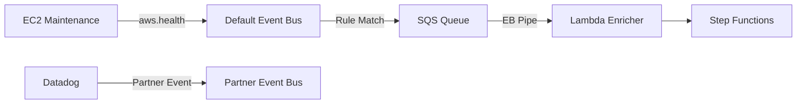
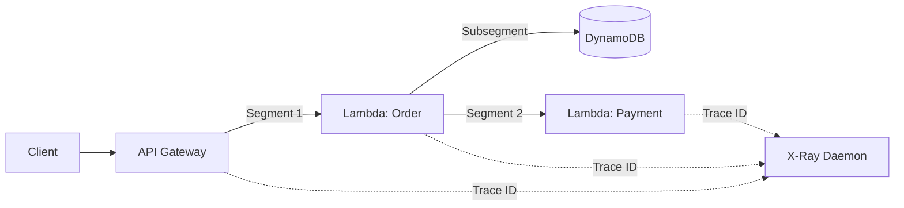
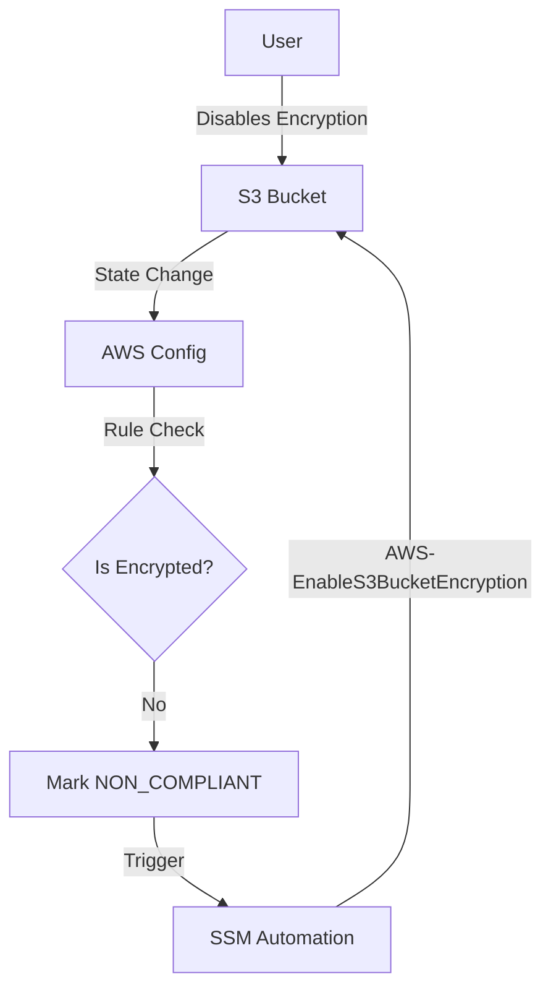
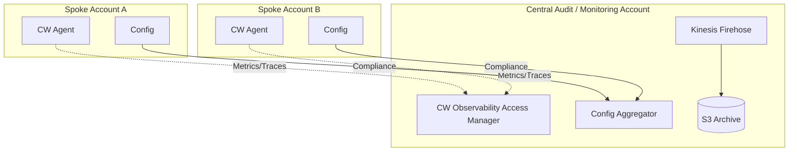

# SAP Section 11: Monitoring & Observability

## CloudWatch Core: Metrics, Logs & Alarms
### 📖 Technical Specifications & AWS Core Concepts
CloudWatch is the central nervous system of AWS observability, covering metrics, logs, and alarms.
* **Metrics:** Time-series data points grouped by **Namespaces** (e.g., `AWS/EC2`) and identified by **Dimensions** (key-value pairs like `InstanceId=X`).
* **Resolution:** Standard resolution is 1 minute (rolled up over time). High-resolution is 1 second (via `StorageResolution=1`).
* **CloudWatch Unified Agent:** Required to capture OS-level metrics (RAM, swap, disk space) and application logs from EC2/on-premises instances.
* **Logs:** Structured into **Log Groups** (primary unit of management/retention) and **Log Streams** (individual sources). Retention is indefinite by default but configurable from 1 day to 10 years.
* **Alarms:** Three states: `OK`, `ALARM`, `INSUFFICIENT_DATA`. Actions include triggering SNS, EC2 actions, Auto Scaling, or SSM OpsItems.

### 🗺️ Visual Architecture: CloudWatch Telemetry Flow


### 🧠 Architectural Probing & Decision Scenarios
* **Scenario:** You need sub-minute alerting (e.g., 10s or 30s) on API latency.
  * **Design:** Publish custom metrics with `StorageResolution=1` and create a High-Resolution Alarm. Because standard metrics roll up to 60s minimum.
* **Scenario:** You must retain audit logs for 7 years to meet compliance, but need to search recent logs interactively.
  * **Design:** Stream CloudWatch Logs to an S3 archive via Subscription Filters or Firehose. Because keeping logs in CloudWatch for 7 years is extremely expensive compared to S3 Glacier deep storage.
* **Scenario:** You are seeing excessive false positive pages from transient database CPU spikes.
  * **Design:** Deploy Composite Alarms with `AND` logic combining DB CPU and API Error Rate. Because alerting on a single metric often ignores broader system context.

### 📐 Application Design Patterns & Trade-offs
* **Metric Math:** Derive metrics (e.g., error rate = errors / requests) at query time without publishing new custom metrics. Trade-off: Lower cost, but you must create specific alarms on the math expression to proactively monitor the ratio.
* **Log Aggregation via Subscription Filters:** Stream log events to Kinesis, Lambda, or Firehose in near real-time. Trade-off: A hard limit of 2 subscription filters per log group requires careful fan-out architectures (e.g., route to a single Kinesis stream that fans out).

### 🚀 Real-World Production Insights
* **Battle Scares:** Storing high-throughput VPC Flow Logs in CloudWatch Logs indefinitely without a retention policy is a fast track to doubling your AWS bill. Always set explicit retention policies upon log group creation.
* **Alerting Limits:** Alarms transitioning to `INSUFFICIENT_DATA` typically happen when EC2 instances are stopped or an endpoint receives zero traffic. Properly handle `INSUFFICIENT_DATA` in your escalation logic to avoid phantom alerts.

### 💻 Hands-on CLI Commands
```bash
aws cloudwatch put-metric-data \
  --namespace "MyApp/Orders" \
  --metric-name "CheckoutLatency" \
  --value 245 \
  --unit Milliseconds \
  --storage-resolution 1 \
  --dimensions Name=Region,Value=us-east-1
  
aws logs put-subscription-filter \
  --log-group-name "/api/production" \
  --filter-name "ErrorToKinesis" \
  --filter-pattern "ERROR" \
  --destination-arn "arn:aws:kinesis:us-east-1:123456789012:stream/CentralLogStream"
```

## Advanced Observability: Synthetics, RUM & Evidently
### 📖 Technical Specifications & AWS Core Concepts
* **CloudWatch Synthetics:** Runs scheduled canary scripts (Node.js/Puppeteer or Python/Selenium) against your endpoints to proactively monitor APIs and UIs.
* **CloudWatch RUM (Real User Monitoring):** Uses a JavaScript snippet in web applications to capture page load times, web vitals, and JavaScript errors from actual user browsers.
* **CloudWatch Evidently:** Platform for feature flagging and A/B testing (experiments) to safely control blast radius during feature rollouts.
* **Insights Suite:** Specialized ML-driven observability including Container Insights (ECS/EKS), Lambda Insights (cold starts/memory via extension layers), and Contributor Insights (top-N analysis).

### 🗺️ Visual Architecture: User Experience Monitoring


### 🧠 Architectural Probing & Decision Scenarios
* **Scenario:** You need to monitor frontend web vitals and JavaScript errors from actual user environments.
  * **Design:** Implement CloudWatch RUM. Because Synthetics only monitors scripted bots, whereas RUM captures geographic network variations and real browser quirks.
* **Scenario:** You need to track SLA availability and detect API downtime at 3 AM when traffic is zero.
  * **Design:** Deploy CloudWatch Synthetics Canaries running every minute. Because RUM requires real user traffic to detect issues.
* **Scenario:** You want to test a new checkout flow on 5% of users while monitoring the impact on business metrics.
  * **Design:** Use CloudWatch Evidently for A/B testing. Because it directly controls the rollout percentage and integrates with CloudWatch to measure metric variance.

### 📐 Application Design Patterns & Trade-offs
* **Canary Blueprints:** Use pre-built Heartbeat or API Canary blueprints for simple SLA metrics. Trade-off: Complex multi-page login flows often require brittle custom DOM-crawling scripts that require heavy maintenance.
* **Progressive Delivery:** Decouple code deployment from feature release using Evidently. Trade-off: Requires disciplined code cleanup post-release to prevent technical debt and flag bloat.

### 🚀 Real-World Production Insights
* **Battle Scares:** A single Synthetic Canary running every minute costs ~$1.50/month. Deploying hundreds of canaries across multiple regions can surprisingly spike your bill. Tier your application monitoring (1-minute runs for Tier 1 apps, 15-minute runs for Tier 3 apps).
* **Throttling:** RUM can generate massive data volumes on high-traffic sites. Configure data sampling (e.g., capturing 10% of sessions) to manage CloudWatch ingestion costs.

### 💻 Hands-on CLI Commands
```bash
aws synthetics create-canary \
  --name "checkout-flow" \
  --code S3Bucket="my-canaries",S3Key="script.zip",Handler="index.handler" \
  --execution-role-arn "arn:aws:iam::123456789012:role/CanaryRole" \
  --schedule Expression="rate(5 minutes)" \
  --runtime-version "syn-nodejs-puppeteer-3.4"

aws evidently create-feature \
  --project "Storefront" \
  --name "NewCheckoutUI" \
  --variations '[{"name": "control", "value": {"boolValue": false}}, {"name": "treatment", "value": {"boolValue": true}}]' \
  --default-variation "control"
```

## Event-Driven Automation: EventBridge & AWS Health
### 📖 Technical Specifications & AWS Core Concepts
* **EventBridge:** Serverless event router. Uses Default buses (AWS events), Custom buses (your app events), and Partner buses (SaaS integrations).
* **Event Rules:** Match event structures (Event Patterns) or trigger on a cron/rate expression (Schedule). Routes to up to 5 targets.
* **EventBridge Pipes:** Point-to-point integration linking sources (SQS, DynamoDB, Kinesis) to targets with an optional Lambda/API Gateway enrichment step.
* **AWS Health:** Provides Service Health (public AWS outages) and Personal Health (account-specific maintenance). Health events are published natively to the Default EventBridge bus.

### 🗺️ Visual Architecture: Event Routing & Enrichment


### 🧠 Architectural Probing & Decision Scenarios
* **Scenario:** You need to enrich an SQS message with data from a DynamoDB table before processing it with a target service.
  * **Design:** Implement EventBridge Pipes with a Lambda enrichment step. Because Pipes natively handles SQS polling, batching, and point-to-point delivery without requiring custom consumer code.
* **Scenario:** You need to automatically snapshot an EBS volume when an AWS Health hardware degradation event is issued.
  * **Design:** Create an EventBridge Rule matching the `aws.health` source and triggering an SSM Automation document. Because Health events land directly in the default event bus for automated response.
* **Scenario:** You need a one-time scheduled task to fire exactly at 10:00 AM on a specific date.
  * **Design:** Use EventBridge Scheduler. Because standard EventBridge Rules only support recurring cron/rate schedules, whereas Scheduler supports one-time, timezone-aware scheduling.

### 📐 Application Design Patterns & Trade-offs
* **Archive & Replay:** Store events in an EventBridge archive for up to 90 days to replay during incident recovery. Trade-off: Storage costs increase linearly with event volume, and replaying events requires idempotent consumer design to prevent duplicate processing.
* **Schema Discovery:** Automatically infer event structures and generate type-safe code bindings. Trade-off: Generates noisy schema registries if your application lacks strict JSON structural discipline.

### 🚀 Real-World Production Insights
* **Battle Scares:** If an EventBridge target (e.g., SQS) lacks proper resource-based permissions (such as a KMS key policy allowing EventBridge to write), the event is silently dropped unless a Dead-Letter Queue (DLQ) is explicitly configured on the target.
* **Event Pattern Filtering:** A typo in an Event Pattern JSON will result in 0 matched events. Always use the "Test Event Pattern" feature in the console before deploying.

### 💻 Hands-on CLI Commands
```bash
aws events put-rule \
  --name "CatchEC2Termination" \
  --event-pattern "{\"source\":[\"aws.ec2\"],\"detail-type\":[\"EC2 Instance State-change Notification\"],\"detail\":{\"state\":[\"terminated\"]}}"
  
aws events put-targets \
  --rule "CatchEC2Termination" \
  --targets "Id"="1","Arn"="arn:aws:sqs:us-east-1:123456789012:MyQueue"

aws pipes create-pipe \
  --name "SQSToStepFunctions" \
  --source "arn:aws:sqs:us-east-1:123456789012:SourceQueue" \
  --target "arn:aws:states:us-east-1:123456789012:stateMachine:MyTarget" \
  --enrichment "arn:aws:lambda:us-east-1:123456789012:function:Enricher" \
  --role-arn "arn:aws:iam::123456789012:role/PipeRole"
```

## Distributed Tracing: AWS X-Ray
### 📖 Technical Specifications & AWS Core Concepts
* **Distributed Tracing:** X-Ray follows requests across microservices using Trace IDs propagated via HTTP headers.
* **Trace Structure:** A Trace contains Segments (work done by one service) and Subsegments (granular external API/DB calls).
* **Annotations vs Metadata:** Annotations are indexed key-value pairs (searchable by business metrics like `TenantID`). Metadata are non-indexed key-value pairs (used for full payload storage).
* **X-Ray Daemon:** Local UDP listener (port 2000) that batches trace segments asynchronously, decoupling application code from X-Ray API network latency.

### 🗺️ Visual Architecture: Microservice Tracing Flow


### 🧠 Architectural Probing & Decision Scenarios
* **Scenario:** You must search application traces based on custom business values like `OrderID` or `Environment`.
  * **Design:** Attach X-Ray Annotations to the segments. Because Annotations are fully indexed and searchable in the console, whereas Metadata is purely informational.
* **Scenario:** You want to trace ECS Fargate containers without embedding heavy AWS API networking logic inside application code.
  * **Design:** Deploy the X-Ray Daemon as a sidecar container in the task definition. Because X-Ray SDKs offload UDP trace data to the local daemon, avoiding network latency on the critical path.
* **Scenario:** X-Ray tracing is generating a massive AWS bill due to high API throughput.
  * **Design:** Implement Custom Sampling Rules (e.g., 1 request per second and 5% of remainder). Because 100% sampling on high-traffic endpoints is cost-prohibitive and unnecessary for identifying statistical latency trends.

### 📐 Application Design Patterns & Trade-offs
* **Service Map Analysis:** The Service Map visualizes the dependency graph, enabling instant identification of bottleneck components. Trade-off: If traces drop or propagate incorrectly (due to missing HTTP trace headers in custom code), the service map becomes fragmented and shows disconnected islands.

### 🚀 Real-World Production Insights
* **Battle Scares:** Forgetting to grant the `xray:PutTraceSegments` permission to the execution IAM role will result in traces silently failing to appear in the console, without throwing explicit application errors.
* **Port Conflicts:** The X-Ray daemon exclusively binds to UDP port 2000. Running multiple sidecars or native agents attempting to bind to this port on EC2 will crash the daemon.

### 💻 Hands-on CLI Commands
```bash
aws xray create-sampling-rule \
  --cli-input-json '{
      "SamplingRule": {
          "RuleName": "PaymentAPI",
          "ResourceARN": "*",
          "Priority": 10,
          "FixedRate": 0.05,
          "ReservoirSize": 1,
          "ServiceName": "payment-service",
          "ServiceType": "*",
          "Host": "*",
          "HTTPMethod": "POST",
          "URLPath": "/checkout",
          "Version": 1
      }
  }'
```

## Compliance & Governance: AWS Config
### 📖 Technical Specifications & AWS Core Concepts
* **AWS Config:** Continuous configuration tracking and compliance service. Answers "how did this resource change over time?"
* **Rules:** Managed Rules (AWS-provided checks like `encrypted-volumes`) and Custom Rules (Lambda-backed logic).
* **Conformance Packs:** Collections of Config rules and SSM remediation actions bundled into a single deployable template (e.g., PCI DSS, CIS Benchmarks).
* **Remediation:** Automated execution of SSM Automation documents triggered by a Config rule marking a resource as `NON_COMPLIANT`.

### 🗺️ Visual Architecture: Continuous Compliance & Remediation


### 🧠 Architectural Probing & Decision Scenarios
* **Scenario:** You need to guarantee that public S3 buckets cannot be created, immediately and preventatively.
  * **Design:** Apply Organizations Service Control Policies (SCPs). Because AWS Config is detective and reactive (evaluates after the resource is created), whereas SCPs block the API call before creation.
* **Scenario:** You need to enforce a massive regulatory framework (like NIST 800-53) across 100 AWS accounts.
  * **Design:** Deploy an AWS Config Conformance Pack via AWS Organizations. Because Conformance Packs standardize hundreds of rules and remediation actions into a single template across all member accounts.
* **Scenario:** You must identify who changed a Security Group rule 3 days ago, and what the precise change was.
  * **Design:** Query CloudTrail for the "who" (IAM identity) and AWS Config Resource Timeline for the "what" (JSON diff of the state change). Because Config explicitly stores configuration history over time.

### 📐 Application Design Patterns & Trade-offs
* **Automated Remediation:** Instantly fixing drift (e.g., revoking open Security Group ports) via SSM Automation. Trade-off: Overly aggressive automated remediation can sever production traffic or break break-glass procedures if a developer legitimately requires a temporary config override during an incident.

### 🚀 Real-World Production Insights
* **Battle Scares:** Turning on AWS Config with "All resource types" selected in an account with frequent churn (like EMR clusters or ephemeral auto-scaling tasks) will result in a colossal configuration recording bill. Always exclude highly ephemeral resource types.
* **Rule Delay:** Automated remediation is not real-time. It can take minutes between a resource change, the Config evaluation, and the SSM Automation trigger.

### 💻 Hands-on CLI Commands
```bash
aws configservice put-config-rule \
  --config-rule '{
      "ConfigRuleName": "encrypted-volumes",
      "Source": {
          "Owner": "AWS",
          "SourceIdentifier": "ENCRYPTED_VOLUMES"
      }
  }'
  
aws configservice put-remediation-configuration \
  --config-rule-name "encrypted-volumes" \
  --target-type "SSM_DOCUMENT" \
  --target-id "AWS-EnableEBSEncryption" \
  --automatic true
```

## Centralized Multi-Account Observability
### 📖 Technical Specifications & AWS Core Concepts
* **CloudWatch Cross-Account Observability:** Links metric, alarm, and log visibility from multiple source accounts into a single central monitoring account without physically duplicating the data.
* **Config Aggregator:** Collects compliance data from multiple AWS Config recorders across different accounts and regions into a central dashboard.
* **Centralized Logging:** Using CloudWatch Log Subscription Filters to fan out logs to a Kinesis Firehose in a central account, landing in a locked S3 bucket.

### 🗺️ Visual Architecture: Hub & Spoke Observability


### 🧠 Architectural Probing & Decision Scenarios
* **Scenario:** The central operations team needs a single pane of glass to view CloudWatch metrics and alarms from 50 different workload accounts.
  * **Design:** Configure CloudWatch Cross-Account Observability via OAM. Because this allows native CloudWatch dashboards in the monitoring account to seamlessly query linked spoke accounts without complex ETL pipelines.
* **Scenario:** You need to centralize AWS Config compliance states from all member accounts in an AWS Organization.
  * **Design:** Deploy an AWS Config Aggregator in the audit account. Because the Aggregator natively integrates with AWS Organizations to auto-enroll new accounts and centralizes the compliance dashboard natively.
* **Scenario:** You must securely retain all CloudWatch logs organization-wide in a tamper-proof manner.
  * **Design:** Use CloudWatch Log Subscription Filters to stream to a central account's Kinesis Data Firehose, writing to an S3 bucket configured with Object Lock. Because cross-account log streaming centralizes storage while keeping local account log ingestion intact.

### 📐 Application Design Patterns & Trade-offs
* **Hub and Spoke Data Routing:** Centralized governance vs decentralized execution. Trade-off: The central monitoring account can become a throughput bottleneck or an IAM nightmare if cross-account resource policies on Event Buses or Kinesis streams are misconfigured or hit quota limits.

### 🚀 Real-World Production Insights
* **Battle Scares:** When setting up a Config Aggregator across hundreds of accounts and regions, initial compliance data population can take hours to appear. Do not assume the setup failed within the first 10 minutes.
* **Logging IAM Issues:** Setting up cross-account Kinesis log subscriptions requires precisely crafted resource-based policies on the Kinesis Data Stream explicitly allowing `logs.amazonaws.com` from the source account IDs.

### 💻 Hands-on CLI Commands
```bash
aws oam create-sink \
  --name "CentralMonitoringSink"

aws configservice put-configuration-aggregator \
  --configuration-aggregator-name "OrgAggregator" \
  --organization-aggregation-source '{"RoleArn": "arn:aws:iam::123456789012:role/AggRole", "AwsRegions": ["us-east-1", "eu-west-1"]}'
```
