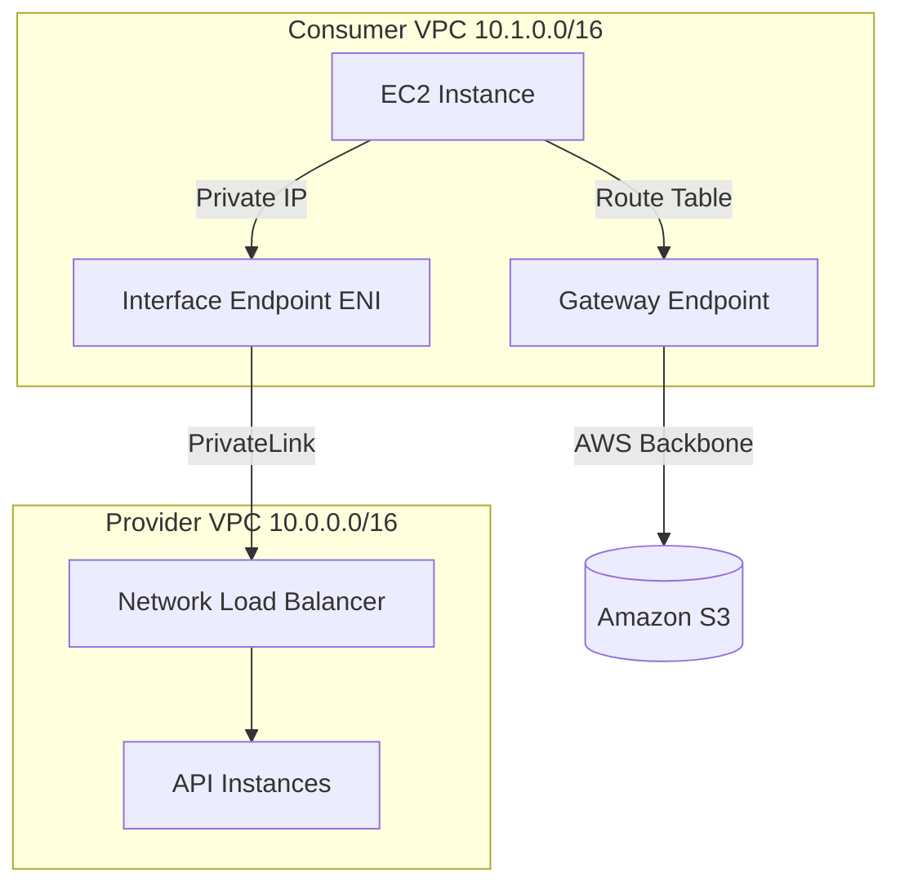
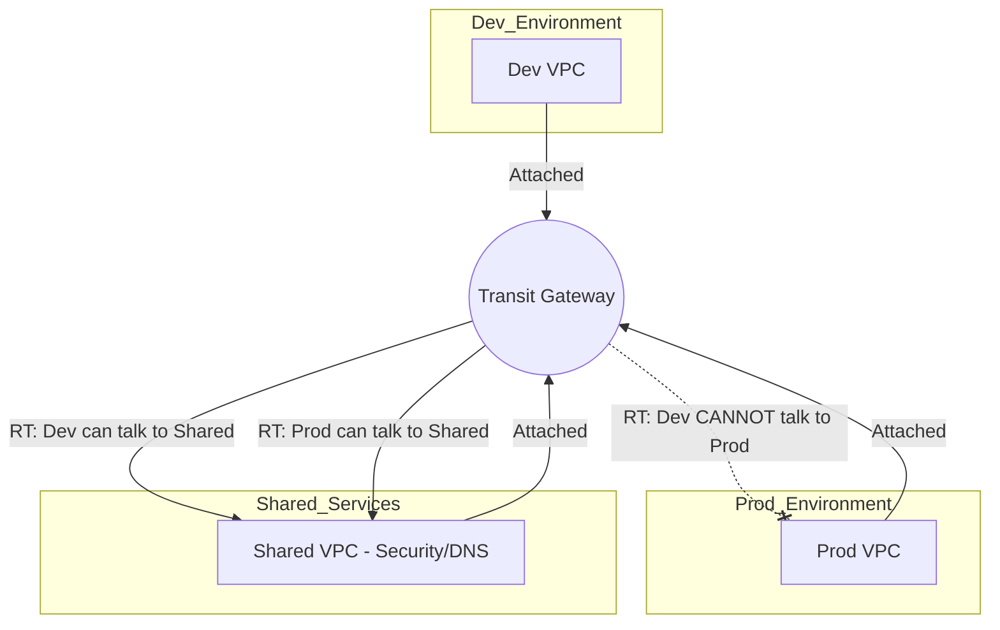
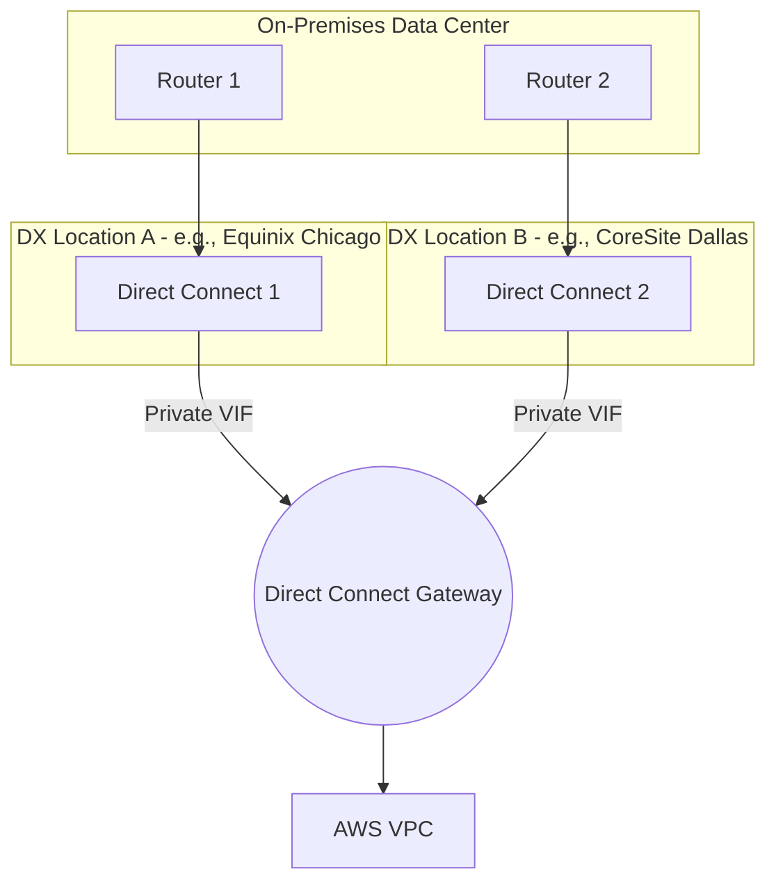
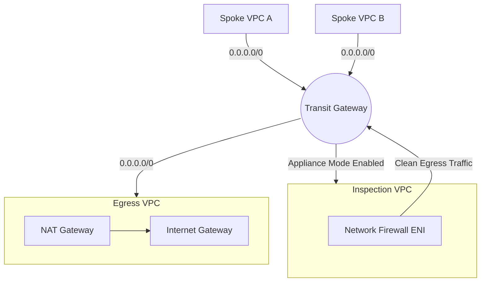

# SAP Section 15: VPC — Advanced Networking (4-Layer Framework)

## VPC Fundamentals, CIDR Planning & Endpoints

### 📖 Technical Specifications & AWS Core Concepts
* **CIDR Rules**: No overlapping CIDRs between any peered VPCs. Subnet CIDRs are permanent after creation. Always allocate at least a `/16` for production VPCs.
* **Gateway Endpoints**: Modify VPC route table to target `vpce-*`. Free, supports only S3 and DynamoDB. Not accessible over VPN/DX or peered VPCs.
* **Interface Endpoints (PrivateLink)**: Deploys an Elastic Network Interface (ENI) into subnets. Costs per-AZ hourly + data processing. Accessible via VPN, DX, and peered VPCs.
* **AWS PrivateLink**: Exposes a service (via Network Load Balancer) to other VPCs/accounts without requiring VPC peering or internet access. Overlapping CIDRs are permitted because traffic targets the PrivateLink ENI.

### 🗺️ Visual Architecture: Endpoints vs PrivateLink


### 🧠 Architectural Probing & Decision Scenarios
* **Scenario:** You need to prevent data exfiltration from your VPC to attacker-controlled S3 buckets while still allowing access to corporate S3 data.
  * **Design:** Deploy an S3 Gateway Endpoint with a VPC Endpoint Policy restricting access to specific corporate buckets, combined with an S3 Bucket Policy enforcing the `aws:sourceVpce` condition. Because this ensures instances cannot reach outside buckets and the bucket rejects traffic from outside the VPC.
* **Scenario:** Expose an internal API to 1,000 customer AWS accounts without routing complexity or worrying about CIDR overlap.
  * **Design:** Deploy AWS PrivateLink (VPC Endpoint Service backed by an NLB). Because PrivateLink is connection-oriented rather than route-oriented, avoiding transitive limits and overlapping CIDR conflicts.
* **Scenario:** On-premises servers need private access to Amazon S3 over Direct Connect without traversing the public internet.
  * **Design:** Deploy an Interface Endpoint for S3. Because Gateway Endpoints are not reachable from outside the VPC, whereas Interface Endpoints provide a private IP accessible over DX.

### 📐 Application Design Patterns & Trade-offs
* **Gateway vs Interface for S3**: Gateway is cost-free but localized to the VPC. Interface costs money but allows hybrid (on-premises) and cross-region access.
* **NAT Gateway vs NAT Instance**: NAT Gateway provides managed HA and scales to 100 Gbps, but costs ~$32/month/AZ + data processing. NAT Instance is cheaper for dev environments and can act as a bastion host, but requires manual scaling, patching, and HA scripting.

### 🚀 Real-World Production Insights
* **Battle Scare**: Hardcoding S3 endpoint IPs. Interface endpoint IPs can change if ENIs are replaced or AZs are added. Always use the DNS name provided by the endpoint.
* **Limits**: You cannot resize a subnet CIDR once created. Outgrowing a subnet requires launching new instances in a new subnet and migrating traffic, which causes downtime.
* **NAT Throttling**: A single NAT Gateway maxes out at 100 Gbps and 1 million concurrent connections. Very high-scale web scraping workloads will exhaust SNAT ports, requiring multiple NAT gateways across multiple subnets.

### 💻 Hands-on CLI Commands
```bash
# Create a VPC Endpoint for S3
aws ec2 create-vpc-endpoint \
    --vpc-id vpc-12345678 \
    --service-name com.amazonaws.us-east-1.s3 \
    --vpc-endpoint-type Gateway \
    --route-table-ids rtb-11223344

# Create a PrivateLink VPC Endpoint Service
aws ec2 create-vpc-endpoint-service \
    --network-load-balancer-arns arn:aws:elasticloadbalancing:us-east-1:123456789012:loadbalancer/net/my-nlb/123456 \
    --acceptance-required
```

---

## Inter-VPC Connectivity (Peering & Transit Gateway)

### 📖 Technical Specifications & AWS Core Concepts
* **VPC Peering**: Direct network connection between two VPCs. Not transitive. Requires a full mesh (N(N-1)/2 connections) for complete routing.
* **Transit Gateway (TGW)**: Regional hub-and-spoke router supporting up to 5,000 attachments (VPCs, VPNs, DX). Supports transitive routing. Maximum bandwidth of 50 Gbps per VPC attachment.
* **TGW Route Tables**: Enables segmentation. You can associate VPCs with different route tables (e.g., Prod vs Dev) to control who talks to whom.
* **Cross-Region Peering**: VPC peering across regions uses the AWS backbone (no internet). TGW peering across regions uses **static routes** only (no BGP between TGWs).

### 🗺️ Visual Architecture: Transit Gateway Segmentation


### 🧠 Architectural Probing & Decision Scenarios
* **Scenario:** You have 50 VPCs across multiple accounts that need to communicate with each other and an on-premises data center.
  * **Design:** Deploy a Transit Gateway in a central network account, share it via AWS RAM, and attach all VPCs and VPNs/DX to it. Because a full peering mesh would require 1,225 connections, which is operationally unmanageable.
* **Scenario:** You need lowest possible latency and free data transfer between two tightly coupled microservices in different VPCs in the same AZ.
  * **Design:** Deploy VPC Peering. Because peering avoids the TGW hop latency and bypasses TGW data processing charges.

### 📐 Application Design Patterns & Trade-offs
* **Peering vs Transit Gateway**: Peering is optimal for <10 VPCs, ultra-low latency, and cost efficiency. TGW is mandatory for enterprise scale, centralized network management, and transitive hybrid connectivity, but incurs data processing fees (~$0.02/GB).

### 🚀 Real-World Production Insights
* **Battle Scare**: Peering limit reached. You can only peer a VPC to 125 other VPCs (hard limit). Trying to build a massive peering mesh will eventually hit a wall.
* **Cross-Account Peering**: SG referencing across cross-account peering requires the explicit account ID and SG ID. Across cross-region peering, you can ONLY use CIDR ranges, not SG IDs.
* **Multicast**: TGW is the only AWS networking construct that natively supports multicast routing for applications like financial data feeds.

### 💻 Hands-on CLI Commands
```bash
# Create a Transit Gateway
aws ec2 create-transit-gateway \
    --description "Central-Hub" \
    --options AutoAcceptSharedAttachments=enable,DefaultRouteTableAssociation=disable

# Create a TGW VPC Attachment
aws ec2 create-transit-gateway-vpc-attachment \
    --transit-gateway-id tgw-0123456789abcdef0 \
    --vpc-id vpc-abcdef12 \
    --subnet-ids subnet-11112222 subnet-33334444
```

---

## Hybrid Connectivity (Site-to-Site VPN & Direct Connect)

### 📖 Technical Specifications & AWS Core Concepts
* **Site-to-Site VPN**: Encrypted IPSec over the internet. 1.25 Gbps per tunnel. Always provisions two tunnels per connection for HA.
* **Direct Connect (DX)**: Dedicated physical fiber to AWS. Not encrypted by default. Consistent latency. Ports available in 1 Gbps, 10 Gbps, and 100 Gbps.
* **Direct Connect Gateway (DX GW)**: A global resource allowing one DX connection to reach multiple VPCs across different AWS regions. Does not route VPC-to-VPC.
* **ECMP (Equal-Cost Multi-Path)**: Aggregates bandwidth across multiple VPN tunnels if BGP is used and attached to a Transit Gateway (not VGW).

### 🗺️ Visual Architecture: 99.99% Direct Connect SLA


### 🧠 Architectural Probing & Decision Scenarios
* **Scenario:** You require 5 Gbps of encrypted throughput to AWS but cannot wait 3 months to provision Direct Connect fiber.
  * **Design:** Deploy multiple Site-to-Site VPN connections attached to a Transit Gateway with ECMP and BGP enabled. Because TGW + ECMP allows simultaneous use of multiple 1.25 Gbps VPN tunnels to aggregate bandwidth.
* **Scenario:** Achieve 99.99% SLA for Direct Connect for mission-critical financial workloads.
  * **Design:** Provision two Direct Connect connections terminating at two completely different physical DX locations. Because two connections at the same facility only grant a 99.9% SLA (vulnerable to facility-wide power/network failure).
* **Scenario:** Compliance requires end-to-end encryption for a 1 Gbps Direct Connect link.
  * **Design:** Deploy a Site-to-Site VPN over a Direct Connect Public VIF. Because DX is unencrypted by default, and MACsec is only supported on dedicated 10 Gbps and 100 Gbps links.

### 📐 Application Design Patterns & Trade-offs
* **DX vs VPN**: DX has high fixed costs and slow lead times but provides predictable latency and lower per-GB data transfer costs. VPN is fast to setup and cheap to idle, but latency fluctuates and internet data transfer rates apply.
* **Failover Patterns**: For DX failover to VPN, always use BGP. DX paths have lower MED by default, so traffic automatically falls back to VPN if the DX BGP session drops. Static routing failover requires external scripts.

### 🚀 Real-World Production Insights
* **Battle Scare**: Asymmetric routing drops over hybrid connections. If traffic enters AWS via DX but the return route is configured to use the VPN backup, stateful firewalls on-premises will drop the return packets. Keep routing symmetric via BGP metrics.
* **VGW limits**: Virtual Private Gateways (VGWs) do not support ECMP. If you attach two VPNs to a VGW, it operates in active/standby mode, hard-capping throughput to 1.25 Gbps.

### 💻 Hands-on CLI Commands
```bash
# Request a Direct Connect dedicated connection
aws directconnect create-connection \
    --location EqDC2 \
    --bandwidth 10Gbps \
    --connection-name "Primary-DX"

# Create a VPN Connection attached to a TGW with BGP
aws ec2 create-vpn-connection \
    --customer-gateway-id cgw-01234567 \
    --type ipsec.1 \
    --transit-gateway-id tgw-11223344 \
    --options "{\"EnableAcceleration\": false}"
```

---

## Advanced Routing, Inspection, & Hybrid DNS

### 📖 Technical Specifications & AWS Core Concepts
* **AWS Network Firewall**: Stateful, managed firewall supporting Suricata rules, Layer 7 inspection (FQDN), and deep packet inspection.
* **VPC Flow Logs**: Captures IP traffic metadata (not payload). Can be filtered by `ACCEPT`, `REJECT`, or `ALL`. Output to CloudWatch Logs, S3, or Kinesis Firehose.
* **Route 53 Resolver Endpoints**: Bridges AWS private DNS with on-premises DNS. Inbound Endpoint = On-prem resolving AWS names. Outbound Endpoint = AWS resolving on-prem names.

### 🗺️ Visual Architecture: Centralized Egress & Inspection


### 🧠 Architectural Probing & Decision Scenarios
* **Scenario:** You have 30 VPCs and want to save costs by avoiding deploying NAT Gateways in every single one, while still allowing outbound internet access.
  * **Design:** Create a Centralized Egress VPC with NAT Gateways, attach it to a Transit Gateway, and configure Spoke VPCs to route `0.0.0.0/0` to the TGW. Because this consolidates NAT Gateway hourly costs into a single VPC.
* **Scenario:** Implement deep packet inspection for all inter-VPC (east-west) traffic using AWS Network Firewall.
  * **Design:** Deploy an Inspection VPC attached to the TGW and enable **Appliance Mode** on the TGW attachment. Because Appliance Mode ensures symmetric routing, so the request and response traverse the exact same firewall ENI, preventing stateful drops.
* **Scenario:** AWS EC2 instances must resolve database hostnames hosted in the on-premises data center (e.g., `db.corp.local`).
  * **Design:** Deploy a Route 53 Resolver Outbound Endpoint and a Forwarding Rule for `corp.local` pointing to the on-premises DNS server IP. Because native AWS DNS cannot resolve custom on-premises domains natively.

### 📐 Application Design Patterns & Trade-offs
* **Distributed vs Centralized Network Firewall**: Distributed (Firewall in every VPC) has lower latency and simple routing, but high cost. Centralized (via TGW) reduces firewall costs and centralizes policy management, but increases routing complexity and incurs TGW data transfer fees.
* **Flow Logs to S3 vs CloudWatch**: S3 is cheap and perfect for long-term Athena queries/auditing. CloudWatch is expensive for high volume but required for real-time Metric Filters and Alarms (e.g., alarming on REJECTED port 22 traffic).

### 🚀 Real-World Production Insights
* **Battle Scare**: Flow logs do NOT capture DNS queries to the Route 53 Resolver, DHCP traffic, or Windows activation traffic. Do not rely on VPC Flow Logs for DNS security analytics—use Route 53 Query Logs instead.
* **Suricata Rules**: A poorly written regex in a Suricata rule on Network Firewall can cause a massive performance penalty and increase latency across the entire inspection path.

### 💻 Hands-on CLI Commands
```bash
# Enable VPC Flow Logs targeting S3 for REJECTED traffic
aws ec2 create-flow-logs \
    --resource-type VPC \
    --resource-ids vpc-00112233 \
    --traffic-type REJECT \
    --log-destination-type s3 \
    --log-destination arn:aws:s3:::my-flow-logs-bucket

# Create a Route 53 Resolver Outbound Endpoint
aws route53resolver create-resolver-endpoint \
    --creator-request-id 20260608-outbound \
    --security-group-ids sg-12345 \
    --direction OUTBOUND \
    --ip-addresses SubnetId=subnet-1111,SubnetId=subnet-2222
```
