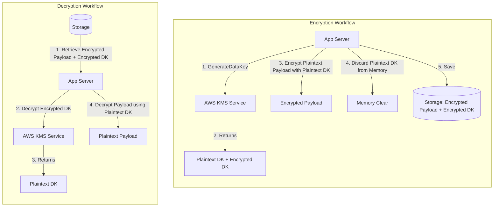
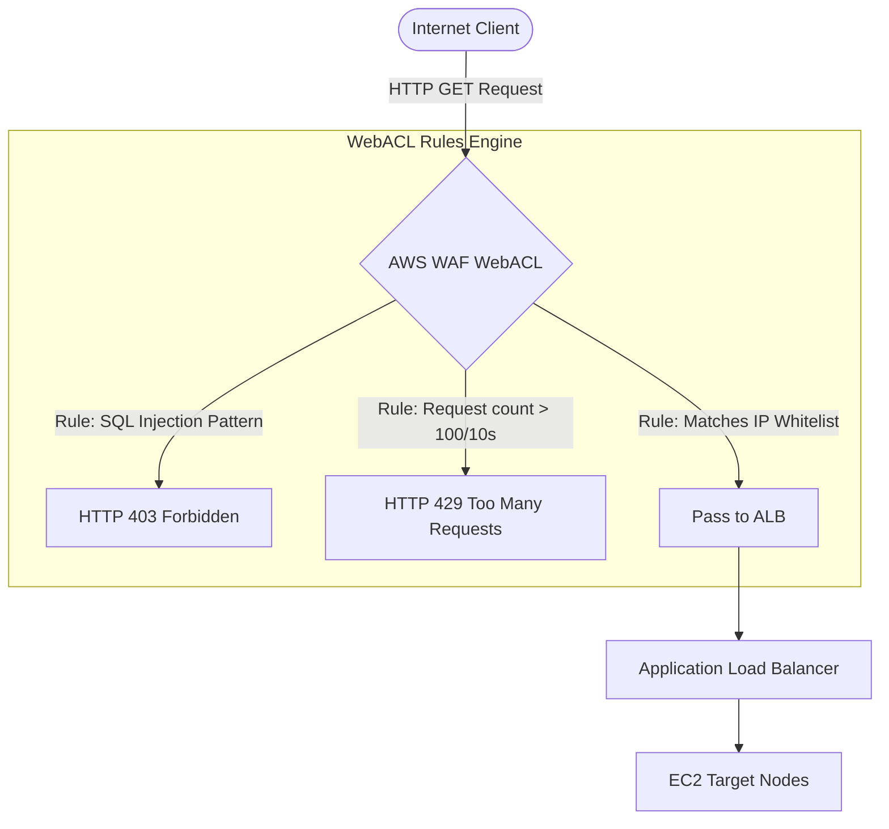

# AWS Security & Encryption — KMS, Secrets Manager, WAF, Shield & GuardDuty (Engineering Architect Reference)

> 📚 Official Docs: https://docs.aws.amazon.com/kms/ | https://docs.aws.amazon.com/waf/ | https://docs.aws.amazon.com/secretsmanager/
> 🎯 SAA-C03 Exam Weight: High — key services for data encryption, credential rotation, firewall filtering, and automated threat detection.

---

## 🔒 Topic 1: AWS KMS & Envelope Encryption

### 📖 Technical Specifications & AWS Core Concepts
* **AWS KMS:** Key Management Service, a managed service to create, control, and audit cryptographic keys. Key material is stored in hardware security modules (HSMs).
* **Customer Master Key (CMK / KMS Key):** A logical key container containing metadata, key policies, and reference pointers to the physical backing key material.
* **Envelope Encryption:** A cryptographic design pattern where data is encrypted with a unique Data Key (DK), and that data key is encrypted under a KMS key.
* **GenerateDataKey:** The KMS API action used to generate a plaintext data key for local encryption and an encrypted version of that key for storage.
* **Multi-Region Key (MRK):** A set of replicated KMS keys in different regions with the same key ID and key material, allowing local decryption of ciphertext across regions without cross-region network calls.

---

### 🗺️ Visual Architecture: Envelope Encryption & Decryption Workflow



---

### 🧠 Architectural Probing & Decision Scenarios
* **Scenario:** Why does AWS KMS enforce Envelope Encryption instead of decrypting the entire payload directly via the KMS API?**
  * **Design:** Direct KMS encryption APIs have a payload limit of **4 KB**. Moving heavy files (e.g., database backups or large images) to KMS over HTTP is slow and insecure. Envelope Encryption solves this: KMS only generates/decrypts a tiny data key (under 4 KB). The encryption of the large file happens locally on the host CPU using the plaintext data key, providing high performance and unlimited file size capabilities.
* **Scenario:** How do KMS Key Policies differ from standard IAM policies?**
  * **Design:** KMS Key Policies are resource-based policies attached directly to the key. By default, **IAM policies cannot grant access to a KMS key** unless the Key Policy itself explicitly delegates permission to the root account (`"Principal": {"AWS": "arn:aws:iam::123456789012:root"}`).

---

### 📐 Application Design Patterns & Trade-offs
* **KMS Multi-Region Keys vs. Cross-Region Key Copying:**
  * **KMS Multi-Region Keys:** Replicates key material across regions under the same Key ID. **Trade-off:** Ideal for active-active multi-region databases (like Aurora Global DB or DynamoDB Global Tables). An application in `eu-west-1` can decrypt data written and encrypted in `us-east-1` locally without cross-region network latencies.
  * **Standard Keys:** Copying encrypted data requires decrypting it in the source region, moving the plaintext across the network, and re-encrypting it under a different destination key. **Trade-off:** Adds network latency but isolates blast radiuses; a compromised key policy in one region does not affect another.

---

### 🚀 Real-World Production Insights
* **The SQS / S3 KMS API Throttling Outage:**
  * **The Trap:** An application handles 10,000 transactions per second, storing transaction files in S3 or sending events to SQS. The architect configures SSE-KMS for security. Because every object read/write or message send/receive triggers a KMS API call (`GenerateDataKey` / `Decrypt`), the application immediately hits the regional KMS API throttle limit (typically 5,000 to 10,000 RPS), causing transaction failures.
  * **Mitigation:** Enable **Amazon S3 Bucket Keys** or **SQS KMS Data Key Reuse Periods** (caching). This allows S3 and SQS to cache the data key locally for a configurable window (e.g., 5 minutes), reducing KMS API call rates by up to 99%.

---

### 💻 Hands-on CLI Commands
* **Encrypt a text file using a Customer Managed Key (CMK):**
  ```bash
  aws kms encrypt \
    --key-id arn:aws:kms:us-east-1:123456789012:key/abc-123-def \
    --plaintext fileb://secret-report.txt \
    --output text \
    --query CiphertextBlob | base64 --decode > encrypted-report.bin
  ```
* **Decrypt the encrypted file back to plaintext:**
  ```bash
  aws kms decrypt \
    --ciphertext-blob fileb://encrypted-report.bin \
    --output text \
    --query Plaintext | base64 --decode > decrypted-report.txt
  ```

---

## 🔑 Topic 2: Secrets Manager vs. SSM Parameter Store

### 📖 Technical Specifications & AWS Core Concepts
* **SSM Parameter Store:** A managed key-value parameter storage service (free for standard parameters, max size 4KB/8KB).
* **AWS Secrets Manager:** A paid credential vault ($0.40/secret/month) that supports automatic password rotation, cross-account access, and native integration with databases.
* **Secret Rotation:** A built-in feature in Secrets Manager that uses a Lambda function to update database passwords and rotate the credential inside the secret vault automatically.

---

### 🧠 Architectural Probing & Decision Scenarios
* **Scenario:** When should an architect choose AWS Secrets Manager over SSM Parameter Store?**
  * **Design:** Choose **Secrets Manager** if the credential requires automatic rotation (e.g., rotating database passwords every 30 days) or needs to be shared across different AWS accounts. Secrets Manager integrates directly with RDS, Redshift, and DocumentDB to rotate credentials natively. Choose **SSM Parameter Store** for standard environment configurations (e.g., URLs, feature flags) that do not require rotation or cross-account access, as standard parameters are completely free.

---

### 🚀 Real-World Production Insights
* **The "Stale Password Connection Drop" rotation failure:**
  * **The Trap:** Secrets Manager rotates a database password successfully using its Lambda rotation function. However, the active application servers run on ECS and cache the database connection pool in memory. When the rotation completes, the running application tasks continue trying to connect using the stale, rotated password, resulting in authentication failures and causing an outage.
  * **Mitigation:** Configure application connection pools to catch database authentication errors, evict the connection pool, pull the fresh secret from Secrets Manager, and rebuild the pool dynamically.

---

### 💻 Hands-on CLI Commands
* **Create a Secret in Secrets Manager:**
  ```bash
  aws secretsmanager create-secret \
    --name production-db-creds \
    --description "Database credentials" \
    --secret-string '{"username":"dbadmin","password":"SuperSecurePassword123!"}'
  ```
* **Retrieve a secret value programmatically:**
  ```bash
  aws secretsmanager get-secret-value \
    --secret-id production-db-creds \
    --query SecretString \
    --output text
  ```

---

## 🛡️ Topic 3: AWS WAF, Shield & GuardDuty — Perimeter Security & Threat Detection

### 📖 Technical Specifications & AWS Core Concepts
* **AWS WAF:** Web Application Firewall, a service that monitors HTTP/HTTPS requests to protect endpoints (ALB, API Gateway, CloudFront) from common web exploits (SQL Injection, XSS).
* **Web ACL (Access Control List):** A collection of rules that define blocking, counting, or allowing criteria for HTTP requests.
* **AWS Shield Standard:** An always-on, free DDoS protection service that protects all AWS customers from Layer 3/4 network attacks.
* **AWS Shield Advanced:** A paid subscription ($3,000/month) that provides advanced Layer 7 DDoS mitigation, financial protection against scaling bills caused by DDoS, and 24/7 access to the Shield Response Team (SRT).
* **Amazon GuardDuty:** An intelligent threat detection service that continuously monitors VPC Flow Logs, DNS Query Logs, EKS audit logs, and CloudTrail events for anomalous behavior using machine learning.

---

### 🗺️ Visual Architecture: WAF Request Landing Inspection



---

### 🧠 Architectural Probing & Decision Scenarios
* **Scenario:** How does Amazon GuardDuty detect threats without impacting application network performance?**
  * **Design:** GuardDuty operates completely out-of-band. It does not sit in the network path of your EC2 instances or databases. Instead, it reads copies of **VPC Flow Logs, DNS Query Logs, and CloudTrail logs** directly from the AWS plane. This architecture guarantees zero impact on network latency or CPU usage.
* **Scenario:** Can AWS WAF protect an EC2 instance directly?**
  * **Design:** No. AWS WAF must be associated with supported resource entry points. These are: **Amazon CloudFront, Amazon API Gateway, Application Load Balancers, or AWS AppSync**. To protect an EC2 instance, you must place an ALB in front of the instance and associate the WAF WebACL with the ALB.

---

### 🚀 Real-World Production Insights
* **The "Count Mode" WAF Rule Release Pattern:**
  * **The Trap:** An engineer deploys a new WAF rule to block SQL injection patterns directly into a production WebACL. Within minutes, customers report that they cannot submit forms, and WAF is blocking legitimate API payloads (false positives).
  * **Mitigation:** When releasing new WAF rules, always set the action to **Count** first. This logs rule matches in CloudWatch without blocking traffic. Monitor the request logs for 48 hours to confirm there are no false positives, then update the rule action to **Block**.

---

### 💻 Hands-on CLI Commands
* **Associate a WAF WebACL with an ALB:**
  ```bash
  aws wafv2 associate-web-acl \
    --web-acl-arn arn:aws:wafv2:us-east-1:123456789012:regional/webacl/prod-blocker/abc123-def456 \
    --resource-arn arn:aws:elasticloadbalancing:us-east-1:123456789012:loadbalancer/app/production-alb/50dc6c495c0c9188
  ```
