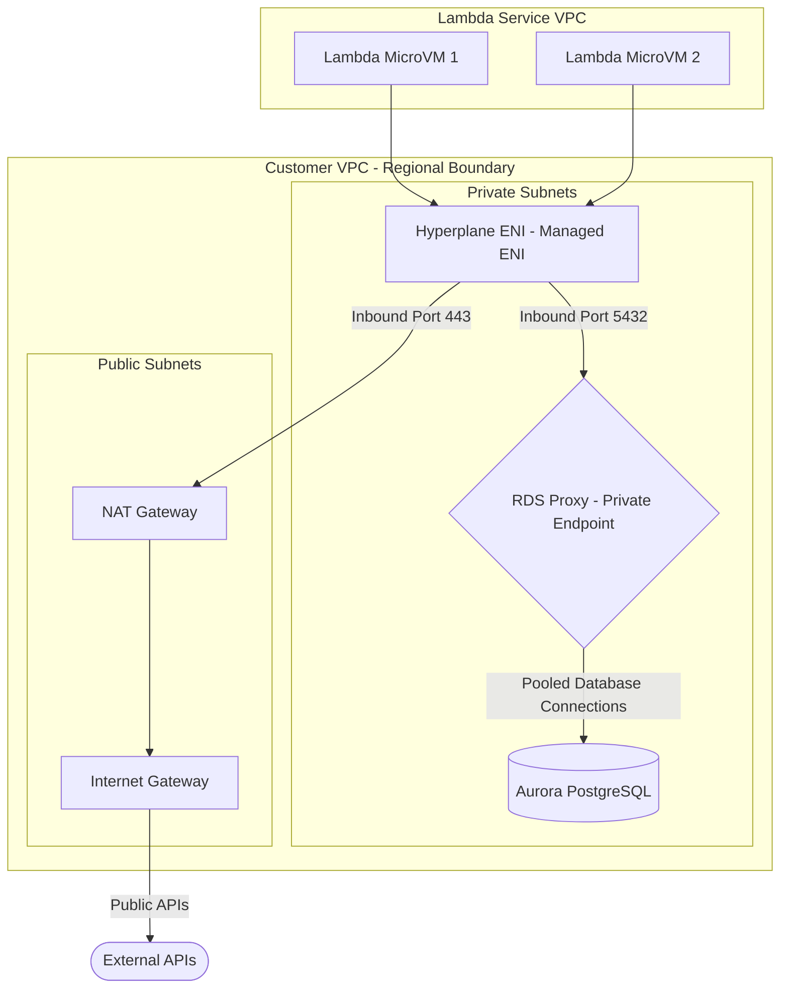

# AWS Lambda & Edge Functions (Engineering Architect Reference)

> 📚 Official Docs: https://docs.aws.amazon.com/lambda/latest/dg/ | https://docs.aws.amazon.com/AmazonCloudFront/latest/DeveloperGuide/edge-computing.html
> 🎯 SAA-C03 Exam Weight: High — key services for event-driven serverless backends, edge optimization, and microservice integration.

---

## ⚡ Topic 1: AWS Lambda Compute & Concurrency Management

### 📖 Technical Specifications & AWS Core Concepts
* **AWS Lambda:** A managed, event-driven serverless compute service that executes code in microVMs (Firecracker) on demand.
* **GB-Second:** The compute duration metric for Lambda pricing, calculated as memory allocated (in GB) multiplied by execution time (in seconds).
* **Reserved Concurrency:** A concurrency cap allocated to a specific function that guarantees a maximum concurrent runtime slot count while protecting other functions from resource starvation.
* **Provisioned Concurrency:** A performance floor that pre-warms and initializes a specified number of execution environments, eliminating cold starts for immediate scaling.
* **SnapStart:** An AWS performance optimization that takes a snapshot of a Java, Python, or .NET microVM's memory and disk state after initialization and resumes from it for subsequent cold starts.

---

### 🗺️ Visual Architecture: Synchronous vs. Asynchronous vs. Event Source Mapping

```mermaid
graph TD
    subgraph Synchronous [Synchronous: API Gateway / ALB]
        Client_Sync([Client]) -->|1. Request| APIGW[API Gateway]
        APIGW -->|2. Block & Invoke| Lambda_Sync[Lambda Function]
        Lambda_Sync -->|3. Compute & Return| APIGW
        APIGW -->|4. HTTP 200 / 429| Client_Sync
    end

    subgraph Asynchronous [Asynchronous: S3 / SNS]
        Client_Async([S3 PutObject]) -->|1. Event| SNS{SNS / S3 Service}
        SNS -->|2. Fire & Forget| Lambda_Queue[AWS Internal Queue]
        Lambda_Queue -->|3. Process| Lambda_Async[Lambda Function]
        Lambda_Async -->|4. On Fail: Retry 2x| DLQ[SQS Dead Letter Queue]
    end

    subgraph EventSourceMap [Event Source Mapping: SQS / DynamoDB]
        DB[(DynamoDB Stream)] -->|1. Stream Records| ESM[Event Source Mapper]
        ESM -->|2. Polls & Batches| ESM
        ESM -->|3. Invokes| Lambda_ESM[Lambda Function]
        Lambda_ESM -->|4. Success: Advance Pointer| DB
    end
```



---

### 🧠 Architectural Probing & Decision Scenarios
* **Scenario:** How does Lambda handle scaling in response to sudden traffic spikes, and what is the concurrency limit behavior?**
  * **Design:** By default, Lambda has a regional account limit of 1000 concurrent executions. If a function receives traffic exceeding this limit:
    * **Synchronous callers** immediately receive an HTTP 429 (Too Many Requests) throttle error.
    * **Asynchronous event sources** are retried by AWS with exponential backoff (up to 6 hours) before being routed to a DLQ or Destination.
* **Scenario:** Why is it critical to set Reserved Concurrency on high-priority functions in an AWS account?**
  * **Design:** Since the 1000 concurrency limit is shared across the entire AWS region within an account, a single run-away function (e.g., an unthrottled image processor) can consume all 1000 slots. This starves other services (e.g., login APIs), causing account-wide throttling. Setting Reserved Concurrency on key functions protects them from starvation.

---

### 📐 Application Design Patterns & Trade-offs
* **Provisioned Concurrency vs. SnapStart for Startup Latency:**
  * **Provisioned Concurrency:** Pre-warms instances, keeping them idle and ready. **Trade-off:** Eliminates cold starts completely for all runtimes but incurs a constant hourly reservation cost, regardless of invocation counts.
  * **SnapStart:** Automatically snapshots the initialized execution environment. **Trade-off:** Reduces cold starts by up to 10x for heavy runtimes (Java/Python/.NET) at **zero cost**, but does not guarantee sub-millisecond initial start times like Provisioned Concurrency.

---

### 🚀 Real-World Production Insights
* **The "Zombie" Connection Timeout Leak:**
  * **The Trap:** When a Lambda function queries external API endpoints or legacy databases without specifying a connection timeout, the request can hang indefinitely. If this occurs, the Lambda instance remains active, waiting for the full 15-minute execution limit. This consumes concurrency, triggers throttle errors for other requests, and results in massive billing costs.
  * **Mitigation:** Always set explicit connection and read timeouts (e.g., 3 seconds) in your HTTP client libraries and database drivers.
* **Ephemeral Storage `/tmp` Contamination:**
  * **The Issue:** Warm Lambda containers are reused for subsequent invocations. If your code writes sensitive user files to the `/tmp` folder and does not clean them up, the next invocation on that same container can access those files, causing data leaks or out-of-disk crashes.
  * **Mitigation:** Wrap write operations in `try/finally` blocks to explicitly delete local files inside the `/tmp` directory before returning.

---

### 💻 Hands-on CLI Commands
* **Create a Lambda function with environment variables and timeout limits:**
  ```bash
  aws lambda create-function \
    --function-name order-processor \
    --runtime python3.12 \
    --role arn:aws:iam::123456789012:role/lambda-execution-role \
    --handler index.handler \
    --zip-file fileb://function.zip \
    --timeout 30 \
    --memory-size 512 \
    --environment Variables={DB_ENDPOINT=mysql.company.internal,ENV=prod}
  ```
* **Set Reserved Concurrency (limit to 100 concurrent executions):**
  ```bash
  aws lambda put-function-concurrency \
    --function-name order-processor \
    --reserved-concurrent-executions 100
  ```

---

## 🔒 Topic 2: Lambda Networking — Private VPC Access & RDS Proxy

### 📖 Technical Specifications & AWS Core Concepts
* **Hyperplane ENI:** The managed network interface technology used by AWS Lambda to map private IP addresses from a target VPC to Lambda microVMs without long cold-start delays.
* **Outbound Internet Access:** By default, a Lambda function inside a VPC cannot connect to the public internet unless it routes traffic through a NAT Gateway.
* **RDS Proxy:** A fully managed, highly available database connection pooler that sits between serverless applications and RDS/Aurora instances.

---

### 🗺️ Visual Architecture: Lambda VPC Networking & RDS Proxy Connection Pooling



---

### 🧠 Architectural Probing & Decision Scenarios
* **Scenario:** How does the Lambda VPC configuration handle external internet access?**
  * **Design:** By default, Lambda runs in a system-managed VPC with direct outbound internet access. When you assign Lambda to your private VPC subnets to reach RDS or cache nodes, it loses its default internet access. To connect to both private RDS databases and public internet APIs, your private subnets **must route outbound traffic through a NAT Gateway** deployed in a public subnet.
* **Scenario:** Why is RDS Proxy required when connecting thousands of Lambda instances to a database?**
  * **Design:** Databases have hard limits on active connection counts (governed by memory limits). A serverless application can scale out to 1,000 concurrent Lambda instances instantly. If each instance opens a connection, the database crashes due to connection exhaustion. RDS Proxy pools and multiplexes connections, allowing thousands of Lambda instances to share a small pool of database connections.

---

### 📐 Application Design Patterns & Trade-offs
* **Serverless VPC Access Latency (Hyperplane ENIs):**
  * **The Context:** Historically, assigning Lambda to a VPC caused a 30–45s cold start delay due to dynamic ENI creation.
  * **The Optimization:** Since the 2019 AWS networking update, Hyperplane ENIs are pre-allocated during function creation/update. Cold starts inside a VPC are now identical to those outside a VPC. **Architectural Choice:** Always deploy database-interacting Lambda functions inside private subnets and leverage security groups for access control.

---

### 🚀 Real-World Production Insights
* **The RDS Proxy Subnet Requirement Gotcha:**
  * **The Reality:** Architects occasionally place Lambda functions outside the VPC but attempt to connect to an RDS database using RDS Proxy to mitigate connection pooling issues.
  * **The Failure:** RDS Proxy does not support public endpoints. It can only be provisioned inside private VPC subnets. Therefore, for a Lambda function to reach RDS Proxy, the **Lambda function must also be configured to run inside the same VPC**.

---

### 💻 Hands-on CLI Commands
* **Configure an existing Lambda function to join a VPC:**
  ```bash
  aws lambda update-function-configuration \
    --function-name order-processor \
    --vpc-config SubnetIds=subnet-0abc123def456,subnet-0def456abc123,SecurityGroupIds=sg-0abc123def456
  ```
* **Map an SQS queue as an Event Source for Lambda (Batch size = 10):**
  ```bash
  aws lambda create-event-source-mapping \
    --event-source-arn arn:aws:sqs:us-east-1:123456789012:incoming-orders-queue \
    --function-name order-processor \
    --batch-size 10
  ```

---

## 🌐 Topic 3: Edge Computing — CloudFront Functions vs. Lambda@Edge

### 📖 Technical Specifications & AWS Core Concepts
* **Edge Location:** A global cache endpoint where AWS CloudFront caches static content close to end-users.
* **CloudFront Functions:** A lightweight, high-performance Javascript runtime deployed globally to execute simple logic at edge locations.
* **Lambda@Edge:** A full-featured Node.js/Python serverless environment managed in `us-east-1` but replicated globally to handle complex requests at CloudFront edge locations.

---

### 🗺️ Visual Architecture: CloudFront Request Lifecycle & Edge Triggers

```mermaid
graph LR
    Client([Internet Client]) -->|1. Viewer Request| CFF{CloudFront Function}
    CFF -->|2. Cache Check| Cache{CloudFront Cache}
    
    subgraph Edge_Location [CloudFront Edge Location]
        CFF
        Cache
    end
    
    Cache -->|3. Cache Miss: Origin Request| L_Edge{Lambda@Edge}
    L_Edge -->|4. Fetch| Origin[Origin: ALB / S3]
    Origin -->|5. Return: Origin Response| L_Edge_Res[Lambda@Edge Response]
    L_Edge_Res -->|6. Cache Content| Cache
    Cache -->|7. Viewer Response| Client
```

---

### 🧠 Architectural Probing & Decision Scenarios
* **Scenario:** How do you choose between CloudFront Functions and Lambda@Edge for request modification?**
  * **Design:** * Choose **CloudFront Functions** for sub-millisecond, high-scale, simple operations (e.g., URL rewrites, redirecting, cache-key normalization, or JWT verification) where you only need Javascript and don't need external network access.
    * Choose **Lambda@Edge** for heavy, complex operations (e.g., calling external databases, performing image manipulation, resizing, or calling third-party authentication APIs) where you need Node.js/Python and filesystem/network access.
* **Scenario:** In which AWS region must you publish a Lambda@Edge function?**
  * **Design:** You must author and publish the Lambda@Edge function in the **`us-east-1` (N. Virginia) region**. Once published, AWS CloudFront automatically replicates the function's bytecode globally to all regional edge caches.

---

### 📐 Application Design Patterns & Trade-offs
* **Viewer vs. Origin Request Trigger Selection:**
  * **Viewer Request Trigger:** Runs on *every* single incoming client request. **Trade-off:** High execution counts and cost, but executes before the CloudFront cache check, making it ideal for cache key normalization.
  * **Origin Request Trigger:** Runs *only* on cache misses (before forwarding to the origin). **Trade-off:** Low execution frequency and cost, but cannot modify cached content returned to other users. Ideal for dynamic header insertion or A/B testing router splits.

---

### 🚀 Real-World Production Insights
* **The "Write-On-Read" Global Database Loop (Lambda@Edge):**
  * **The Trap:** When using Lambda@Edge to perform session validation or user lookup, developers query a regional database in the origin region (e.g., `us-east-1`). If a user in Tokyo hits the edge location, the Lambda@Edge executes locally in Tokyo, but must query database endpoints in the US, adding 150ms of network latency and defeating the purpose of edge computing.
  * **Mitigation:** Couple Lambda@Edge with globally replicated database architectures (e.g., DynamoDB Global Tables or Aurora Global Database) to ensure local, low-latency reads.

---

### 💻 Hands-on CLI Commands
* **Publish a new version of a Lambda function in us-east-1 for Lambda@Edge:**
  ```bash
  aws lambda publish-version \
    --function-name my-edge-router \
    --region us-east-1
  ```
* **Enable SnapStart on an existing Java function configuration:**
  ```bash
  aws lambda update-function-configuration \
    --function-name java-backend \
    --snap-start ApplyOn=PublishedVersions
  ```
