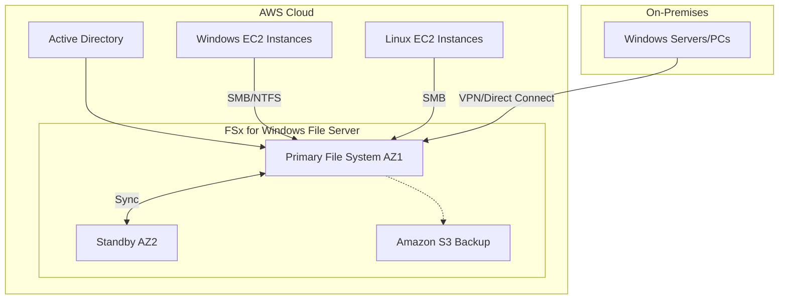
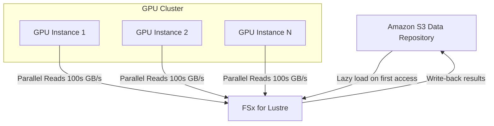
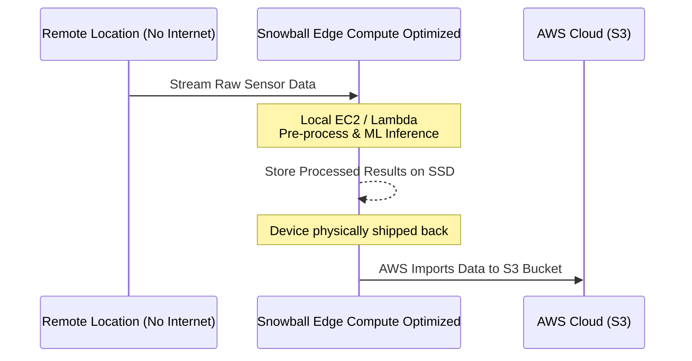
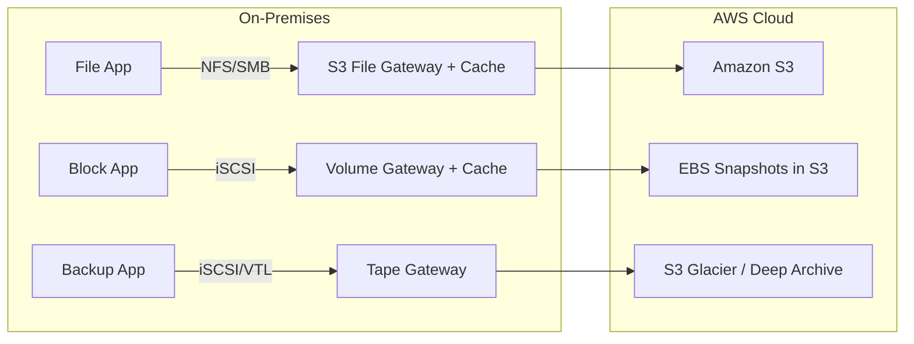
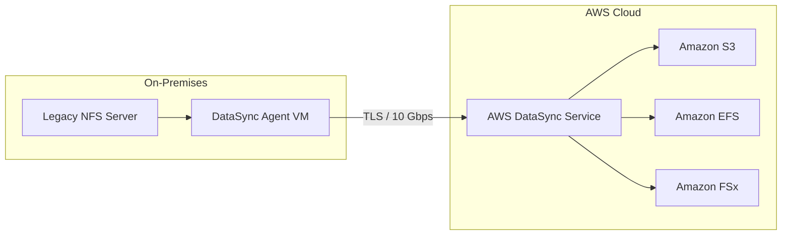

# AWS Storage Extras — FSx, Snow Family, Storage Gateway & DataSync

> **Exam**: AWS SAA-C03 | **Topic Weight**: Medium-High (8–12% of questions touch hybrid storage and migration)

## Amazon FSx for Windows File Server

### 📖 Technical Specifications & AWS Core Concepts
- **Protocol:** SMB (Server Message Block), Windows NTFS.
- **Authentication:** Native Microsoft Active Directory integration (domain-joined, ACLs, user quotas).
- **Access:** Can be accessed by Windows and Linux EC2 instances, and on-premises via VPN or Direct Connect.
- **Availability:** Multi-AZ deployment available with automatic failover.
- **Storage:** Options include SSD for low latency and HDD for broad throughput.
- **Backup:** Daily automated backups to Amazon S3.

### 🗺️ Visual Architecture: FSx for Windows File Server HA


### 🧠 Architectural Probing & Decision Scenarios
* **Scenario:** You need shared storage for legacy Windows applications requiring native NTFS permissions and Active Directory integration.
  * **Design:** Deploy FSx for Windows File Server. Because EFS only supports NFS and Linux permissions.
* **Scenario:** You need to group files across multiple FSx file systems under a single namespace.
  * **Design:** Implement Microsoft DFS Namespaces. Because it unifies multiple shares into one logical path.

### 📐 Application Design Patterns & Trade-offs
- **Pattern:** Hybrid Cloud Windows File Shares.
  - **Trade-offs:** Gives on-prem users low-latency access to cloud storage via FSx File Gateway. Direct access over VPN can add latency for intensive workloads, so local caching via File Gateway is often required.
- **Pattern:** High Availability Windows File Server.
  - **Trade-offs:** Multi-AZ setup ensures HA but doubles storage costs compared to Single-AZ deployments.

### 🚀 Real-World Production Insights
- **Battle Scare:** DFS Namespaces misconfiguration can cause clients to route traffic across AWS Regions leading to unexpected massive egress costs.
- **Limits:** Max storage capacity is 64 TB per file system, but DFS namespaces can logically group hundreds of PBs.
- **Throttling:** IOPS are tied to storage capacity or manually provisioned. If bursts exhaust credits, latency spikes dramatically. Always monitor `BurstBalance`.

### 💻 Hands-on CLI Commands
```bash
# Create FSx for Windows File Server in Multi-AZ
aws fsx create-file-system \
  --file-system-type WINDOWS \
  --storage-capacity 300 \
  --subnet-ids subnet-0abc123def456 subnet-0def456abc123 \
  --windows-configuration '{
    "ThroughputCapacity": 8,
    "ActiveDirectoryId": "d-1234567890",
    "DeploymentType": "MULTI_AZ_1",
    "PreferredSubnetId": "subnet-0abc123def456",
    "AutomaticBackupRetentionDays": 7
  }'
```

## Amazon FSx for Lustre

### 📖 Technical Specifications & AWS Core Concepts
- **Protocol:** Lustre API, POSIX file system.
- **Use Case:** High-Performance Computing (HPC), Machine Learning, Genomics, Media Rendering.
- **Integration:** Seamlessly integrates with Amazon S3. Lazy loads data on first read and writes results back to S3.
- **Deployment Options:** 
  - **Scratch:** Non-replicated, highest burst performance (200 MB/s per TiB), for temporary processing.
  - **Persistent:** Replicated within a single AZ, survives disk/server failures, for long-term workloads.
- **Performance:** Sub-millisecond latency, scales to millions of IOPS and 100s GB/s throughput.

### 🗺️ Visual Architecture: FSx for Lustre S3 Integration


### 🧠 Architectural Probing & Decision Scenarios
* **Scenario:** You need ultra-fast shared storage to feed 100 GPUs for machine learning training.
  * **Design:** Deploy FSx for Lustre. Because standard EFS will bottleneck on parallel massive reads.
* **Scenario:** You run a short-lived, intensive data processing job where data is replaceable from S3.
  * **Design:** Deploy Scratch Lustre File System. Because it avoids replication overhead and maximizes raw burst throughput at a lower cost.

### 📐 Application Design Patterns & Trade-offs
- **Pattern:** S3-Backed Processing Cluster.
  - **Trade-offs:** S3 integration allows separating compute storage from long-term storage, but the first read carries S3 latency penalty (lazy load).
- **Pattern:** Scratch vs Persistent.
  - **Trade-offs:** Scratch saves cost but risks complete data loss upon hardware failure. Persistent guarantees AZ-level durability but is more expensive and has slightly lower peak burst throughput.

### 🚀 Real-World Production Insights
- **Battle Scare:** Relying on lazy loading for a time-critical ML training run can cause the GPUs to sit idle waiting for S3 data. Pre-loading data into FSx before starting the compute cluster is often required in production.
- **Limits:** Max throughput scales strictly with provisioned storage. You might need to provision more TBs just to achieve the necessary GB/s.

### 💻 Hands-on CLI Commands
```bash
# Create Scratch FSx for Lustre for temp HPC jobs with S3 integration
aws fsx create-file-system \
  --file-system-type LUSTRE \
  --storage-capacity 1200 \
  --subnet-ids subnet-0abc123def456 \
  --lustre-configuration '{
    "DeploymentType": "SCRATCH_2",
    "ImportPath": "s3://my-ml-training-data",
    "ExportPath": "s3://my-ml-training-data/output"
  }'
```

## AWS Snow Family

### 📖 Technical Specifications & AWS Core Concepts
- **Purpose:** Offline data migration for petabyte-scale data or environments with limited/no internet connectivity.
- **Rule of Thumb:** Use if internet transfer takes > 1 week.
- **Variants:**
  - **Snowball Edge Storage Optimized:** 210 TB NVMe SSD, 104 vCPUs. Optimized for mass data movement.
  - **Snowball Edge Compute Optimized:** 28 TB NVMe SSD, 104 vCPUs. Optimized for edge computing (ML inference, local Lambda/EC2).
- **Security:** Tamper-evident, 256-bit encryption, KMS integration.
- **Migration Path:** Imports to S3. Cannot import directly to S3 Glacier (requires S3 Lifecycle transition).

### 🗺️ Visual Architecture: Snowball Edge Edge Computing Workflow


### 🧠 Architectural Probing & Decision Scenarios
* **Scenario:** You need to migrate 2 PB of data to AWS over a 100 Mbps internet connection.
  * **Design:** Deploy AWS Snowball Edge Storage Optimized. Because a 100 Mbps connection would take years, while shipping physical devices takes days.
* **Scenario:** You need to archive 50 TB of on-premises video data directly into Amazon S3 Glacier via Snowball.
  * **Design:** Import via Snowball to S3 Standard, then use S3 Lifecycle to transition to Glacier. Because Snowball cannot import directly to Glacier.
* **Scenario:** You need to run ML inference on camera feeds on a cruise ship with no internet.
  * **Design:** Deploy Snowball Edge Compute Optimized. Because it provides local EC2 and Lambda execution environments without requiring connectivity.

### 📐 Application Design Patterns & Trade-offs
- **Pattern:** Disconnected Edge Computing.
  - **Trade-offs:** Allows advanced computing in hostile/remote environments, but hardware logistics (shipping/handling) can introduce weeks of lead time before data reaches the central cloud.
- **Pattern:** Mass Offline Migration.
  - **Trade-offs:** Highly secure and avoids network saturation, but requires manual labor to rack, connect, and process the devices on-prem.

### 🚀 Real-World Production Insights
- **Battle Scare:** Sending millions of 1KB files to a Snowball device will bottleneck the copy process severely due to file metadata overhead. Always batch/tar small files before copying them to a Snowball.
- **Limits:** The actual usable capacity is always slightly lower than the raw capacity (e.g., 210 TB raw -> ~190 TB usable). Plan for overhead.

### 💻 Hands-on CLI Commands
```bash
# Snowball jobs are typically managed via AWS Console or Snowball Client locally
# Example local Snowball Client copy command
snowball cp /local/path/to/data s3://my-snowball-bucket/ --recursive
```

## AWS Storage Gateway

### 📖 Technical Specifications & AWS Core Concepts
- **Purpose:** Hybrid cloud storage; bridges on-premises environments with AWS cloud storage.
- **Deployment:** Installed as a VM (VMware, Hyper-V, KVM) or hardware appliance on-premises.
- **Gateway Types:**
  - **S3 File Gateway:** Exposes S3 as NFS/SMB file shares. Uses local cache.
  - **Volume Gateway:** Exposes EBS snapshots as iSCSI block storage. (Cached mode: data in S3, local cache; Stored mode: all data local, async backup to S3).
  - **Tape Gateway:** Virtual Tape Library (VTL) replacing physical tapes. Backs up to S3 and archives to Glacier.
  - **FSx File Gateway:** Local cache for FSx for Windows.

### 🗺️ Visual Architecture: Storage Gateway Options


### 🧠 Architectural Probing & Decision Scenarios
* **Scenario:** Your company wants to keep their existing Veeam backup software but replace physical tape infrastructure.
  * **Design:** Deploy AWS Tape Gateway. Because it presents a standard iSCSI VTL interface to the backup software while transparently routing data to S3 and Glacier.
* **Scenario:** You want to mount an S3 bucket as a local network drive for on-prem users to drag and drop files.
  * **Design:** Deploy S3 File Gateway. Because it translates SMB/NFS to S3 API calls automatically and maintains a local read cache.

### 📐 Application Design Patterns & Trade-offs
- **Pattern:** Cloud-Backed SAN (Volume Gateway - Cached).
  - **Trade-offs:** Provides petabyte-scale block storage without buying expensive on-prem SAN hardware. Latency increases if the working set exceeds the local cache size.
- **Pattern:** Hybrid File Share.
  - **Trade-offs:** S3 File Gateway is excellent for document sharing and backups, but does not support true POSIX or NTFS file-level locking needed for complex database workloads.

### 🚀 Real-World Production Insights
- **Battle Scare:** Insufficient local disk allocated for the Gateway cache will cause thrashing, severely degrading performance for on-prem applications. Always provision the cache to cover the entire working dataset.
- **Throttling:** Storage Gateway uploads data asynchronously. If local applications write faster than the internet connection can upload, the local cache fills up and write operations will stall.

### 💻 Hands-on CLI Commands
```bash
# Create an NFS file share on an existing S3 File Gateway
aws storagegateway create-nfs-file-share \
  --client-token "token-$(date +%s)" \
  --gateway-arn arn:aws:storagegateway:us-east-1:123456789012:gateway/sgw-ABC12DEF \
  --role arn:aws:iam::123456789012:role/StorageGatewayRole \
  --location-arn arn:aws:s3:::my-hybrid-bucket \
  --nfs-file-share-defaults FileMode=0666,DirectoryMode=0777
```

## AWS DataSync

### 📖 Technical Specifications & AWS Core Concepts
- **Purpose:** Online, automated data migration and synchronization over internet or Direct Connect.
- **Sources/Destinations:** NFS, SMB, HDFS, S3-compatible APIs, Azure Blob, GCS -> Amazon S3, EFS, FSx.
- **Capabilities:** Preserves metadata, file permissions, and timestamps.
- **Network:** Built-in throttling, encryption (TLS), and automatic recovery from network interruptions.
- **Components:** Requires a lightweight DataSync Agent VM deployed on-premises.

### 🗺️ Visual Architecture: DataSync Migration


### 🧠 Architectural Probing & Decision Scenarios
* **Scenario:** You need to migrate 50 TB of data from an on-prem NFS server to EFS over a 10 Gbps Direct Connect, keeping all POSIX permissions intact.
  * **Design:** Deploy AWS DataSync. Because it handles permission preservation, network retries, and high-speed multi-threaded transfer out of the box.
* **Scenario:** You need to continuously replicate file changes from Google Cloud Storage to Amazon S3.
  * **Design:** Deploy AWS DataSync. Because it supports cloud-to-cloud transfers natively and can be scheduled to run incrementally.

### 📐 Application Design Patterns & Trade-offs
- **Pattern:** Incremental Cloud Replication.
  - **Trade-offs:** Can be run on a schedule (e.g., hourly) to keep cloud storage in sync with on-prem. But aggressive scanning of directories with millions of small files can take hours before the actual transfer even begins.

### 🚀 Real-World Production Insights
- **Battle Scare:** Running DataSync tasks during business hours can completely saturate the corporate internet pipe, taking down external connectivity for the entire office. Always configure bandwidth throttling (`SetBandwidthLimit`) for daytime runs.
- **Limits:** A single DataSync task can handle up to 50 million files. Beyond that, you must split the migration into multiple tasks by subdirectory.

### 💻 Hands-on CLI Commands
```bash
# Create a DataSync task to migrate NFS to S3
aws datasync create-task \
  --name "Migrate NFS to S3" \
  --source-location-arn arn:aws:datasync:us-east-1:123456789012:location/loc-source \
  --destination-location-arn arn:aws:datasync:us-east-1:123456789012:location/loc-dest \
  --options '{
    "PreserveDeletedFiles": "PRESERVE",
    "PreserveDevices": "NONE",
    "Uid": "INT_VALUE",
    "Gid": "INT_VALUE",
    "LogLevel": "TRANSFER"
  }'

# Start the DataSync task
aws datasync start-task-execution \
  --task-arn arn:aws:datasync:us-east-1:123456789012:task/task-abc123
```
