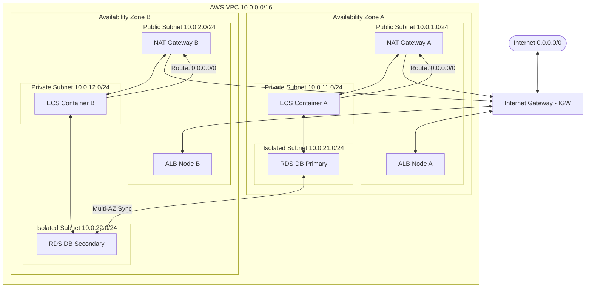
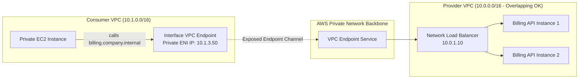

# AWS VPC & Networking (Engineering Architect Reference)

> 📚 Official Docs: https://docs.aws.amazon.com/vpc/latest/userguide/  
> 🎯 SAA-C03 Exam Weight: High — core network design, microservice segmentation, connection management, and hybrid topologies.

---

## 🌐 Topic 1: VPC Fundamentals & Subnet Design

### 📖 Technical Specifications & AWS Core Concepts
* **VPC (Virtual Private Cloud):** A logically isolated virtual network that you define in the AWS cloud. It closely resembles a traditional network that you'd operate in your own data center.
* **Subnet:** A range of IP addresses in your VPC. Subnets are Availability Zone (AZ) specific; **a single subnet cannot span multiple AZs**.
* **Public Subnet:** A subnet configured with a route table that directs traffic to an Internet Gateway (IGW), allowing bidirectional public internet communication.
* **Private Subnet:** A subnet configured with a route table that directs traffic to a NAT Gateway or NAT Instance, allowing outbound-only internet communication while blocking inbound requests.
* **Isolated Subnet:** A subnet with no route to the internet (local VPC routing only), used for highly sensitive databases and backends.
* **CIDR (Classless Inter-Domain Routing):** A method for allocating IP addresses and routing IP packets (e.g., `10.0.0.0/16` for VPC, `10.0.1.0/24` for subnets).
* **Reserved IP Addresses:** AWS reserves the **first 4 and the last 1 IP address** in every subnet (5 IPs total) for VPC routing, DNS, and network identification.
* **Dedicated Tenancy:** A VPC configuration where all EC2 instances run on physical hardware dedicated to a single customer, satisfying strict compliance/licensing constraints at an elevated cost.

---

### 🗺️ Visual Architecture: Subnet Tier Layout & Traffic Flows



---

### 🧠 Architectural Probing & Decision Scenarios
* **Scenario:** Why does AWS reserve 5 IP addresses per subnet, and how does this affect size planning (specifically a `/28` subnet)?**
  * **Design:** AWS reserves these IPs for infrastructure management:
    * `x.x.x.0` — Network Address
    * `x.x.x.1` — VPC Router (default gateway)
    * `x.x.x.2` — AWS Reserved DNS Resolver (AmazonProvidedDNS)
    * `x.x.x.3` — AWS Future Use (reserved for protocol mapping)
    * `x.x.x.255` — Network Broadcast (AWS does not support broadcast, but reserves this)
  * **Impact:** In a small `/28` subnet (16 IPs total), you only have **11 usable IP addresses** ($16 - 5 = 11$). This is a common exam gotcha when sizing subnets for Auto Scaling Groups.

* **Scenario:** When should you choose dedicated tenancy for a VPC, and what are the cost implications?**
  * **Design:** Choose dedicated tenancy only when regulatory compliances (such as HIPAA, PCI-DSS, or government rules) or host-bound software licensing agreements forbid sharing physical hardware with other tenants. It carries an automatic flat fee of $2/hour per region, making it far more expensive than standard tenancy.

* **Scenario:** What defines a public subnet vs. a private subnet or an isolated subnet, and how do their route tables differ?**
  * **Design:** * **Public Subnet:** Route table contains: `0.0.0.0/0 → igw-xxxx` (Internet Gateway). Instances must have public IPs.
    * **Private Subnet:** Route table contains: `0.0.0.0/0 → nat-xxxx` (NAT Gateway). Instances use private IPs.
    * **Isolated Subnet:** Route table contains *only* the local VPC route (e.g., `10.0.0.0/16 → local`). No outbound internet route exists.

---

### 📐 Application Design Patterns & Trade-offs
* **Preventing IP Address Exhaustion in Dynamic Container Environments (ECS/EKS):**
  * **The Challenge:** Running serverless containers (ECS Fargate or EKS on Fargate) using the `awsvpc` network mode. Every single task/pod launched consumes a private IP from its subnet. If you configure a tight `/24` subnet (251 usable IPs) and trigger a rapid scaling event or deploy a large microservice cluster, you will quickly exhaust the IP space, causing new tasks to fail with provisioning errors.
  * **The Architectural Pattern:** Design custom VPCs with wide CIDR blocks (e.g., `/16` giving 65,536 IPs). When allocating subnets specifically for dynamic container runtimes, partition them into wide ranges (at least `/21` giving 2048 IPs per AZ) rather than traditional `/24` blocks. This accommodates scaling spikes and rolling blue/green deployments where old and new tasks run concurrently.

---

### 💻 Hands-on CLI Commands
* **Create a custom VPC and enable standard DNS settings:**
  ```bash
  # 1. Create the VPC
  aws ec2 create-vpc --cidr-block 10.0.0.0/16 --tag-specifications 'ResourceType=vpc,Tags=[{Key=Name,Value=MyVPC}]'
  
  # 2. Enable DNS hostnames (essential for private hosted zones)
  aws ec2 modify-vpc-attribute --vpc-id vpc-0abc123def456 --enable-dns-hostnames
  aws ec2 modify-vpc-attribute --vpc-id vpc-0abc123def456 --enable-dns-resolution
  ```
* **Create subnets and configure auto-assign public IP rules:**
  ```bash
  # Create a subnet
  aws ec2 create-subnet --vpc-id vpc-0abc123def456 --cidr-block 10.0.1.0/24 --availability-zone us-east-1a
  
  # Enable auto-assign public IP for public subnet
  aws ec2 modify-subnet-attribute --subnet-id subnet-0abc123def456 --map-public-ip-on-launch
  ```

---

## 🚪 Topic 2: Internet Gateways (IGW) & Route Tables

### 📖 Technical Specifications & AWS Core Concepts
* **Internet Gateway (IGW):** A redundant, horizontally scaled, highly available VPC component that allows communication between instances in your VPC and the internet.
* **Route Table:** A set of rules (routes) used to determine where network traffic directed to an IP address is forwarded.
* **Longest Prefix Match:** The AWS routing rule stating that if a packet matches multiple routes in a route table, the **most specific route** (the route with the longest matching prefix or largest CIDR mask) wins.

---

### 🧠 Architectural Probing & Decision Scenarios
* **Scenario:** Why is attaching an Internet Gateway (IGW) to a VPC not enough to grant internet access to public instances?**
  * **Design:** Attaching the IGW only establishes the physical path. You must also update the **Route Table** associated with the public subnets to route all non-local traffic (`0.0.0.0/0`) to the IGW (`igw-xxxx`). Additionally, the instances themselves must possess a public IPv4 address and security groups that permit outbound traffic.

* **Scenario:** How does AWS resolve route conflicts if a packet matches multiple rules in a route table?**
  * **Design:** AWS uses **Longest Prefix Match**. For example, if your route table has:
    1. `0.0.0.0/0 → igw-xxxx` (Matches all IPs, prefix length `/0`)
    2. `10.1.0.0/16 → pcx-xxxx` (Matches VPC Peer, prefix length `/16`)
    3. `10.1.2.0/24 → nat-xxxx` (Matches NAT, prefix length `/24`)
    * A packet bound for `10.1.2.5` matches all three, but will be routed to the **NAT Gateway** because `/24` is the most specific prefix.

---

### 📐 Application Design Patterns & Trade-offs
* **Stateless vs. Stateful Failovers at the Network Layer:**
  * **The Design Pattern:** When designing multi-AZ architectures, avoid putting different target roles (e.g. primary databases and application servers) in the same subnet with a single shared route table if their internet routing needs differ. Use separate custom route tables for public tiers (pointing to the IGW) and private tiers (pointing to the NAT Gateways). This keeps routing tables segmented, predictable, and clean, preventing routing loops or routing tables from becoming single points of failure.

---

### 💻 Hands-on CLI Commands
* **Configure routing to the Internet Gateway:**
  ```bash
  # 1. Create a custom route table for public subnet
  aws ec2 create-route-table --vpc-id vpc-0abc123def456 --tag-specifications 'ResourceType=route-table,Tags=[{Key=Name,Value=PublicRT}]'
  
  # 2. Add route pointing to the Internet Gateway (IGW)
  aws ec2 create-route --route-table-id rtb-0abc123def456 --destination-cidr-block 0.0.0.0/0 --gateway-id igw-0abc123def456
  
  # 3. Associate the route table with your public subnet
  aws ec2 associate-route-table --subnet-id subnet-0abc123def456 --route-table-id rtb-0abc123def456
  ```

---

## ⚡ Topic 3: NAT Gateways vs. NAT Instances

### 📖 Technical Specifications & AWS Core Concepts
* **NAT Gateway:** A highly available, managed Network Address Translation (NAT) service that permits instances in private subnets to send outbound traffic to the internet while preventing inbound connections from the internet.
* **NAT Instance:** A legacy architecture where a self-managed EC2 instance configured with NAT software performs address translation.
* **Source/Destination Check:** An EC2 attribute that requires instances to only send or receive traffic matching their own IP. **This must be disabled on NAT Instances** to allow them to forward traffic for other servers.

---

### 🧠 Architectural Probing & Decision Scenarios
* **Scenario:** Why choose a NAT Gateway over a NAT Instance, and how do you achieve High Availability (HA) across multiple AZs?**
  * **Design:** * **Managed vs. Self-managed:** NAT Gateways auto-scale bandwidth (from 5 Gbps to 100 Gbps), require no OS patching, have built-in high availability, and do not require managing EC2 security groups or disabling source/destination checks.
    * **High Availability Design:** A NAT Gateway is **AZ-bound**. To build an HA multi-AZ architecture, you **must provision one NAT Gateway per Availability Zone**. If you deploy only one NAT Gateway in AZ-A and it fails (or AZ-A goes down), all private subnets in AZ-B and AZ-C will lose internet access.

* **Scenario:** How does NAT Gateway handle security groups, and why can it only process outbound-initiated traffic?**
  * **Design:** NAT Gateways **do not support Security Groups** at the infrastructure layer (access is controlled via the private instance security groups and subnet NACLs). It is a one-way gateway: it only translates traffic initiated inside the private subnet, recording the connection state so return packets can get back. It rejects all unsolicited inbound traffic.

---

### 📐 Application Design Patterns & Trade-offs
* **Handling Connection Failures During High-Throughput API Ingestion:**
  * **The Challenge:** Your private instances perform millions of API calls to external third-party servers. All outbound requests pass through the NAT Gateway. As the request volume grows, connections begin to fail with intermittent timeout errors.
  * **The Root Cause:** **SNAT Port Exhaustion**. A NAT Gateway maps a private IP to its public IP using a unique source port. Because there are only ~64,000 available ports per destination IP, if your servers make too many concurrent connections to the *same* destination IP, the NAT Gateway runs out of ports.
  * **The Architectural Patterns:**
    1. **Keep-Alives:** Enable HTTP Keep-Alives in your application code to reuse TCP connections rather than opening a new one for every request.
    2. **Multiple Elastic IPs:** Associate up to 8 Elastic IPs with your NAT Gateway. This multiplies the available SNAT port pool, allowing up to 512,000 concurrent connections to the same destination.

---

### 🚀 Real-World Production Insights
* **The NAT Gateway SNAT Outage:**
  * **The Failure:** A high-throughput Java microservice running in private subnets executes parallel calls to an external partner API. During a flash traffic spike, clients receive `504 Gateway Timeout` or `ConnectTimeoutException` errors. CloudWatch metrics show the NAT Gateway status is active, but network logs reveal dropping outbound packets.
  * **The Root Cause:** **SNAT Port Allocation Exhaustion**. Because the application opening connections doesn't reuse them, and all instances hit the same external API endpoint IP, the NAT Gateway's single Elastic IP exhausts its 64,512 port range limit.
  * **Mitigation:** Modify the application connection pool settings to enable **HTTP Keep-Alives** with connection reuse. Simultaneously, attach **multiple Elastic IP addresses** to the NAT Gateway. Each added EIP allocates an extra 64,000 port pool for outbound mapping, multiplying scaling limits.

---

### 💻 Hands-on CLI Commands
* **Provision a NAT Gateway in a public subnet:**
  ```bash
  # 1. Allocate an Elastic IP for the gateway
  ALLOC_ID=$(aws ec2 allocate-address --domain vpc --query 'AllocationId' --output text)
  
  # 2. Create the NAT Gateway
  aws ec2 create-nat-gateway \
    --subnet-id subnet-PUBLIC_SUB_ID \
    --allocation-id $ALLOC_ID \
    --tag-specifications 'ResourceType=nat-gateway,Tags=[{Key=Name,Value=MainNAT}]'
    
  # 3. Associate NAT Gateway with private subnet route table
  aws ec2 create-route --route-table-id rtb-PRIVATE_RT_ID --destination-cidr-block 0.0.0.0/0 --nat-gateway-id nat-0abc123def456
  ```

---

## 🛡️ Topic 4: Security Groups vs. Network ACLs (Stateful vs. Stateless)

### 📖 Technical Specifications & AWS Core Concepts
* **Security Group:** A stateful firewall that controls inbound and outbound traffic at the **Elastic Network Interface (ENI)** / instance level.
* **Network ACL (NACL):** A stateless firewall that controls inbound and outbound traffic at the **subnet** level.
* **Stateful Firewall:** A firewall that remembers connection states. If an inbound packet is allowed, return outbound traffic is automatically allowed regardless of outbound rules.
* **Stateless Firewall:** A firewall that does not trace connection state. Outbound return traffic must be explicitly allowed by an outbound rule.
* **Ephemeral Ports:** Temporary, high-numbered ports (range `1024-65535`) opened by client operating systems to receive return packets from servers.

---

### 🧠 Architectural Probing & Decision Scenarios
* **Scenario:** What is the difference between stateful (Security Groups) and stateless (NACLs) firewalls, and how does this affect return traffic and ephemeral ports?**
  * **Design:** * **Security Groups (Stateful):** If you open port `80` inbound, the return traffic on the ephemeral port is automatically permitted.
    * **NACLs (Stateless):** If you open port `80` inbound, you **must explicitly create an outbound rule** allowing traffic to the ephemeral port range `1024-65535`. If you forget the outbound ephemeral rule, the private instance will receive the request but the client will timeout waiting for the response.

* **Scenario:** Why would you choose a NACL instead of a Security Group to block a malicious IP address?**
  * **Design:** Security Groups **only support ALLOW rules**. You cannot create a rule to explicitly block an IP. NACLs support both **ALLOW and DENY rules**, and rules are evaluated sequentially (lowest rule number first). To block a hacker IP, you create a low-numbered rule (e.g., Rule `#50`) with a `DENY` action for that IP.

* **Scenario:** What is the architectural benefit of referencing a Security Group ID in another Security Group's rules instead of CIDR ranges?**
  * **Design:** Referencing a Security Group ID (e.g., allowing port `3306` from `sg-app`) creates a dynamic security boundary. Only EC2 instances that have `sg-app` attached can connect to the database. If the Auto Scaling group launches 50 new app servers, they automatically inherit database access without needing static IP updates.

---

### 📐 Application Design Patterns & Trade-offs
* **Mitigating "Blast Radius" with Microsegmentation:**
  * **The Strategy:** Avoid putting all application components under a single generic security group (e.g. `default-sg`). If one public-facing container is compromised, the attacker can scan and access internal databases and cache tiers.
  * **The Design Pattern:** Implement strict **tier-based security group references**.
    * `sg-alb` -> Allows public `443` inbound.
    * `sg-app` -> Allows port `8080` inbound **only** if the source is `sg-alb`.
    * `sg-db` -> Allows port `5432` inbound **only** if the source is `sg-app`.
    * This ensures that even if an attacker gains shell access to an instance in the app tier, they cannot bypass the load balancer security layer to connect directly to other peer app instances or databases unless explicitly permitted.

---

### 💻 Hands-on CLI Commands
* **Create a Security Group with nested references:**
  ```bash
  # 1. Create Database SG
  DB_SG_ID=$(aws ec2 create-security-group --group-name db-sg --description "DB SG" --vpc-id vpc-0abc123def456 --query 'GroupId' --output text)
  
  # 2. Authorize inbound MySQL port (3306) specifically from App SG
  aws ec2 authorize-security-group-ingress --group-id $DB_SG_ID --protocol tcp --port 3306 --source-group sg-APP_SG_ID
  ```
* **Configure a custom NACL with sequential rules:**
  ```bash
  # 1. Create custom NACL
  NACL_ID=$(aws ec2 create-network-acl --vpc-id vpc-0abc123def456 --query 'NetworkAcl.NetworkAclId' --output text)
  
  # 2. Block inbound traffic from malicious IP
  aws ec2 create-network-acl-entry --network-acl-id $NACL_ID --rule-number 50 --protocol -1 --cidr-block 203.0.113.45/32 --ingress --rule-action deny
  ```

---

## 🗺️ Topic 5: VPC Peering, Transit Gateway, & PrivateLink

### 📖 Technical Specifications & AWS Core Concepts
* **VPC Peering:** A networking connection that enables you to route traffic between two VPCs privately using IPv4 or IPv6 addresses.
* **Transit Gateway (TGW):** A network transit hub that you can use to interconnect your Virtual Private Clouds (VPCs) and your on-premises networks in a hub-and-spoke configuration.
* **AWS PrivateLink:** A highly secure technology that exposes a specific service hosted in a provider VPC directly to a consumer VPC privately using interface endpoints, avoiding VPC peering.
* **Transit VIF:** A virtual interface used to associate a Direct Connect connection with a Transit Gateway, allowing access to multiple VPCs across accounts and regions.
* **ECMP (Equal-Cost Multi-Path):** A routing strategy that load-balances traffic across multiple paths (VPN tunnels) to scale VPN bandwidth beyond the 1.25 Gbps threshold.

---

### 🗺️ Visual Architecture: AWS PrivateLink (NLB-to-Endpoint) Model



---

### 🧠 Architectural Probing & Decision Scenarios
* **Scenario:** Why is VPC Peering non-transitive, and how does Transit Gateway solve the $N \times (N-1) / 2$ mesh complexity?**
  * **Design:** * **Non-transitive:** If VPC-A is peered with VPC-B, and VPC-B is peered with VPC-C, VPC-A cannot route traffic to VPC-C through VPC-B. 
    * **Mesh Complexity:** Because of this, interconnecting 10 VPCs requires 45 individual peering connections ($10 \times 9 / 2$). 
    * **TGW Solution:** Transit Gateway acts as a central cloud router (hub). You attach all VPCs to the TGW (spokes). This reduces the connection overhead to a simple 1-to-1 attachment per VPC, permitting transitive routing across all VPCs through the hub's route tables.

* **Scenario:** Why does VPC Peering require non-overlapping CIDRs, and how does PrivateLink solve this limitation?**
  * **Design:** * **The Overlap Conflict:** VPC Peering routes traffic at the network level. If VPC-A and VPC-B both use `10.0.0.0/16`, routers cannot determine whether an IP resides locally or in the peered VPC, causing routing failures.
    * **PrivateLink Solution:** PrivateLink does not peer networks. Instead, it places a local Elastic Network Interface (ENI) with a single private IP from the consumer's subnet into their VPC. This ENI maps directly to a Network Load Balancer (NLB) in the provider's VPC. Because routing is handled via this endpoint interface, both VPCs can share the exact same CIDR block without conflict.

---

### 📐 Application Design Patterns & Trade-offs
* **Exposing SaaS API Services Cross-Account at Scale:**
  * **The Scenario:** Your team built a billing API used by 50 other internal company applications owned by different teams.
  * **VPC Peering Approach:** Connects the entire network. If one tenant application goes rogue, it can scan your entire VPC subnet, scan other database ports, and potentially interfere with your infrastructure. Plus, managing 50 peers creates significant route table overhead.
  * **PrivateLink Approach:** Set up an NLB in front of your billing service and create an **Endpoint Service**. Share the service name with the 50 consumer accounts. They mount it via an **Interface VPC Endpoint**. 
  * **Architectural Advantage:** Consumers can only access your billing API on its specific port (e.g., port `443`). They have zero network visibility into the rest of your VPC, IP space conflicts are completely bypassed, and billing data flows securely across accounts without public internet exposure.

---

### 💻 Hands-on CLI Commands
* **Request a VPC Peering Connection:**
  ```bash
  aws ec2 create-vpc-peering-connection \
    --vpc-id vpc-0abc123def456 \
    --peer-vpc-id vpc-0def456abc123 \
    --peer-owner-id 123456789012
  ```
* **Accept a VPC Peering Connection in the peer account:**
  ```bash
  aws ec2 accept-vpc-peering-connection --vpc-peering-connection-id pcx-0abc123def456
  ```

---

## 📂 Topic 6: VPC Endpoints (Gateway vs. Interface)

### 📖 Technical Specifications & AWS Core Concepts
* **VPC Endpoint:** A VPC component that enables private connections between your VPC and supported AWS services or VPC endpoint services.
* **Gateway Endpoint:** A type of VPC endpoint that acts as a target in your route table for routing traffic to **Amazon S3** or **Amazon DynamoDB**.
* **Interface Endpoint:** A type of VPC endpoint that creates an Elastic Network Interface (ENI) in your subnet with a private IP address, serving as an entry point for traffic destined to most other AWS services (e.g., SQS, Secrets Manager).
* **VPC Endpoint Policy:** An IAM resource policy that you attach to a VPC endpoint to restrict which principals can access which resources through the endpoint.

---

### 🧠 Architectural Probing & Decision Scenarios
* **Scenario:** When do you choose a Gateway Endpoint over an Interface Endpoint, and how do they differ in cost, route tables, and DNS resolution?**
  * **Design:** * **Service Support:** Gateway Endpoints support **S3 and DynamoDB only**. Interface Endpoints support almost all other AWS services.
    * **Cost:** Gateway Endpoints are **completely free**. Interface Endpoints cost ~$0.01/hour per AZ plus data processing fees ($0.01/GB).
    * **Routing & DNS:** Gateway Endpoints modify your subnet **route tables** (redirecting traffic bound for S3 to `vpce-xxxx`). Interface Endpoints require no route table modifications; instead, they create an **ENI** in your subnet and use **Private DNS** to resolve service hostnames (e.g., `sqs.us-east-1.amazonaws.com`) directly to that private ENI IP.

---

### 📐 Application Design Patterns & Trade-offs
* **Data Exfiltration Prevention via Endpoint Policies:**
  * **The Risk:** An internal developer has access to an EC2 instance in a private subnet. The subnet accesses S3 via a Gateway Endpoint. The developer could potentially write a script to upload proprietary company data from the EC2 instance to their own personal S3 bucket.
  * **The Design Pattern:** Attach a restrictive **VPC Endpoint Policy** to the Gateway Endpoint. Instead of allowing `*` resources, explicitly write a policy that only permits `s3:PutObject` and `s3:GetObject` on the **company's official S3 bucket ARNs**. Any attempts to access external S3 buckets through the VPC endpoint will be rejected, preventing data exfiltration while maintaining private cloud connectivity.

---

### 💻 Hands-on CLI Commands
* **Create a Gateway VPC Endpoint for S3:**
  ```bash
  aws ec2 create-vpc-endpoint \
    --vpc-id vpc-0abc123def456 \
    --service-name com.amazonaws.us-east-1.s3 \
    --route-table-ids rtb-0abc123def456 \
    --vpc-endpoint-type Gateway
  ```
* **Create an Interface VPC Endpoint for Secrets Manager:**
  ```bash
  aws ec2 create-vpc-endpoint \
    --vpc-id vpc-0abc123def456 \
    --service-name com.amazonaws.us-east-1.secretsmanager \
    --vpc-endpoint-type Interface \
    --subnet-ids subnet-0abc123def456 \
    --security-group-ids sg-0abc123def456
  ```

---

## 🏢 Topic 7: Hybrid Connectivity (VPN vs. Direct Connect)

### 📖 Technical Specifications & AWS Core Concepts
* **VGW (Virtual Private Gateway):** The VPN endpoint on the AWS side of a Site-to-Site VPN connection attached to your VPC.
* **CGW (Customer Gateway):** The physical device or software application on the on-premises side of a Site-to-Site VPN connection.
* **Direct Connect (DX):** A cloud service solution that establishes a dedicated, private physical network connection from your premises directly to AWS, bypassing the public internet.
* **Dedicated Connection:** A physical ethernet port (1, 10, or 100 Gbps) allocated directly to a single customer.
* **Hosted Connection:** A logical connection partitioned by an AWS Direct Connect partner, supporting lower bandwidth increments (50 Mbps to 10 Gbps).
* **VPN CloudHub:** A VGW feature that enables multiple on-premises sites to communicate with each other and the VPC using simple Site-to-Site VPN tunnels in a hub-and-spoke model.

---

### 🧠 Architectural Probing & Decision Scenarios
* **Scenario:** How do you choose between AWS Site-to-Site VPN and AWS Direct Connect (DX) for on-premises connectivity?**
  * **Design:** * **Site-to-Site VPN:** Choose when you need a **fast, low-cost setup** (takes minutes to configure) and can tolerate variable latency since traffic travels over the public internet. Limited to 1.25 Gbps per tunnel.
    * **Direct Connect (DX):** Choose when you require **consistent latency, high bandwidth** (up to 100 Gbps), and cheaper data egress costs for large-scale migrations. It takes weeks to months to provision the physical fiber links.

* **Scenario:** Since Direct Connect traffic is unencrypted by default, how do you secure sensitive data crossing the physical link?**
  * **Design:** To encrypt DX traffic, you have three options:
    1. **VPN over DX:** Provision an IPsec VPN tunnel that runs *inside* the private Direct Connect link, ensuring encryption at layer 3.
    2. **MACsec:** Deploy IEEE 802.1AE encryption at the physical link layer (available only on 10 Gbps and 100 Gbps dedicated connections).
    3. **Application-level TLS:** Encrypt the payload itself (HTTPS/TLS) before transmitting.

---

### 📐 Application Design Patterns & Trade-offs
* **Active-Passive vs. Active-Active Hybrid Routing Resiliency:**
  * **The Design Pattern:** When setting up a hybrid network for an enterprise client:
    * **Active-Active DX:** Deploy two separate Direct Connect connections terminated at different AWS Direct Connect locations (routers) using BGP (Border Gateway Protocol) routing weight parameters. This avoids a single point of failure.
    * **Direct Connect with VPN Backup:** For cost-sensitive designs, deploy a single Direct Connect link as the primary path, and configure an AWS Site-to-Site VPN as the backup path. Configure BGP routing to prioritize the DX link (using local preference). If the fiber optic link is cut, the BGP session drops, and traffic instantly routes over the encrypted VPN tunnel, maintaining application availability at a lower cost.

---

### 💻 Hands-on CLI Commands
* **Provision Site-to-Site VPN components:**
  ```bash
  # 1. Create Virtual Private Gateway (VGW)
  VGW_ID=$(aws ec2 create-vpn-gateway --type ipsec.1 --query 'VpnGateway.VpnGatewayId' --output text)
  
  # 2. Attach VGW to VPC
  aws ec2 attach-vpn-gateway --vpn-gateway-id $VGW_ID --vpc-id vpc-0abc123def456
  
  # 3. Create Customer Gateway (CGW) for your local router
  CGW_ID=$(aws ec2 create-customer-gateway --type ipsec.1 --public-ip-address 203.0.113.50 --bgp-asn 65000 --query 'CustomerGateway.CustomerGatewayId' --output text)
  
  # 4. Create the VPN connection
  aws ec2 create-vpn-connection --type ipsec.1 --customer-gateway-id $CGW_ID --vpn-gateway-id $VGW_ID
  ```

---

## 🕵️ Topic 8: Bastion Hosts, SSM Session Manager, Traffic Mirroring, & Flow Logs

### 📖 Technical Specifications & AWS Core Concepts
* **Bastion Host:** An EC2 instance deployed in a public subnet configured to receive administrative SSH/RDP traffic, acting as a jump server to access private backend instances.
* **SSM Session Manager:** An AWS Systems Manager capability that allows you to manage EC2 instances through an interactive one-click browser-based shell or AWS CLI without opening inbound ports (like SSH port 22) or managing bastion hosts.
* **VPC Flow Logs:** An AWS feature that captures metadata (IP address, ports, protocols, action) about IP traffic flowing to and from network interfaces (ENIs) in your VPC.
* **VPC Traffic Mirroring:** An AWS feature that copies raw layer 2 network traffic from a source Elastic Network Interface (ENI) and forwards it to out-of-band security and monitoring appliances for deep packet inspection.

---

### 🧠 Architectural Probing & Decision Scenarios
* **Scenario:** Why should you migrate from classic Bastion Hosts to Systems Manager (SSM) Session Manager for administrative access?**
  * **Design:** Bastion hosts require maintaining a public EC2 instance, managing SSH keys, and opening inbound port `22` to the internet, creating a security attack surface. SSM Session Manager **requires zero open inbound ports**. Traffic is encrypted and authenticated through IAM, session commands are logged to CloudWatch/S3 for audits, and developers log in using their standard AWS credentials.

* **Scenario:** What is the difference between VPC Flow Logs and VPC Traffic Mirroring for security monitoring and troubleshooting?**
  * **Design:** * **VPC Flow Logs** capture **network metadata only** (e.g., `ACCEPT` or `REJECT` on port `80`, IP addresses, bytes). It does not inspect packet payloads. Use it to trace connection failures, audit access, or analyze bandwidth usage.
    * **VPC Traffic Mirroring** copies **raw, full network packets** (layer 2). Use it for deep packet inspection (DPI), running Intrusion Detection/Prevention Systems (IDS/IPS), or capturing payload contents for security forensics.

---

### 📐 Application Design Patterns & Trade-offs
* **Serverless Connection Pooling Challenges:**
  * **The Challenge:** A serverless function (AWS Lambda) inside a private subnet needs to connect to an RDS database.
  * **The Connection Storm:** Because Lambda scales horizontally instantly, a burst of requests creates a separate database connection for every Lambda container. This can quickly exhaust the database's connection pool (causing HTTP 500 errors).
  * **The Architectural Pattern:** Deploy **RDS Proxy** in front of the database. RDS Proxy sits in the private VPC subnet, pools and shares database connections, and reduces RDS memory utilization. The Lambda function queries RDS Proxy instead of the database directly, shielding the relational database from serverless connection storms.

---

### 🚀 Real-World Production Insights
* **The Serverless DB Connection Crash:**
  * **The Failure:** You deploy a serverless endpoint using API Gateway and AWS Lambda, which queries a PostgreSQL RDS instance in an isolated subnet. During a sudden marketing event, traffic surges to 5,000 API requests/sec. The app crashes with `too many connections` errors.
  * **The Cause:** Every time Lambda scales to handle concurrent requests, it boots a separate micro-container. Each container opens a stateful connection to PostgreSQL. PostgreSQL is resource-constrained and allocates ~10MB of RAM per connection. With 1,000 concurrent containers, DB memory is exhausted, query threads block, and the database drops offline.
  * **Mitigation:** Deploy **RDS Proxy** between Lambda and RDS. RDS Proxy holds a fixed pool of connections to the database and performs multiplexing—allowing multiple Lambda invocations to share the same physical DB connection. For serverless applications querying RDS, RDS Proxy is a mandatory architectural component.

---

### 💻 Hands-on CLI Commands
* **Start an interactive terminal session via SSM (No SSH key or port 22 required):**
  ```bash
  aws ssm start-session --target i-0123456789abcdef0
  ```
* **Enable VPC Flow Logs to record rejected traffic to an S3 bucket:**
  ```bash
  aws ec2 create-flow-logs \
    --resource-type VPC \
    --resource-ids vpc-0abc123def456 \
    --traffic-type REJECT \
    --log-destination-type s3 \
    --log-destination arn:aws:s3:::prod-flow-logs-bucket/
  ```
