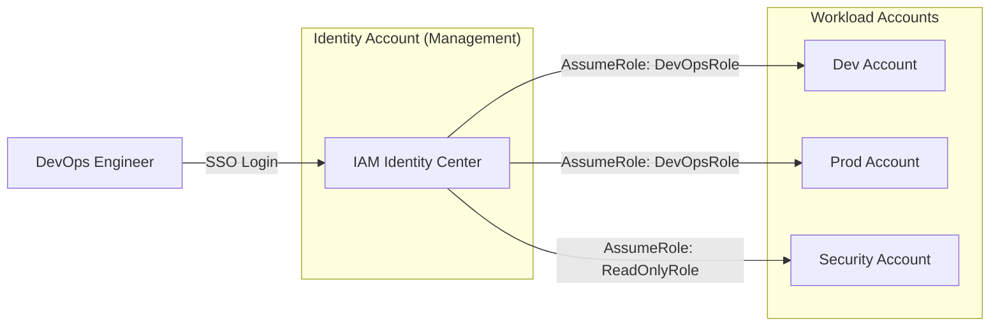
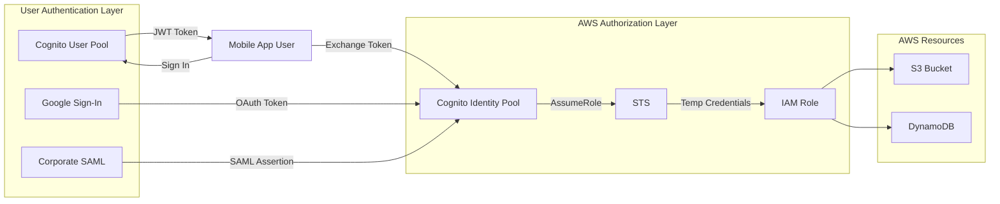

# Section 03 — Identity & Federation

> **Purpose**: AWS identity is not merely "who can access what." It is the foundational control plane upon which every security boundary, every audit trail, and every operational delegation rests. A principal engineer designing a multi-account AWS estate does not think in terms of "IAM users" — they think in terms of trust chains, permission boundaries, blast radius isolation, and the invariant that **explicit deny always wins**.
>
> **Official Documentation**: [IAM](https://docs.aws.amazon.com/IAM/latest/UserGuide/introduction.html) | [Organizations](https://docs.aws.amazon.com/organizations/latest/userguide/orgs_introduction.html) | [IAM Identity Center](https://docs.aws.amazon.com/singlesignon/latest/userguide/what-is.html) | [STS](https://docs.aws.amazon.com/STS/latest/APIReference/welcome.html) | [Cognito](https://docs.aws.amazon.com/cognito/latest/developerguide/what-is-amazon-cognito.html)

---

## 1. Why Identity Architecture Matters

In a single-account AWS environment, identity is straightforward: a handful of IAM users, some roles, a few policies. In an enterprise with 50+ AWS accounts, thousands of developers, third-party SaaS integrations, regulated workloads, and multi-region deployments, identity architecture becomes a **distributed systems problem**.

The questions shift from "how do I give Bob S3 access?" to:
- How do we ensure a compromised CI/CD pipeline in the `sandbox` OU cannot assume a role in the `production` OU?
- How do we enforce that no account — not even the root user — can disable CloudTrail?
- How do we let a SaaS vendor write to our S3 bucket without creating a confused deputy vulnerability?
- How do we audit who accessed what, when, and from where — across 50 accounts?

These are architect-level concerns. The primitives are simple (users, roles, policies), but their **composition** determines whether your organization survives a security incident or collapses under it.

---

## 2. IAM Core Architecture

### 2.1 The IAM Identity Model

AWS IAM recognizes three identity types, and understanding their operational semantics is critical:

| Identity Type | Credential Lifetime | Use Case | Operational Risk |
|---------------|---------------------|----------|------------------|
| **User** | Long-term (Access Key ID + Secret Access Key) | Human console access, legacy application authentication | Credential leakage, rotation burden, no automatic expiration |
| **Role** | Temporary (STS issues tokens: 15 min – 12 hrs default, up to configurable max) | Service-to-service auth, cross-account access, federation, SSO | Properly designed: minimal risk. Improper trust policies: catastrophic |
| **Group** | Container only (no credentials) | Organizing users for policy attachment | Low — but nested groups are NOT supported |

> **Architectural Principle**: In a modern AWS environment, IAM Users should be **extremely rare**. Humans authenticate via federation (IAM Identity Center, SAML, OIDC). Applications authenticate via IAM Roles (instance profiles, ECS task roles, Lambda execution roles). Long-term access keys are a code smell.

### 2.2 Policy Types and the Permission Evaluation Stack

IAM policies are not monolithic. AWS evaluates **six distinct policy types** in a specific order. A senior architect must understand not just each type, but how they **intersect**:

```
┌─────────────────────────────────────────────────────────────────────────────┐
│                    IAM Policy Evaluation Order                              │
│                                                                             │
│  Step 1:  Explicit DENY in any policy?              → DENY (hard stop)       │
│  Step 2:  SCP (Service Control Policy) allows?     → If NO: DENY            │
│  Step 3:  Resource-based policy allows?            → If YES: ALLOW*         │
│  Step 4:  Permission Boundary allows?              → If NO: DENY            │
│  Step 5:  Session Policy allows?                   → If NO: DENY            │
│  Step 6:  Identity Policy allows?                  → If YES: ALLOW          │
│  Step 7:  No match found?                          → Implicit DENY         │
│                                                                             │
│  * Same-account resource policies can allow without role assumption         │
│  * Cross-account ALWAYS requires both identity AND resource policy OR       │
│    role assumption with trust policy + identity policy                        │
└─────────────────────────────────────────────────────────────────────────────┘
```

**Effective Permission = Identity Policy ∩ Permission Boundary ∩ Session Policy ∩ SCP**

If any layer does not allow, the result is DENY. This intersection model is why architects say: "IAM is a series of gates."

#### Policy Type Deep Dive

| Policy Type | Attachment Point | Grants Permissions? | Common Misconception |
|-------------|------------------|---------------------|---------------------|
| **Identity Policy** | User, Group, Role | Yes | "More policies = more access" — actually, intersection logic means over-permissioning one layer doesn't help if another layer restricts |
| **Resource Policy** | S3 bucket, KMS key, SQS queue, SNS topic, Lambda function | Yes (who can access this resource) | "Resource policy replaces identity policy" — incorrect; cross-account needs BOTH |
| **Permission Boundary** | User or Role | **No** — only restricts | "I attached a boundary, so my dev has access" — boundaries RESTRICT, never grant |
| **SCP** | AWS Organizations account or OU | **No** — only restricts | "SCP grants permissions to the org" — SCPs are permission boundaries for entire accounts |
| **Session Policy** | Passed during `AssumeRole` | **No** — only restricts this session | Session policies are ephemeral permission boundaries |
| **Inline Policy** | Embedded in one principal | Yes | Hard to audit at scale; prefer managed policies |

### 2.3 The Trust Policy — IAM's Most Misunderstood Feature

A Role has two policies: a **Trust Policy** (who can assume the role) and **Identity Policies** (what the role can do). The trust policy is NOT an access control list — it defines which principals are **permitted to attempt assumption**. The actual assumption still requires:

1. The caller has `sts:AssumeRole` permission in their identity policy
2. The role's trust policy permits the caller
3. (Cross-account) The caller's account is not blocked by an SCP

```json
{
  "Version": "2012-10-17",
  "Statement": [
    {
      "Effect": "Allow",
      "Principal": {
        "AWS": "arn:aws:iam::999888777666:root"
      },
      "Action": "sts:AssumeRole",
      "Condition": {
        "StringEquals": {
          "sts:ExternalId": "unique-identifier-from-third-party"
        }
      }
    }
  ]
}
```

> **Critical Design Scenario**: "Why does `Principal: *` in a trust policy NOT mean 'anyone on the internet can assume this role'?"
> 
> **Answer**: The trust policy principal `"*"` or `"AWS": "*"` only allows AWS principals (authenticated AWS entities) to attempt assumption. An unauthenticated internet user cannot call `sts:AssumeRole` — they need valid AWS credentials first. However, `"*"` is still dangerous because it allows any authenticated AWS account. Always scope trust policies to specific account ARNs or use `ExternalId` for third-party scenarios.

### 2.4 The Confused Deputy Problem and ExternalId

The confused deputy problem is a classic cross-account security vulnerability:

**Scenario**: Your company (Account A) uses a SaaS vendor (Account B) to monitor S3 buckets. The SaaS vendor asks you to create a role they can assume to read your CloudTrail logs.

**Vulnerability**: Another customer of the SaaS vendor (Account C) discovers the SaaS vendor's account ID and your role name. Account C calls `sts:AssumeRole` on YOUR role, pretending to be the SaaS vendor. If your trust policy says `"Principal": { "AWS": "arn:aws:iam::999888777666:root" }`, AWS allows it — because Account C is authenticated as an AWS principal in the trusted account.

**Solution**: `ExternalId`. The SaaS vendor generates a unique UUID per customer. Your trust policy requires that UUID. Account C cannot guess Account B's unique UUID for your account, so Account C cannot assume your role even though they are authenticated in Account B.

```json
{
  "Condition": {
    "StringEquals": {
      "sts:ExternalId": "a1b2c3d4-e5f6-7890-abcd-ef1234567890"
    }
  }
}
```

> **Architectural Trap**: "Does ExternalId encrypt the session or add encryption to the role assumption?" No. ExternalId is a plaintext string condition. It prevents the confused deputy by adding a required parameter that only the legitimate third party knows. It is NOT a secret in the cryptographic sense — it is a shared identifier that prevents arbitrary assumption.

---

## 3. AWS Organizations and Multi-Account Architecture

### 3.1 Why Multi-Account?

A single AWS account is a **blast radius unit**. When (not if) something goes wrong — a leaked access key, a misconfigured S3 bucket, a compromised CI/CD pipeline — the damage is contained to one account.

| Single Account | Multi-Account |
|----------------|---------------|
| One compromised admin → entire estate at risk | Compromised dev sandbox → production unaffected |
| Resource naming collisions across teams | Teams own their accounts; no naming conflicts |
| Hard to attribute costs and compliance | Each account has its own CloudTrail, Config, billing |
| SCPs impossible (no Organizations) | OUs enforce guardrails across accounts automatically |

> **AWS Well-Architected Guidance**: For production workloads, AWS recommends separate accounts per environment (dev, staging, prod), per business unit, and per regulated workload. The management account should have zero workloads — it exists only for billing aggregation and Organization governance.

### 3.2 SCPs: The Permission Boundary for Accounts

Service Control Policies are the most powerful and most dangerous Organizations feature. They are **permission boundaries**, not permission grants.

**SCP Inheritance Model**:

```
Root OU
├── Sandbox OU  [SCP: Deny production services]
│   ├── Account A
│   └── Account B
├── Production OU  [SCP: Require MFA for deletion]
│   ├── Account C
│   └── Account D
└── Security OU  [SCP: Deny leaving organization, deny stopping CloudTrail]
    └── Audit Account
```

SCPs cascade down. An SCP attached to `Sandbox OU` affects Accounts A and B. An SCP attached to `Root` affects every account.

**Critical SCP Behaviors**:
- SCPs do NOT grant permissions. An account with only `FullAWSAccess` SCP still needs identity policies to do anything.
- The root user of an account IS bound by SCPs. This surprises many engineers.
- SCPs cannot restrict the management account. The management account must be secured separately.
- SCP evaluation order: `Deny` statements are evaluated first, then `Allow` statements. If no `Allow` matches, implicit deny.

**Common SCP Patterns**:

```json
// Prevent accounts from leaving the organization (protect against theft)
{
  "Version": "2012-10-17",
  "Statement": [{
    "Effect": "Deny",
    "Action": "organizations:LeaveOrganization",
    "Resource": "*"
  }]
}

// Require MFA for destructive S3 actions
{
  "Version": "2012-10-17",
  "Statement": [{
    "Effect": "Deny",
    "Action": ["s3:DeleteBucket", "s3:PutBucketPolicy"],
    "Resource": "*",
    "Condition": {
      "BoolIfExists": { "aws:MultiFactorAuthPresent": "false" }
    }
  }]
}

// Restrict regions (prevent data residency violations)
{
  "Version": "2012-10-17",
  "Statement": [{
    "Effect": "Deny",
    "Action": "*",
    "Resource": "*",
    "Condition": {
      "StringNotEquals": {
        "aws:RequestedRegion": ["us-east-1", "eu-west-1"]
      }
    }
  }]
}
```

### 3.3 Cross-Account Role Assumption Architecture

The canonical multi-account access pattern uses a **centralized identity account** with IAM Identity Center, and **role assumption** into workload accounts.



**Why this pattern?**
- No long-term credentials in workload accounts
- Centralized user lifecycle (onboard/offboard in one place)
- Audit trail in every account's CloudTrail shows who assumed what role, when
- Least privilege per account: the DevOps role in Prod has different (tighter) permissions than in Dev

---

## 4. IAM Identity Center (Successor to AWS SSO)

### 4.1 What It Actually Is

IAM Identity Center is AWS's native workforce identity solution. It is **not** just "SSO for AWS" — it is a complete identity federation, permission management, and application access platform.

**Architecture Components**:

| Component | Purpose | Architect Consideration |
|-----------|---------|------------------------|
| **Identity Source** | Where users live | Built-in directory (small orgs), External IdP (enterprise), or AWS Managed AD |
| **Permission Sets** | IAM policy templates + role trust configuration | Map to IAM roles in target accounts. Can include AWS managed policies, inline policies, or customer-managed policies |
| **Account Assignments** | Who gets what access where | Can assign to users or groups. Supports ABAC via attribute-based conditions |
| **Applications** | SAML/OIDC app integrations | Not just AWS accounts — also Salesforce, Office 365, GitHub Enterprise, etc. |

### 4.2 Permission Sets vs IAM Roles

A common confusion: "If Identity Center creates IAM roles in target accounts, why do I need Permission Sets?"

Permission Sets are **templates**. They define:
- The IAM policies (what the role CAN do)
- The session duration (how long tokens are valid)
- Whether MFA is required
- Whether a custom policy boundary applies

When you assign a Permission Set to an account, Identity Center **provisions an IAM role** in that account with a predictable naming convention: `AWSReservedSSO_<PermissionSetName>_<random-suffix>`.

> **Operational Reality**: Identity Center eventually consistent provisioning can take minutes. If you create a Permission Set and immediately try to use it, the role may not exist yet in the target account. Design your CI/CD to account for this delay.

### 4.3 ABAC in Identity Center

Attribute-Based Access Control scales identity management by orders of magnitude:

Instead of:
```
User: alice@corp.com → Permission Set: FinanceS3Access → Account: Finance-Prod
User: bob@corp.com → Permission Set: FinanceS3Access → Account: Finance-Prod
User: charlie@corp.com → Permission Set: FinanceS3Access → Account: Finance-Prod
... (repeat for 500 finance users)
```

Use ABAC:
```
User tag: department=finance → Permission Set: DepartmentAccess → Account: Finance-Prod
Permission Set policy condition: aws:PrincipalTag/department == aws:ResourceTag/department
```

One Permission Set. One assignment. Scales to thousands of users.

> **ABAC Limitation**: ABAC requires discipline in tagging. If resources aren't tagged consistently, ABAC silently fails (implicit deny). Many organizations adopt a hybrid: ABAC for broad access, explicit assignments for privileged roles.

---

## 5. AWS STS and Temporary Credentials

### 5.1 STS API Operations

The Security Token Service is the backbone of all temporary credential issuance in AWS. Understand each API's purpose:

| API | Use Case | Token Lifetime | Key Characteristic |
|-----|----------|---------------|-------------------|
| `AssumeRole` | Cross-account, service-to-service, user-to-role | 15 min – 1 hr (default), up to configurable max | Most common. Returns AccessKeyId, SecretAccessKey, SessionToken |
| `AssumeRoleWithSAML` | Enterprise SSO (Okta, Azure AD, AD FS) | Same as AssumeRole | No long-term AWS credentials needed. User authenticates via IdP, gets SAML assertion, exchanges for AWS temp creds |
| `AssumeRoleWithWebIdentity` | Mobile/web app federation (deprecated, use Cognito) | Same as AssumeRole | Replaced by Cognito Identity Pools for most use cases |
| `GetSessionToken` | MFA-protected API calls for IAM users | 15 min – 36 hrs | Only for IAM users (not roles). Enforces MFA if configured |
| `GetFederationToken` | Temporary credentials for untrusted users | 15 min – 36 hrs | Can restrict permissions via policy parameter. Legacy pattern |
| `AssumeRoot` | Rare — assume the root user of an Organization member account | Session policy only | Very limited, specific use cases only |

### 5.2 STS Regional Endpoints and Token Validity

STS tokens are **regionally scoped in terms of where they are issued**, but the credentials are valid globally (with service-specific exceptions).

**Critical behavior**: When you call `sts:AssumeRole` against `sts.us-east-1.amazonaws.com`, the token is issued from that region. The token itself contains an expiration timestamp. The token is valid everywhere — but if you use it to call a regional service, that service must be in a region where the role exists (which it does, since IAM is global).

**Session Tags**: You can pass tags during `AssumeRole`:
```bash
aws sts assume-role \
  --role-arn arn:aws:iam::123456789012:role/CrossAccountRole \
  --role-session-name alice-session \
  --tags Key=Project,Value=Alpha \
  --transitive-tag-keys Project
```

These tags appear in CloudTrail and can be used for ABAC decisions during the session.

---

## 6. Amazon Cognito: User Pools vs Identity Pools

Cognito is AWS's customer-facing identity service (as opposed to IAM Identity Center, which is workforce-facing). It serves two distinct purposes that are often conflated:

### 6.1 Cognito User Pools (Authentication)

- **Purpose**: Create and manage a user directory for your application
- **Users**: Your application's end users (customers), not your employees
- **Features**: Sign-up/sign-in, MFA, password policies, custom attributes, Lambda triggers (pre-sign-up, post-authentication)
- **Output**: JWT tokens (ID token, access token, refresh token)
- **Integration**: API Gateway authorizer, ALB authentication, application-level JWT validation

### 6.2 Cognito Identity Pools (Authorization)

- **Purpose**: Exchange valid credentials (from User Pools, Google, Facebook, SAML, OIDC) for **temporary AWS credentials**
- **Input**: Identity token (from User Pool, Google, etc.)
- **Output**: AWS Access Key + Secret Key + Session Token (via STS)
- **IAM Integration**: Identity Pools map authenticated/unauthenticated identities to IAM roles
- **Use case**: Mobile app users directly uploading files to S3, IoT devices writing to DynamoDB



> **Common Misconception**: "I use Cognito User Pools, so my users can access AWS services." Not automatically. User Pools authenticate users and issue JWTs. To access AWS resources, you need an Identity Pool to exchange those JWTs for AWS temporary credentials, OR you use API Gateway with a User Pool authorizer and let your backend assume roles.

---

## 7. AWS Directory Service

AWS provides three managed directory options. The choice depends on your Active Directory dependency:

| Option | Use Case | Key Limitation |
|--------|----------|---------------|
| **AWS Managed Microsoft AD** | Full AD forest in AWS; need Group Policy, LDAP, trusts with on-prem AD | Most expensive; requires VPC with at least 2 subnets |
| **AD Connector** | Proxy to existing on-prem AD; no directory hosted in AWS | Requires VPN/Direct Connect to on-prem; single point of failure if link drops |
| **Simple AD** | Standalone Samba-based AD-compatible directory; small orgs, test environments | Not real Windows AD; limited scale; no forest trusts |

**Architectural Decision**: If you need real Active Directory features (GPOs, schema extensions, multi-forest trusts), use AWS Managed Microsoft AD. If you just need LDAP authentication for a Linux application, consider Simple AD or even Amazon OpenSearch Service's built-in security. AD Connector is a bridge, not a destination.

---

## 8. Operational Realities and Failure Scenarios

### 8.1 IAM Is Eventually Consistent

After creating a user, role, or policy, there is a **propagation delay** (typically seconds, but can be up to a minute in some regions). If your automation creates a role and immediately assumes it, you may get `AccessDenied`.

**Mitigation**: Retry with exponential backoff, or add a small delay (2-5 seconds) in automation scripts.

### 8.2 The 4096-Character Policy Limit

IAM policies have a maximum size of 6,144 characters for customer-managed policies and 2,048 for inline policies. Large organizations hit this limit when adding many S3 bucket ARNs to a policy.

**Solution**: Use resource tags + ABAC conditions instead of enumerating ARNs. Or use multiple managed policies per principal (up to 10 per user/role, up to 20 total size).

### 8.3 IAM Role Session Limits

- Maximum 5,000 concurrent role sessions per role (soft limit, can be increased)
- Session duration: minimum 15 minutes, maximum 12 hours (configurable per role)
- For long-running processes (ETL jobs, CI/CD), ensure session duration covers the job, or implement credential refresh logic

### 8.4 Audit and Compliance

Every IAM API call is logged to CloudTrail. Key audit queries:

```bash
# Find who assumed a role and when
aws cloudtrail lookup-events \
  --lookup-attributes AttributeKey=EventName,AttributeValue=AssumeRole \
  --max-results 50

# Find policy changes
aws cloudtrail lookup-events \
  --lookup-attributes AttributeKey=EventName,AttributeValue=PutRolePolicy
```

> **Operational Tip**: Enable CloudTrail in EVERY account, including the management account. Forward logs to a central Security account using Organizations trail. The management account's CloudTrail is the only record of Organization-level changes (SCP modifications, account invitations).

---

## 9. Architectural Decision Challenges

* **Scenario:** A company with 500 developers, 50 AWS accounts, and SOC2 compliance requirements needs an IAM design.
  * **Design:** Implement a multi-account structure (Management + OUs for Sandbox, NonProd, Prod, Security) with zero workloads in the management account. Use IAM Identity Center with SAML 2.0 integration to a corporate IdP, ensuring zero IAM Users in workload accounts. Create Permission Sets per role type with ABAC. Enforce guardrails via SCPs (e.g., deny destructive actions without MFA in Prod, deny stopping CloudTrail in Security). Centralize CloudTrail to the Security account and configure break-glass emergency roles. Because this limits blast radius, centralizes lifecycle management, and guarantees the immutable audit trails required for SOC2.

* **Scenario:** A developer created a role with `Principal: *` in the trust policy, and you must assess the risk.
  * **Design:** Clarify that the risk is not unauthenticated internet access, but that *any* authenticated AWS principal in any account can attempt assumption. Because if an attacker has `sts:AssumeRole` permissions and there is no `ExternalId` or `SourceIp` condition restricting the trust policy, they will successfully assume the role, creating a severe vulnerability if the role has permissive identity policies.

* **Scenario:** You must explain why a Permission Boundary does not grant permissions.
  * **Design:** Describe the Permission Boundary as a maximum-permissions ceiling that restricts rather than grants. Because effective permissions are the intersection of the identity policy and the permission boundary. If the boundary allows `s3:*` but the identity policy has no S3 statements, the result is an implicit DENY; the identity policy must explicitly allow the action within the allowed boundary.

* **Scenario:** You are choosing between a resource policy and cross-account role assumption.
  * **Design:** Use a resource policy for simpler, same-account access or isolated single-resource cross-account access (like an S3 bucket or KMS key) without STS overhead. Use cross-account role assumption for complex access patterns, crossing account boundaries for multiple services, or when you need session tags and explicit CloudTrail audit logs of the assumption event. Because role assumption provides centralized auditing and scales better for complex identities, whereas resource policies are simpler but harder to audit centrally at scale.

---

## 10. Tradeoffs and Alternatives

| Scenario | AWS Native | Third-Alternative | Tradeoff |
|----------|-----------|-------------------|----------|
| Workforce SSO | IAM Identity Center | Okta/Azure AD with SAML | Identity Center is free but less feature-rich than enterprise IdPs. Most enterprises use external IdP + Identity Center as broker |
| Customer auth | Cognito User Pools | Auth0, Firebase Auth | Cognito is cheaper at scale but has fewer features. Auth0 has better developer experience |
| Machine-to-machine | IAM Roles | VPC Lattice service auth, SigV4 with custom signers | IAM Roles are AWS-native but require credential management. VPC Lattice simplifies service-to-service auth within a VPC |
| Directory services | AWS Managed Microsoft AD | Self-managed AD on EC2, JumpCloud | Managed AD is expensive (~$0.40/hr for small). Self-managed requires operational expertise |

---

## 11. Cross-Service Integration Patterns

### Pattern: Secure CI/CD Pipeline
```
GitHub Actions → OIDC Token → IAM Role (web identity) → ECR Push + ECS Deploy
```
No long-term AWS credentials in GitHub. The OIDC trust policy validates the GitHub repository and branch.

### Pattern: Centralized Security Monitoring
```
All Accounts → CloudTrail → S3 in Security Account → Athena Queries + GuardDuty
```
The Security account is a read-only observer. Its SCP prevents it from being modified by other accounts.

### Pattern: SaaS Integration with ExternalId
```
SaaS Vendor → AssumeRole (with ExternalId) → S3 Write Access (limited prefix)
```
Trust policy restricts to vendor account + ExternalId. Identity policy restricts to specific S3 prefix. Principle of least privilege at every layer.

---

## 12. Points to Remember

- **IAM is global** — policies apply across all regions simultaneously. IAM API calls route to `us-east-1` regardless of your configured region.
- **Explicit Deny always wins** — this is the most tested IAM concept. A single `Deny` in any policy overrides all `Allow` statements.
- **Roles have no credentials** — they are assumed. The temporary credentials come from STS, not from the role itself.
- **SCPs restrict, never grant** — an account with `FullAWSAccess` SCP and no identity policies can do nothing.
- **Permission Boundaries restrict, never grant** — same logic as SCPs but applied to individual users/roles.
- **Trust Policy != Access Policy** — the trust policy says WHO can assume. The identity policies say WHAT the role can do.
- **ExternalId prevents confused deputy** — always require it for third-party role assumption.
- **IAM Identity Center replaces AWS SSO** — the old name is deprecated. Use Permission Sets, not direct IAM users.
- **Cognito User Pools authenticate; Identity Pools authorize AWS resource access** — they are separate concerns.
- **CloudTrail logs every IAM API call** — essential for security auditing and compliance.
- **IAM is eventually consistent** — automation must handle propagation delays after creating roles/policies.
- **Maximum 10 managed policies per principal** — design policies to be broad but safe, not narrow and numerous.

---

## 13. Further Reading

For deeper coverage, CLI commands, and exam-specific trivia, see the detailed reference:

- **IAM fundamentals**: [`IAM-Users-Groups-Policies-Roles.md`](../../detailed-reference/IAM-Users-Groups-Policies-Roles.md)
- **Advanced identity (SAP level)**: [`SAP-03-Identity-Federation.md`](../../detailed-reference/SAP-03-Identity-Federation.md)
- **Organizations, Identity Center, Cognito, STS**: [`AdvancedIdentity-DR-OtherServices.md`](../../detailed-reference/AdvancedIdentity-DR-OtherServices.md)

---

*Section 03 — Identity & Federation | Last Validated: 2026-05-10*
