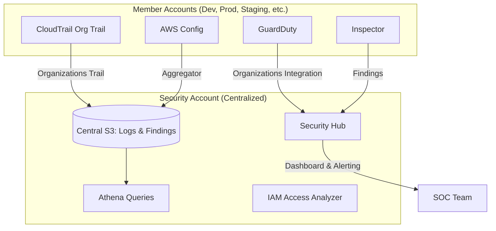

# Section 04 — Security

> **Purpose**: Security in AWS is not a product — it is a **property of the architecture**. No single service makes you secure. KMS encrypts data, WAF filters requests, GuardDuty detects threats, but security emerges from how these services compose with IAM, networking, logging, and operational processes. This section treats AWS security services as an integrated control system, not a checklist.
>
> **Official Documentation**: [KMS](https://docs.aws.amazon.com/kms/latest/developerguide/overview.html) | [WAF](https://docs.aws.amazon.com/waf/latest/developerguide/waf-chapter.html) | [Shield](https://docs.aws.amazon.com/waf/latest/developerguide/shield-chapter.html) | [GuardDuty](https://docs.aws.amazon.com/guardduty/latest/ug/what-is-guardduty.html) | [CloudTrail](https://docs.aws.amazon.com/awscloudtrail/latest/userguide/cloudtrail-user-guide.html) | [AWS Config](https://docs.aws.amazon.com/config/latest/developerguide/WhatIsConfig.html)

---

## 1. Encryption Architecture

### 1.1 Encryption in Flight vs At Rest vs Client-Side

| Layer | What It Protects | AWS Responsibility | Your Responsibility | Typical Failure |
|-------|-----------------|-------------------|---------------------|-----------------|
| **In Flight (TLS)** | Data moving between services or over internet | Provides TLS endpoints, certificate infrastructure | Enable TLS, configure certificate validation, enforce HTTPS | Using HTTP instead of HTTPS, not validating certificates, outdated TLS versions |
| **At Rest (Server-Side)** | Data stored on disk/flash | Provides encryption mechanisms (KMS, SSE-S3, etc.) | Choose encryption method, manage key access policies, rotate keys | Leaving buckets unencrypted, using AWS-owned keys for regulated data, overly permissive key policies |
| **Client-Side** | Data before it reaches AWS | None — zero knowledge of plaintext | Generate keys, perform encryption, manage key lifecycle | Losing client keys (irrecoverable), weak encryption algorithms, key leakage |

> **Architectural Insight**: Most AWS services support all three layers. The question is not "should we encrypt?" but "where do we manage the trust boundary?" AWS-managed keys shift trust to AWS. Customer-managed keys shift operational burden to you. Client-side encryption shifts everything to you but maximizes confidentiality.

### 1.2 AWS KMS: The Encryption Control Plane

KMS is the most security-critical AWS service after IAM. A compromised KMS key policy can expose every encrypted resource in your account.

#### Key Types and Trust Model

| Key Type | Control Level | Rotation | Cost | Audit Visibility | Use Case |
|----------|--------------|----------|------|-----------------|----------|
| **AWS Owned** (SSE-S3 default) | None — fully AWS-managed | Automatic, opaque | Free | None | Default S3, SQS, DynamoDB encryption. You don't know the key exists |
| **AWS Managed** (`aws/s3`, `aws/rds`) | View metadata only, no policy control | Automatic, 365 days | Free | CloudTrail shows key usage | When you need audit trail but not custom access control |
| **Customer Managed** (CMK) | Full control: key policy, grants, aliases, rotation | Automatic (365d) or manual | $1/month/key + API calls | Full CloudTrail, key policy version history | Regulated data, cross-account sharing, custom rotation schedules |
| **External (Imported)** | You hold key material | Manual only | $1/month/key | Full | Compliance requiring keys generated in on-prem HSM |
| **CloudHSM Backed** | Key material in your HSM | Manual | $1/month/key + CloudHSM hourly | Full | FIPS 140-2 Level 3 requirement |

#### The Key Policy Is a Second Gate

Even if IAM permits `kms:Encrypt`, the **key policy must also allow it**. This is unique to KMS among AWS services.

```
IAM Policy: "DevRole can call kms:Encrypt on any key"
Key Policy: "Only AdminRole and ApplicationRole can use this key"
Result: DevRole CANNOT encrypt — key policy DENIES
```

> **Operational Reality**: When you create a CMK, the default key policy grants the account root full access. This is a safety mechanism so you don't lock yourself out. But in production, you should replace this with a least-privilege policy immediately.

#### Envelope Encryption: The Only Way to Encrypt Large Data

KMS can only encrypt up to 4 KB directly. For anything larger, envelope encryption is mandatory:

```
1. Call KMS GenerateDataKey
   → Returns: { PlaintextDataKey, EncryptedDataKey }

2. Encrypt data locally using PlaintextDataKey (AES-256-GCM)

3. Store: { EncryptedData, EncryptedDataKey }

4. Discard PlaintextDataKey from memory

5. To decrypt: Call KMS Decrypt(EncryptedDataKey) → PlaintextDataKey
   → Decrypt data locally → Discard PlaintextDataKey
```

**Why this matters architecturally**:
- KMS API throttling: 5,500 req/sec per CMK. Encrypting 10,000 S3 objects directly = throttling. Envelope encryption = 1 KMS call per batch.
- **S3 Bucket Key** (modern optimization): S3 caches data keys per bucket, reducing KMS calls by ~99%. Enable this for high-throughput workloads.
- **Performance**: Local AES encryption is microseconds. KMS API calls are milliseconds + network latency.

#### Multi-Region Keys: Nuance and Limitations

Multi-region keys replicate key material across regions with the same key ID. However:

- **Replicated keys are independent** after initial replication. They do NOT sync key policy changes, alias changes, or rotation events across regions.
- **Primary key** controls replication. If you delete the primary, replicas become independent (not deleted).
- **Use case**: Global DynamoDB tables, S3 cross-region replication, DR scenarios where you need to decrypt in the DR region without cross-region KMS calls.
- **Not for**: Real-time synchronized encryption across regions (replicas don't stay in sync).

### 1.3 CloudHSM: When KMS Is Not Enough

CloudHSM provides dedicated FIPS 140-2 Level 3 hardware. Unlike KMS (FIPS 140-2 Level 2), CloudHSM keys never leave the HSM boundary — AWS personnel cannot access them.

**When to use CloudHSM**:
- Regulatory mandate for FIPS 140-2 Level 3 (some government, financial)
- Keys must be generated in hardware you control
- Custom cryptographic operations (key derivation, special algorithms)
- Oracle TDE with customer-managed keys

**Operational burden**:
- You manage HSM cluster, backups, client software, and failover
- ~$1.69/hour per HSM (2+ required for HA across AZs)
- Client software must run on EC2 in the same VPC
- **KMS Custom Key Store** offers a middle ground: KMS API convenience with CloudHSM backing. Higher latency, but simpler operations.

> **Interview Trap**: "Is CloudHSM more secure than KMS?" Security is not a scalar. CloudHSM provides stronger hardware isolation and compliance certification. KMS provides better integration, automatic scaling, and lower operational overhead. The right answer depends on the threat model and compliance requirements.

---

## 2. Secrets Management: Parameter Store vs Secrets Manager

Both services store sensitive values, but their operational semantics differ:

| Dimension | SSM Parameter Store | AWS Secrets Manager |
|-----------|---------------------|---------------------|
| **Primary purpose** | Configuration + secrets | Secrets only |
| **Encryption** | SecureString type (KMS) | Always KMS-encrypted |
| **Auto-rotation** | No (can build with Lambda) | Yes — native RDS/Redshift/DocumentDB integration |
| **Cost model** | Free (Standard tier, 10K params); $0.05/param/month (Advanced, 100K params) | $0.40/secret/month + API call charges |
| **Max size** | 4 KB (Standard), 8 KB (Advanced) | 65 KB |
| **TTL/Expiry** | Advanced tier supports parameter policies with expiration | No built-in TTL |
| **Cross-account** | IAM + resource-based policy on parameter | Resource policy on secret |
| **Replication** | No | Yes — multi-region secret replication |
| **Use case** | App config, feature flags, non-rotating secrets | Database passwords, API keys, certificates requiring rotation |

**Architectural Decision**: Use Parameter Store for configuration and static secrets. Use Secrets Manager for credentials that MUST rotate (especially database passwords). In practice, many organizations use both: Parameter Store for app config paths, Secrets Manager for actual secrets.

> **Operational Reality**: Secrets Manager rotation uses AWS Lambda under the hood. The Lambda function must have IAM permissions to change the database password AND update the secret. If the database is in a VPC, the Lambda needs VPC networking. This is a common source of rotation failures in production.

---

## 3. AWS Certificate Manager (ACM)

ACM's value is not certificate issuance — it is **certificate lifecycle automation**.

| Certificate Type | Cost | Private Key Export | Auto-Renewal | Use Case |
|-----------------|------|-------------------|--------------|----------|
| **Public** | Free | No | Yes (DNS validation) | ALB, CloudFront, API Gateway |
| **Private** | $0.75/month/CA + $0.058/certificate | Yes | Yes | Internal mTLS, service mesh, internal APIs |
| **Imported** | Free | Yes (you provided it) | No (you manage renewal) | When you must use a specific CA or have existing certs |

**Critical constraint**: ACM-issued public certificates cannot have their private key exported. The private key remains in AWS's secure storage. If your application needs the private key (e.g., running an HTTPS server directly on EC2 with nginx), you must either:
- Use an imported certificate
- Terminate TLS at ALB/CloudFront and use HTTP internally
- Use ACM Private CA

> **Regional Constraint for CloudFront**: CloudFront is a global service, but ACM certificates attached to CloudFront distributions MUST be in `us-east-1`. This is a hard requirement, not a recommendation. Always request CloudFront certificates in us-east-1 regardless of your origin's region.

---

## 4. Perimeter and Application Security

### 4.1 AWS WAF: Layer 7 Protection

WAF operates at the application layer (HTTP/HTTPS). It understands request structure: headers, body, query strings, cookies, and URI paths.

**Integration Points**:
- Application Load Balancer (ALB)
- CloudFront distributions
- API Gateway (REST, HTTP, and WebSocket APIs)
- AppSync GraphQL APIs
- Cognito User Pools

**WAF Architecture**:

```
Internet → [CloudFront / ALB / API Gateway] → [WAF Web ACL] → [Target]
                                    ↑
                             Rule Evaluation:
                             1. AWS Managed Rules (SQLi, XSS, bots)
                             2. Custom Rules (IP sets, geo-blocks, rate limits)
                             3. Default Action (Allow / Block)
```

**Rule Evaluation Order**:
1. Rules are evaluated in priority order (lowest number first)
2. First matching rule determines action (Allow, Block, Count, CAPTCHA, Challenge)
3. If no rule matches, default action applies

**Rate-Based Rules**: Block an IP if it exceeds a threshold (e.g., 2,000 requests per 5 minutes) within a sliding window. Useful for Layer 7 DDoS mitigation and brute-force protection.

> **WAF Limitation**: WAF cannot protect Network Load Balancer (Layer 4) or EC2 instances directly. You must place an ALB or CloudFront in front. For Layer 4 DDoS protection, use Shield Advanced.

### 4.2 AWS Shield: DDoS Protection

| Feature | Shield Standard | Shield Advanced |
|---------|----------------|-----------------|
| **Cost** | Free (automatic) | $3,000/month per organization + data transfer |
| **Protection** | Automatic for all AWS customers | Enhanced, with 24/7 DRT (DDoS Response Team) |
| **Layer 3/4** | SYN floods, UDP reflection, DNS amplification | Same + volumetric attack mitigation with larger capacity |
| **Layer 7** | Basic (via WAF, not Shield directly) | Integrated with WAF — DRT helps create custom WAF rules during attacks |
| **Cost protection** | None | Reimburses scaling costs incurred during attack |
| **Health-based detection** | No | Yes — monitors CloudWatch, Route53 health checks |
| **Required for** | Everyone (automatic) | Mission-critical applications, compliance requirements |

> **Architectural Note**: Shield Standard is always on — you cannot disable it. It protects all AWS customers at the network edge. Shield Advanced is an insurance policy: you pay monthly for the DRT access and cost protection, hoping you never need it, but knowing that a large attack without it could cost tens of thousands in scaled resource charges.

### 4.3 AWS Firewall Manager

Firewall Manager is a **centralized management layer** for WAF rules, Shield Advanced protections, and security groups across an AWS Organization.

**Use case**: You have 50 accounts and need every ALB to have the same baseline WAF rules. Without Firewall Manager, you manually configure 50 Web ACLs. With Firewall Manager, you define a policy once, and it auto-provisions to all (or selected) accounts.

**Firewall Manager Policies**:
- **WAF Policies**: Deploy Web ACLs to specified resource types across accounts
- **Shield Advanced Policies**: Enroll resources into Shield Advanced automatically
- **Security Group Policies**: Audit and remediate security group rules (e.g., "no inbound 0.0.0.0/0 to port 22")
- **Network Firewall Policies**: Manage AWS Network Firewall rule groups centrally

> **Operational Reality**: Firewall Manager requires AWS Organizations. It can take several minutes for policies to propagate to all member accounts. Changes made directly in member accounts can be overridden by Firewall Manager's remediation setting.

---

## 5. Threat Detection and Compliance

### 5.1 Amazon GuardDuty: Intelligent Threat Detection

GuardDuty is a **continuous security monitoring** service that analyzes CloudTrail logs, VPC Flow Logs, and DNS logs using machine learning and threat intelligence feeds.

**Data Sources**:
- **CloudTrail Event Logs**: Unusual API calls (IAM policy changes at 3 AM, root account usage)
- **VPC Flow Logs**: Unusual network patterns (port scanning, connections to known malicious IPs)
- **DNS Logs**: DNS queries to known bad domains, crypto-mining C2 domains
- **EKS Audit Logs**: Kubernetes API suspicious activity
- **S3 Data Events**: Unusual data access patterns, public exposure

**GuardDuty is NOT a replacement for**:
- WAF (Layer 7 filtering — GuardDuty only detects, doesn't block)
- Security groups (network access control)
- Manual penetration testing

**GuardDuty Architecture**:

```
CloudTrail Logs ──┐
VPC Flow Logs ────┼──► GuardDuty ML Analysis ──► Findings ──► EventBridge ──► SNS/Email/Slack/Lambda
DNS Logs ─────────┤                                      ──► Security Hub ──► Central Dashboard
EKS Audit Logs ───┘
```

> **Cost Model**: GuardDuty charges per GB of analyzed logs. In busy accounts, this can be significant ($1-5K/month for large estates). You can selectively disable data sources (e.g., turn off EKS if you don't use Kubernetes) to control costs. There is no charge for the first 30 days (free trial).

### 5.2 Amazon Inspector: Vulnerability Assessment

Inspector scans EC2 instances and container images for:
- Common vulnerabilities and exposures (CVEs) in OS packages
- Network reachability analysis (is this instance exposed to the internet unnecessarily?)
- CIS benchmarks compliance

**Inspector vs GuardDuty**:
- **Inspector**: "What vulnerabilities exist in my software?" (proactive, scheduled scans)
- **GuardDuty**: "Is someone attacking me right now?" (reactive, continuous monitoring)

**Inspector v2 (modern)**: Continuous scanning, not just scheduled assessments. Integrates with ECR for container image scanning.

### 5.3 Amazon Macie: Data Discovery and Classification

Macie uses machine learning to discover and classify sensitive data in S3:
- **Personally Identifiable Information (PII)**: names, addresses, SSNs, passport numbers
- **Financial data**: credit card numbers, bank accounts
- **Custom data**: regex patterns you define

**Macie Architecture**:
```
S3 Buckets ──► Macie Classification Jobs ──► Findings ──► EventBridge ──► Alerts
        └─► Automated Discovery (continuous, near real-time)
```

> **Cost**: Macie charges per GB of data classified. For buckets with petabytes of data, this can be expensive. Use targeted classification jobs (specific buckets, specific prefixes) rather than account-wide classification for cost control.

### 5.4 AWS Security Hub: The Central Pane

Security Hub aggregates findings from:
- GuardDuty
- Inspector
- Macie
- IAM Access Analyzer
- Firewall Manager
- Third-party integrations (Palo Alto, Splunk, etc.)

It provides a **consolidated security score** and compliance standards mapping (CIS AWS Foundations, PCI DSS, AWS Foundational Security Best Practices).

> **Operational Reality**: Security Hub can be noisy out of the box. Expect hundreds of findings initially. The real value comes from: (1) automating remediation for common findings, (2) establishing baseline metrics and trending over time, (3) integrating with SOAR/SIEM tools.

### 5.5 IAM Access Analyzer: External Access Detection

Access Analyzer analyzes resource policies (S3, IAM roles, KMS keys, Lambda, SQS, SNS) to identify resources accessible from outside your account or Organization.

**Key capabilities**:
- **External access findings**: "S3 bucket my-data is accessible from account 999888777666"
- **Unused access findings** (new): Identify IAM roles with permissions that haven't been used in 90+ days
- **Custom archive rules**: Mark expected external access as intentional to reduce noise

> **Architect Interview Question**: "How do you prevent S3 bucket misconfigurations?"
> **Answer**: Defense in depth — (1) SCPs to block public bucket policies, (2) IAM Access Analyzer to detect external access, (3) AWS Config rule for s3-bucket-public-read-prohibited, (4) Amazon Macie to detect sensitive data in exposed buckets, (5) GuardDuty to alert on anomalous access patterns.

---

## 6. Audit and Compliance Services

### 6.1 AWS CloudTrail: The Audit Log of AWS

CloudTrail records **every AWS API call** (management events) and optionally data events (S3 object-level operations, Lambda invocations).

**CloudTrail Architecture**:

```
All AWS API Calls ──► CloudTrail ──► S3 (long-term storage)
                              └──► CloudWatch Logs (real-time monitoring)

Organizations Trail: Management Account configures, ALL member accounts log to central S3
```

**Event Types**:
- **Management Events**: Control plane operations (create EC2, modify IAM policy, delete bucket). Always logged.
- **Data Events**: Data plane operations (S3 GetObject, Lambda Invoke). Must be explicitly enabled. Higher cost.
- **Insights Events**: ML-detected unusual API call patterns (e.g., 10x normal `DeleteBucket` rate). Requires CloudTrail Insights add-on.

**Critical CloudTrail Behaviors**:
- CloudTrail is **eventually consistent**: There can be a 5-15 minute delay between API call and log delivery.
- CloudTrail is **regional for most services**, but **global for IAM, STS, CloudFront, Route53, and Support**.
- An **Organization Trail** automatically logs all accounts in the Organization. No per-account setup needed.
- **Log file integrity validation**: Cryptographically sign logs so you can detect tampering. Enable this for compliance.

> **Operational Reality**: CloudTrail S3 buckets grow continuously. A busy account can generate 10-100 GB/day. Implement S3 Lifecycle policies to transition to Glacier after 90 days, and set up Athena for ad-hoc querying.

### 6.2 AWS Config: Configuration Drift Detection

Config records the **configuration state** of AWS resources and evaluates them against rules.

**Config is NOT a security monitoring tool** — it is a **configuration compliance tool**. It answers "is my infrastructure configured according to policy?" not "am I under attack?"

**Key capabilities**:
- **Configuration history**: What did this security group look like last Tuesday?
- **Config rules**: Evaluate resources against policies (e.g., "all EBS volumes must be encrypted")
- **Conformance packs**: Collections of Config rules for compliance standards (PCI DSS, HIPAA)
- **Remediation actions**: Auto-remediate non-compliant resources via SSM Automation

**Config vs CloudTrail**:

| Question | CloudTrail Answers | Config Answers |
|----------|-------------------|----------------|
| Who changed the security group? | Yes (API call record) | No (unless you correlate with CloudTrail) |
| What rules are in this security group right now? | No | Yes (configuration snapshot) |
| Is this security group compliant with policy? | No | Yes (Config rule evaluation) |
| Was this S3 bucket public last week? | Maybe (if API call happened) | Yes (configuration timeline) |

> **Cost Warning**: Config charges per configuration item recorded. In accounts with thousands of resources, this adds up. Be selective about which resource types to record. Enable only the rules you actually need.

---

## 7. Security Service Integration Architecture

### The Centralized Security Account Pattern

For organizations with 10+ accounts, the centralized security account is the gold standard:



**Why this pattern works**:
- **Tamper resistance**: Member account admins cannot delete their own audit logs (logs live in Security account)
- **Centralized analysis**: Athena queries across all accounts' CloudTrail data from one place
- **Unified alerting**: Security Hub provides a single dashboard for all findings
- **SCP protection**: Security account has an SCP preventing it from being removed from the Organization or having its CloudTrail stopped

---

## 8. Interview Challenges and Tradeoffs

### Q1: "SSE-S3 vs SSE-KMS vs SSE-C vs Client-Side Encryption — when would you use each?"

**Answer**:
- **SSE-S3**: Default S3 encryption. AWS manages keys entirely. Use when you need encryption-at-rest but have no key management requirements. Zero operational burden.
- **SSE-KMS**: S3 encryption with KMS key. You control key policy, rotation, and audit. Use when you need key-level access control, CloudTrail audit of every encryption operation, or cross-account key sharing. Costs $1/key/month + API charges.
- **SSE-C**: You provide the key in the API request. AWS encrypts server-side but uses YOUR key. Use when you have an existing key management system and need AWS to do the encryption work. Key must be sent with every request.
- **Client-Side**: You encrypt before sending to S3. AWS never sees plaintext. Use for maximum confidentiality, regulatory requirements, or when you don't trust the cloud provider with data. You manage key distribution, rotation, and recovery.

### Q2: "A GuardDuty finding says an EC2 instance is communicating with a known crypto-mining C2 domain. What's your response?"

**Answer**:
1. **Contain**: Isolate the instance — modify its security group to block all outbound traffic except to your incident response tools.
2. **Preserve evidence**: Create a memory snapshot (if possible) and EBS snapshot before terminating. Do NOT stop the instance yet — live memory contains forensic evidence.
3. **Analyze**: Check CloudTrail for how the instance was launched (compromised credentials? vulnerable application?). Check VPC Flow Logs for lateral movement.
4. **Remediate**: Rotate all credentials that had access to the instance. Patch the vulnerability that allowed entry. Review IAM policies for excessive permissions.
5. **Prevent**: Implement GuardDuty automated response (EventBridge → Lambda → isolate instance). Enable VPC Flow Logs in all accounts. Implement least-privilege IAM.

### Q3: "Why is AWS Config not sufficient for security monitoring?"

**Answer**: Config evaluates configuration state against rules. It detects "this S3 bucket is public" but NOT "someone is exfiltrating data from this bucket right now." Config is **point-in-time compliance**; GuardDuty/CloudTrail are **continuous behavioral monitoring**. You need both: Config to ensure baseline security posture, and GuardDuty/CloudTrail to detect active threats and audit actions.

---

## 9. Points to Remember

- **KMS key policies are mandatory gates** — even root account needs key policy permission to use a CMK.
- **Envelope encryption is mandatory for data > 4 KB** — direct KMS encryption of large files causes throttling.
- **S3 Bucket Key reduces KMS API calls by ~99%** — enable for high-throughput workloads.
- **CloudHSM is not "better KMS"** — it is different. Higher compliance, higher operational burden, higher cost.
- **Secrets Manager rotation requires Lambda in VPC** if the database is VPC-resident — a common production failure point.
- **ACM public certificates cannot export private keys** — design your architecture accordingly.
- **CloudFront certificates MUST be in us-east-1** — request them there regardless of origin region.
- **WAF cannot protect NLB directly** — use ALB/CloudFront/API Gateway as integration points.
- **Shield Standard is free and automatic** — Shield Advanced ($3K/month) adds DRT support and cost protection.
- **GuardDuty detects; it does not block** — findings must trigger EventBridge → automated response.
- **CloudTrail is eventually consistent** — expect 5-15 minute delays in log delivery.
- **Organization Trails log ALL accounts automatically** — use them instead of per-account trails.
- **Config records configuration state; CloudTrail records API calls** — they are complementary, not interchangeable.
- **IAM Access Analyzer finds external access; it does not prevent it** — combine with Config rules and SCPs for prevention.
- **Security Hub is only as good as its integrations** — configure auto-remediation for findings you can fix programmatically.

---

## 13. Further Reading

For deeper coverage, CLI commands, and exam-specific trivia, see the original notes:

- **KMS, WAF, Shield, GuardDuty, Inspector, Macie**: [`Security-KMS-WAF-Shield-GuardDuty.md`](../../original-notes/Security-KMS-WAF-Shield-GuardDuty.md)
- **Advanced security (SAP level)**: [`SAP-04-Security.md`](../../original-notes/SAP-04-Security.md)
- **CloudTrail, Config, monitoring integration**: [`Monitoring-CloudWatch-CloudTrail-Config.md`](../../original-notes/Monitoring-CloudWatch-CloudTrail-Config.md)

---

*Section 04 — Security | Last Validated: 2026-05-10*
