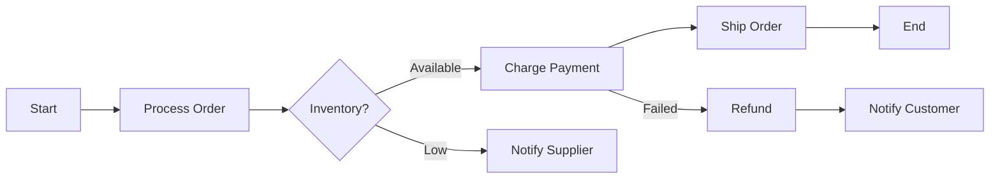

# Section 09 — Service Communication

> **Purpose**: In distributed systems, how services communicate determines the system's reliability, scalability, and failure modes. Synchronous HTTP calls create tight coupling and cascading failures. Asynchronous messaging decouples services but introduces eventual consistency and operational complexity. Event-driven architectures with pub/sub enable flexible evolution but require careful schema governance. This section covers the full spectrum: from simple queues to complex orchestration.
>
> **Official Documentation**: [SQS](https://docs.aws.amazon.com/sqs/) | [SNS](https://docs.aws.amazon.com/sns/) | [EventBridge](https://docs.aws.amazon.com/eventbridge/) | [Step Functions](https://docs.aws.amazon.com/step-functions/) | [API Gateway](https://docs.aws.amazon.com/apigateway/)

---

## 1. Amazon SQS: Decoupled Message Queues

### 1.1 SQS Queue Types

| Feature | Standard Queue | FIFO Queue |
|---------|---------------|------------|
| **Throughput** | Nearly unlimited | 300 msg/sec (per queue, batching increases to 3,000) |
| **Ordering** | Best-effort (messages may arrive out of order) | Strict ordering (within message group) |
| **Delivery** | At-least-once (duplicates possible) | Exactly-once (deduplication window: 5 minutes) |
| **Use case** | High-throughput, decoupled workloads | Order processing, sequential tasks, deduplication required |
| **Cost** | Lower | Slightly higher |

### 1.2 SQS Operational Semantics

**Visibility Timeout**: When a consumer receives a message, it becomes invisible to other consumers for a configurable time (default 30 seconds, max 12 hours). If the consumer doesn't delete the message before timeout, it reappears in the queue.

```
Message available ──► Consumer receives ──► Invisible (processing)
                                         │
                    ┌────────────────────┘
                    │
                    ├── DeleteMessage ──► Removed from queue
                    │
                    └── Visibility timeout expires ──► Message visible again
                                                         (another consumer picks it up)
```

**Dead Letter Queues (DLQ)**: After a message fails processing `MaxReceiveCount` times, it moves to the DLQ for investigation. This prevents poison messages from blocking the queue indefinitely.

**Long Polling** (`WaitTimeSeconds=20`): Consumer waits up to 20 seconds for a message. Reduces empty responses (and thus API costs) compared to short polling. Recommended for all production consumers.

> **SQS Polling Behavior**: Short polling returns immediately (possibly empty). Long polling waits up to `WaitTimeSeconds`. Always use long polling unless you have a specific reason not to.

### 1.3 SQS Scaling and Limits

| Limit | Value | Implication |
|-------|-------|-------------|
| Message retention | 4 days default, 14 days max | Design for idempotency — messages may be processed multiple times |
| Message size | 256 KB default, 2 GB with S3 payload | Large payloads: store in S3, send S3 reference in SQS message |
| In-flight messages | 120,000 (Standard), 20,000 (FIFO) | Limits concurrent processing capacity |
| Delay seconds | 0-15 minutes (per message or queue default) | Schedule message delivery into the future |

> **Architectural Trap**: "SQS guarantees exactly-once delivery." FALSE. Only FIFO queues with deduplication ID provide exactly-once. Standard queues provide at-least-once. Applications MUST be idempotent.

---

## 2. Amazon SNS: Pub/Sub Notification

### 2.1 SNS Fan-Out Architecture

SNS implements the **fan-out pattern**: one message published to many subscribers simultaneously.

```
Publisher ──► SNS Topic ──┬──► SQS Queue (Microservice A)
                          ├──► SQS Queue (Microservice B)
                          ├──► SQS Queue (Microservice C)
                          ├──► Lambda Function (Real-time processing)
                          ├──► Email/SMS (Human alerting)
                          └──► HTTPS Endpoint (Third-party webhook)
```

**Message delivery semantics**:
- **SQS subscriptions**: At-least-once delivery to each queue
- **Lambda subscriptions**: Synchronous invocation (for FIFO) or asynchronous (for Standard)
- **HTTP/S subscriptions**: Retry with exponential backoff. Dead letter behavior depends on endpoint response.

### 2.2 SNS Message Filtering

SNS supports **subscription filter policies** — subscribers only receive messages matching their filter:

```json
{
  "event_type": ["order_placed"],
  "region": ["us-east-1", "us-west-2"],
  "priority": [{"numeric": [">=", 3]}]
}
```

This prevents subscribers from receiving irrelevant messages, reducing queue depth and processing costs.

### 2.3 SNS FIFO Topics

SNS FIFO topics pair with SQS FIFO queues for ordered, exactly-once fan-out:
- Message ordering preserved across all FIFO subscribers
- Deduplication based on `MessageDeduplicationId` (5-minute window)
- Limited throughput: 300 msg/sec (or 3,000 with batching)

> **FIFO Pairing**: SNS FIFO can only publish to SQS FIFO queues. Standard topics can publish to both Standard and FIFO queues (but ordering guarantees are lost).

---

## 3. Amazon EventBridge: Serverless Event Bus

### 3.1 EventBridge vs SNS

| Dimension | SNS | EventBridge |
|-----------|-----|-------------|
| **Event structure** | Simple message (string/JSON payload) | Rich event schema with metadata (source, detail-type, time, resources) |
| **Filtering** | Basic (filter policies on attributes) | Advanced (content-based filtering on nested JSON, prefix, suffix, numeric ranges, exists) |
| **Sources** | AWS services, your applications | 200+ AWS services, SaaS partners (Zendesk, Datadog, PagerDuty), custom apps |
| **Targets** | SQS, Lambda, HTTP, email, SMS | 20+ targets including Step Functions, API destinations, cross-account buses |
| **Schema registry** | No | Yes — discover and validate event schemas |
| **Replay** | No | Yes — replay events from archive |

### 3.2 EventBridge Event Structure

```json
{
  "version": "0",
  "id": "12345678-1234-1234-1234-123456789012",
  "detail-type": "EC2 Instance State-change Notification",
  "source": "aws.ec2",
  "account": "123456789012",
  "time": "2026-05-10T12:34:56Z",
  "region": "us-east-1",
  "resources": ["arn:aws:ec2:us-east-1:123456789012:instance/i-1234567890abcdef0"],
  "detail": {
    "instance-id": "i-1234567890abcdef0",
    "state": "running"
  }
}
```

**Content-based filtering example**:
```json
{
  "source": ["aws.ec2"],
  "detail-type": ["EC2 Instance State-change Notification"],
  "detail": {
    "state": ["stopped", "terminated"],
    "instance-id": [{"prefix": "i-0a"}]
  }
}
```

### 3.3 EventBridge Pipes and Schedules

**EventBridge Pipes** (new): Point-to-point integrations between sources and targets with optional filtering, enrichment, and transformation. No event bus needed.

**EventBridge Scheduler**: Serverless cron with more features than CloudWatch Events rules:
- One-time, recurring, and flexible schedules
- Timezone support
- Delivery to 20+ targets
- Millions of schedules (CloudWatch Events limited to 100 rules per region per account by default)

---

## 4. AWS Step Functions: Workflow Orchestration

### 4.1 Step Functions vs Lambda for Orchestration

A common anti-pattern is chaining Lambda functions via SNS/SQS and managing state in DynamoDB. This is fragile:
- No visual workflow
- Retry logic scattered across functions
- Error handling requires DLQs and manual compensation
- State management is custom code

Step Functions solves this by providing **state machine orchestration**:



### 4.2 Step Functions Workflow Types

| Type | Duration | Use Case | Cost |
|------|----------|----------|------|
| **Standard** | Up to 1 year | Complex, long-running workflows (order fulfillment, data pipelines) | Per state transition |
| **Express** | Up to 5 minutes | High-throughput, short workflows (IoT data processing, ETL micro-batches) | Per execution + duration |

### 4.3 Step Functions Patterns

**Parallel**: Execute multiple branches simultaneously and wait for all to complete.

**Map**: Iterate over a list and process each item (supports dynamic parallelism — up to 40 concurrent iterations).

**Wait**: Delay execution for a fixed time or until a specific timestamp.

**Choice**: Branch based on input data (no Lambda needed for simple decisions).

**Error Handling**: Catch specific errors, retry with exponential backoff, or route to a fallback state.

**Callback**: Pause workflow until an external system calls back (e.g., wait for human approval via email).

> **Step Functions + ECS/Fargate**: For compute-intensive steps, invoke ECS tasks or Fargate containers instead of Lambda. Step Functions waits for task completion. This combines orchestration with arbitrary compute capacity.

### 4.4 Step Functions Express vs Standard Decision Framework

```
Workflow duration?
├── > 5 minutes → Standard (only option)
├── < 5 minutes AND high throughput (> 100K executions/day) → Express
└── < 5 minutes AND low throughput → Standard (better observability) or Express
```

**Express limitation**: No visual execution history in console (must use CloudWatch Logs). No `DescribeExecution` for in-progress workflows. Design for observability using CloudWatch.

---

## 5. Amazon API Gateway: API Management

### 5.1 API Gateway Types

| Type | Protocol | Latency | Features | Cost | Use Case |
|------|----------|---------|----------|------|----------|
| **REST API** | HTTP/HTTPS | Higher (~10-50ms) | Full feature set: caching, throttling, WAF, request/response transformation, VPC links | Per request + cache | Full-featured APIs, complex routing |
| **HTTP API** | HTTP/HTTPS | Lower (~1-10ms) | Core features: JWT authorizers, CORS, VPC links, automatic deployments | ~71% cheaper than REST | Simple APIs, microservices, Lambda proxy |
| **WebSocket API** | WebSocket | Real-time bidirectional | Persistent connections, message routing, Lambda/HTTP integration | Per message + connection time | Chat, real-time dashboards, gaming |

> **Architectural Decision**: Default to HTTP API for new APIs. It is cheaper and faster. Only use REST API if you need: request/response transformation, caching, WAF integration (HTTP API now supports WAF), or resource policies.

### 5.2 API Gateway Integration Patterns

| Integration | Use Case | Notes |
|-------------|----------|-------|
| **Lambda Proxy** | Serverless API backend | Passes full request context to Lambda. Lambda returns API Gateway-compatible response. |
| **HTTP Proxy** | Route to existing HTTP backend | ALB, EC2, on-prem server. Request/response passthrough. |
| **AWS Service Proxy** | Direct AWS API calls | Invoke Step Functions, SQS, S3 directly without Lambda. Reduces Lambda costs and cold starts. |
| **Mock** | Testing, canary deployments | Returns static responses. Useful for API contract testing before backend is ready. |
| **VPC Link** | Private backend access | HTTP API uses VPC Link to reach private ALB/NLB/EC2 in a VPC. |

### 5.3 API Gateway Security

| Mechanism | How It Works | Best For |
|-----------|-------------|----------|
| **IAM Signature v4** | AWS SigV4 signed requests | Internal service-to-service APIs |
| **Lambda Authorizer** | Custom auth logic (JWT validation, OAuth, custom tokens) | Complex auth requirements, existing identity providers |
| **Cognito User Pool** | User directory + token validation | Customer-facing APIs with user accounts |
| **API Keys** | Throttling and usage plans | Rate limiting, monetization (weak security, not for authentication) |
| **Resource Policies** | IP whitelisting, VPC endpoint restrictions | Network-level access control |

> **API Key Misconception**: API Keys are for throttling and usage tracking, NOT authentication. Do not use API Keys as security credentials. They are easily extracted from client applications.

### 5.4 API Gateway Throttling and Caching

**Throttling**:
- **Account limit**: 10,000 RPS default (burst: 5,000) per region. Request increase if needed.
- **Per-method throttling**: Override default for specific resources.
- **Usage plans**: Associate API keys with throttling limits and quotas.

**Caching** (REST API only):
- Cache responses at API Gateway for TTL seconds
- Reduces backend load and improves latency
- Cache invalidation: flush entire cache or by path
- Cost: Per hour cache is enabled + per GB cache size

---

## 6. Cross-Service Communication Patterns

### Pattern: Event-Driven Microservices

```
┌──────────┐     ┌──────────────┐     ┌──────────┐     ┌──────────┐
│  Order   │────►│ EventBridge  │────►│  SQS A   │────►│ Payment  │
│ Service  │     │   Bus        │     │          │     │ Service  │
└──────────┘     └──────────────┘     ├──────────┤     └──────────┘
                                      │  SQS B   │────►│Inventory │
                                      ├──────────┤     │ Service  │
                                      │  SQS C   │────►│Shipping  │
                                      └──────────┘     │ Service  │
                                                       └──────────┘
```

Benefits: Order service doesn't know about Payment, Inventory, or Shipping. New subscribers can be added without modifying Order Service.

### Pattern: Saga Pattern with Step Functions

For distributed transactions across microservices:

```
Step Functions Orchestrator
├── Invoke: Reserve Payment
├── Invoke: Reserve Inventory
├── Invoke: Create Shipping Label
│
├── If any step fails:
│   ├── Compensate: Refund Payment
│   ├── Compensate: Release Inventory
│   └── Compensate: Cancel Shipping
│
└── All succeed → Confirm Order
```

Step Functions handles retries, timeouts, and compensation logic centrally.

### Pattern: API Gateway + Lambda + DynamoDB

```
Client ──► API Gateway ──► Lambda ──► DynamoDB
                              │
                              └──► CloudWatch (logging)
                              └──► X-Ray (tracing)
```

The canonical serverless API pattern. API Gateway handles routing, throttling, and auth. Lambda contains business logic. DynamoDB provides low-latency persistence.

---

## 7. Architectural Decision Challenges

* **Scenario:** A financial trading system needs to process orders exactly once and in sequence.
  * **Design:** Use SQS FIFO with deduplication. Because FIFO guarantees ordering within a message group and provides exactly-once delivery via `MessageDeduplicationId`. Standard queues allow duplicates and lack ordering guarantees. (If higher throughput beyond 300/sec is needed, shard across multiple FIFO queues).

* **Scenario:** You need to choose between EventBridge and SNS for an event-driven architecture.
  * **Design:** Use EventBridge for content-based filtering on nested JSON, schema registries, SaaS integrations, event replay, or cross-account buses. Because SNS is strictly for simple high-throughput pub/sub, mobile push, SMS/email alerting, and delivering to multiple protocols from one topic.

* **Scenario:** A microservices platform needs to deploy 50 APIs. Choose between API Gateway REST vs HTTP.
  * **Design:** Default to HTTP API. Because it is ~71% cheaper, has lower latency, and supports essentials like JWT authorizers, VPC links, CORS, and WAF. Only use REST API if you specifically need request/response transformation, per-method caching, or resource policies. Evaluate actual requirements rather than defaulting to REST "just in case."

---

## 8. Points to Remember

- **SQS Standard = at-least-once delivery, possible duplicates, no ordering** — consumers must be idempotent.
- **SQS FIFO = exactly-once, ordered, limited throughput** — use `MessageGroupId` for parallel ordering (different groups process in parallel).
- **SNS fan-out sends messages to all subscribers simultaneously** — each subscriber gets its own copy.
- **SNS FIFO topics only publish to SQS FIFO queues** — standard topics can publish to any subscriber type.
- **EventBridge provides content-based filtering and schema registry** — use for complex event routing and SaaS integrations.
- **EventBridge Scheduler replaces CloudWatch Events for cron** — supports millions of schedules and timezone awareness.
- **Step Functions Standard workflows can run up to 1 year** — use for long-running processes, human approvals, and complex orchestration.
- **Step Functions Express workflows max 5 minutes** — use for high-throughput, short-duration workflows.
- **API Gateway HTTP APIs are ~71% cheaper than REST APIs** — default to HTTP unless you need REST-specific features.
- **API Keys are for throttling, NOT authentication** — never use them as security credentials.
- **Step Functions Map state supports dynamic parallelism** — up to 40 concurrent iterations, ideal for batch processing.
- **SQS long polling (`WaitTimeSeconds=20`) reduces empty responses** — always use in production consumers.
- **Dead Letter Queues prevent poison messages from blocking the queue** — configure `MaxReceiveCount` appropriately (typically 3-5).

---

## 13. Further Reading

For deeper coverage, CLI commands, and exam-specific trivia, see the detailed reference:

- **SQS, SNS, Kinesis, Amazon MQ**: [`Integration-Messaging-SQS-SNS-Kinesis.md`](../../detailed-reference/Integration-Messaging-SQS-SNS-Kinesis.md)
- **API Gateway, Step Functions, Cognito**: [`DynamoDB-APIGateway-Serverless.md`](../../detailed-reference/DynamoDB-APIGateway-Serverless.md)

---

*Section 09 — Service Communication | Last Validated: 2026-05-10*
