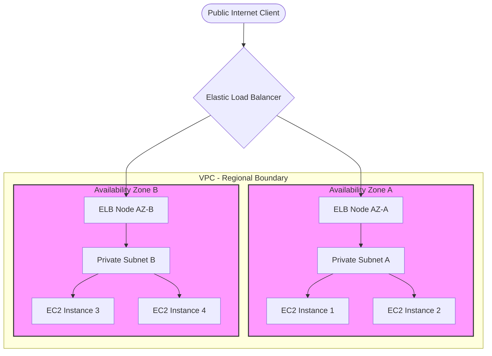
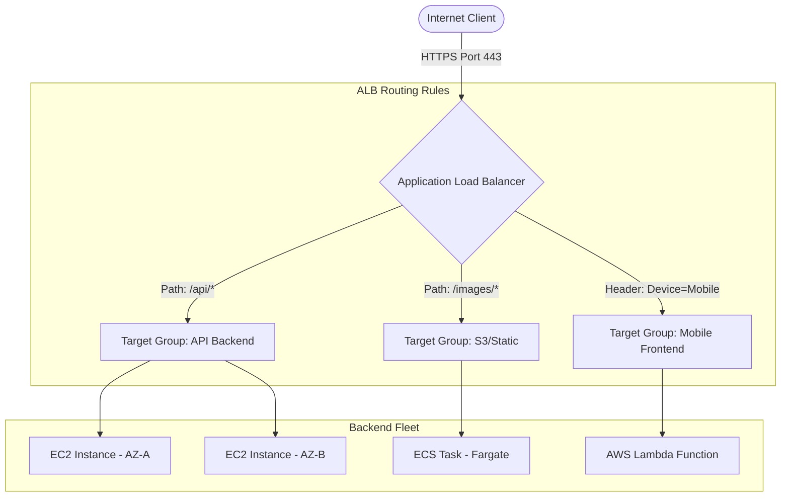
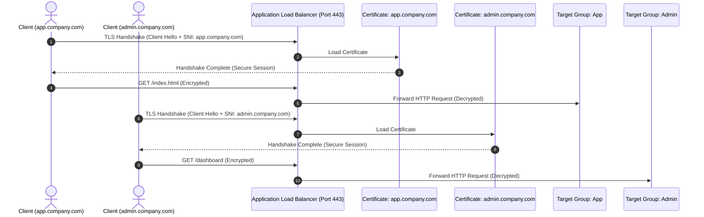
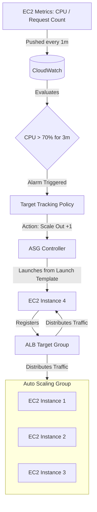
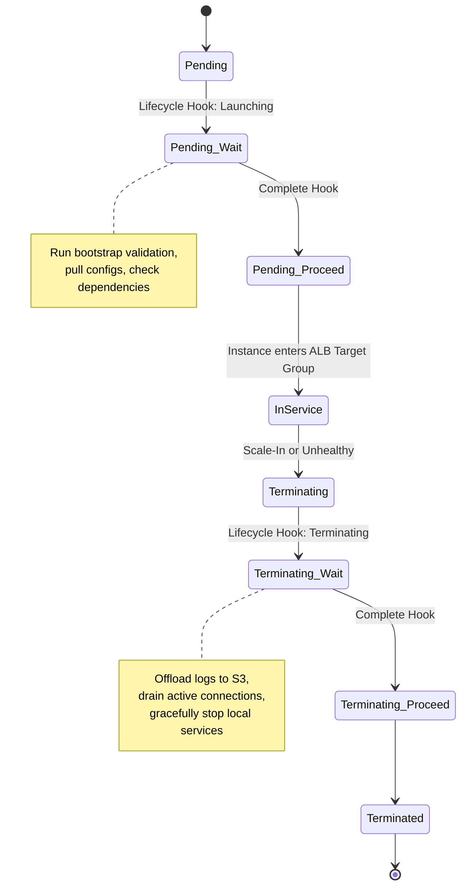

# High Availability & Scalability — ELB & Auto Scaling (Engineering Architect Reference)

> 📚 Official Docs: https://docs.aws.amazon.com/elasticloadbalancing/ | https://docs.aws.amazon.com/autoscaling/
> 🎯 SAA-C03 Exam Weight: Very High — core design patterns for regional failover, request landing, and automatic elasticity.

---

## 🌐 Topic 1: Scalability vs. High Availability (HA)

### 📖 Technical Specifications & AWS Core Concepts
* **Scalability:** The ability of a system to handle increased load by adjusting its resource capacity (vertically or horizontally).
* **Vertical Scaling (Scale Up/Down):** Changing the capacity of a resource by moving to a larger or smaller instance size (e.g., upgrading an EC2 instance from `t3.micro` to `m5.large`).
* **Horizontal Scaling (Scale Out/In):** Adjusting capacity by adding or removing resource instances (e.g., adding more EC2 instances behind a load balancer).
* **High Availability (HA):** A design pattern that ensures a system remains operational and accessible, without user-perceptible downtime, even in the event of component failures (typically achieved by running resources across multiple Availability Zones).

---

### 🗺️ Visual Architecture: Horizontal Scaling and High Availability



---

### 🧠 Architectural Probing & Decision Scenarios
* **Scenario:** Why should an architect prefer horizontal scaling over vertical scaling for production-grade applications?**
  * **Design:** Vertical scaling has hard hardware limits (you cannot upgrade beyond the largest physical host size, e.g., high-memory metal instances), requires downtime to resize the virtual machine, and maintains a Single Point of Failure (SPOF). Horizontal scaling provides unlimited scalability, eliminates SPOF by distributing workloads across multiple hosts, and supports dynamic scaling-in to optimize runtime costs during low-demand periods.
* **Scenario:** Does deploying an application across multiple Availability Zones guarantee high availability if the database is single-instance?**
  * **Design:** No. While the application tier (EC2 instances) is horizontally scaled and highly available across multiple AZs, the single-instance database is a critical SPOF. If the AZ hosting the database suffers an outage, the entire system fails. True high availability requires replication and failover capability at every tier of the stack (e.g., RDS Multi-AZ for the database).

---

### 📐 Application Design Patterns & Trade-offs
* **Stateless vs. Stateful Application Architecture:**
  * **The Trade-off:** Horizontal scaling is trivial for *stateless* applications because any instance can process any user request. For *stateful* applications (where user sessions or files are stored locally on the EC2 instance disk or memory), horizontal scaling causes session loss or data inconsistency when requests land on different servers.
  * **The Design Pattern:** Externalize session state to a fast cache (e.g., Amazon ElastiCache for Redis) or database (e.g., DynamoDB), and store shared files on a network file system (e.g., Amazon EFS) or object storage (e.g., Amazon S3). This makes the EC2 application instances completely stateless and disposable.

---

### 🚀 Real-World Production Insights
* **The "Looming Resize" Downtime Trap:**
  * **The Reality:** Architects often scale vertically ("just change the instance type") as a quick fix for performance bottlenecks. However, modifying an EC2 instance type requires stopping the instance. In a single-instance environment, this causes an immediate outage. Even in a Multi-AZ clustered environment, vertical resizing must be executed sequentially (rolling update) to prevent total cluster failure.
  * **Mitigation:** Standardize on horizontal scaling from day one. If vertical resizing is unavoidable, automate a blue/green infrastructure swap or perform a rolling update via an Auto Scaling Group by creating a new Launch Template and performing an instance refresh.

---

### 💻 Hands-on CLI Commands
* **Modify an EC2 instance type (Vertical Scaling):**
  ```bash
  # Step 1: Stop the running instance (downtime starts)
  aws ec2 stop-instances --instance-ids i-1234567890abcdef0
  
  # Step 2: Wait for instance to stop
  aws ec2 wait instance-stopped --instance-ids i-1234567890abcdef0
  
  # Step 3: Modify the instance type
  aws ec2 modify-instance-attribute \
    --instance-id i-1234567890abcdef0 \
    --instance-type "m5.large"
    
  # Step 4: Restart the instance (downtime ends)
  aws ec2 start-instances --instance-ids i-1234567890abcdef0
  ```

---

## ⚖️ Topic 2: Elastic Load Balancing (ELB) — ALB, NLB, and GWLB

### 📖 Technical Specifications & AWS Core Concepts
* **Application Load Balancer (ALB):** A Layer 7 (HTTP/HTTPS) load balancer that inspects request headers, paths, query parameters, and host headers to make routing decisions.
* **Network Load Balancer (NLB):** A Layer 4 (TCP/UDP/TLS) load balancer built on hyper-performance routing technology, capable of handling millions of requests per second at ultra-low latency.
* **Gateway Load Balancer (GWLB):** A Layer 3 (IP packets) load balancer that routes traffic to third-party virtual security appliances (e.g., firewalls, IDS/IPS) using the GENEVE protocol on port 6081.
* **Target Group:** A logical grouping of targets (EC2, ECS, Lambda, or IP addresses) that receive routed traffic from a load balancer listener.
* **`X-Forwarded-For`:** A standard HTTP header used by Layer 7 load balancers to pass the original client IP address to the backend target, since backend targets see the connection originating from the load balancer's private IP.

---

### 🗺️ Visual Architecture: Landing Requests & Target Groups



---

### 🧠 Architectural Probing & Decision Scenarios
* **Scenario:** Under what conditions should an architect choose an NLB over an ALB?**
  * **Design:** Choose NLB when:
    1. **High Throughput/Low Latency:** You need to handle sudden, massive traffic spikes (millions of RPS) with microsecond latency.
    2. **Non-HTTP Protocols:** You need to load balance raw TCP, UDP, or TLS traffic (e.g., MQTT, gaming servers, LDAP).
    3. **Static/Elastic IPs:** The client firewall requires fixed IP addresses for IP whitelisting. NLB allocates a static IP address per AZ (and supports Elastic IP association), whereas ALB only provides DNS names and has dynamic IPs.
* **Scenario:** How does a Gateway Load Balancer (GWLB) insert security appliances transparently into the network path?**
  * **Design:** GWLB uses VPC Route Tables to intercept traffic. It routes raw IP packets to a target fleet of third-party firewalls. The traffic is encapsulated using the GENEVE protocol (port 6081), allowing the firewall to inspect the original packet headers and payload, approve/deny it, and return it to the GWLB, which forwards it to the destination.

---

### 📐 Application Design Patterns & Trade-offs
* **Cross-Zone Load Balancing:**
  * **The Trade-off:** With Cross-Zone Load Balancing enabled, each load balancer node distributes traffic evenly across all registered targets in *all* enabled Availability Zones. With it disabled, each node routes traffic only to targets in its *local* AZ.
  * **The Choice:** Enable Cross-Zone Load Balancing for ALB (enabled by default, free) to ensure even distribution across backends, even if AZs have an uneven number of instances. For NLB, it is disabled by default and incurs inter-AZ data transfer costs if enabled. Keep it disabled on NLB for maximum throughput and zero inter-AZ latency, provided target instance capacity is distributed symmetrically across AZs.

---

### 🚀 Real-World Production Insights
* **The Load Balancer "Flash Crowd" 503 Outage:**
  * **The Trap:** Architects assume ELB automatically handles any scale. While ALB is auto-scaling, it scales *reactively* by updating DNS records. A sudden 20x traffic spike (e.g., a ticket launch or TV advertisement) will overwhelm the ALB nodes before they can scale out, resulting in HTTP 503 Gateway Timeout/Service Unavailable errors for clients.
  * **Mitigation:** If you expect sudden traffic spikes, you must **pre-warm** the ALB by opening a support ticket with AWS to pre-allocate load balancer capacity. Alternatively, use an NLB in front of the ALB, as NLB handles sudden spikes natively without pre-warming.
* **VPC NAT Gateway SNAT Port Exhaustion:**
  * **The Problem:** When EC2 instances in a private subnet connect to external APIs through a NAT Gateway, each connection consumes a Source Network Address Translation (SNAT) port. If connection pools are not managed properly, the NAT Gateway runs out of SNAT ports, causing external connections to drop.
  * **Mitigation:** Configure application client libraries to use connection pooling and keep-alive headers. Deploy multiple NAT Gateways (one per AZ) and associate multiple Elastic IPs to each NAT Gateway to expand the available SNAT port pool.

---

### 💻 Hands-on CLI Commands
* **Create an Application Load Balancer, Target Group, and Listener:**
  ```bash
  # Step 1: Create the ALB
  aws elbv2 create-load-balancer \
    --name production-alb \
    --subnets subnet-0123456789abcdef0 subnet-0abcdef0123456789 \
    --security-groups sg-0abc123def456 \
    --scheme internet-facing \
    --type application
    
  # Step 2: Create a Target Group with HTTP health checks
  aws elbv2 create-target-group \
    --name web-app-tg \
    --protocol HTTP \
    --port 80 \
    --vpc-id vpc-1234567890abcdef0 \
    --target-type instance \
    --health-check-path /healthz \
    --health-check-interval-seconds 15 \
    --healthy-threshold-count 2 \
    --unhealthy-threshold-count 3
    
  # Step 3: Create an HTTPS Listener (requires ACM SSL Certificate)
  aws elbv2 create-listener \
    --load-balancer-arn arn:aws:elasticloadbalancing:us-east-1:123456789012:loadbalancer/app/production-alb/50dc6c495c0c9188 \
    --protocol HTTPS \
    --port 443 \
    --certificates CertificateArn=arn:aws:acm:us-east-1:123456789012:certificate/abc-123-def \
    --default-actions Type=forward,TargetGroupArn=arn:aws:elasticloadbalancing:us-east-1:123456789012:targetgroup/web-app-tg/73e2d6bc24d8a067
  ```

---

## 🔒 Topic 3: SSL/TLS Termination and SNI on ELBs

### 📖 Technical Specifications & AWS Core Concepts
* **SSL Termination:** The process of decrypting SSL/TLS encrypted traffic at the load balancer level, passing unencrypted HTTP requests to the backend targets (reducing target CPU load).
* **SSL Passthrough:** Routing encrypted TLS traffic directly through the load balancer to the targets without decryption, requiring targets to manage certificates and perform decryption.
* **Server Name Indication (SNI):** A TLS extension that allows a client to specify the target hostname during the initial TLS handshake, enabling a single load balancer listener to host multiple secure domains, each with its own SSL certificate.

---

### 🗺️ Visual Architecture: SNI Host-Header Routing



---

### 🧠 Architectural Probing & Decision Scenarios
* **Scenario:** When should an architect design an application with SSL Passthrough instead of SSL Termination?**
  * **Design:** Use SSL Passthrough (via NLB at Layer 4) when strict compliance regulations (e.g., PCI-DSS, HIPAA) mandate end-to-end encryption. In this model, data cannot be decrypted at any intermediate proxy (like the ELB) and must remain encrypted until it reaches the authorized target instance.
* **Scenario:** Can you use a single ALB listener on port 443 to host both `api.mysite.com` and `portal.mysite.com`?**
  * **Design:** Yes, by leveraging **Server Name Indication (SNI)**. You associate multiple SSL certificates with the single ALB listener. When a client initiates a connection, the ALB inspects the SNI header in the TLS client hello, serves the matching certificate, and routes the traffic to the corresponding target group using host-header routing rules.

---

### 📐 Application Design Patterns & Trade-offs
* **SSL Offloading vs. End-to-End Encryption:**
  * **SSL Offloading (Termination):** The load balancer decrypts traffic. The internal network path between the ALB and EC2 instances is unencrypted HTTP. **Trade-off:** High backend performance (no decryption overhead on EC2) and simplified certificate management (certs live only in ACM, not on EC2).
  * **End-to-End Encryption:** The ALB decrypts traffic, inspects it, and re-encrypts it before forwarding to the target. **Trade-off:** Highest security, but requires CPU overhead on the backend and certificate installation/rotation on the individual EC2 targets.

---

### 🚀 Real-World Production Insights
* **The "Mixed Content" SSL Redirect Loop:**
  * **The Trap:** When SSL termination is configured on an ALB, the ALB forwards requests to EC2 targets over plain HTTP. If the application framework on the EC2 target (e.g., WordPress, Django) redirects incoming HTTP requests to HTTPS, it will detect the ALB-to-target connection as insecure HTTP and issue a 301 redirect to HTTPS. The browser receives the redirect, hits the ALB on HTTPS, which forwards it to the EC2 target on HTTP again — creating an infinite redirect loop.
  * **Mitigation:** Configure the web server or application framework on the EC2 target to inspect the `X-Forwarded-Proto` header. If `X-Forwarded-Proto` is `https`, the application must treat the request as secure and suppress HTTPS redirects.

---

### 💻 Hands-on CLI Commands
* **Associate multiple SSL certificates to an existing ALB listener (SNI Setup):**
  ```bash
  # Step 1: Query the existing listener ARN
  # Step 2: Add a secondary SSL certificate to the listener
  aws elbv2 add-listener-certificates \
    --listener-arn arn:aws:elasticloadbalancing:us-east-1:123456789012:listener/app/production-alb/50dc6c495c0c9188 \
    --certificates CertificateArn=arn:aws:acm:us-east-1:123456789012:certificate/xyz-789-uvw
  ```

---

## 🔄 Topic 4: Auto Scaling Groups (ASG) & Scaling Policies

### 📖 Technical Specifications & AWS Core Concepts
* **Auto Scaling Group (ASG):** A collection of EC2 instances managed as a logical unit, defined by minimum, maximum, and desired capacity limits, designed to adjust count automatically.
* **Launch Template:** A configuration specification containing EC2 instance configuration parameters (AMI, instance type, key pairs, security groups, user data) used by ASG to provision new instances.
* **Target Tracking Scaling Policy:** A scaling policy that dynamically adds or removes instances to maintain a specific metric target value (e.g., keep average cluster CPU utilization at 60%).
* **Step Scaling Policy:** A policy that adjusts capacity based on a set of graduated scale-out or scale-in rules tied to CloudWatch alarm thresholds (e.g., if CPU > 80% add 3 instances; if CPU > 60% add 1 instance).
* **Predictive Scaling Policy:** An ML-driven policy that analyzes historical ASG load patterns to forecast future traffic demand and proactively launches instances ahead of scheduled spikes.

---

### 🗺️ Visual Architecture: Dynamic Scaling & CloudWatch Loop



---

### 🧠 Architectural Probing & Decision Scenarios
* **Scenario:** How does an ASG determine if an instance is unhealthy, and how does it replace it?**
  * **Design:** By default, ASG uses EC2 Status Checks (hardware/system level). If an instance fails these checks, the ASG terminates it and provisions a replacement. However, if the instance is running but the web server process has crashed, EC2 status checks will still report "Healthy". To solve this, you must **enable ELB health checks** on the ASG. This configures the ASG to terminate and replace instances as soon as the associated ELB Target Group reports them as unhealthy.
* **Scenario:** Why is Target Tracking generally preferred over Step Scaling?**
  * **Design:** Target Tracking is simple to configure because it automatically creates and manages the underlying CloudWatch alarms and scaling math. You only specify the target metric value (e.g., `ASGAverageCPUUtilization` = 60%). Step Scaling requires you to manually define alarms, thresholds, and exact scaling adjustment steps, which is error-prone.

---

### 📐 Application Design Patterns & Trade-offs
* **Dynamic Scaling vs. Scheduled Scaling:**
  * **Dynamic (Reactive) Scaling:** Scales based on real-time load metrics. **Trade-off:** Ideal for unpredictable workloads, but suffers from startup lag (it takes a few minutes to boot and bootstrap a new instance, during which the existing cluster remains overloaded).
  * **Scheduled (Proactive) Scaling:** Scales at specific dates/times. **Trade-off:** Ideal for predictable, cyclical traffic (e.g., scaling up at 8:55 AM before employees log in to a corporate portal). Eliminates boot lag completely but wastes money if the predicted traffic fails to materialize.

---

### 🚀 Real-World Production Insights
* **The "Scale-Out Alert Storm" Loop:**
  * **The Trap:** A high-traffic API cluster uses CPU-based scaling. A sudden traffic spike hits the cluster. The CPU jumps to 95%, triggering the CloudWatch alarm. The ASG launches a new instance. While the instance is booting and executing its user data scripts (which takes 3 minutes), the existing instances remain at 95% CPU. The alarm fires again, triggering *another* scale-out. By the time the instances boot, the cluster has scaled out to its maximum capacity, resulting in excessive over-provisioning and wasted spend.
  * **Mitigation:** Configure a **Cooldown Period** (or warm-up time) on the scaling policy. This tells the ASG to ignore subsequent alarms for a specified duration (e.g., 300 seconds) after a scaling action, allowing newly launched instances time to boot, enter service, and absorb load.
* **Instance Startup Optimization (Reducing Boot Time):**
  * **The Problem:** If your user data script installs heavy software packages (e.g., downloading and compiling dependency libraries) at boot time, instances can take 10+ minutes to become healthy, rendering dynamic scaling ineffective during traffic spikes.
  * **Mitigation:** Build pre-configured machine images (**Gold AMIs**) using tools like EC2 Image Builder or Packer. The AMI should contain the application and all dependencies pre-installed. The user data script should perform only lightweight runtime configuration (e.g., pulling the latest code branch or database connection credentials).

---

### 💻 Hands-on CLI Commands
* **Create a Launch Template and an Auto Scaling Group:**
  ```bash
  # Step 1: Create a Launch Template with User Data
  aws ec2 create-launch-template \
    --launch-template-name web-app-lt \
    --launch-template-data '{
      "ImageId": "ami-0c55b159cbfafe1f0",
      "InstanceType": "t3.medium",
      "SecurityGroupIds": ["sg-0abc123def456"],
      "UserData": "IyEvYmluL2Jhc2gKeXVtIHVwZGF0ZSAteQp5dW0gaW5zdGFsbCAteSBodHRwZApzeXN0ZW1jdGwgZW5hYmxlIC0tbm93IGh0dHBk"
    }'
    
  # Step 2: Create the ASG associated with an ALB Target Group
  aws autoscaling create-auto-scaling-group \
    --auto-scaling-group-name production-asg \
    --launch-template LaunchTemplateName=web-app-lt,Version='$Latest' \
    --min-size 2 \
    --max-size 10 \
    --desired-capacity 2 \
    --vpc-zone-identifier "subnet-0123456789abcdef0,subnet-0abcdef0123456789" \
    --target-group-arns arn:aws:elasticloadbalancing:us-east-1:123456789012:targetgroup/web-app-tg/73e2d6bc24d8a067 \
    --health-check-type ELB \
    --health-check-grace-period 300
  ```

---

## 🛠️ Topic 5: ASG Advanced Patterns (Cooldowns, Lifecycle Hooks, and Instance Refresh)

### 📖 Technical Specifications & AWS Core Concepts
* **Deregistration Delay (Connection Draining):** An ELB setting that allows active, in-flight requests to complete when an instance is deregistered or marked unhealthy, before closing the connections.
* **Termination Policy:** A set of rules that determines which specific EC2 instance in the ASG is terminated first during a scale-in event.
* **Lifecycle Hook:** A mechanism that pauses ASG instance launch or termination transitions, allowing you to perform custom actions (e.g., log backup, data hydration) before the instance enters or leaves service.
* **Instance Refresh:** An ASG feature that automates rolling updates of all instances in a group (e.g., deploying a new AMI version) while maintaining a minimum operational capacity.

---

### 🗺️ Visual Architecture: ASG Lifecycle & Hook Points



---

### 🧠 Architectural Probing & Decision Scenarios
* **Scenario:** How does the ASG default Termination Policy protect application availability during scale-in?**
  * **Design:** The default termination policy works as follows:
    1. **Identify AZs:** It determines which Availability Zone currently hosts the most instances.
    2. **Evaluate Allocation:** If multiple AZs have the same number of instances, it selects the AZ with the oldest Launch Configuration or Template.
    3. **Evaluate Instance Age:** Within that AZ, it terminates the instance closest to the next billing hour (for legacy billing) or the oldest instance. This ensures the group scales down while keeping the cluster balanced across AZs to maintain high availability.
* **Scenario:** What is the purpose of an ASG Lifecycle Hook during instance termination?**
  * **Design:** It allows you to run cleanup tasks before an instance is destroyed. For example, if your application stores state locally or generates logs that are not pushed in real time to CloudWatch, a termination lifecycle hook pauses the shutdown transition. The instance remains in a `Terminating:Wait` state while a script executes to push logs to Amazon S3 or offload active state. Once complete, the hook signals the ASG to proceed with termination.

---

### 📐 Application Design Patterns & Trade-offs
* **Connection Draining (Deregistration Delay) Optimization:**
  * **The Trade-off:** The default deregistration delay is 300 seconds. 
    * **Setting it too high:** Preserves slow queries and long-running connections (e.g., file downloads) but delays scale-in actions and instance updates, extending deployment times.
    * **Setting it too low:** Terminates instances rapidly, but cuts off active connections prematurely, resulting in HTTP 502 Bad Gateway or 504 Gateway Timeout errors for users.
  * **The Design Pattern:** Analyze your P99 request duration. Set the deregistration delay to slightly above your longest expected request execution time (e.g., 30–60 seconds for typical APIs, 15 minutes for legacy file upload tasks).

---

### 🚀 Real-World Production Insights
* **The "Default Cooldown" Resource Lock:**
  * **The Problem:** When scale-out or scale-in events occur, ASG uses a **Default Group Cooldown** (typically 300 seconds). During this cooldown, no other scaling activities can begin. For highly dynamic applications, this 5-minute freeze prevents the group from reacting to secondary spikes or crashes.
  * **Mitigation:** Use Target Tracking scaling policies instead of simple scaling. Target tracking policies bypass the default group cooldown and use individual policy-specific scale-in/scale-out cooldowns (typically set to 60s for scale-out, 300s for scale-in), allowing immediate responses to sudden traffic growth.

---

### 💻 Hands-on CLI Commands
* **Configure a Lifecycle Hook and trigger an Instance Refresh:**
  ```bash
  # Step 1: Put a lifecycle hook on instance termination
  aws autoscaling put-lifecycle-hook \
    --lifecycle-hook-name archive-logs-hook \
    --auto-scaling-group-name production-asg \
    --lifecycle-transition autoscaling:EC2_INSTANCE_TERMINATING \
    --heartbeat-timeout 3600 \
    --default-result CONTINUE
    
  # Step 2: Start an Instance Refresh to deploy a new Launch Template version
  aws autoscaling start-instance-refresh \
    --auto-scaling-group-name production-asg \
    --preferences '{
      "MinHealthyPercentage": 50,
      "InstanceWarmup": 300
    }'
  ```
